# Python Master Tutorial & Reference for JavaScript Developers

> A comprehensive, zero-forward-reference curriculum designed specifically for JavaScript/TypeScript developers mastering Python for LeetCode coding interviews and backend/CLI production engineering.

---

## Table of Contents

- [Module 1: Foundations & The Python Mental Model](#module-1-foundations-the-python-mental-model)
  - [1.1 How Python Executes: CPython, Bytecode & The PVM](#11-how-python-executes-cpython-bytecode-the-pvm)
  - [1.2 Significant Indentation: The #1 Python Rule](#12-significant-indentation-the-1-python-rule)
  - [1.3 Running Python & The Interactive REPL](#13-running-python-the-interactive-repl)
  - [1.4 Console Output & Formatting (`print()`)](#14-console-output-formatting-print)
  - [1.5 Console Input (`input()`)](#15-console-input-input)
  - [1.6 Comments & Docstrings](#16-comments-docstrings)
  - [Module 1 Practice Challenges](#module-1-practice-challenges)
- [Module 2: Variables, Types & The Object Reference Model](#module-2-variables-types-the-object-reference-model)
  - [2.1 Dynamic Typing with Strict Runtime Safety](#21-dynamic-typing-with-strict-runtime-safety)
  - [2.2 The Python Memory Model: Variables Are Names, Not Containers!](#22-the-python-memory-model-variables-are-names-not-containers)
  - [2.3 Mutable vs. Immutable Types (The Most Critical Python Concept)](#23-mutable-vs-immutable-types-the-most-critical-python-concept)
  - [2.4 Built-in Data Types Breakdown](#24-built-in-data-types-breakdown)
  - [2.5 Type Casting & Type Checking](#25-type-casting-type-checking)
  - [2.6 Modern Type Hints (PEP 484 - Python 3.6+)](#26-modern-type-hints-pep-484---python-36)
  - [Module 2 Practice Challenges](#module-2-practice-challenges)
- [Module 3: Strings, Slicing & Formatting](#module-3-strings-slicing-formatting)
  - [3.1 Strings Are Immutable Sequences](#31-strings-are-immutable-sequences)
  - [3.2 Powerful Slicing Notation (`[start:stop:step]`)](#32-powerful-slicing-notation-startstopstep)
  - [3.3 Modern String Interpolation: f-strings (Python 3.6+)](#33-modern-string-interpolation-f-strings-python-36)
  - [3.4 Essential String Methods for LeetCode & Projects](#34-essential-string-methods-for-leetcode-projects)
  - [Module 3 Practice Challenges](#module-3-practice-challenges)
- [Module 4: Control Flow, Truthiness & Pattern Matching](#module-4-control-flow-truthiness-pattern-matching)
  - [4.1 Truthy vs. Falsy in Python](#41-truthy-vs-falsy-in-python)
  - [4.2 Conditionals: `if`, `elif`, `else`](#42-conditionals-if-elif-else)
  - [4.3 Identity vs. Equality: `is` vs `==`](#43-identity-vs-equality-is-vs-)
  - [4.4 Loops (`for`, `while`, `break`, `continue`)](#44-loops-for-while-break-continue)
  - [4.5 The Unique `for...else` Construct](#45-the-unique-forelse-construct)
  - [4.6 Modern Structural Pattern Matching (`match / case` - Python 3.10+)](#46-modern-structural-pattern-matching-match-case---python-310)
  - [Module 4 Practice Challenges](#module-4-practice-challenges)
- [Module 5: Functions, Scopes & Parameters](#module-5-functions-scopes-parameters)
  - [5.1 Defining Functions & Return Values](#51-defining-functions-return-values)
  - [5.2 Positional vs. Keyword Arguments](#52-positional-vs-keyword-arguments)
  - [5.3 The Infamous Mutable Default Argument Trap](#53-the-infamous-mutable-default-argument-trap)
  - [5.4 Variable Arguments: `*args` and `**kwargs`](#54-variable-arguments-args-and-kwargs)
  - [5.5 Scopes: The LEGB Rule](#55-scopes-the-legb-rule)
  - [5.6 Lambda Functions (Anonymous Functions)](#56-lambda-functions-anonymous-functions)
  - [Module 5 Practice Challenges](#module-5-practice-challenges)
- [Module 6: Sequences: Lists & Tuples](#module-6-sequences-lists-tuples)
  - [6.1 Lists: Python's Dynamic Arrays](#61-lists-pythons-dynamic-arrays)
  - [6.2 List Comprehensions: The Idiomatic Python Powerhouse](#62-list-comprehensions-the-idiomatic-python-powerhouse)
  - [6.3 Tuples: Immutable Sequences](#63-tuples-immutable-sequences)
  - [6.4 Sorting in Python (`sort()` vs `sorted()`)](#64-sorting-in-python-sort-vs-sorted)
  - [Module 6 Practice Challenges](#module-6-practice-challenges)
- [Module 7: Hash Collections: Dictionaries & Sets](#module-7-hash-collections-dictionaries-sets)
  - [7.1 Dictionaries (`dict`): $O(1)$ Key-Value Hash Maps](#71-dictionaries-dict-o1-key-value-hash-maps)
  - [7.2 Iterating Over Dictionaries](#72-iterating-over-dictionaries)
  - [7.3 Dictionary Comprehensions](#73-dictionary-comprehensions)
  - [7.4 Sets (`set`): Unique Hash Collections](#74-sets-set-unique-hash-collections)
  - [Module 7 Practice Challenges](#module-7-practice-challenges)
- [Module 8: LeetCode & Interview Standard Data Structures](#module-8-leetcode-interview-standard-data-structures)
  - [8.1 `collections.deque`: Double-Ended Queues ($O(1)$ Operations)](#81-collectionsdeque-double-ended-queues-o1-operations)
  - [8.2 `collections.defaultdict`: Auto-Initializing Dictionaries](#82-collectionsdefaultdict-auto-initializing-dictionaries)
  - [8.3 `collections.Counter`: Frequency Hash Map](#83-collectionscounter-frequency-hash-map)
  - [8.4 `heapq`: Priority Queues (Min-Heaps & Max-Heaps)](#84-heapq-priority-queues-min-heaps-max-heaps)
  - [8.5 Canonical LeetCode Linked List & Tree Node Classes](#85-canonical-leetcode-linked-list-tree-node-classes)
  - [Module 8 Practice Challenges](#module-8-practice-challenges)
- [Module 9: Object-Oriented Python (OOP)](#module-9-object-oriented-python-oop)
  - [9.1 Classes, Instances & The Explicit `self`](#91-classes-instances-the-explicit-self)
  - [9.2 `__init__` Constructor vs Class Attributes](#92-__init__-constructor-vs-class-attributes)
  - [9.3 Encapsulation & Python Privacy Conventions](#93-encapsulation-python-privacy-conventions)
  - [9.4 Pythonic Getters and Setters: `@property`](#94-pythonic-getters-and-setters-property)
  - [9.5 Core Dunder (Magic) Methods](#95-core-dunder-magic-methods)
  - [9.6 Modern Python: `@dataclass`](#96-modern-python-dataclass)
  - [Module 9 Practice Challenges](#module-9-practice-challenges)
- [Module 10: Advanced OOP & Design Patterns](#module-10-advanced-oop-design-patterns)
  - [10.1 Inheritance and `super()`](#101-inheritance-and-super)
  - [10.2 Multiple Inheritance and MRO (Method Resolution Order)](#102-multiple-inheritance-and-mro-method-resolution-order)
  - [10.3 Abstract Base Classes (ABCs)](#103-abstract-base-classes-abcs)
  - [10.4 Composition Over Inheritance](#104-composition-over-inheritance)
  - [Module 10 Practice Challenges](#module-10-practice-challenges)
- [Module 11: Exception Handling & Context Managers](#module-11-exception-handling-context-managers)
  - [11.1 The Full Exception Handling Lifecycle](#111-the-full-exception-handling-lifecycle)
  - [11.2 Custom Exception Classes](#112-custom-exception-classes)
  - [11.3 Context Managers & The `with` Statement](#113-context-managers-the-with-statement)
  - [Module 11 Practice Challenges](#module-11-practice-challenges)
- [Module 12: Functional Python, Iterators & Generators](#module-12-functional-python-iterators-generators)
  - [12.1 The Iterator Protocol: `iter()` and `next()`](#121-the-iterator-protocol-iter-and-next)
  - [12.2 Generators & The `yield` Keyword (Lazy Evaluation)](#122-generators-the-yield-keyword-lazy-evaluation)
  - [12.3 Python Decorators: Metaprogramming & Closures](#123-python-decorators-metaprogramming-closures)
  - [12.4 Useful Built-in Functional Utilities](#124-useful-built-in-functional-utilities)
  - [Module 12 Practice Challenges](#module-12-practice-challenges)
- [Module 13: Files, JSON & Modern Pathlib](#module-13-files-json-modern-pathlib)
  - [13.1 Modern Filesystem Handling with `pathlib`](#131-modern-filesystem-handling-with-pathlib)
  - [13.2 Memory-Efficient File Streaming](#132-memory-efficient-file-streaming)
  - [13.3 JSON Serialization & Deserialization](#133-json-serialization-deserialization)
  - [13.4 The Canonical Entry Point: `if __name__ == "__main__":`](#134-the-canonical-entry-point-if-__name__-__main__)
  - [Module 13 Practice Challenges](#module-13-practice-challenges)
- [Module 14: Python Ecosystem, Testing & Mini-Projects](#module-14-python-ecosystem-testing-mini-projects)
  - [14.1 Virtual Environments & Dependency Management](#141-virtual-environments-dependency-management)
  - [14.2 Testing in Python: `unittest` & `pytest`](#142-testing-in-python-unittest-pytest)
  - [14.3 Complete Mini-Project: CLI Task Tracker Application](#143-complete-mini-project-cli-task-tracker-application)
  - [Module 14 Practice Challenges](#module-14-practice-challenges)

---

## Module 1: Foundations & The Python Mental Model

Welcome to Python! If you are a JavaScript developer, you already understand programming logic, asynchronous workflows, and object-based design. However, Python differs in three fundamental ways:
1. **Significant Whitespace (No Curly Braces):** Code blocks are determined strictly by indentation (4 spaces), not `{}`.
2. **No Semicolons:** Line breaks terminate statements.
3. **Execution Architecture:** Python is interpreted and bytecode-compiled by the Python Virtual Machine (PVM).

### 1.1 How Python Executes: CPython, Bytecode & The PVM

In JavaScript (browsers or Node.js), engines like V8 parse your source code into an Abstract Syntax Tree (AST) and execute it using a Just-In-Time (JIT) compiler on an event loop.

Python (by default, **CPython**, the reference implementation written in C) follows a clean two-step execution model:

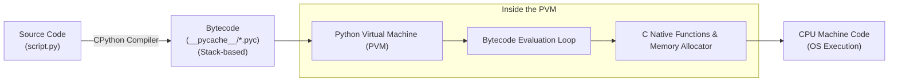

1. **Bytecode Compilation:** When you execute a script, CPython compiles your `.py` source text into platform-independent **bytecode** (stored in `__pycache__/*.pyc` files for imported modules).
2. **PVM Evaluation:** The **Python Virtual Machine (PVM)** is a stack-based runtime loop that reads bytecode instructions and executes the underlying C library implementations.

> [!NOTE]
> **Dynamic vs. Ahead-of-Time:**
> Unlike Java (which requires manual `javac` compilation producing `.class` files), Python performs bytecode compilation automatically in-memory before running your script.

### 1.2 Significant Indentation: The #1 Python Rule

In JavaScript, whitespace is completely ignored by the parser:
```javascript
// Valid JavaScript (though messy):
if (isLoggedIn) {
console.log("Welcome");
  showDashboard();
}
```

In Python, **indentation defines the block structure**. Using inconsistent indentation triggers an immediate `IndentationError`:

```python
# Valid Python (Standard: 4 spaces per indentation level)
if is_logged_in:
    print("Welcome")
    show_dashboard()
```

> [!WARNING]
> **⚠️ Never Mix Tabs and Spaces:**
> Python 3 strictly prohibits mixing tab characters and space characters for indentation. Configure your code editor (VS Code, Cursor, PyCharm) to automatically convert the Tab key into **4 spaces**.

### 1.3 Running Python & The Interactive REPL

1. **Interactive REPL (Read-Eval-Print-Loop):**
   Open your terminal and type `python3` (or `ipython` for an enhanced developer shell). You can experiment with expressions interactively:
   ```text
   >>> 2 + 2
   4
   >>> name = "Alice"
   >>> f"Hello, {name}"
   'Hello, Alice'
   ```
   Type `exit()` or press `Ctrl + D` to exit.
2. **Running Script Files:**
   Execute a file directly from the terminal:
   ```bash
   python3 main.py
   ```

### 1.4 Console Output & Formatting (`print()`)

The built-in `print()` function outputs text to the standard output (`stdout`):

```python
# 1. Basic print (automatically appends a newline, like console.log)
print("Hello, World!")

# 2. Printing multiple values with a custom separator (sep=" ")
print("Alice", 25, "Engineer", sep=" | ") # Output: Alice | 25 | Engineer

# 3. Custom line terminator (end="\n" by default)
print("Loading...", end="") # Does not move to a new line!
print("Done!")              # Output: Loading...Done!
```

### 1.5 Console Input (`input()`)

To read input from the user in the terminal, use the built-in `input()` function:

```python
# input() halts execution, displays prompt, and ALWAYS returns a string!
user_input = input("Enter your age: ") # User types "25"

# Must convert string to integer if doing math!
age = int(user_input)
print(f"Next year you will be {age + 1}")
```

> [!WARNING]
> **⚠️ The String Input Trap:**
> In JavaScript, `prompt()` returns a string. Similarly in Python, `input()` **always returns a string**. If you type `10` and calculate `user_input + 5`, Python raises a `TypeError: can only concatenate str (not "int") to str`. Always cast with `int(user_input)` or `float(user_input)`.

### 1.6 Comments & Docstrings

```python
# 1. Single-line comment (starts with a hash '#')

# 2. Multi-line comments: Python convention uses multiple single-line hashes
# for block comments explaining algorithms or logic.

def calculate_tax(subtotal: float, rate: float = 0.08) -> float:
    """
    3. Docstring (Documentation String): Placed immediately under a function,
    class, or module using triple quotes. Accessible via help(calculate_tax)
    and read by documentation generators (Sphinx) and IDE intellisense.
    """
    return subtotal * rate
```

---

### Module 1 Practice Challenges

#### Challenge 1.1: Command-Line Greeter with Defaults
**Problem:** Write a Python script that prompts the user for their name and preferred programming language. If the user enters an empty name, default to `"Developer"`. Output a formatted greeting.

**Thought Process & Strategy (Step-by-Step):**
1. **Prompt for Input:** Use `input()` to prompt for name and language.
2. **Handle Empty Input (Whitespace):** In Python, empty strings `""` or whitespace-only strings evaluate to falsy. Use `.strip()` to remove leading/trailing whitespace.
3. **Apply Fallback:** Use the Pythonic `name.strip() or "Developer"` idiom (evaluates the right side if the left side is falsy).
4. **Print Formatted Output:** Use an f-string to display the result.

```python
def greet_user():
    # Prompt user for inputs
    raw_name = input("Enter your name: ")
    raw_lang = input("Enter your favorite language: ")

    # strip() removes accidental whitespace; 'or' provides safe default
    name = raw_name.strip() or "Developer"
    language = raw_lang.strip() or "Python"

    print(f"Welcome, {name}! Let's build something great with {language}.")

if __name__ == "__main__":
    greet_user()
# Time Complexity: O(n) where n is input string length
# Space Complexity: O(n)
```

#### Challenge 1.2: Formatted Receipt Printer
**Problem:** Given 3 items with names, quantities, and prices, print a neatly formatted receipt using column alignments, dividers, and formatted float values.

**Thought Process & Strategy (Step-by-Step):**
1. **Define Columns:** Use f-string format specifiers: `{text:<20}` (left-align in 20 chars), `{qty:>5}` (right-align in 5 chars), `{price:>10.2f}` (right-align float rounded to 2 decimal places).
2. **Compute Total:** Sum the extended prices $(qty \times price)$.
3. **Print Header, Rows, and Total:** Use a string multiplier `"-" * 37` to create clean horizontal dividers.

```python
def print_receipt():
    items = [
        ("Wireless Mouse", 1, 29.99),
        ("Mechanical Keyboard", 1, 119.50),
        ("USB-C Cable", 3, 8.25),
    ]

    # Print Table Header
    print(f"{'Item':<20} {'Qty':>5} {'Price':>10}")
    print("-" * 37)

    subtotal = 0.0
    for name, qty, price in items:
        total_price = qty * price
        subtotal += total_price
        # Format: Item name left-aligned, qty right-aligned, price right-aligned with 2 decimals
        print(f"{name:<20} {qty:>5} ${total_price:>9.2f}")

    print("-" * 37)
    print(f"{'Total Due:':<26} ${subtotal:>9.2f}")

if __name__ == "__main__":
    print_receipt()
# Time Complexity: O(k) where k is number of items
# Space Complexity: O(1)
```


---

## Module 2: Variables, Types & The Object Reference Model

### 2.1 Dynamic Typing with Strict Runtime Safety

Like JavaScript, Python is **dynamically typed**: you do not declare variable types, and a variable can reference different types over time:

```python
data = 42        # data refers to an integer
data = "hello"   # data now refers to a string
```

However, unlike JavaScript, Python is **strongly typed**. It refuses to silently coerce incompatible types:

```javascript
// JavaScript (Weak Typing): Silently converts 5 to string!
console.log("5" + 5); // "55"
console.log("10" - 2); // 8 (Silently converts "10" to number!)
```

```python
# Python (Strong Typing): Strict and predictable!
result = "5" + 5
# TypeError: can only concatenate str (not "int") to str
```

### 2.2 The Python Memory Model: Variables Are Names, Not Containers!

In C and Java, a variable is a physical memory box where binary data lives.
In Python, **Everything is an Object**. A variable is simply a **name (label / pointer)** tagged onto an object in Heap memory:

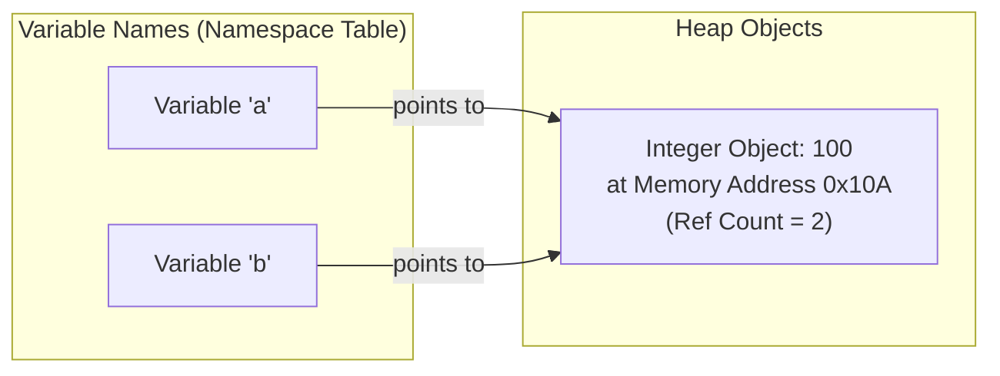

```python
a = 100
b = a # 'b' does NOT create a copy! Both 'a' and 'b' point to the exact same object in memory!
print(id(a) == id(b)) # True: id() returns the object's unique memory address
```

### 2.3 Mutable vs. Immutable Types (The Most Critical Python Concept)

Every object in Python is either **Mutable** (its contents can change in-place) or **Immutable** (its contents cannot change once allocated):

| Category | Types | Behavior |
|---|---|---|
| **Immutable** | `int`, `float`, `bool`, `str`, `tuple`, `frozenset`, `bytes` | Any modification creates a **brand new object** in memory. |
| **Mutable** | `list`, `dict`, `set`, `bytearray`, custom classes | Changes mutate the **existing object** in-place at the same memory address. |

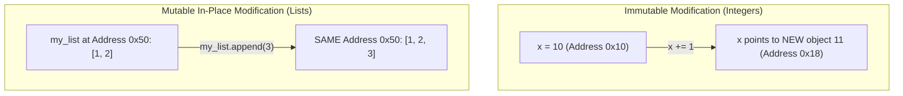

### 2.4 Built-in Data Types Breakdown

- **Integers (`int`):** Python 3 integers have **arbitrary precision**. There is no 32-bit or 64-bit integer limit. Python will automatically allocate as many bytes as needed. $2^{1000}$ computes instantly without numeric overflow!
- **Floating-point (`float`):** 64-bit double-precision numbers (equivalent to C's `double` or JS `Number`).
- **Complex numbers (`complex`):** Built-in support for imaginary numbers: `z = 3 + 4j`.
- **Booleans (`bool`):** Subclass of `int`. Strictly capitalized: `True` and `False` (in lowercase, `true` triggers a `NameError`).
- **NoneType (`None`):** Represents the absence of a value (equivalent to JS `null` and `undefined` combined).

### 2.5 Type Casting & Type Checking

```python
# 1. Type Inspection
x = 42
print(type(x)) # <class 'int'>

# 2. Idiomatic Type Checking (isinstance checks inheritance chains)
if isinstance(x, int):
    print("x is an integer")

# 3. Explicit Type Casting
s = "100"
num = int(s)       # String to int -> 100
pi = float("3.14") # String to float -> 3.14
text = str(250)    # Int to string -> "250"
flag = bool(0)     # 0 to bool -> False
```

### 2.6 Modern Type Hints (PEP 484 - Python 3.6+)

Python remains dynamically typed at runtime, but modern Python supports **Type Hints** for static analysis (via tools like MyPy, VS Code, and IDE auto-complete):

```python
def calculate_discount(price: float, percentage: float = 0.10) -> float:
    return price * (1.0 - percentage)

# Type hints do NOT cause runtime errors if violated:
# calculate_discount("invalid", 0.1)  # Runs at runtime until math fails, but IDE flags it in red!
```

---

### Module 2 Practice Challenges

#### Challenge 2.1: Floating-Point Precision & Rounding
**Problem:** Write a function `calculate_compound_interest(principal: float, rate: float, times: int, years: int) -> float` that calculates compound interest: $A = P \left(1 + \frac{r}{n}\right)^{nt}$, rounded to 2 decimal places.

**Thought Process & Strategy (Step-by-Step):**
1. **Mathematical Formula:** $A = P \times (1 + r/n)^{n \times t}$.
2. **Python Exponentiation:** In Python, the exponentiation operator is `**` (e.g. `2 ** 3 = 8`), identical to JavaScript's `**`.
3. **Rounding:** Use the built-in `round(value, 2)` function to round to 2 decimal places.

```python
def calculate_compound_interest(principal: float, rate: float, times: int, years: int) -> float:
    # Avoid division by zero edge case
    if times <= 0 or years < 0:
        raise ValueError("Times and years must be positive integers")

    # Formula: A = P * (1 + r/n)**(n*t)
    amount = principal * ((1.0 + (rate / times)) ** (times * years))
    return round(amount, 2)

if __name__ == "__main__":
    p = 1000.0  # $1,000 principal
    r = 0.05    # 5% annual interest
    n = 12      # Compounded monthly
    t = 5       # 5 years
    total = calculate_compound_interest(p, r, n, t)
    print(f"Total after 5 years: ${total:.2f}") # $1283.36
# Time Complexity: O(1)
# Space Complexity: O(1)
```

#### Challenge 2.2: Pythonic Tuple Unpack Swap & Object Identity
**Problem:** Demonstrate how Python swaps two variables without temporary variables using tuple unpacking (`a, b = b, a`), and prove that their underlying memory addresses swapped.

**Thought Process & Strategy (Step-by-Step):**
1. **Understand Tuple Packing:** In Python, writing `b, a` on the right side of an assignment creates an in-memory tuple `(b, a)` packing both references.
2. **Understand Tuple Unpacking:** The left side `a, b` unpacks the tuple's elements sequentially into the variable names.
3. **Verify Identity:** Print the memory address using `id()` before and after to inspect object pointers.

```python
def demonstrate_swap():
    x = "Apple"
    y = "Banana"

    x_id_before = id(x)
    y_id_before = id(y)

    print(f"Before: x = {x} (id: {x_id_before}), y = {y} (id: {y_id_before})")

    # The Pythonic in-place swap:
    # 1. Right side creates a temporary tuple: ("Banana", "Apple")
    # 2. Left side binds x to "Banana" and y to "Apple"
    x, y = y, x

    print(f"After:  x = {x} (id: {id(x)}), y = {y} (id: {id(y)})")

    # Validation
    assert id(x) == y_id_before, "x should now point to the original y object"
    assert id(y) == x_id_before, "y should now point to the original x object"
    print("Swap identity verified successfully!")

if __name__ == "__main__":
    demonstrate_swap()
# Time Complexity: O(1)
# Space Complexity: O(1)
```


---

## Module 3: Strings, Slicing & Formatting

### 3.1 Strings Are Immutable Sequences

In Python, `str` is an **immutable sequence of Unicode characters**. You cannot modify characters in-place:

```python
s = "Python"
# s[0] = "J" # TypeError: 'str' object does not support item assignment
```

### 3.2 Powerful Slicing Notation (`[start:stop:step]`)

Unlike JavaScript's `substring()` or `slice()`, Python features a built-in slicing syntax available across all sequences (strings, lists, tuples):

$$\text{sequence}[\text{start} : \text{stop} : \text{step}]$$

- `start`: Inclusive starting index (defaults to `0`).
- `stop`: **Exclusive** ending index (defaults to length of string).
- `step`: Stride / direction (defaults to `1`).

```python
s = "Hello, World!"

# 1. Basic slicing: characters from index 0 up to (not including) index 5
print(s[0:5])   # "Hello"

# 2. Omitted start/stop (slice from start, or slice to end)
print(s[:5])    # "Hello"
print(s[7:])    # "World!"

# 3. Negative indexing (counts backwards from the end: -1 is the last char!)
print(s[-1])    # "!"
print(s[-6:-1]) # "World"

# 4. Stepping (skip every 2nd character)
print(s[::2])   # "Hlo ol!"

# 5. Reverse a string (LeetCode favorite idiom!):
print(s[::-1])  # "!dlroW ,olleH"
```

### 3.3 Modern String Interpolation: f-strings (Python 3.6+)

Python supports multiple string formatting styles. Always prefer **f-strings (Formatted String Literals)**:

```python
name = "Alex"
score = 95.456

# f-strings evaluate Python expressions inside curly braces {} at runtime:
print(f"Student: {name.upper()}, Score: {score:.1f}") # "Student: ALEX, Score: 95.5"

# Arithmetic and method calls directly inside braces:
print(f"Double: {score * 2}")

# Debug specifier (Python 3.8+): prints expression name and value!
print(f"{name=}") # "name='Alex'"
```

### 3.4 Essential String Methods for LeetCode & Projects

```python
s = "  LeetCode Python Solutions  "

# 1. Stripping whitespace
clean = s.strip()       # "LeetCode Python Solutions" (lstrip() / rstrip())

# 2. Case transformations
lower_s = clean.lower() # "leetcode python solutions"
upper_s = clean.upper() # "LEETCODE PYTHON SOLUTIONS"

# 3. Splitting and Joining (equivalent to JS split and join)
words = clean.split(" ")          # ['LeetCode', 'Python', 'Solutions']
rejoined = "-".join(words)        # "LeetCode-Python-Solutions"

# 4. Search and Check
print(clean.startswith("Leet"))   # True
print(clean.endswith("Solutions"))# True
print("Python" in clean)          # True (in operator checks substring presence!)
print(clean.find("Python"))       # 9 (returns -1 if not found)

# 5. Character validations (Crucial for LeetCode two-pointer problems!)
char = "A"
print(char.isalnum())             # True (is alphanumeric: letter or digit)
print(char.isalpha())             # True (is letter)
print(char.isdigit())             # False (is digit)

# 6. Replacement
new_s = clean.replace("Python", "Java") # "LeetCode Java Solutions"
```

---

### Module 3 Practice Challenges

#### Challenge 3.1 (LeetCode 125): Valid Palindrome
**Problem:** A phrase is a palindrome if, after converting all uppercase letters into lowercase letters and removing all non-alphanumeric characters, it reads the same forward and backward. Implement `is_palindrome(s: str) -> bool`.

**Thought Process & Strategy (Step-by-Step):**
1. **Approach Choice:** We can solve this either with:
   - *Pythonic 1-liner:* Filter with a list comprehension and compare with `[::-1]`. (Takes $O(n)$ space).
   - *Optimal In-Place Two-Pointer:* Converge from head and tail ($O(1)$ space).
2. **Set Pointers:** `left = 0`, `right = len(s) - 1`.
3. **Skip Irrelevant Chars:** While `left < right`, skip any character where `not s[left].isalnum()`.
4. **Compare Characters:** Lowercase both chars (`s[left].lower() != s[right].lower()`). If mismatch, return `False`. If match, advance inward.

```python
def is_palindrome(s: str) -> bool:
    left = 0
    right = len(s) - 1

    while left < right:
        # Skip non-alphanumeric characters on left
        while left < right and not s[left].isalnum():
            left += 1
        # Skip non-alphanumeric characters on right
        while left < right and not s[right].isalnum():
            right -= 1

        # Compare lowercase characters
        if s[left].lower() != s[right].lower():
            return False

        left += 1
        right -= 1

    return True

# One-liner alternative (convenient for quick interview checks):
def is_palindrome_pythonic(s: str) -> bool:
    cleaned = [c.lower() for c in s if c.isalnum()]
    return cleaned == cleaned[::-1]

if __name__ == "__main__":
    test = "A man, a plan, a canal: Panama"
    print("Is palindrome (two-pointer):", is_palindrome(test)) # True
    print("Is palindrome (pythonic):   ", is_palindrome_pythonic(test)) # True
# Time Complexity: O(n) - Single pass through string
# Space Complexity: O(1) for two-pointer approach
```

#### Challenge 3.2 (LeetCode 242): Valid Anagram
**Problem:** Given two strings `s` and `t`, return `true` if `t` is an anagram of `s`, and `false` otherwise.

**Thought Process & Strategy (Step-by-Step):**
1. **Length Guard Check:** Anagrams must have equal lengths (`len(s) != len(t)` returns `False`).
2. **Frequency Counting:** We can count character occurrences in both strings and compare counts.
3. **Optimal Python Approach:** Python's standard library provides `collections.Counter`, which builds a hash table of character frequencies in $O(n)$ time.

```python
from collections import Counter

def is_anagram(s: str, t: str) -> bool:
    if len(s) != len(t):
        return False

    # Counter(s) creates a dict mapping char -> frequency: {'a': 3, 'n': 1, ...}
    return Counter(s) == Counter(t)

# Array-based alternative (O(1) space for 26 lowercase English letters):
def is_anagram_array(s: str, t: str) -> bool:
    if len(s) != len(t):
        return False

    counts = [0] * 26
    for char_s, char_t in zip(s, t):
        # ord('a') returns ASCII code 97; subtracting ord('a') maps 'a'->0, 'b'->1, ...
        counts[ord(char_s) - ord('a')] += 1
        counts[ord(char_t) - ord('a')] -= 1

    return all(count == 0 for count in counts)

if __name__ == "__main__":
    print(is_anagram("anagram", "nagaram")) # True
    print(is_anagram("rat", "car"))         # False
# Time Complexity: O(n) - Linear pass through strings
# Space Complexity: O(1) - Counter bounded by alphabet size (26 letters)
```


---

## Module 4: Control Flow, Truthiness & Pattern Matching

### 4.1 Truthy vs. Falsy in Python

In JavaScript, truthiness has quirky rules (`[]` is truthy, `{}` is truthy, `NaN` is falsy).
In Python, **any empty container or zero is strictly Falsy**:

| Value | In Python | In JavaScript |
|---|---|---|
| Empty List `[]` | **Falsy** | Truthy! |
| Empty Dict `{}` | **Falsy** | Truthy! |
| Empty String `""`| Falsy | Falsy |
| Number `0` / `0.0`| Falsy | Falsy |
| `None` / `null` | Falsy | Falsy |

```python
users = []

# Pythonic idiom: Check if container has items directly!
if not users:
    print("No users found!") # Runs because empty list [] is falsy
```

### 4.2 Conditionals: `if`, `elif`, `else`

- Notice `elif` (not `else if`).
- Parentheses around conditions are optional and generally omitted.
- Logical operators are English words: `and`, `or`, `not` (not `&&`, `||`, `!`).

```python
score = 85

if score >= 90:
    grade = "A"
elif score >= 80 and score < 90: # 'and' instead of &&
    grade = "B"
else:
    grade = "C"

# Python chained comparisons (clean math syntax!):
if 80 <= score < 90:
    print("Solid B grade")
```

### 4.3 Identity vs. Equality: `is` vs `==`

- **`==` (Value Equality):** Calls the object's `__eq__()` method to check if contents match (like `.equals()` in Java).
- **`is` (Identity / Memory Check):** Checks if two variables point to the **exact same memory address** (`id(a) == id(b)`).

> [!IMPORTANT]
> **Always check `None` using `is`:**
> ```python
> user = None
> if user is None: # Correct Pythonic style
>     print("User is missing")
> if user is not None:
>     print("User exists")
> ```

### 4.4 Loops (`for`, `while`, `break`, `continue`)

In Python, `for` loops iterate over any **iterable** (lists, strings, ranges, dictionaries):

```python
# 1. Iterating over range(start, stop_exclusive, step)
for i in range(5):
    print(i, end=" ") # 0 1 2 3 4
print()

# 2. Iterating with index using enumerate() (JS: array.forEach((item, index) => ...))
fruits = ["Apple", "Banana", "Cherry"]
for index, fruit in enumerate(fruits):
    print(f"{index}: {fruit}")

# 3. While loop
count = 3
while count > 0:
    count -= 1
```

### 4.5 The Unique `for...else` Construct

In Python, loops can have an optional **`else` block**. The `else` block executes **only if the loop completed naturally without hitting a `break` statement**:

```python
# Search for target in a list:
target = 7
numbers = [1, 3, 5, 9]

for n in numbers:
    if n == target:
        print("Found target!")
        break
else:
    # Executes ONLY if no 'break' occurred during loop!
    print("Target was not found in the list.")
```

### 4.6 Modern Structural Pattern Matching (`match / case` - Python 3.10+)

Python 3.10 introduced the `match` statement, surpassing traditional C/Java switches by matching data patterns, types, and unpacking structures:

```python
def handle_command(command):
    match command:
        case "QUIT":
            return "Exiting system"
        case "START" | "RESUME": # Multi-match using pipe |
            return "Starting process"
        case ["MOVE", x, y]:     # Pattern matching on a list structure!
            return f"Moving to coordinate ({x}, {y})"
        case {"status": 200, "data": payload}: # Matching dictionary shape!
            return f"Success with payload: {payload}"
        case _:                  # Wildcard fallback (like 'default' in switch)
            return "Unknown command"

print(handle_command(["MOVE", 10, 20])) # "Moving to coordinate (10, 20)"
```

---

### Module 4 Practice Challenges

#### Challenge 4.1 (LeetCode 136): Single Number via Bitwise XOR
**Problem:** Given a non-empty list of integers `nums`, every element appears twice except for one unique element. Find that single unique one in $O(n)$ time and $O(1)$ extra memory.

**Thought Process & Strategy (Step-by-Step):**
1. **XOR Bitwise Math:** $x \oplus x = 0$ (identical numbers cancel each other out), and $x \oplus 0 = x$.
2. **Loop and Accumulate:** Initialize `unique = 0`. XOR every element into `unique`.
3. **Result:** Every duplicate cancels out, leaving only the unique integer.

```python
def single_number(nums: list[int]) -> int:
    unique = 0
    for num in nums:
        unique ^= num # XOR assignment
    return unique

if __name__ == "__main__":
    print(single_number([4, 1, 2, 1, 2])) # 4
# Time Complexity: O(n)
# Space Complexity: O(1)
```

#### Challenge 4.2: Pattern-Matched HTTP Response Parser
**Problem:** Write a function `parse_response(response: dict) -> str` using Python 3.10's `match / case` to inspect API responses. Handle status 200 with data, status 400 with error message, status 404, and any other status code.

**Thought Process & Strategy (Step-by-Step):**
1. **Input Inspection:** The response is a dictionary with keys like `"status"` and `"data"` or `"error"`.
2. **Match on Dict Shapes:** Use dictionary pattern matching `case {"status": 200, "data": data}`.
3. **Capture Error Data:** Use `case {"status": 400, "error": msg}` to extract the message variable directly into the scope.

```python
def parse_response(response: dict) -> str:
    match response:
        case {"status": 200, "data": data}:
            return f"OK: Received {len(data)} items"
        case {"status": 400, "error": msg}:
            return f"Bad Request: {msg}"
        case {"status": 404}:
            return "Not Found: Resource does not exist"
        case {"status": code}:
            return f"HTTP Error: Unhandled status {code}"
        case _:
            return "Invalid response format"

if __name__ == "__main__":
    print(parse_response({"status": 200, "data": ["item1", "item2"]})) # OK: Received 2 items
    print(parse_response({"status": 400, "error": "Missing email"}))    # Bad Request: Missing email
    print(parse_response({"status": 500}))                             # HTTP Error: Unhandled status 500
# Time Complexity: O(1)
# Space Complexity: O(1)
```


---

## Module 5: Functions, Scopes & Parameters

### 5.1 Defining Functions & Return Values

Functions are declared with `def`. If a function finishes without an explicit `return`, it returns `None` automatically:

```python
def greet(name: str) -> str:
    return f"Hello, {name}!"

def do_work():
    pass # Returns None
```

### 5.2 Positional vs. Keyword Arguments

In Python, callers can pass arguments positionally or by keyword name:

```python
def create_profile(username, email, role="Member", active=True):
    return {"user": username, "email": email, "role": role, "active": active}

# 1. Positional (order matters)
create_profile("alex", "alex@mail.com")

# 2. Keyword arguments (order does not matter!)
create_profile(email="alex@mail.com", username="alex", active=False)
```

### 5.3 The Infamous Mutable Default Argument Trap

> [!WARNING]
> **⚠️ The #1 Python Bug for Beginners:**
> Default argument expressions are evaluated **once when the function is defined**, NOT every time the function is called!
>
> ```python
> # DANGEROUS BUG: The default list [] is shared across ALL calls!
> def append_item(item, target_list=[]):
>     target_list.append(item)
>     return target_list
>
> print(append_item("a")) # ['a']
> print(append_item("b")) # ['a', 'b']  <-- BUG: Shared list retained previous state!
> ```
>
> **The Idiomatic Fix: Use `None` as default sentinel:**
> ```python
> def append_item(item, target_list=None):
>     if target_list is None:
>         target_list = [] # Allocates a FRESH list on every call!
>     target_list.append(item)
>     return target_list
> ```

### 5.4 Variable Arguments: `*args` and `**kwargs`

Similar to JavaScript rest parameters (`...args`):
- `*args`: Collects arbitrary positional arguments into a **tuple**.
- `**kwargs`: Collects arbitrary keyword arguments into a **dictionary**.

```python
def flexible_logger(level: str, *args, **kwargs):
    print(f"[{level}] Positional: {args}")     # tuple: (1, 2, 3)
    print(f"[{level}] Keyword: {kwargs}")       # dict: {'user': 'Alex', 'ip': '127.0.0.1'}

flexible_logger("INFO", 1, 2, 3, user="Alex", ip="127.0.0.1")
```

**Unpacking Collections into Arguments (`*` and `**`):**
```python
def add(a, b, c):
    return a + b + c

nums = [1, 2, 3]
print(add(*nums)) # Unpacks list items into a, b, c -> 6

params = {"a": 10, "b": 20, "c": 30}
print(add(**params)) # Unpacks dict keys into named arguments -> 60
```

### 5.5 Scopes: The LEGB Rule

When Python encounters a variable name, it searches for it in this exact order (**LEGB**):
1. **L (Local):** Defined inside the current function.
2. **E (Enclosing):** Defined in any outer enclosing functions (closures).
3. **G (Global):** Defined at top-level module scope.
4. **B (Built-in):** Built into Python (`print`, `len`, `range`).

```python
x = 10 # Global

def outer():
    x = 20 # Enclosing

    def inner():
        # To modify outer's 'x', must declare: nonlocal x
        # To modify module's 'x', must declare: global x
        x = 30 # Local
        print("Inner:", x)

    inner()
    print("Outer:", x)

outer()
print("Global:", x)
```

### 5.6 Lambda Functions (Anonymous Functions)

In Python, `lambda` creates small, one-line anonymous functions (like JS arrow functions `(x) => x * 2`):

```python
# Syntax: lambda arg1, arg2: expression
square = lambda x: x ** 2
print(square(5)) # 25

# Most commonly used as inline sorting keys:
pairs = [(1, "one"), (3, "three"), (2, "two")]
pairs.sort(key=lambda p: p[1]) # Sort by second element string alphabetically
```

---

### Module 5 Practice Challenges

#### Challenge 5.1 (LeetCode 704): Binary Search with Midpoint Protection
**Problem:** Given a sorted array of integers `nums` and an integer `target`, return the index of `target` if found, or `-1` if not found, in $O(\log n)$ runtime.

**Thought Process & Strategy (Step-by-Step):**
1. **Pointers:** `left = 0`, `right = len(nums) - 1`.
2. **Midpoint:** In Python, integer overflow does not occur because `int` has arbitrary precision, so `(left + right) // 2` is safe. (Notice `//` is integer floor division in Python, unlike `/` which returns a float!).
3. **Narrow Search:** If `nums[mid] == target`, return `mid`. If smaller, search right (`left = mid + 1`). If larger, search left (`right = mid - 1`).

```python
def binary_search(nums: list[int], target: int) -> int:
    left = 0
    right = len(nums) - 1

    while left <= right:
        # Floor division '//' ensures mid is an integer index
        mid = (left + right) // 2

        if nums[mid] == target:
            return mid
        elif nums[mid] < target:
            left = mid + 1
        else:
            right = mid - 1

    return -1

if __name__ == "__main__":
    sorted_nums = [-1, 0, 3, 5, 9, 12]
    print(binary_search(sorted_nums, 9)) # 4
    print(binary_search(sorted_nums, 2)) # -1
# Time Complexity: O(log n)
# Space Complexity: O(1)
```

#### Challenge 5.2: Safe Keyword Arguments Validator
**Problem:** Write a function `configure_server(*args, **kwargs)` that accepts optional server configuration flags. Enforce that `port` must be an integer between `1024` and `65535`, `host` defaults to `"localhost"`, and reject any unexpected keyword arguments by raising a `ValueError`.

**Thought Process & Strategy (Step-by-Step):**
1. **Inspect Allowed Keys:** Define a set of permitted keys: `{"host", "port", "debug"}`.
2. **Reject Unknown Keys:** Find differences between `set(kwargs.keys())` and permitted keys.
3. **Validate and Apply Defaults:** Check port integer ranges.

```python
def configure_server(**kwargs):
    allowed_keys = {"host", "port", "debug"}
    extra_keys = set(kwargs.keys()) - allowed_keys
    if extra_keys:
        raise ValueError(f"Unrecognized configuration options: {extra_keys}")

    host = kwargs.get("host", "localhost")
    port = kwargs.get("port", 8080)
    debug = kwargs.get("debug", False)

    if not isinstance(port, int) or not (1024 <= port <= 65535):
        raise ValueError(f"Port must be an integer between 1024 and 65535. Received: {port}")

    return {"host": host, "port": port, "debug": debug}

if __name__ == "__main__":
    config = configure_server(host="0.0.0.0", port=3000, debug=True)
    print("Server configured:", config)
```


---

## Module 6: Sequences: Lists & Tuples

### 6.1 Lists: Python's Dynamic Arrays

In Python, a `list` is a mutable, dynamically resizing array (analogous to JavaScript arrays). Under the hood in CPython, a list is an array of contiguous object reference pointers.

```python
# Creation
fruits = ["apple", "banana", "cherry"]

# Common Operations:
fruits.append("date")         # Appends to end: O(1) amortized
fruits.insert(0, "avocado")   # Inserts at index: O(n) (shifts elements right!)
popped = fruits.pop()         # Removes & returns last item: O(1)
fruits.remove("banana")       # Removes first occurrence of value: O(n)
length = len(fruits)          # O(1) length check
```

### 6.2 List Comprehensions: The Idiomatic Python Powerhouse

In JavaScript, transforming arrays requires chaining `.map()` and `.filter()`:
```javascript
// JavaScript:
const evensSquared = numbers.filter(x => x % 2 === 0).map(x => x ** 2);
```

In Python, **List Comprehensions** provide a faster, concise, expressive syntax:
$$\text{[expression for item in iterable if condition]}$$

```python
numbers = [1, 2, 3, 4, 5, 6]

# Map + Filter in one clean line!
evens_squared = [x ** 2 for x in numbers if x % 2 == 0]
print(evens_squared) # [4, 16, 36]

# 2D Matrix Flattening:
matrix = [[1, 2], [3, 4], [5, 6]]
flattened = [val for row in matrix for val in row]
print(flattened) # [1, 2, 3, 4, 5, 6]
```

### 6.3 Tuples: Immutable Sequences

A **`tuple`** is defined with parentheses `(1, 2, 3)`. Once created, items cannot be added, removed, or modified:

```python
point = (10, 20)
# point[0] = 99 # TypeError: 'tuple' object does not support item assignment
```

**Why Use Tuples Over Lists?**
1. **Memory & Speed:** Tuples are smaller and faster than lists because their size is frozen.
2. **Dict Keys & Sets:** Tuples are **hashable** (if they contain only immutable items), meaning a tuple can be used as a dictionary key or in a set! (Lists cannot).
3. **Data Integrity:** Protects values from accidental in-place mutation.

**Tuple Unpacking (Multiple Return Values):**
```python
def get_coordinates():
    return (37.7749, -122.4194) # Lat, Long

latitude, longitude = get_coordinates()
```

### 6.4 Sorting in Python (`sort()` vs `sorted()`)

- `list.sort()`: Modifies the list **in-place** and returns `None`.
- `sorted(iterable)`: Leaves original sequence untouched and returns a **new sorted list**.

```python
students = [("Alex", 88), ("Bob", 95), ("Charlie", 72)]

# Sort by grade (second tuple element) using key lambda:
students.sort(key=lambda s: s[1], reverse=True) # Descending order
print(students) # [('Bob', 95), ('Alex', 88), ('Charlie', 72)]
```

---

### Module 6 Practice Challenges

#### Challenge 6.1 (LeetCode 1): Two Sum
**Problem:** Given an array of integers `nums` and an integer `target`, return indices of the two numbers that add up to `target`.

**Thought Process & Strategy (Step-by-Step):**
1. **Hash Table Lookup:** We need $complement = target - num$.
2. **Single Pass:** Store visited numbers in a dictionary `seen[num] = index`.
3. **Check:** As we loop with `enumerate(nums)`, check if `complement in seen`.

```python
def two_sum(nums: list[int], target: int) -> list[int]:
    seen = {} # Maps number -> index

    for i, num in enumerate(nums):
        complement = target - num
        if complement in seen:
            return [seen[complement], i]
        seen[num] = i

    raise ValueError("No two sum solution found")

if __name__ == "__main__":
    print(two_sum([2, 7, 11, 15], 9)) # [0, 1]
# Time Complexity: O(n)
# Space Complexity: O(n)
```

#### Challenge 6.2 (LeetCode 53): Maximum Subarray (Kadane's Algorithm)
**Problem:** Find the contiguous subarray within `nums` with the largest sum and return its sum.

**Thought Process & Strategy (Step-by-Step):**
1. **Decision at Index `i`:** `current_sum = max(nums[i], current_sum + nums[i])` (either start fresh at `nums[i]` or extend existing subarray).
2. **Track Max:** `max_sum = max(max_sum, current_sum)`.

```python
def max_sub_array(nums: list[int]) -> int:
    max_sum = nums[0]
    current_sum = nums[0]

    for num in nums[1:]:
        current_sum = max(num, current_sum + num)
        max_sum = max(max_sum, current_sum)

    return max_sum

if __name__ == "__main__":
    print(max_sub_array([-2, 1, -3, 4, -1, 2, 1, -5, 4])) # 6
# Time Complexity: O(n)
# Space Complexity: O(1)
```


---

## Module 7: Hash Collections: Dictionaries & Sets

### 7.1 Dictionaries (`dict`): $O(1)$ Key-Value Hash Maps

In JavaScript, objects (`{}`) and `Map` store key-value pairs.
In Python, **`dict`** is the ubiquitous hash table data structure. (Since Python 3.7, dictionaries are guaranteed to maintain insertion order!).

```python
user = {
    "name": "Alex",
    "role": "Admin",
    "active": True
}

# 1. Accessing values:
print(user["name"]) # "Alex"
# print(user["missing"]) # KeyError! Direct indexing with missing key crashes!

# 2. Safe access with .get(key, default):
role = user.get("department", "Engineering") # Returns fallback "Engineering"

# 3. Adding or updating:
user["role"] = "Lead" # Updates
user["email"] = "alex@mail.com" # Adds new key

# 4. Removing:
removed_role = user.pop("role") # Removes key and returns value
```

### 7.2 Iterating Over Dictionaries

```python
stats = {"views": 1200, "clicks": 85, "shares": 14}

# 1. Iterate over keys (default):
for key in stats:
    print(key, stats[key])

# 2. Iterate over key-value pairs together (Most common!):
for key, value in stats.items():
    print(f"{key} -> {value}")

# 3. Iterate over values only:
total = sum(stats.values())
```

### 7.3 Dictionary Comprehensions

Like list comprehensions, you can transform and build dictionaries with `{key_expr: val_expr for ... in ...}`:

```python
names = ["alice", "bob", "charlie"]
# Map each name to its character length:
name_lengths = {name: len(name) for name in names}
print(name_lengths) # {'alice': 5, 'bob': 3, 'charlie': 7}
```

### 7.4 Sets (`set`): Unique Hash Collections

A **`set`** is an unordered collection of unique, hashable elements with $O(1)$ average-time lookups:

```python
tags = {"python", "javascript", "python"} # Duplicate "python" automatically removed!
print(tags) # {'python', 'javascript'}

# Fast membership testing: O(1) lookup (vs O(n) linear scan in a list!)
if "python" in tags:
    print("Tag present")
```

**Set Mathematics (Venn Diagram Operations):**
```python
a = {1, 2, 3, 4}
b = {3, 4, 5, 6}

print(a | b) # Union: {1, 2, 3, 4, 5, 6}
print(a & b) # Intersection: {3, 4}
print(a - b) # Difference (in a but not b): {1, 2}
print(a ^ b) # Symmetric Difference (in a or b, but not both): {1, 2, 5, 6}
```

---

### Module 7 Practice Challenges

#### Challenge 7.1 (LeetCode 49): Group Anagrams
**Problem:** Given an array of strings `strs`, group the anagrams together. Return the answer in any order.

**Thought Process & Strategy (Step-by-Step):**
1. **Identify the Signature Key:** Anagrams have the exact same sorted characters (e.g. `"eat"`, `"tea"`, `"ate"` all become `"aet"` when sorted).
2. **Choose the Map Data Structure:** Use a dictionary mapping `signature_tuple -> list_of_words`. In Python, a tuple `tuple(sorted(word))` or joined string `"".join(sorted(word))` can serve as a hashable dictionary key!
3. **Group Elements:** Iterate through each word, compute its sorted key, and append it to the map. Return `list(map.values())`.

```python
from collections import defaultdict

def group_anagrams(strs: list[str]) -> list[list[str]]:
    # defaultdict(list) automatically initializes an empty list [] for unseen keys!
    anagram_groups = defaultdict(list)

    for word in strs:
        # Sort characters into a string key: e.g. "eat" -> "aet"
        sorted_key = "".join(sorted(word))
        anagram_groups[sorted_key].append(word)

    return list(anagram_groups.values())

if __name__ == "__main__":
    words = ["eat", "tea", "tan", "ate", "nat", "bat"]
    print(group_anagrams(words))
    # [['eat', 'tea', 'ate'], ['tan', 'nat'], ['bat']]
# Time Complexity: O(n * k log k) where n is word count and k is max word length
# Space Complexity: O(n * k)
```

#### Challenge 7.2 (LeetCode 349): Intersection of Two Arrays
**Problem:** Given two integer arrays `nums1` and `nums2`, return an array of their intersection. Each element in the result must be unique.

**Thought Process & Strategy (Step-by-Step):**
1. **Set Conversion:** Convert `nums1` and `nums2` into sets to eliminate duplicates.
2. **Set Intersection:** Use the `&` operator to find common elements in $O(n + m)$ time.
3. **Convert to List:** Cast the resulting set back into a list.

```python
def intersection(nums1: list[int], nums2: list[int]) -> list[int]:
    # Pythonic set intersection
    return list(set(nums1) & set(nums2))

if __name__ == "__main__":
    print(intersection([1, 2, 2, 1], [2, 2])) # [2]
# Time Complexity: O(n + m)
# Space Complexity: O(n + m)
```


---

## Module 8: LeetCode & Interview Standard Data Structures

In algorithmic coding interviews and LeetCode challenges, using the right data structure directly determines whether your solution passes with optimal $O(1)$ or $O(\log N)$ performance, or fails with "Time Limit Exceeded" (TLE).

Python's standard library provides battle-tested implementations in `collections` and `heapq` that are essential for technical interviews.

---

### 8.1 `collections.deque`: Double-Ended Queues ($O(1)$ Operations)

In JavaScript, developers often use `array.shift()` to dequeue elements. In Python, calling `list.pop(0)` is an **anti-pattern** in technical interviews:

| Operation | Python `list` | `collections.deque` | Explanation |
| :--- | :--- | :--- | :--- |
| Append right | $O(1)$ amortized | $O(1)$ | Appends to the back |
| Pop right | $O(1)$ | $O(1)$ | Removes from the back |
| Append left | $O(N)$ | $O(1)$ | In `list`, all $N$ elements must shift forward in memory |
| Pop left | $O(N)$ | $O(1)$ | In `list`, all $N$ elements must shift backward in memory |
| Random Access (`q[i]`) | $O(1)$ | $O(N)$ | Deque is a doubly-linked list of fixed blocks |

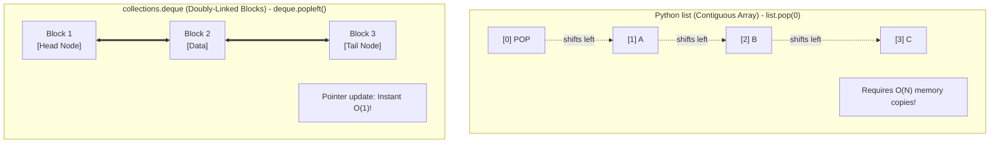

#### Syntax and Methods

```python
from collections import deque

# Initialize
queue = deque(["task1", "task2", "task3"])

# Queue operations (FIFO: First-In, First-Out)
queue.append("task4")        # Add to tail: O(1)
first = queue.popleft()       # Remove from head: O(1) -> 'task1'

# Stack operations (LIFO: Last-In, First-Out)
queue.appendleft("urgent")    # Add to head: O(1)
last = queue.pop()            # Remove from tail: O(1) -> 'task4'

# Rotating queue elements
queue.rotate(1)               # Shifts all elements right by 1
queue.rotate(-1)              # Shifts all elements left by 1

# Maxlen (Bounded buffer - automatically discards old elements)
recent_logs = deque(maxlen=3)
for i in range(5):
    recent_logs.append(i)
print(list(recent_logs))      # Output: [2, 3, 4]
```

---

### 8.2 `collections.defaultdict`: Auto-Initializing Dictionaries

In JavaScript, grouping items by key requires manual initialization:
```javascript
// JS grouping:
if (!groups[key]) groups[key] = [];
groups[key].push(val);
```

In standard Python `dict`, accessing a missing key raises a `KeyError`. While you can use `dict.setdefault(key, [])`, `defaultdict` is much cleaner and faster because it calls a default factory function automatically whenever a missing key is accessed:

```python
from collections import defaultdict

# 1. Grouping elements with defaultdict(list)
graph = defaultdict(list)
edges = [("A", "B"), ("A", "C"), ("B", "D"), ("C", "D")]

for u, v in edges:
    graph[u].append(v)  # If 'u' is not in graph, an empty list [] is created instantly!

print(dict(graph))
# Output: {'A': ['B', 'C'], 'B': ['D'], 'C': ['D']}

# 2. Counting frequencies with defaultdict(int)
word_counts = defaultdict(int)
for word in ["apple", "banana", "apple", "orange", "banana", "apple"]:
    word_counts[word] += 1  # Missing keys default to 0

print(dict(word_counts))
# Output: {'apple': 3, 'banana': 2, 'orange': 1}
```

---

### 8.3 `collections.Counter`: Frequency Hash Map

`Counter` is a subclass of `dict` specifically engineered for counting hashable objects. It replaces handwritten frequency loops:

```python
from collections import Counter

# Instant frequency map
counts = Counter("abracadabra")
print(counts)
# Output: Counter({'a': 5, 'b': 2, 'r': 2, 'c': 1, 'd': 1})

# Querying missing keys returns 0 (Never raises KeyError!)
print(counts["z"])  # Output: 0

# Get top K most frequent elements: O(N log K)
print(counts.most_common(2))
# Output: [('a', 5), ('b', 2)]

# Counter arithmetic
c1 = Counter(a=3, b=1)
c2 = Counter(a=1, b=2, c=1)
print(c1 + c2)  # Output: Counter({'a': 4, 'b': 3, 'c': 1})
print(c1 - c2)  # Output: Counter({'a': 2}) (Non-positive counts stripped)
print(c1 & c2)  # Output: Counter({'a': 1, 'b': 1}) (Intersection: min counts)
```

---

### 8.4 `heapq`: Priority Queues (Min-Heaps & Max-Heaps)

JavaScript does not have a native binary heap or priority queue in its standard library. Python provides the `heapq` module, which implements a **Min-Heap** directly on top of regular Python `list` objects.

In a Min-Heap, the smallest element is **always** at index `0` (`heap[0]`).

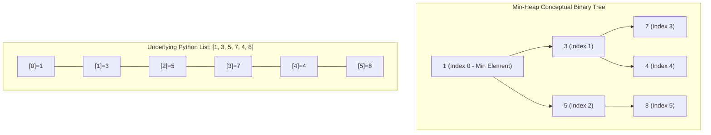

#### Core Heap Operations and Time Complexities

| Function | Operation | Time Complexity |
| :--- | :--- | :--- |
| `heapq.heapify(nums)` | Converts an unsorted list to a valid heap in-place | **$O(N)$** (Linear!) |
| `heapq.heappush(heap, val)` | Inserts a new element and maintains heap invariant | **$O(\log N)$** |
| `heapq.heappop(heap)` | Pops and returns the smallest element (`heap[0]`) | **$O(\log N)$** |
| `heap[0]` | Inspects smallest element without removing it | **$O(1)$** |
| `heapq.heappushpop(heap, val)` | Pushes `val` then pops smallest (faster than push + pop) | **$O(\log N)$** |

```python
import heapq

# 1. Creating a Min-Heap
data = [7, 2, 5, 1, 9]
heapq.heapify(data)  # O(N) in-place transformation
print("Heap array:", data)  # First element is guaranteed smallest: data[0] == 1

# 2. Push and Pop
heapq.heappush(data, 3)     # Inserts 3, reorganizes: O(log N)
smallest = heapq.heappop(data)  # Removes and returns 1: O(log N)
print("Smallest element popped:", smallest)

# 3. Max-Heap Pattern (Invert values with negative numbers)
# Python heapq only supports Min-Heap natively. To get a Max-Heap, negate values!
max_heap = []
numbers = [10, 30, 20, 5, 40]
for num in numbers:
    heapq.heappush(max_heap, -num)  # Push negative values

# Pop max elements in descending order
max_val = -heapq.heappop(max_heap)
print("Largest element:", max_val)  # Output: 40
```

---

### 8.5 Canonical LeetCode Linked List & Tree Node Classes

When practicing tree and linked list problems on LeetCode, questions expect canonical class structures:

#### The Canonical Singly Linked List Node
```python
class ListNode:
    """Standard LeetCode Singly-Linked List Node."""
    def __init__(self, val: int = 0, next: "ListNode" = None):
        self.val = val
        self.next = next

# Helper to build a linked list from a Python list:
def build_linked_list(values: list[int]) -> ListNode | None:
    dummy = ListNode(0)
    curr = dummy
    for val in values:
        curr.next = ListNode(val)
        curr = curr.next
    return dummy.next
```

#### The Canonical Binary Tree Node & BFS Traversal
```python
from collections import deque

class TreeNode:
    """Standard LeetCode Binary Tree Node."""
    def __init__(self, val: int = 0, left: "TreeNode" = None, right: "TreeNode" = None):
        self.val = val
        self.left = left
        self.right = right

def level_order_traversal(root: TreeNode | None) -> list[list[int]]:
    """
    Breadth-First Search (BFS) level-order traversal using collections.deque.
    Time Complexity: O(N) where N is number of nodes.
    Space Complexity: O(W) where W is maximum width of the tree.
    """
    if not root:
        return []

    result = []
    queue = deque([root])

    while queue:
        level_size = len(queue)
        current_level = []
        for _ in range(level_size):
            node = queue.popleft()  # O(1) pop
            current_level.append(node.val)
            if node.left:
                queue.append(node.left)
            if node.right:
                queue.append(node.right)
        result.append(current_level)

    return result
```

---

### Module 8 Practice Challenges

#### Challenge 8.1: Valid Parentheses (LeetCode 20)
**Problem:** Given a string `s` containing just the characters `'('`, `')'`, `'{'`, `'}'`, `'['` and `']'`, determine if the input string is valid. An input string is valid if open brackets are closed by the same type of brackets in the correct order.

##### Thought Process & Strategy (Step-by-Step)
1. **Goal & Edge Cases:**
   - Every closing bracket must match the most recently opened unmatched bracket.
   - If the string length is odd, it can never be valid (instant `False`).
   - If we encounter a closing bracket with an empty stack, it is invalid.
   - At the end, if any unclosed opening brackets remain in the stack, it is invalid.
2. **Data Structure Selection & Why:**
   - A **Stack** (implemented via Python's standard `list` with `.append()` and `.pop()`) is the natural choice because parentheses follow a Last-In, First-Out (LIFO) order.
   - A **Hash Map** (`dict`) mapping closing brackets to matching opening brackets: `{')': '(', '}': '{', ']': '['}` provides $O(1)$ lookups.
3. **Algorithm Walkthrough:**
   - Iterate through each character `char` in `s`.
   - If `char` is in the map (it's a closing bracket):
     - Check if stack is non-empty and `stack[-1] == map[char]`. If yes, pop from stack. Otherwise, return `False`.
   - If `char` is an opening bracket:
     - Push onto stack.
   - Return `len(stack) == 0`.

```python
def is_valid_parentheses(s: str) -> bool:
    """
    Validates matching parentheses using a LIFO stack and hash map.
    Time Complexity: O(N) - single pass over string.
    Space Complexity: O(N) - stack holds at most N opening brackets.
    """
    # Fast check: odd length strings can never be balanced
    if len(s) % 2 != 0:
        return False

    # Mapping closing brackets to their matching opening partner
    matching_bracket = {")": "(", "}": "{", "]": "["}
    stack = []

    for char in s:
        if char in matching_bracket:
            # It's a closing bracket: check top of stack
            if stack and stack[-1] == matching_bracket[char]:
                stack.pop()  # Matched successfully
            else:
                return False  # Mismatch or stack was empty
        else:
            # It's an opening bracket: push onto stack
            stack.append(char)

    # Valid only if all opened brackets were successfully matched and popped
    return len(stack) == 0

# Test cases
assert is_valid_parentheses("()[]{}") == True
assert is_valid_parentheses("(]") == False
assert is_valid_parentheses("([)]") == False
assert is_valid_parentheses("{[]}") == True
assert is_valid_parentheses("(") == False
print("Challenge 8.1 Passed!")
```

---

#### Challenge 8.2: Top K Frequent Elements (LeetCode 347)
**Problem:** Given an integer array `nums` and an integer `k`, return the `k` most frequent elements.

##### Thought Process & Strategy (Step-by-Step)
1. **Goal & Edge Cases:**
   - Find the $k$ elements that occur with the highest frequencies.
   - If $k == len(set(nums))$, return all unique elements.
2. **Data Structure Selection & Why:**
   - `collections.Counter`: Counts frequencies of all elements in $O(N)$ time.
   - `heapq` (Min-Heap of size $k$): Storing `(frequency, num)` in a Min-Heap of bounded size $k$.
   - Why not sort? Sorting takes $O(N \log N)$. Using a heap of size $k$ takes $O(N \log K)$. (When $k \ll N$, this is significantly faster).
3. **Algorithm Walkthrough:**
   - Count frequencies: `count = Counter(nums)`.
   - Iterate over `(num, freq)` pairs in `count.items()`:
     - Push `(freq, num)` onto the heap.
     - If `len(heap) > k`, pop the root (`heappop(heap)`). The root is the smallest frequency among the $k+1$ items, so we discard it and keep only the largest $k$ frequencies.
   - Extract numbers from the remaining heap.

```python
from collections import Counter
import heapq

def top_k_frequent(nums: list[int], k: int) -> list[int]:
    """
    Returns the k most frequent elements using Counter and a bounded Min-Heap.
    Time Complexity: O(N log K) where N is len(nums) and K is the target count.
    Space Complexity: O(N + K) for the frequency map and heap.
    """
    # Step 1: Count frequency of each number in O(N)
    frequencies = Counter(nums)

    # Step 2: Maintain a Min-Heap of size K: O(N log K)
    # The heap stores tuples: (frequency, num)
    min_heap = []

    for num, freq in frequencies.items():
        heapq.heappush(min_heap, (freq, num))
        if len(min_heap) > k:
            heapq.heappop(min_heap)  # Discard smallest frequency item

    # Step 3: Extract the k elements from the heap
    return [num for freq, num in min_heap]

# Test cases
assert sorted(top_k_frequent([1, 1, 1, 2, 2, 3], 2)) == [1, 2]
assert top_k_frequent([1], 1) == [1]
print("Challenge 8.2 Passed!")
```


---

## Module 9: Object-Oriented Python (OOP)

Python is a pure object-oriented language: everything (functions, integers, modules, types) is an object. Python's OOP system differs from JavaScript's prototype-based model and Java's rigid access-modifier model.

---

### 9.1 Classes, Instances & The Explicit `self`

In JavaScript, methods refer to the executing context using `this`. JavaScript's `this` is notorious for dynamic binding bugs (e.g. losing context when passed to callbacks):
```javascript
// JS: "this" depends on call-site
const obj = { name: "Alex", greet() { console.log(this.name); } };
const fn = obj.greet;
fn(); // undefined or error!
```

In Python, the instance is passed **explicitly** as the first parameter to every instance method, conventionally named `self`:

```python
class User:
    def __init__(self, username: str, email: str):
        # self refers to the new instance being created
        self.username = username
        self.email = email

    def greet(self) -> str:
        # self must be explicitly accepted and used
        return f"Hello, I am {self.username} ({self.email})"

user = User("alex99", "alex@example.com")
print(user.greet())  # Python transforms this behind the scenes into: User.greet(user)
```

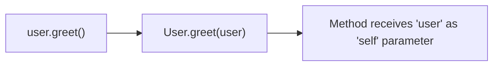

---

### 9.2 `__init__` Constructor vs Class Attributes

Python classes distinguish between **instance attributes** (unique to each object) and **class attributes** (shared across all instances):

```python
class Dog:
    # CLASS ATTRIBUTE: Shared by all instances (like static properties in JS)
    species = "Canis familiaris"

    def __init__(self, name: str, breed: str):
        # INSTANCE ATTRIBUTES: Stored in each instance's internal __dict__
        self.name = name
        self.breed = breed

d1 = Dog("Buddy", "Golden Retriever")
d2 = Dog("Luna", "Husky")

print(d1.name, "-", d1.species)  # Buddy - Canis familiaris
print(d2.name, "-", d2.species)  # Luna - Canis familiaris

# WARNING: Mutable Class Attribute Trap!
class BadCart:
    items = []  # CLASS ATTRIBUTE! Shared by ALL instances!

cart1 = BadCart()
cart2 = BadCart()
cart1.items.append("Laptop")
print(cart2.items)  # ['Laptop']! cart2 sees cart1's item!

# THE FIX: Always initialize mutable containers inside __init__:
class GoodCart:
    def __init__(self):
        self.items = []  # Unique to each instance
```

---

### 9.3 Encapsulation & Python Privacy Conventions

Unlike Java (`private`, `protected`, `public`) or modern JavaScript (`#privateField`), Python follows the principle: *"We are all consenting adults here."*

| Syntax | Convention | Behavior |
| :--- | :--- | :--- |
| `name` | **Public** | Accessible anywhere. |
| `_name` | **Protected (Convention)** | Intended for internal use within class/subclasses. Tools/linters warn against direct external access, but Python does not forbid it. |
| `__name` | **Private (Name Mangling)** | Python automatically renames `self.__val` to `self._ClassName__val` to prevent accidental name collisions in subclasses. |

```python
class BankAccount:
    def __init__(self, owner: str, initial_balance: float):
        self.owner = owner            # Public
        self._account_type = "Checking" # Protected convention
        self.__balance = initial_balance # Name mangled

account = BankAccount("Alice", 1000.0)
print(account.owner)           # Alice
print(account._account_type)   # Checking (Allowed, but linter discourages)

# print(account.__balance)     # AttributeError: 'BankAccount' object has no attribute '__balance'
print(account._BankAccount__balance)  # 1000.0 (Reveals name mangling)
```

---

### 9.4 Pythonic Getters and Setters: `@property`

In Java, developers write verbose `.getBalance()` and `.setBalance()`. In Python, you write clean attribute syntax (`account.balance`) while retaining full validation control using the `@property` decorator:

```python
class Product:
    def __init__(self, name: str, price: float):
        self.name = name
        self.price = price  # Triggers the setter below!

    @property
    def price(self) -> float:
        """Getter: returns the underlying value."""
        return self._price

    @price.setter
    def price(self, value: float) -> None:
        """Setter: validates input before updating."""
        if value < 0:
            raise ValueError("Price cannot be negative!")
        self._price = round(value, 2)

item = Product("Keyboard", 79.99)
print(item.price)  # Accesses like a regular attribute: 79.99

item.price = 69.50  # Calls the @price.setter
print(item.price)  # 69.50

# item.price = -10  # Raises ValueError: Price cannot be negative!
```

---

### 9.5 Core Dunder (Magic) Methods

Dunder methods (double underscore methods) allow your custom objects to integrate seamlessly with Python's built-in operations:

| Dunder Method | Triggered by | Purpose |
| :--- | :--- | :--- |
| `__str__(self)` | `str(obj)`, `print(obj)` | Readable, user-facing string representation. |
| `__repr__(self)` | `repr(obj)`, REPL inspection | Precise, developer-focused representation (ideally runnable code). |
| `__len__(self)` | `len(obj)` | Returns length as an integer. |
| `__eq__(self, other)` | `obj1 == obj2` | Defines equality logic. |
| `__hash__(self)` | `hash(obj)`, dict keys, sets | Generates integer hash for hash tables. |

```python
class Book:
    def __init__(self, title: str, author: str, pages: int):
        self.title = title
        self.author = author
        self.pages = pages

    def __str__(self) -> str:
        # For end-user reading
        return f"'{self.title}' by {self.author}"

    def __repr__(self) -> str:
        # For developers / debugging
        return f"Book(title={self.title!r}, author={self.author!r}, pages={self.pages})"

    def __len__(self) -> int:
        return self.pages

    def __eq__(self, other: object) -> bool:
        if not isinstance(other, Book):
            return False
        return self.title == other.title and self.author == other.author

    def __hash__(self) -> int:
        # Objects that define __eq__ must define __hash__ to be stored in sets/dict keys
        return hash((self.title, self.author))

book1 = Book("Fluent Python", "Luciano Ramalho", 1014)
book2 = Book("Fluent Python", "Luciano Ramalho", 1014)

print(str(book1))       # Output: 'Fluent Python' by Luciano Ramalho
print(repr(book1))      # Output: Book(title='Fluent Python', author='Luciano Ramalho', pages=1014)
print(len(book1))       # Output: 1014
print(book1 == book2)   # Output: True (Value equality, not identity!)
library = {book1}       # Works in sets because __hash__ and __eq__ are defined
```

---

### 9.6 Modern Python: `@dataclass`

Introduced in Python 3.7, `@dataclass` eliminates boilerplate for classes primarily used to store data:

```python
from dataclasses import dataclass, field

@dataclass(frozen=True)  # frozen=True makes instances immutable and automatically hashable!
class Coordinate:
    x: float
    y: float
    label: str = "Point"

# Python automatically generates __init__, __repr__, __eq__, and __hash__!
p1 = Coordinate(10.5, 20.0)
p2 = Coordinate(10.5, 20.0)

print(p1)         # Coordinate(x=10.5, y=20.0, label='Point')
print(p1 == p2)   # True!
# p1.x = 99       # FrozenInstanceError: cannot assign to field 'x'
```

---

### Module 9 Practice Challenges

#### Challenge 9.1: Money Value Object
**Problem:** Build an immutable `Money` value object representing an amount and currency (e.g. `USD`, `EUR`). Support addition (`m1 + m2`), string formatting (`"$10.50"`), value equality (`m1 == m2`), and prevent addition of different currencies with a `ValueError`.

##### Thought Process & Strategy (Step-by-Step)
1. **Goal & Edge Cases:**
   - Represent a monetary amount (stored as integer cents or rounded float to prevent binary float inaccuracies).
   - Prevent mixing different currencies (e.g. adding USD to EUR must raise `ValueError`).
   - Adding two Money objects returns a *new* Money instance (immutability).
2. **Data Structure Selection & Why:**
   - A custom class with `@dataclass(frozen=True)` or standard class with `__add__`, `__repr__`, `__str__`, and `__eq__`. Using `@dataclass(frozen=True)` ensures immutability and auto-generates `__repr__` and `__eq__`.
3. **Algorithm Walkthrough:**
   - Fields: `amount: float`, `currency: str`.
   - In `__add__(self, other)`:
     - Verify `isinstance(other, Money)`.
     - Check `self.currency == other.currency`. If not, raise `ValueError`.
     - Return `Money(self.amount + other.amount, self.currency)`.
   - In `__str__(self)`:
     - Return formatted string like `f"{self.amount:.2f} {self.currency}"`.

```python
from dataclasses import dataclass

@dataclass(frozen=True)
class Money:
    """
    Immutable Money Value Object supporting safe arithmetic.
    """
    amount: float
    currency: str

    def __post_init__(self):
        # Validate that amount is non-negative and currency is uppercase 3-letter code
        if self.amount < 0:
            raise ValueError("Money amount cannot be negative.")
        # We use object.__setattr__ because the dataclass is frozen
        object.__setattr__(self, "currency", self.currency.upper())
        object.__setattr__(self, "amount", round(self.amount, 2))

    def __add__(self, other: "Money") -> "Money":
        """Overloads the '+' operator (m1 + m2)."""
        if not isinstance(other, Money):
            return NotImplemented
        if self.currency != other.currency:
            raise ValueError(f"Cannot add different currencies: {self.currency} and {other.currency}")
        return Money(self.amount + other.amount, self.currency)

    def __str__(self) -> str:
        symbols = {"USD": "$", "EUR": "€", "GBP": "£"}
        sym = symbols.get(self.currency, f"{self.currency} ")
        return f"{sym}{self.amount:.2f}"

# Test cases
m1 = Money(15.50, "USD")
m2 = Money(10.25, "USD")
m3 = m1 + m2

assert str(m3) == "$25.75"
assert m3.amount == 25.75
assert m1 == Money(15.50, "usd")  # Case insensitive currency normalization

try:
    m1 + Money(5.00, "EUR")
    assert False, "Should have raised ValueError"
except ValueError as e:
    assert "Cannot add different currencies" in str(e)

print("Challenge 9.1 Passed!")
```


---

## Module 10: Advanced OOP & Design Patterns

Large-scale Python applications rely on well-structured inheritance hierarchies, abstract interfaces, and composition patterns.

---

### 10.1 Inheritance and `super()`

In Python, inheritance syntax places the parent class in parentheses after the child class name: `class Child(Parent):`.

```python
class Employee:
    def __init__(self, name: str, employee_id: int):
        self.name = name
        self.employee_id = employee_id

    def get_details(self) -> str:
        return f"ID {self.employee_id}: {self.name}"

class Manager(Employee):
    def __init__(self, name: str, employee_id: int, department: str):
        # Call the parent constructor using super()
        super().__init__(name, employee_id)
        self.department = department

    # Method Overriding
    def get_details(self) -> str:
        base_info = super().get_details()
        return f"{base_info} | Manager of {self.department}"

mgr = Manager("Sarah Connor", 101, "Cyberdyne Security")
print(mgr.get_details())
# Output: ID 101: Sarah Connor | Manager of Cyberdyne Security
```

---

### 10.2 Multiple Inheritance and MRO (Method Resolution Order)

Unlike Java or JavaScript (which only support single class inheritance), Python supports **multiple inheritance**. When multiple parent classes define the same method, Python resolves the ambiguity using the **C3 Linearization algorithm**, known as the **Method Resolution Order (MRO)**:

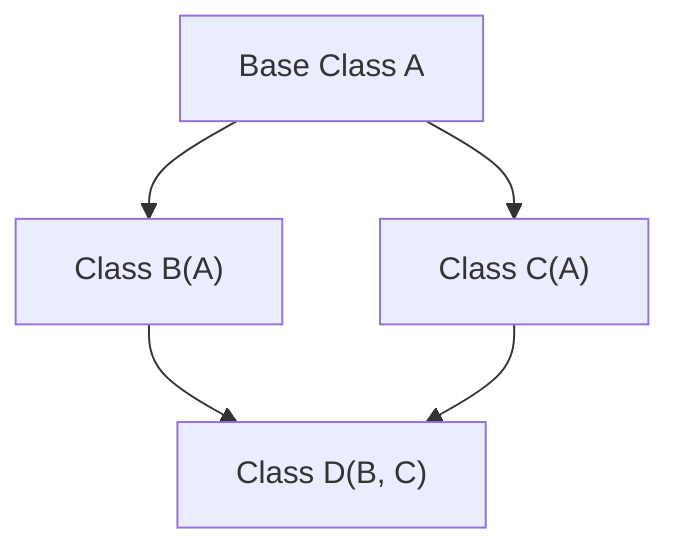

```python
class A:
    def action(self): return "A"

class B(A):
    def action(self): return "B"

class C(A):
    def action(self): return "C"

class D(B, C):
    pass

d = D()
print(d.action())  # Output: 'B' (because B comes before C in definition: D(B, C))

# Inspecting the exact lookup sequence:
print([cls.__name__ for cls in D.mro()])
# Output: ['D', 'B', 'C', 'A', 'object']
```

---

### 10.3 Abstract Base Classes (ABCs)

JavaScript and TypeScript developers rely on `interface` to enforce API contracts. Python achieves compile-time-like interface verification via the `abc` module:

```python
from abc import ABC, abstractmethod

class PaymentGateway(ABC):
    """Abstract Base Class: acts like an interface."""

    @abstractmethod
    def process_payment(self, amount: float) -> bool:
        """Subclasses MUST implement this method."""
        pass

    @abstractmethod
    def refund(self, transaction_id: str) -> bool:
        pass

class StripeGateway(PaymentGateway):
    def process_payment(self, amount: float) -> bool:
        print(f"Charging ${amount} via Stripe API...")
        return True

    def refund(self, transaction_id: str) -> bool:
        print(f"Refunding transaction {transaction_id} on Stripe...")
        return True

# If a subclass forgets to implement any @abstractmethod, Python raises TypeError!
class BrokenGateway(PaymentGateway):
    def process_payment(self, amount: float) -> bool:
        return True
    # Forgot refund()!

# b = BrokenGateway()
# TypeError: Can't instantiate abstract class BrokenGateway without an implementation for abstract method 'refund'
```

---

### 10.4 Composition Over Inheritance

Inheritance couples subclasses tightly to parent classes. In modern Python, **Composition** (combining simpler objects to build complex behavior) is strongly favored:

```python
class Engine:
    def start(self) -> str:
        return "Engine V8 roaring to life."

class GPS:
    def route_to(self, destination: str) -> str:
        return f"Navigating to {destination}."

class ElectricCar:
    """Uses composition instead of deep inheritance hierarchies."""
    def __init__(self, model: str):
        self.model = model
        self.engine = Engine()  # Composed component
        self.gps = GPS()        # Composed component

    def drive(self, destination: str) -> None:
        print(self.engine.start())
        print(self.gps.route_to(destination))

car = ElectricCar("Tesla Model S")
car.drive("Silicon Valley")
```

---

### Module 10 Practice Challenges

#### Challenge 10.1: Strategy Pattern for Discounts
**Problem:** Build an e-commerce checkout calculation system using the **Strategy Design Pattern**. Define an abstract `DiscountStrategy` class with an `apply_discount(total: float) -> float` method. Implement concrete strategies: `NoDiscount`, `PercentageDiscount(percent)`, and `FixedAmountDiscount(amount)`. Create an `Order` class that accepts a strategy and calculates the final total.

##### Thought Process & Strategy (Step-by-Step)
1. **Goal & Edge Cases:**
   - Define a swappable algorithm interface for discounts.
   - Discount should never reduce the final total below $0.00.
2. **Data Structure & Pattern Choice:**
   - `abc.ABC` with `@abstractmethod` ensures that any new discount strategy conforms strictly to the interface.
   - The `Order` class holds a reference to a `DiscountStrategy` (composition) and delegates computation to it.
3. **Algorithm Walkthrough:**
   - `DiscountStrategy(ABC)` defines `apply_discount(total: float) -> float`.
   - `PercentageDiscount` multiplies `total * (1 - percent / 100)`.
   - `FixedAmountDiscount` subtracts amount: `max(0.0, total - amount)`.
   - `Order` has `subtotal` and `discount_strategy`. `calculate_total()` invokes `self.discount_strategy.apply_discount(self.subtotal)`.

```python
from abc import ABC, abstractmethod

class DiscountStrategy(ABC):
    """Abstract Strategy interface."""
    @abstractmethod
    def apply_discount(self, total: float) -> float:
        pass

class NoDiscount(DiscountStrategy):
    def apply_discount(self, total: float) -> float:
        return total

class PercentageDiscount(DiscountStrategy):
    def __init__(self, percentage: float):
        if not (0 <= percentage <= 100):
            raise ValueError("Percentage must be between 0 and 100.")
        self.percentage = percentage

    def apply_discount(self, total: float) -> float:
        return round(total * (1.0 - self.percentage / 100.0), 2)

class FixedAmountDiscount(DiscountStrategy):
    def __init__(self, amount: float):
        if amount < 0:
            raise ValueError("Discount amount cannot be negative.")
        self.amount = amount

    def apply_discount(self, total: float) -> float:
        return max(0.0, round(total - self.amount, 2))

class Order:
    def __init__(self, subtotal: float, discount_strategy: DiscountStrategy = NoDiscount()):
        self.subtotal = subtotal
        self.discount_strategy = discount_strategy

    def calculate_total(self) -> float:
        return self.discount_strategy.apply_discount(self.subtotal)

# Test cases
order1 = Order(100.0, NoDiscount())
assert order1.calculate_total() == 100.0

order2 = Order(200.0, PercentageDiscount(15))  # 15% off 200 = 170.0
assert order2.calculate_total() == 170.0

order3 = Order(50.0, FixedAmountDiscount(60.0))  # Capped at 0.0
assert order3.calculate_total() == 0.0

print("Challenge 10.1 Passed!")
```


---

## Module 11: Exception Handling & Context Managers

Robust software handles errors gracefully and cleans up resources (file descriptors, network sockets, database connections) predictably.

---

### 11.1 The Full Exception Handling Lifecycle

Python's `try / except / else / finally` construct provides a comprehensive error lifecycle:

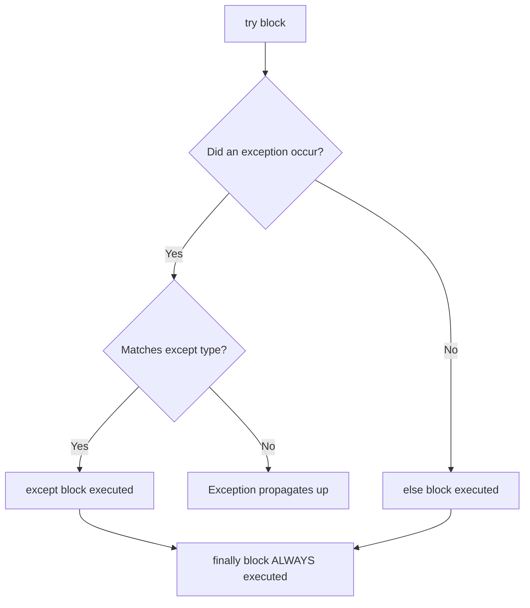

```python
def parse_and_divide(raw_number: str, divisor: float) -> float | None:
    try:
        # Code that may trigger ValueError or ZeroDivisionError
        number = float(raw_number)
        result = number / divisor
    except ValueError as err:
        print(f"[Handled] Invalid numeric string: {err}")
        return None
    except ZeroDivisionError as err:
        print(f"[Handled] Cannot divide by zero: {err}")
        return None
    else:
        # Executes ONLY if the try block succeeded without exceptions!
        print(f"[Success] Calculation successful: {result}")
        return result
    finally:
        # Executes ALWAYS, regardless of success or error (e.g. cleanup)
        print("[Cleanup] Operation attempt finished.")

parse_and_divide("42", 2)
parse_and_divide("abc", 2)
parse_and_divide("42", 0)
```

> [!CAUTION]
> **Anti-Pattern: Bare `except:`**
> Never write a bare `except:` or `except BaseException:`. This catches system-level signals like `KeyboardInterrupt` (Ctrl+C) and `SystemExit`, preventing the user from terminating a runaway script! Always catch specific exceptions or at most `except Exception:`.

---

### 11.2 Custom Exception Classes

Always inherit from Python's built-in `Exception` (not `BaseException`):

```python
class ApplicationError(Exception):
    """Base exception for this application."""
    pass

class ValidationError(ApplicationError):
    """Raised when input fails domain validation rules."""
    def __init__(self, field: str, message: str):
        super().__init__(f"Validation failed on field '{field}': {message}")
        self.field = field

def validate_age(age: int) -> None:
    if age < 0 or age > 130:
        raise ValidationError("age", "Must be between 0 and 130.")

try:
    validate_age(150)
except ValidationError as e:
    print(e)
    print("Problematic field:", e.field)
```

---

### 11.3 Context Managers & The `with` Statement

In JavaScript, managing resources often requires manual `try ... finally` blocks. In Python, the `with` statement ensures resources are automatically released the instant execution leaves the block, even if an unexpected exception crashes the program.

Under the hood, any object that implements the **Context Manager Protocol** (`__enter__` and `__exit__`) works with `with`:

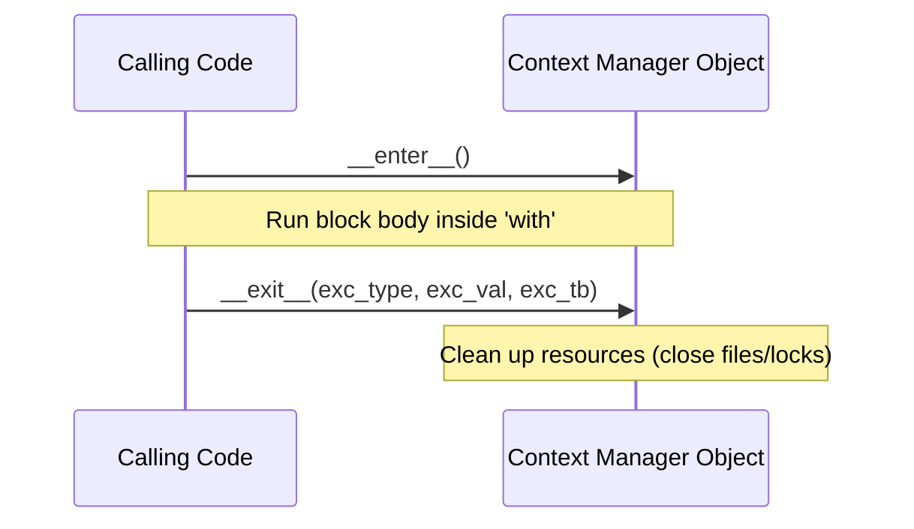

#### Implementing the Protocol Manually

```python
class DatabaseConnection:
    def __init__(self, connection_string: str):
        self.connection_string = connection_string
        self.is_connected = False

    def __enter__(self):
        print(f"Connecting to {self.connection_string}...")
        self.is_connected = True
        return self  # The value assigned to the variable after 'as'

    def __exit__(self, exc_type, exc_val, exc_tb):
        print("Closing database connection safely...")
        self.is_connected = False
        # Returning True suppresses any exception that occurred inside the with block.
        # Returning False (or None) allows the exception to propagate normally.
        return False

with DatabaseConnection("postgresql://localhost:5432/mydb") as db:
    print("Database connected status:", db.is_connected)
    print("Executing query...")
# Connection is GUARANTEED closed here!
```

#### The Pythonic Shortcut: `contextlib.contextmanager`

Writing `__enter__` and `__exit__` manually can be tedious. Python provides the `@contextmanager` generator decorator:

```python
from contextlib import contextmanager
import time

@contextmanager
def temporary_status(user: dict, new_status: str):
    old_status = user.get("status", "offline")
    user["status"] = new_status
    try:
        yield user  # Everything before yield is __enter__
    finally:
        # Everything after yield in finally is __exit__
        user["status"] = old_status

user_profile = {"name": "Alex", "status": "offline"}
with temporary_status(user_profile, "busy"):
    print("Inside block:", user_profile["status"])  # Output: busy

print("After block:", user_profile["status"])       # Output: offline
```

---

### Module 11 Practice Challenges

#### Challenge 11.1: Custom Bank Exception and Transaction Guard
**Problem:** Implement an `InsufficientFundsError` exception with `balance` and `attempted_amount` attributes. Create a `BankAccount` class with a `withdraw(amount)` method that raises this error if funds are inadequate. Write a test wrapper with `try/except/else/finally` that handles the error gracefully.

##### Thought Process & Strategy (Step-by-Step)
1. **Goal & Edge Cases:**
   - Exception should store relevant numeric context (`balance`, `amount`) for audit logging.
   - Bank account should prevent overdrafts.
2. **Algorithm Walkthrough:**
   - `class InsufficientFundsError(Exception):` takes `balance` and `attempted`.
   - `BankAccount.withdraw(amount)` verifies `amount <= self.balance`. If not, raises the exception.
   - Caller handles it via `try ... except InsufficientFundsError as e: ...`.

```python
class InsufficientFundsError(Exception):
    """Raised when an account withdrawal exceeds available balance."""
    def __init__(self, balance: float, attempted_amount: float):
        super().__init__(
            f"Cannot withdraw ${attempted_amount:.2f}; only ${balance:.2f} available."
        )
        self.balance = balance
        self.attempted_amount = attempted_amount

class Account:
    def __init__(self, initial_balance: float):
        self.balance = initial_balance

    def withdraw(self, amount: float) -> float:
        if amount > self.balance:
            raise InsufficientFundsError(self.balance, amount)
        self.balance -= amount
        return self.balance

# Verification
acc = Account(100.0)
audit_log = []

try:
    acc.withdraw(150.0)
except InsufficientFundsError as err:
    audit_log.append(f"DENIED: Deficit of ${err.attempted_amount - err.balance:.2f}")
else:
    audit_log.append("SUCCESS")
finally:
    audit_log.append(f"FINAL_BALANCE: ${acc.balance:.2f}")

assert "DENIED" in audit_log[0]
assert "FINAL_BALANCE: $100.00" in audit_log[1]
print("Challenge 11.1 Passed!")
```

---

#### Challenge 11.2: Benchmark Timer Context Manager
**Problem:** Build a `Timer` context manager (using either class-based `__enter__`/`__exit__` or `@contextlib.contextmanager`) that measures elapsed execution time in milliseconds and records it on an attribute `elapsed_ms`.

##### Thought Process & Strategy (Step-by-Step)
1. **Goal & Edge Cases:**
   - Measure time accurately using `time.perf_counter()`.
   - Ensure timing stops even if an exception is thrown inside the block.
2. **Implementation Choice:**
   - A class-based context manager allows the caller to inspect `timer.elapsed_ms` after the `with` block finishes.

```python
import time

class Timer:
    """
    Measures execution time of a code block in milliseconds.
    """
    def __init__(self):
        self.elapsed_ms: float = 0.0
        self._start: float = 0.0

    def __enter__(self):
        self._start = time.perf_counter()
        return self

    def __exit__(self, exc_type, exc_val, exc_tb):
        end = time.perf_counter()
        self.elapsed_ms = (end - self._start) * 1000.0
        return False  # Do not suppress exceptions

# Verification
with Timer() as t:
    total = sum(i * i for i in range(100_000))

assert t.elapsed_ms > 0
print(f"Elapsed: {t.elapsed_ms:.2f} ms")
print("Challenge 11.2 Passed!")
```


---

## Module 12: Functional Python, Iterators & Generators

Python offers powerful functional programming primitives, lazy evaluation pipelines, and metaprogramming via decorators.

---

### 12.1 The Iterator Protocol: `iter()` and `next()`

In Python, an **Iterable** is any object that can return an iterator (it implements `__iter__()`). An **Iterator** is an object representing a stream of data; calling `next(iterator)` returns the next item or raises `StopIteration` when exhausted:

```python
numbers = [10, 20, 30]

# 1. Obtain an iterator
it = iter(numbers)

# 2. Advance the iterator
print(next(it))  # 10
print(next(it))  # 20
print(next(it))  # 30

# 3. Next call exhausts the iterator
# print(next(it))  # Raises StopIteration!

# What Python's 'for item in numbers:' loop actually does under the hood:
it = iter(numbers)
while True:
    try:
        item = next(it)
        # loop body
    except StopIteration:
        break  # Clean exit
```

---

### 12.2 Generators & The `yield` Keyword (Lazy Evaluation)

In JavaScript, functions run to completion (unless using ES6 `function*`). In Python, any function containing the `yield` keyword is a **Generator function**.

Instead of computing an entire collection in memory and returning it, a generator produces items one at a time on demand. When execution hits `yield`, the function's state (local variables, instruction pointer) is frozen until `next()` is called again:

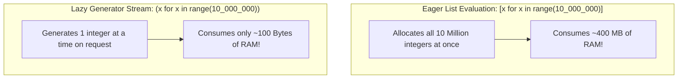

```python
def count_up_to(max_val: int):
    """Generator function yielding numbers lazily."""
    current = 1
    while current <= max_val:
        yield current  # Pauses execution and yields value
        current += 1

gen = count_up_to(3)
print(next(gen))  # 1
print(next(gen))  # 2
print(next(gen))  # 3

# Generator Expressions (Parentheses syntax)
squares_gen = (x * x for x in range(1000_000))  # Instant! No memory allocated!
print(next(squares_gen))  # 0
print(next(squares_gen))  # 1
```

---

### 12.3 Python Decorators: Metaprogramming & Closures

In JavaScript, higher-order functions wrap functions: `const loggedFn = withLogging(fn)`. Python provides syntactic sugar using the `@` symbol:

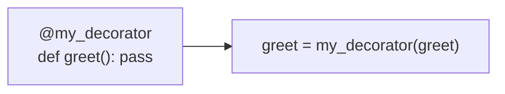

#### Writing Decorators with `@functools.wraps`

Always decorate inner wrapper functions with `@functools.wraps(func)`. Without it, the wrapped function loses its original `__name__`, docstring, and signature!

```python
import functools
import time

def log_execution(func):
    """Decorator that logs function execution and arguments."""
    @functools.wraps(func)  # Crucial: Preserves func.__name__ and docstrings!
    def wrapper(*args, **kwargs):
        print(f"[LOG] Calling {func.__name__} with args={args}, kwargs={kwargs}")
        result = func(*args, **kwargs)
        print(f"[LOG] {func.__name__} returned {result}")
        return result
    return wrapper

@log_execution
def calculate_sum(a: int, b: int) -> int:
    """Calculates sum of two numbers."""
    return a + b

print(calculate_sum(5, 7))
print("Function name preserved:", calculate_sum.__name__)  # 'calculate_sum', not 'wrapper'!
```

---

### 12.4 Useful Built-in Functional Utilities

Python provides expressive built-in functional utilities:

```python
# 1. zip(): Iterate over multiple iterables in parallel
names = ["Alice", "Bob", "Charlie"]
scores = [95, 82, 88]
for name, score in zip(names, scores):
    print(f"{name}: {score}")

# Converting parallel lists to a dictionary:
score_dict = dict(zip(names, scores))  # {'Alice': 95, 'Bob': 82, 'Charlie': 88}

# 2. enumerate(): Index and value pairs (replaces manual 'i = 0' loops)
for index, name in enumerate(names, start=1):
    print(f"#{index}: {name}")

# 3. any() and all(): Short-circuit boolean evaluation
flags = [True, True, False]
print(any(flags))  # True (At least one True)
print(all(flags))  # False (Not all True)
```

---

### Module 12 Practice Challenges

#### Challenge 12.1: Lazy Fibonacci Stream Generator
**Problem:** Write an infinite generator function `fibonacci_stream()` that lazily yields numbers from the Fibonacci sequence (`0, 1, 1, 2, 3, 5, 8, ...`). Consume the first $N$ numbers using a helper function.

##### Thought Process & Strategy (Step-by-Step)
1. **Goal & Edge Cases:**
   - Infinite sequence generation without hitting memory limits or recursion depth errors.
2. **Data Structure Selection & Why:**
   - A generator with `yield` stores only two integer variables in memory (`a` and `b`) regardless of whether we produce 10 or 10,000,000 Fibonacci numbers ($O(1)$ space).
3. **Algorithm Walkthrough:**
   - Initialize `a, b = 0, 1`.
   - Enter `while True:` loop.
   - `yield a`.
   - Update `a, b = b, a + b`.

```python
def fibonacci_stream():
    """
    Lazily generates infinite Fibonacci numbers.
    Space Complexity: O(1) memory!
    """
    a, b = 0, 1
    while True:
        yield a
        a, b = b, a + b

def take(n: int, iterable) -> list:
    """Helper to safely consume the first n items from an infinite generator."""
    result = []
    gen = iter(iterable)
    for _ in range(n):
        result.append(next(gen))
    return result

# Test cases
first_8 = take(8, fibonacci_stream())
assert first_8 == [0, 1, 1, 2, 3, 5, 8, 13]
print("Challenge 12.1 Passed!")
```

---

#### Challenge 12.2: Retry Decorator
**Problem:** Build a parameterized decorator `@retry(max_attempts=3, delay_seconds=0.1)` that automatically retries an operation if it raises an exception, only raising if all attempts fail.

##### Thought Process & Strategy (Step-by-Step)
1. **Goal & Edge Cases:**
   - Decorator with arguments requires a 3-layer nested function:
     - Outer function takes decorator arguments (`max_attempts`).
     - Middle function takes the target `func`.
     - Inner function (`wrapper`) handles execution and retries.
   - Use `@functools.wraps` to preserve target function metadata.
2. **Algorithm Walkthrough:**
   - Loop `attempt` from 1 to `max_attempts`.
   - In `try` block, invoke `func(*args, **kwargs)`. If successful, return result immediately.
   - In `except Exception`, if `attempt == max_attempts`, re-raise. Otherwise, sleep and retry.

```python
import functools
import time

def retry(max_attempts: int = 3, delay_seconds: float = 0.05):
    """
    Decorator that retries a function upon failure.
    """
    def decorator(func):
        @functools.wraps(func)
        def wrapper(*args, **kwargs):
            last_exception = None
            for attempt in range(1, max_attempts + 1):
                try:
                    return func(*args, **kwargs)
                except Exception as exc:
                    last_exception = exc
                    if attempt < max_attempts:
                        time.sleep(delay_seconds)
            raise last_exception
        return wrapper
    return decorator

# Test cases
call_count = 0

@retry(max_attempts=3, delay_seconds=0.01)
def flaky_api_call():
    global call_count
    call_count += 1
    if call_count < 3:
        raise ConnectionError("Temporary network glitch")
    return "SUCCESS"

assert flaky_api_call() == "SUCCESS"
assert call_count == 3
print("Challenge 12.2 Passed!")
```


---

## Module 13: Files, JSON & Modern Pathlib

Production scripts and backend microservices interact with the filesystem, process structured JSON data, and must execute cleanly from the command line.

---

### 13.1 Modern Filesystem Handling with `pathlib`

In legacy Python, developers used string concatenation with `os.path.join()`. Modern Python uses the object-oriented `pathlib.Path` module:

| Task | Legacy `os.path` | Modern `pathlib.Path` |
| :--- | :--- | :--- |
| Current Directory | `os.getcwd()` | `Path.cwd()` |
| Join Paths | `os.path.join(dir, "sub", "file.txt")` | `Path(dir) / "sub" / "file.txt"` (Overloads `/`!) |
| Check Exists | `os.path.exists(p)` | `p.exists()` |
| Create Directories | `os.makedirs(p, exist_ok=True)` | `p.mkdir(parents=True, exist_ok=True)` |
| Read Text File | `with open(p) as f: f.read()` | `p.read_text(encoding="utf-8")` |
| Write Text File | `with open(p, "w") as f: f.write(s)` | `p.write_text(s, encoding="utf-8")` |

```python
from pathlib import Path

# Create path object using the '/' operator
project_dir = Path.cwd() / "my_project"
data_file = project_dir / "data" / "records.txt"

# Create nested directories if they don't exist
data_file.parent.mkdir(parents=True, exist_ok=True)

# Fast file writing and reading
data_file.write_text("Hello from Pathlib!\nLine 2", encoding="utf-8")
content = data_file.read_text(encoding="utf-8")
print(content)

# File metadata
print("File name:", data_file.name)        # records.txt
print("File extension:", data_file.suffix)  # .txt
print("Parent directory:", data_file.parent) # .../my_project/data
```

---

### 13.2 Memory-Efficient File Streaming

Loading a 10 GB file using `file.read()` or `readlines()` reads the entire file into RAM, crashing your system with an `OutOfMemoryError`. In Python, an open file object is an **iterator that yields one line at a time lazily**:

```python
from pathlib import Path

def count_matching_lines(filepath: Path, keyword: str) -> int:
    """
    Streams file line-by-line. Consumes O(1) memory regardless of file size!
    """
    count = 0
    with open(filepath, mode="r", encoding="utf-8") as f:
        for line in f:  # Lazy streaming: loads 1 line into RAM at a time!
            if keyword in line:
                count += 1
    return count
```

---

### 13.3 JSON Serialization & Deserialization

Python's built-in `json` module maps JSON formats directly to native Python data types:

| JSON Type | Python Equivalent |
| :--- | :--- |
| `object` (`{}`) | `dict` |
| `array` (`[]`) | `list` |
| `string` (`"hello"`) | `str` |
| `number` (`42`, `3.14`) | `int` or `float` |
| `true` / `false` | `True` / `False` |
| `null` | `None` |

```python
import json
from dataclasses import dataclass, asdict

# 1. String JSON: json.loads (from string) & json.dumps (to string)
json_str = '{"user": "Alex", "active": true, "roles": ["admin", "dev"]}'
data = json.loads(json_str)  # Deserializes to Python dict
print(data["user"], data["roles"])

# Formatting Python dict to indented JSON string
pretty_json = json.dumps(data, indent=2)
print(pretty_json)

# 2. File JSON: json.load (read from file) & json.dump (write to file)
# with open("config.json", "w", encoding="utf-8") as f:
#     json.dump(data, f, indent=2)

# 3. Serializing Custom Dataclasses
@dataclass
class ServerConfig:
    host: str
    port: int
    debug: bool

config = ServerConfig("127.0.0.1", 8000, True)
# Convert dataclass to dict using asdict(), then serialize:
config_json = json.dumps(asdict(config))
print("Serialized dataclass:", config_json)
```

---

### 13.4 The Canonical Entry Point: `if __name__ == "__main__":`

In JavaScript/Node.js, every file imported via `require()` or `import` runs its top-level code. In Python, when a file is imported as a module, its code also runs.

To ensure executable test code or CLI execution runs **only** when the file is invoked directly (and NOT when imported by another file), Python sets the special variable `__name__` to `"__main__"`:

```python
def add(a: int, b: int) -> int:
    return a + b

# This block executes ONLY if run directly via: python script.py
# If another file writes: import script, this block is SKIPPED!
if __name__ == "__main__":
    print("Running script directly!")
    result = add(10, 20)
    print(f"Result: {result}")
```

---

### Module 13 Practice Challenges

#### Challenge 13.1: Log File Analyzer & JSON Reporter
**Problem:** Write a function `generate_log_report(log_lines: list[str]) -> dict` that parses Apache/Nginx-style log strings containing an HTTP status code (e.g. `200`, `404`, `500`), counts the status codes, computes the total request count, and calculates the error rate (`4xx` and `5xx` / total).

##### Thought Process & Strategy (Step-by-Step)
1. **Goal & Edge Cases:**
   - Parse status codes from log entries.
   - If `total_requests == 0`, return error rate `0.0` to avoid division by zero.
2. **Data Structure Choice:**
   - `collections.Counter` to track frequencies of status codes.
3. **Algorithm Walkthrough:**
   - Loop over lines, extract 3-digit status code.
   - Increment Counter.
   - Sum error codes (`code >= 400`). Return summary dict.

```python
from collections import Counter
import json

def generate_log_report(log_lines: list[str]) -> str:
    """
    Parses log lines, aggregates HTTP status codes, and returns a JSON report string.
    """
    if not log_lines:
        return json.dumps({"total_requests": 0, "error_rate_pct": 0.0, "status_breakdown": {}})

    status_counts = Counter()

    for line in log_lines:
        # Example format: 'GET /index.html HTTP/1.1 200'
        parts = line.strip().split()
        if parts:
            status_code = parts[-1]
            if status_code.isdigit():
                status_counts[int(status_code)] += 1

    total_requests = sum(status_counts.values())
    error_requests = sum(count for code, count in status_counts.items() if code >= 400)
    error_rate = (error_requests / total_requests) * 100.0 if total_requests else 0.0

    report = {
        "total_requests": total_requests,
        "error_rate_pct": round(error_rate, 2),
        "status_breakdown": {str(code): count for code, count in sorted(status_counts.items())}
    }
    return json.dumps(report, indent=2)

# Test cases
sample_logs = [
    "GET /api/users HTTP/1.1 200",
    "POST /api/login HTTP/1.1 200",
    "GET /favicon.ico HTTP/1.1 404",
    "POST /api/checkout HTTP/1.1 500",
    "GET /api/products HTTP/1.1 200",
]

report_json = generate_log_report(sample_logs)
parsed = json.loads(report_json)

assert parsed["total_requests"] == 5
assert parsed["status_breakdown"]["200"] == 3
assert parsed["status_breakdown"]["404"] == 1
assert parsed["status_breakdown"]["500"] == 1
assert parsed["error_rate_pct"] == 40.0
print("Challenge 13.1 Passed!")
```


---

## Module 14: Python Ecosystem, Testing & Mini-Projects

To build real-world software in Python, you must isolate project dependencies using virtual environments, write automated test suites, and structure modular CLI/web projects.

---

### 14.1 Virtual Environments & Dependency Management

In Node.js, `npm install` creates a local `node_modules/` folder isolated to that specific directory.

In Python, running `pip install` by default installs packages **globally** into the system interpreter, leading to package version conflicts between different projects.

To solve this, Python uses **Virtual Environments (`venv`)**, which create an isolated directory containing a private Python binary and site-packages folder:

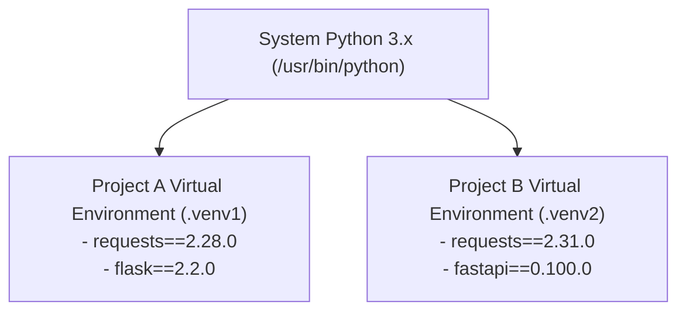

#### Step-by-Step Virtual Environment Workflow

```bash
# 1. Create a virtual environment named '.venv' in your project root:
python3 -m venv .venv

# 2. Activate the virtual environment:
# On macOS / Linux:
source .venv/bin/activate
# On Windows (PowerShell):
# .venv\Scripts\Activate.ps1

# (Your terminal prompt will now show '(.venv)')

# 3. Install packages into the isolated environment:
pip install requests pytest

# 4. Save your project dependencies to requirements.txt (equivalent to package.json):
pip freeze > requirements.txt

# 5. When a teammate clones your repo, they install everything with:
pip install -r requirements.txt

# 6. Deactivate when finished:
deactivate
```

---

### 14.2 Testing in Python: `unittest` & `pytest`

Python includes a built-in testing framework called `unittest` (inspired by JUnit in Java). However, modern Python overwhelmingly prefers **`pytest`** because it uses standard Python `assert` statements rather than cumbersome methods like `self.assertEqual()`:

#### Comparison: `unittest` vs `pytest`

```python
# 1. Standard library unittest (Built-in)
import unittest

def add(x, y): return x + y

class TestAdd(unittest.TestCase):
    def test_positive_numbers(self):
        self.assertEqual(add(2, 3), 5)

# 2. Modern pytest (Clean, concise, industry standard)
# Simply write standard Python functions starting with test_
def test_add_positive():
    assert add(2, 3) == 5

def test_add_negative():
    assert add(-1, -1) == -2

# Pytest provides rich failure reports showing exact variable values automatically!
```

---

### 14.3 Complete Mini-Project: CLI Task Tracker Application

To consolidate everything you have learned across all 14 modules (OOP, `@dataclass`, `pathlib`, `json`, exception handling, and clean modular code), here is a complete, runnable CLI Task Tracker application:

```python
from dataclasses import dataclass, asdict
from pathlib import Path
import json
import sys

@dataclass
class Task:
    id: int
    title: str
    completed: bool = False

class TaskManager:
    def __init__(self, storage_path: Path):
        self.storage_path = storage_path
        self.tasks: list[Task] = []
        self._load()

    def _load(self) -> None:
        """Loads tasks from JSON storage file."""
        if not self.storage_path.exists():
            return
        try:
            raw_data = json.loads(self.storage_path.read_text(encoding="utf-8"))
            self.tasks = [Task(**item) for item in raw_data]
        except (json.JSONDecodeError, KeyError) as err:
            print(f"[Warning] Failed to parse existing tasks: {err}")
            self.tasks = []

    def _save(self) -> None:
        """Saves current tasks to JSON storage file."""
        self.storage_path.parent.mkdir(parents=True, exist_ok=True)
        serialized = [asdict(task) for task in self.tasks]
        self.storage_path.write_text(json.dumps(serialized, indent=2), encoding="utf-8")

    def add_task(self, title: str) -> Task:
        """Generates a new sequential ID and appends task."""
        new_id = max((t.id for t in self.tasks), default=0) + 1
        new_task = Task(id=new_id, title=title)
        self.tasks.append(new_task)
        self._save()
        return new_task

    def complete_task(self, task_id: int) -> bool:
        """Marks task as completed."""
        for task in self.tasks:
            if task.id == task_id:
                task.completed = True
                self._save()
                return True
        return False

    def list_tasks(self) -> list[Task]:
        return list(self.tasks)
```

---

### Module 14 Practice Challenges

#### Challenge 14.1: Task Filtering and Priority System
**Problem:** Extend the `Task` dataclass to include a `priority` attribute (allowed values: `"LOW"`, `"MEDIUM"`, `"HIGH"`). Add a method `filter_by_priority(priority: str)` to `TaskManager` that returns matching tasks, raising a `ValueError` if an invalid priority string is supplied.

##### Thought Process & Strategy (Step-by-Step)
1. **Goal & Edge Cases:**
   - Allow prioritizing tasks.
   - Enforce valid priority values with clear error messages.
2. **Data Structure Selection & Why:**
   - Enum or uppercase string set (`VALID_PRIORITIES = {"LOW", "MEDIUM", "HIGH"}`) provides $O(1)$ validation.
3. **Algorithm Walkthrough:**
   - Validate priority string.
   - Filter task list using list comprehension: `[t for t in self.tasks if t.priority == priority]`.

```python
from dataclasses import dataclass
from pathlib import Path

VALID_PRIORITIES = {"LOW", "MEDIUM", "HIGH"}

@dataclass
class PriorityTask:
    id: int
    title: str
    priority: str = "MEDIUM"
    completed: bool = False

    def __post_init__(self):
        upper_p = self.priority.upper()
        if upper_p not in VALID_PRIORITIES:
            raise ValueError(f"Invalid priority '{self.priority}'. Must be one of {VALID_PRIORITIES}")
        object.__setattr__(self, "priority", upper_p)

def filter_tasks(tasks: list[PriorityTask], priority: str) -> list[PriorityTask]:
    """Filters tasks by priority."""
    norm_p = priority.upper()
    if norm_p not in VALID_PRIORITIES:
        raise ValueError(f"Invalid filter priority '{priority}'.")
    return [t for t in tasks if t.priority == norm_p]

# Test cases
tasks = [
    PriorityTask(1, "Fix database indexing", "HIGH"),
    PriorityTask(2, "Update README docs", "LOW"),
    PriorityTask(3, "Implement OAuth2 login", "HIGH"),
    PriorityTask(4, "Refactor button CSS", "MEDIUM"),
]

high_tasks = filter_tasks(tasks, "high")
assert len(high_tasks) == 2
assert [t.id for t in high_tasks] == [1, 3]

try:
    filter_tasks(tasks, "URGENT")
    assert False, "Should have raised ValueError"
except ValueError:
    pass

print("Challenge 14.1 Passed!")
```

