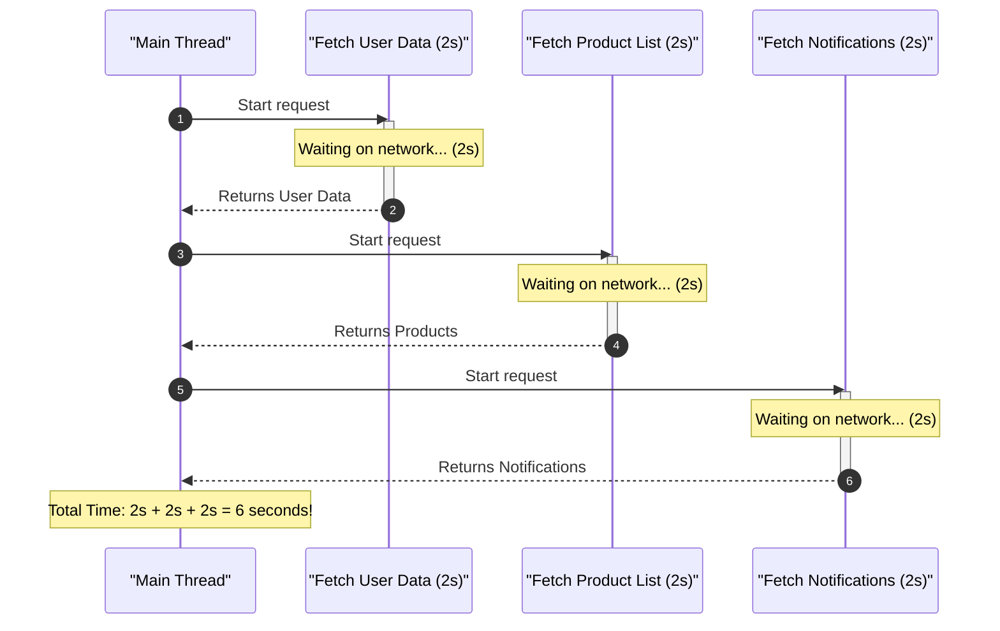
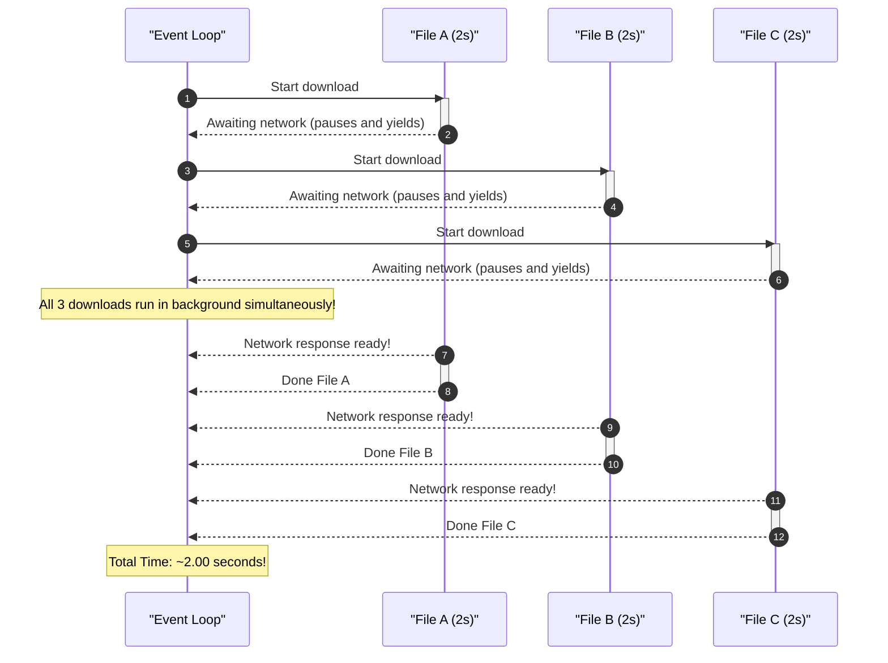
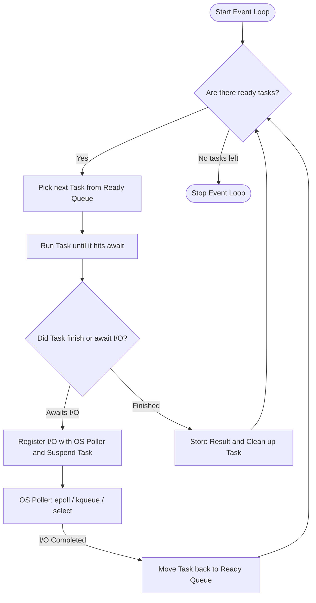
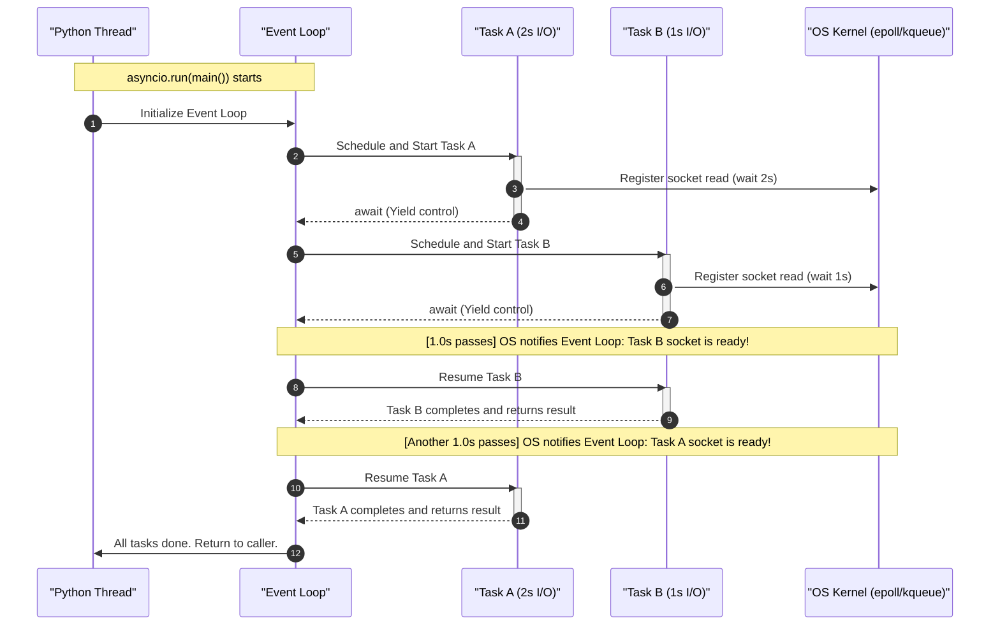

# Python `asyncio`: The Complete Beginner to Advanced Guide

Imagine you are a chef in a restaurant kitchen with three orders on your counter:

1. Boil pasta (takes 10 minutes)
2. Bake a pizza (takes 15 minutes)
3. Chop salad (takes 3 minutes)

In a **synchronous** kitchen, you drop the pasta into boiling water, fold your arms, and stand completely still staring at the pot for 10 minutes. Only after the pasta is drained do you put the pizza into the oven and stand still for 15 minutes. Total time: **28 minutes**.

In an **asynchronous** kitchen, you drop the pasta in the water, immediately pop the pizza into the oven, and while both are cooking by themselves, you chop the salad. Total time: **~15 minutes**.

In computer programming, **`asyncio`** (Asynchronous I/O) is Python's built-in library that lets your code work like that smart chef. It allows a single Python program to handle thousands of waiting tasks—like downloading web pages, querying databases, or reading files—without getting stuck waiting for each one to finish.

## 1. Synchronous vs. Asynchronous: The Core Mental Model

Before writing any code, it is vital to understand the difference between **CPU-bound** tasks and **I/O-bound** tasks.

- **CPU-bound tasks:** Number crunching, image processing, machine learning calculations. The computer processor is working at 100% capacity the entire time.
- **I/O-bound tasks:** Waiting for a web server to respond, waiting for a database query to return rows, waiting for a user to type, or reading data from disk. The CPU is sitting at 0% idle, simply waiting for external hardware or the network.

`asyncio` is specifically designed for **I/O-bound tasks**. It eliminates wasted waiting time.

### Synchronous Execution: The "Stop and Wait" Way

In standard synchronous Python code, every line blocks execution until it finishes completely.



### Standalone Example 1A: The Synchronous Bottleneck

Here is a simple synchronous script you can run immediately. Notice how counting numbers has to wait until the 2-second fetch finishes completely:

```python
import time

def sync_fetch_data():
    print("[Fetch] Starting to fetch data from server...")
    time.sleep(2.0)  # Blocks everything for 2 seconds
    print("[Fetch] Data fetched successfully!")
    return {"status": "success", "items": 100}

def sync_print_numbers():
    print("[Counter] Starting counter...")
    for i in range(1, 5):
        time.sleep(0.3)
        print(f"[Counter] Number: {i}")
    print("[Counter] Counter finished!")

start_time = time.perf_counter()

# Step 1: Fetch must finish completely
data = sync_fetch_data()
print("Data received:", data)

# Step 2: Only now does the counter start
sync_print_numbers()

total_time = time.perf_counter() - start_time
print(f"Total Synchronous Time: {total_time:.2f}s")
```

**Example Output:**

```text
[Fetch] Starting to fetch data from server...
[Fetch] Data fetched successfully!
Data received: {'status': 'success', 'items': 100}
[Counter] Starting counter...
[Counter] Number: 1
[Counter] Number: 2
[Counter] Number: 3
[Counter] Number: 4
[Counter] Counter finished!
Total Synchronous Time: 3.22s
```

### Asynchronous Execution: The "Work While Waiting" Way

In asynchronous code, whenever a task has to wait for I/O, it voluntarily pauses and yields control back to the system so other tasks can run in the meantime.



### Standalone Example 1B: The Asynchronous Advantage

Now run the exact same workflow asynchronously. Watch how the counter counts **while** the data is being fetched:

```python
import asyncio
import time

async def async_fetch_data():
    print("[Fetch] Starting to fetch data from server...")
    await asyncio.sleep(2.0)  # Non-blocking pause: lets other tasks run!
    print("[Fetch] Data fetched successfully!")
    return {"status": "success", "items": 100}

async def async_print_numbers():
    print("[Counter] Starting counter...")
    for i in range(1, 5):
        await asyncio.sleep(0.3)
        print(f"[Counter] Number: {i}")
    print("[Counter] Counter finished!")

async def main():
    start_time = time.perf_counter()

    # Schedule both to run concurrently
    fetch_task = asyncio.create_task(async_fetch_data())
    counter_task = asyncio.create_task(async_print_numbers())

    # Await results
    data = await fetch_task
    print("Data received:", data)
    await counter_task

    total_time = time.perf_counter() - start_time
    print(f"Total Asynchronous Time: {total_time:.2f}s")

asyncio.run(main())
```

**Example Output:**

```text
[Fetch] Starting to fetch data from server...
[Counter] Starting counter...
[Counter] Number: 1
[Counter] Number: 2
[Counter] Number: 3
[Counter] Number: 4
[Counter] Counter finished!
[Fetch] Data fetched successfully!
Data received: {'status': 'success', 'items': 100}
Total Asynchronous Time: 2.01s
```

Notice the total time dropped from **3.22s down to 2.01s**, and the counter was actively making progress during the network delay!

---

## 2. Meet `asyncio`: The Engine Under the Hood

To understand `asyncio`, you only need to understand three core concepts:

1. **The Event Loop**
2. **Cooperative Multitasking**
3. **Single-Threaded Concurrency**

### The Event Loop: The Traffic Conductor

The **Event Loop** is the heart of `asyncio`. Think of it as an infinite loop running in the background:

- It maintains a list of tasks that are ready to run.
- It executes a task until that task says: _"Hey, I'm waiting on network data! Take control back!"_
- The event loop puts that waiting task on pause, checks if any other task is ready to do work, and runs it.
- When the operating system signals that the network data arrived, the event loop wakes the paused task back up and resumes it from the exact line where it paused.



### What is "Cooperative Multitasking"?

In operating systems, threads use **preemptive multitasking**: the OS forcibly interrupts a thread at any millisecond to switch to another thread.

In `asyncio`, Python uses **cooperative multitasking**:

- Python will **NEVER** forcibly pause your code in the middle of a line.
- A task runs continuously until it **voluntarily cooperates** by using the keyword `await`.
- If you write a task that runs an infinite `while True:` loop without an `await`, the event loop is locked up and nothing else will ever run!

### Standalone Example 2A: The Ping-Pong Cooperative Switching Demo

This standalone script clearly shows two tasks passing control back and forth to each other through the event loop:

```python
import asyncio

async def task_ping():
    for i in range(1, 4):
        print(f"Ping {i}")
        await asyncio.sleep(0.5)  # Yields control so Pong can run

async def task_pong():
    for i in range(1, 4):
        print(f"   Pong {i}")
        await asyncio.sleep(0.5)  # Yields control so Ping can run

async def main():
    print("Starting Ping-Pong demo...")
    # Schedule both tasks concurrently
    await asyncio.gather(task_ping(), task_pong())
    print("Game over!")

asyncio.run(main())
```

**Example Output:**

```text
Starting Ping-Pong demo...
Ping 1
   Pong 1
Ping 2
   Pong 2
Ping 3
   Pong 3
Game over!
```

### Standalone Example 2B: What Happens When Code Refuses to Cooperate?

Run this example to see what happens when a task forgets to cooperate (using synchronous `time.sleep` instead of `await asyncio.sleep`):

```python
import asyncio
import time

async def selfish_task():
    print("[Selfish] Starting... I will hog the thread for 2 seconds without awaiting!")
    time.sleep(2)  # Refuses to cooperate! Does NOT yield control!
    print("[Selfish] Done!")

async def polite_task():
    print("[Polite] Waiting for my turn...")
    await asyncio.sleep(0.1)
    print("[Polite] Finally got a turn!")

async def main():
    # Even though both are scheduled, selfish_task blocks polite_task from starting!
    await asyncio.gather(selfish_task(), polite_task())

asyncio.run(main())
```

**Example Output:**

```text
[Selfish] Starting... I will hog the thread for 2 seconds without awaiting!
(everything freezes for 2 full seconds)
[Selfish] Done!
[Polite] Waiting for my turn...
[Polite] Finally got a turn!
```

---

## 3. The Core Building Blocks: `async def`, `await`, Coroutines, and Tasks

Let's look at the basic syntax. Standard Python uses normal functions; `asyncio` introduces **coroutine functions**.

### 1. Defining a Coroutine Function (`async def`)

When you put `async` in front of `def`, Python creates a **coroutine function**:

```python
async def greet():
    return "Hello, Async World!"
```

### Standalone Example 3A: The Unawaited Coroutine Gotcha

Run this snippet to see the most common beginner mistake:

```python
async def greet():
    return "Hello, Async World!"

# Calling it like a normal function:
result = greet()
print("Returned object:", result)
print("Object type:", type(result))
```

**Example Output:**

```text
Returned object: <coroutine object greet at 0x104b2c120>
Object type: <class 'coroutine'>
sys:1: RuntimeWarning: coroutine 'greet' was never awaited
```

Calling an `async def` function creates a dormant **coroutine object**. It does **not** execute a single line until you `await` it inside an event loop.

### 2. Standalone Example 3B: The Classic Background Task Pattern

This example demonstrates how to launch a task in the background using `asyncio.create_task()`, run other code while it is waiting, and collect its returned value when ready:

```python
import asyncio

async def fetch_data():
    print("start fetching")
    await asyncio.sleep(2.0)  # Simulates network latency
    print("done fetching")
    return {"data": 100}

async def print_numbers():
    for i in range(10):
        print(i)
        await asyncio.sleep(0.25)

async def main():
    # Wrap coroutine into a background task
    task1 = asyncio.create_task(fetch_data())
    task2 = asyncio.create_task(print_numbers())

    # Wait for task1 to finish and capture its return value
    data = await task1
    print("Received data:", data)

    # Wait for the remaining numbers to finish
    await task2

asyncio.run(main())
```

**Example Output:**

```text
start fetching
0
1
2
3
4
5
6
7
done fetching
Received data: {'data': 100}
8
9
```

Notice the sequence of events:

1. `fetch_data` starts and goes to sleep for 2 seconds.
2. While it sleeps, `print_numbers` takes over and prints numbers `0` through `7` (each taking 0.25s: $0.25 \times 8 = 2.0\text{s}$).
3. At exactly 2.0s, `fetch_data` finishes and announces `done fetching`.
4. The main function prints `Received data: {'data': 100}`.
5. Finally, the remaining numbers `8` and `9` finish.

---

## 4. Running Tasks Concurrently: `asyncio.gather()` and Modern `TaskGroup`

When you have multiple tasks, manually creating tasks and awaiting each one is repetitive. Python gives you two powerful tools: `asyncio.gather()` and the modern `asyncio.TaskGroup()`.

### Method A: `asyncio.gather(*coroutines)`

`asyncio.gather()` takes multiple coroutines, converts them into tasks, runs them all concurrently, and returns their results in the **exact order** they were passed in.

### Standalone Example 4A: Handling Failures with `return_exceptions=True`

In real life, APIs occasionally fail. By default, an error in `asyncio.gather()` will crash the whole batch. Passing `return_exceptions=True` allows healthy tasks to finish and returns the error object safely:

```python
import asyncio

async def fetch_service_a():
    await asyncio.sleep(1.0)
    return "Service A: Online"

async def fetch_service_b():
    await asyncio.sleep(0.5)
    raise ConnectionResetError("Service B: Server rejected connection!")

async def fetch_service_c():
    await asyncio.sleep(1.2)
    return "Service C: Online"

async def main():
    print("Checking all 3 services concurrently...")

    # return_exceptions=True prevents one crash from ruining the other results!
    results = await asyncio.gather(
        fetch_service_a(),
        fetch_service_b(),
        fetch_service_c(),
        return_exceptions=True
    )

    for i, res in enumerate(results, start=1):
        if isinstance(res, Exception):
            print(f"Service {i} FAILED -> {res}")
        else:
            print(f"Service {i} SUCCESS -> {res}")

asyncio.run(main())
```

**Example Output:**

```text
Checking all 3 services concurrently...
Service 1 SUCCESS -> Service A: Online
Service 2 FAILED -> Service B: Server rejected connection!
Service 3 SUCCESS -> Service C: Online
```

### Method B: Modern Python 3.11+ `asyncio.TaskGroup()` (Structured Concurrency)

In Python 3.11+, `asyncio.TaskGroup()` is the recommended way to run tasks concurrently.

#### Why is `TaskGroup` Better Than `gather`?

If you launch 5 tasks with `gather()` and task #2 crashes with an exception, the other 4 tasks might keep running in the background as "zombies", wasting resources.

With `TaskGroup`:

- If any task fails, all other tasks in the group are **automatically cancelled**.
- Errors are cleanly bundled and re-raised in an `ExceptionGroup`.
- It uses Python's familiar `async with` context manager.

### Standalone Example 4B: Structured Concurrency with `TaskGroup`

```python
import asyncio

async def fetch_user(user_id):
    await asyncio.sleep(1.0)
    return {"id": user_id, "username": "pushkar_dev"}

async def fetch_orders(user_id):
    await asyncio.sleep(1.5)
    return [{"order_id": 101, "total": "$45.00"}, {"order_id": 102, "total": "$120.00"}]

async def main():
    async with asyncio.TaskGroup() as tg:
        user_task = tg.create_task(fetch_user(42))
        orders_task = tg.create_task(fetch_orders(42))

    # When leaving the 'async with' block, ALL tasks are guaranteed to be finished!
    print("User Profile:", user_task.result())
    print("User Orders:", orders_task.result())

asyncio.run(main())
```

**Example Output:**

```text
User Profile: {'id': 42, 'username': 'pushkar_dev'}
User Orders: [{'order_id': 101, 'total': '$45.00'}, {'order_id': 102, 'total': '$120.00'}]
```

### Standalone Example 4C: Enforcing Strict Timeouts

Never let your code wait indefinitely on a unresponsive third-party server:

```python
import asyncio

async def unresponsive_server():
    print("Connecting to unresponsive server...")
    await asyncio.sleep(10.0)  # Simulates hung connection
    return "Finally connected!"

async def main():
    try:
        # Give the server at most 1.5 seconds to respond
        async with asyncio.timeout(1.5):
            response = await unresponsive_server()
            print(response)
    except TimeoutError:
        print("Error: Operation cancelled after exceeding 1.5s timeout limit!")

asyncio.run(main())
```

**Example Output:**

```text
Connecting to unresponsive server...
Error: Operation cancelled after exceeding 1.5s timeout limit!
```

---

## 5. Visualizing Execution: Deep Dive with Diagrams

Let's look under the hood to see how Python's single thread bounces back and forth between tasks.

### Step-by-Step Chronological Execution Flow

Consider this scenario with two concurrent tasks:

- **Task A:** Needs 2 seconds of I/O.
- **Task B:** Needs 1 second of I/O.



### ASCII Single-Thread Call Stack Timeline

Here is what the CPU core is actually doing millisecond by millisecond:

```text
TIME (seconds):
0.0s    | [CPU: Starts Task A] -> Task A awaits network -> registers with OS
0.001s  | [CPU: Starts Task B] -> Task B awaits network -> registers with OS
0.002s  | [CPU: Goes to sleep / Event Loop polls OS kernel for events]
...     | (CPU sits idle with 0% utilization while external network works)
1.000s  | [OS Kernel: Task B data arrived!] -> Wakes Event Loop
1.001s  | [CPU: Resumes Task B] -> Finishes Task B code
1.002s  | [CPU: Goes back to sleep / Event Loop polls OS kernel]
...     | (CPU sits idle)
2.000s  | [OS Kernel: Task A data arrived!] -> Wakes Event Loop
2.001s  | [CPU: Resumes Task A] -> Finishes Task A code
2.002s  | [All done! Event loop exits]
```

### Standalone Example 5: The Live Execution Tracer

Run this script to observe the exact millisecond-level timeline live in your own terminal:

```python
import asyncio
import time

start_timestamp = 0.0

async def monitored_task(name, duration):
    elapsed = time.perf_counter() - start_timestamp
    print(f"[{elapsed:.3f}s] {name} STARTED (will pause for {duration}s)")

    await asyncio.sleep(duration)

    elapsed = time.perf_counter() - start_timestamp
    print(f"[{elapsed:.3f}s] {name} FINISHED!")

async def main():
    global start_timestamp
    start_timestamp = time.perf_counter()

    print(f"[{0.000:.3f}s] Main: Launching Task A (2s) and Task B (1s)...")
    await asyncio.gather(
        monitored_task("Task A", 2.0),
        monitored_task("Task B", 1.0)
    )

    elapsed = time.perf_counter() - start_timestamp
    print(f"[{elapsed:.3f}s] Main: Both tasks completed successfully!")

asyncio.run(main())
```

**Example Output:**

```text
[0.000s] Main: Launching Task A (2s) and Task B (1s)...
[0.000s] Task A STARTED (will pause for 2.0s)
[0.000s] Task B STARTED (will pause for 1.0s)
[1.001s] Task B FINISHED!
[2.001s] Task A FINISHED!
[2.001s] Main: Both tasks completed successfully!
```

---

## 6. Python `asyncio` vs. JavaScript & Node.js: The Complete Breakdown

If you come from JavaScript or Node.js (or are learning both), you will see many similarities—and some massive, sneaky differences.

### The Fundamental Philosophy: Opt-In vs. Native Default

- **JavaScript / Node.js:** Built for the browser and event-driven I/O from day one (1995). Almost **all I/O in JavaScript is asynchronous by default** (e.g., `fetch()`, `fs.promises.readFile()`, timers).
- **Python:** Created in 1991 as a strictly synchronous language. `asyncio` was added much later (Python 3.4 in 2014, with `async/await` syntax in Python 3.5). Python is **synchronous by default**, and asynchronous programming is an explicit, opt-in world.

### The "Function Color" Problem

In Python, functions are strictly divided into two "colors":

- **Normal (Blue) functions:** `def foo():`
- **Async (Red) functions:** `async def bar():`

A synchronous function **cannot** directly `await` an async function! If you try:

```python
def regular_sync_function():
    await some_async_function()  # SyntaxError: 'await' outside async function
```

In JavaScript, top-level `await` is supported in ES Modules, and promises can be chained in synchronous functions using `.then()`. In Python, you must either be inside an `async def` function, or launch the event loop with `asyncio.run()`.

### Side-by-Side Syntax Comparison Table

Here is how common operations in Node.js translate directly into Python `asyncio`:

| Concept / Action              | JavaScript / Node.js                                    | Python `asyncio`                                                                           |
| :---------------------------- | :------------------------------------------------------ | :----------------------------------------------------------------------------------------- |
| **Async function definition** | `async function getData() { ... }`                      | `async def get_data(): ...`                                                                |
| **Awaiting a call**           | `const res = await getData();`                          | `res = await get_data()`                                                                   |
| **Top-level execution**       | Automatically runs in Node.js global event loop         | Must explicitly call `asyncio.run(main())`                                                 |
| **Non-blocking sleep**        | `await new Promise(r => setTimeout(r, 1000))`           | `await asyncio.sleep(1)`                                                                   |
| **Concurrent Execution**      | `Promise.all([p1, p2, p3])`                             | `await asyncio.gather(c1, c2, c3)`                                                         |
| **Structured Concurrency**    | Not native (manual cancellation via `AbortController`)  | `async with asyncio.TaskGroup() as tg:`                                                    |
| **Wait for fastest (Race)**   | `Promise.race([p1, p2])`                                | `await asyncio.wait([t1, t2], return_when=FIRST_COMPLETED)`                                |
| **Handle errors in batch**    | `Promise.allSettled([p1, p2])`                          | `await asyncio.gather(c1, c2, return_exceptions=True)`                                     |
| **Background execution**      | Calling `asyncFn()` without `await` starts it instantly | Calling `async_fn()` creates an idle coroutine; must use `asyncio.create_task(async_fn())` |

### Deep Execution Difference: When Does Code Start Running?

This is the most critical difference between Python and JavaScript:

#### In JavaScript:

When you invoke an async function, **it begins executing immediately and synchronously** until it encounters its first `await`:

```javascript
// JavaScript / Node.js
async function greet() {
  console.log("Step 1: Runs right now!");
  await delay(1000);
  console.log("Step 2: Runs later");
}

// Just calling this starts execution immediately!
greet();
console.log("Step 3: After call");

// Output in Node.js:
// Step 1: Runs right now!
// Step 3: After call
// (1 second later)
// Step 2: Runs later
```

#### In Python:

Invoking a coroutine function **does NOT execute a single line of code inside it!** It merely creates a dormant coroutine object.

### Standalone Example 6: Demonstrating Python's Dormant Coroutine Behavior

Run this standalone Python script to prove this behavior for yourself:

```python
import asyncio

async def test_coroutine():
    print("Inside coroutine: Did I run immediately? YES!")
    await asyncio.sleep(0.5)
    print("Inside coroutine: Finished sleep.")

async def main():
    print("[Step 1: Just calling the function]")
    coro = test_coroutine()
    print(f"Object created: {coro}")
    print("Notice that 'Inside coroutine' has NOT printed yet!\n")

    print("[Step 2: Now we explicitly await it]")
    await coro
    print("[Step 3: Done]")

asyncio.run(main())
```

**Example Output:**

```text
[Step 1: Just calling the function]
Object created: <coroutine object test_coroutine at 0x102cb4880>
Notice that 'Inside coroutine' has NOT printed yet!

[Step 2: Now we explicitly await it]
Inside coroutine: Did I run immediately? YES!
Inside coroutine: Finished sleep.
[Step 3: Done]
```

---

## 7. Crucial Gotchas & Beginner Pitfalls

Avoid these common traps that catch almost every developer new to `asyncio`.

### Pitfall 1: Calling a Synchronous Blocking Function Inside Async Code

If you use standard `time.sleep()` or synchronous libraries like `requests` inside an async function, you freeze the entire event loop.

#### Standalone Example 7A: The Blocking Bug vs. `asyncio.to_thread()` Fix

Here is a runnable side-by-side benchmark showing how `asyncio.to_thread()` lets you run legacy blocking code in background worker threads without freezing your event loop:

```python
import asyncio
import time

def legacy_blocking_io(task_id):
    # Simulates a legacy synchronous library like requests.get() or time.sleep()
    time.sleep(1.0)
    return f"Task {task_id} data"

async def bad_way():
    # DISASTER: Runs serially and freezes the thread for 3 full seconds!
    start = time.perf_counter()
    res1 = legacy_blocking_io(1)
    res2 = legacy_blocking_io(2)
    res3 = legacy_blocking_io(3)
    print(f"Bad Way (Blocking): {time.perf_counter() - start:.2f}s")

async def good_way():
    # EXCELLENT: Runs blocking functions concurrently on background threads!
    start = time.perf_counter()
    results = await asyncio.gather(
        asyncio.to_thread(legacy_blocking_io, 1),
        asyncio.to_thread(legacy_blocking_io, 2),
        asyncio.to_thread(legacy_blocking_io, 3)
    )
    print(f"Good Way (asyncio.to_thread): {time.perf_counter() - start:.2f}s")

async def main():
    await bad_way()
    await good_way()

asyncio.run(main())
```

**Example Output:**

```text
Bad Way (Blocking): 3.01s
Good Way (asyncio.to_thread): 1.01s
```

### Pitfall 2: Running `asyncio.run()` in Jupyter Notebooks

If you try to run `asyncio.run(main())` in a Jupyter Notebook (like `async.io.ipynb`), you will get this error:

```text
RuntimeError: asyncio.run() cannot be called from a running event loop
```

**Why does this happen?**
Jupyter itself runs completely on top of an internal `asyncio` event loop so it can handle interactive outputs. You cannot start an event loop inside an already running event loop!

#### Standalone Example 7B: The Solution in Jupyter Notebooks

Inside any Jupyter cell, simply `await` your async function directly:

```python
# In a Jupyter notebook cell (e.g. async.io.ipynb):
import asyncio

async def fetch():
    await asyncio.sleep(1)
    return "Jupyter Async Works!"

# Do NOT call asyncio.run(fetch())!
# Just call await directly:
output = await fetch()
print(output)
```

**Example Output:**

```text
Jupyter Async Works!
```

---

## 8. Real-World Async Patterns & Use Cases

Where does `asyncio` truly shine in production?

### Standalone Example 8A: Zero-Dependency Concurrent HTTP Status Checker

You don't need third-party packages to test concurrent web requests. This standalone script uses Python's built-in `urllib` wrapped with `asyncio.to_thread()` to check multiple websites concurrently in parallel:

```python
import asyncio
import urllib.request
import time

def check_website(url):
    try:
        req = urllib.request.Request(url, headers={"User-Agent": "Python-Async-Bot/1.0"})
        with urllib.request.urlopen(req, timeout=4) as response:
            return url, response.status
    except Exception as e:
        return url, f"Error: {e.__class__.__name__}"

async def main():
    urls = [
        "https://www.python.org",
        "https://docs.python.org",
        "https://pypi.org",
    ]

    print(f"Checking {len(urls)} sites concurrently...")
    start = time.perf_counter()

    # Dispatch checks in parallel
    tasks = [asyncio.to_thread(check_website, u) for u in urls]
    results = await asyncio.gather(*tasks)

    for url, status in results:
        print(f" - {url} -> {status}")

    print(f"All sites checked in {time.perf_counter() - start:.2f}s!")

asyncio.run(main())
```

**Example Output:**

```text
Checking 3 sites concurrently...
 - https://www.python.org -> 200
 - https://docs.python.org -> 200
 - https://pypi.org -> 200
All sites checked in 0.85s!
```

### Standalone Example 8B: Producer-Consumer Queue (`asyncio.Queue`)

When dealing with rate limits (e.g., OpenAI API or payment processors), you don't want to fire 10,000 requests simultaneously. You can use an async queue to limit concurrency:

```python
import asyncio
import random

async def worker(worker_id, queue):
    while True:
        job = await queue.get()
        print(f"[Worker-{worker_id}] Started job: {job}")
        await asyncio.sleep(random.uniform(0.3, 0.7))  # Simulates work
        print(f"[Worker-{worker_id}] Finished job: {job}")
        queue.task_done()

async def main():
    queue = asyncio.Queue()

    # Launch 2 background worker tasks
    workers = [
        asyncio.create_task(worker(1, queue)),
        asyncio.create_task(worker(2, queue))
    ]

    # Queue up 4 jobs
    for item in ["Email Customer", "Process Payment", "Generate PDF", "Send SMS"]:
        await queue.put(item)

    # Wait until all jobs in the queue are completed
    await queue.join()

    # Cancel the continuous workers
    for w in workers:
        w.cancel()

    print("All queue tasks completed!")

asyncio.run(main())
```

**Example Output:**

```text
[Worker-1] Started job: Email Customer
[Worker-2] Started job: Process Payment
[Worker-1] Finished job: Email Customer
[Worker-1] Started job: Generate PDF
[Worker-2] Finished job: Process Payment
[Worker-2] Started job: Send SMS
[Worker-1] Finished job: Generate PDF
[Worker-2] Finished job: Send SMS
All queue tasks completed!
```

---

## 9. Quick Reference Cheatsheet

### Core Mental Rules

1. **CPU-bound?** -> Use `multiprocessing` (uses multiple CPU cores).
2. **I/O-bound (blocking legacy code)?** -> Use `threading` or `asyncio.to_thread()`.
3. **I/O-bound (modern, scalable web/network)?** -> Use `asyncio` (single-threaded, handles thousands of connections).

### Standalone Example 9: The 10-Second Copy-Paste Starter Template

Copy and paste this template whenever you want to start a new async Python script:

```python
import asyncio
import time

async def worker_task(task_id, delay):
    print(f"Task {task_id}: Started")
    await asyncio.sleep(delay)
    print(f"Task {task_id}: Finished after {delay}s")
    return f"Result {task_id}"

async def main():
    start = time.perf_counter()

    # Run tasks concurrently
    async with asyncio.TaskGroup() as tg:
        t1 = tg.create_task(worker_task(1, 1.0))
        t2 = tg.create_task(worker_task(2, 0.5))

    print("Results:", t1.result(), t2.result())
    print(f"Total time: {time.perf_counter() - start:.2f}s")

if __name__ == "__main__":
    asyncio.run(main())
```

**Example Output:**

```text
Task 1: Started
Task 2: Started
Task 2: Finished after 0.5s
Task 1: Finished after 1.0s
Results: Result 1 Result 2
Total time: 1.01s
```

### The Golden Rule of `asyncio`:

> **Never block the event loop!** If a task does not use `await`, no other task can run. Always use async-native libraries (`aiofiles`, `httpx`, `asyncpg`, etc.) or delegate blocking calls to `asyncio.to_thread()`.
