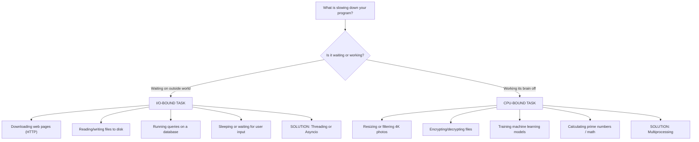
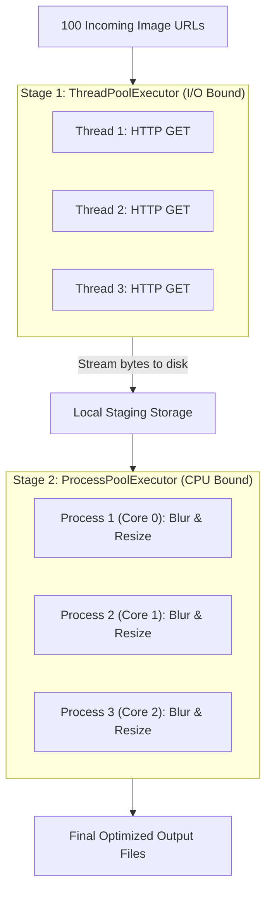

# The Complete Beginner-to-Advanced Guide to Python Concurrency & Parallelism

> **A Step-by-Step, Visual, and Code-Driven Tutorial on Threading, Multiprocessing, Locks, and Asynchronous Concepts in Python.**  
> _Based on Corey Schafer's classic tutorials on Threading and Multiprocessing, expanded with intuitive building blocks, line-by-line code breakdowns, real-world projects, and production architecture._

---

## 📖 How to Use This Guide

This guide is designed to take you from **zero knowledge** of concurrency to **production-ready mastery**. Every concept is taught in three stages:

1. **The Intuitive Mental Model:** A plain-English, real-world analogy (kitchens, chefs, passports, post offices) so you understand _why_ the concept exists.
2. **The Step-by-Step Building Blocks:** Small, bite-sized snippets where every single line, parameter, and function is explained.
3. **The Standalone Runnable Code:** A complete, working Python script you can copy, run, and observe directly in your terminal, along with its expected output.

---

## 🗺️ Table of Contents

### 🟢 Phase 1: The Fundamentals

- [1. Understanding Your Computer: Hardware, Processes, and Threads](#1-understanding-your-computer-hardware-processes-and-threads)
  - [The Kitchen Analogy (Process vs. Thread vs. Core)](#the-kitchen-analogy-process-vs-thread-vs-core)
  - [I/O-Bound vs. CPU-Bound: Waiting vs. Working](#io-bound-vs-cpu-bound-waiting-vs-working)
  - [Concurrency vs. Parallelism: The Definitive Difference](#concurrency-vs-parallelism-the-definitive-difference)
- [2. The Python GIL (Global Interpreter Lock)](#2-the-python-gil-global-interpreter-lock)
  - [What is the GIL and Why Does It Exist?](#what-is-the-gil-and-why-does-it-exist)
  - [Why Threading Works for I/O but Fails for CPU Math](#why-threading-works-for-io-but-fails-for-cpu-math)
  - [Free-Threaded Python: PEP 703 (Python 3.13+)](#free-threaded-python-pep-703-python-313)
- [3. The Baseline: Synchronous Execution](#3-the-baseline-synchronous-execution)
  - [Building Block 1: The Task Function](#building-block-1-the-task-function)
  - [Building Block 2: Benchmarking with `time.perf_counter()`](#building-block-2-benchmarking-with-timeperf_counter)
  - [Standalone Script: Synchronous Execution](#standalone-script-synchronous-execution)

---

### 🟡 Phase 2: Python Threading (For I/O-Bound Tasks)

- [4. The Classic Way: Manual Threading (`threading.Thread`)](#4-the-classic-way-manual-threading-threadingthread)
  - [Building Block 1: Spawning a Thread](#building-block-1-spawning-a-thread)
  - [Building Block 2: The Mystery of the 0.0-Second Timer](#building-block-2-the-mystery-of-the-00-second-timer)
  - [Building Block 3: The Fix — `.join()`](#building-block-3-the-fix--join)
  - [Building Block 4: Passing Arguments (`args=(val,)`)](#building-block-4-passing-arguments-argsval)
  - [Building Block 5: Scaling with Loops (The Accumulator Pattern)](#building-block-5-scaling-with-loops-the-accumulator-pattern)
  - [Building Block 6: Background Workers (Daemon Threads)](#building-block-6-background-workers-daemon-threads)
  - [Standalone Script: Classic Threading in Action](#standalone-script-classic-threading-in-action)
- [5. The Modern Way: `concurrent.futures.ThreadPoolExecutor`](#5-the-modern-way-concurrentfuturesthreadpoolexecutor)
  - [Why Was `concurrent.futures` Created?](#why-was-concurrentfutures-created)
  - [Building Block 1: The Context Manager (`with`)](#building-block-1-the-context-manager-with)
  - [Building Block 2: Scheduling with `executor.submit()` & `Future` Objects](#building-block-2-scheduling-with-executorsubmit--future-objects)
  - [Building Block 3: First-Done, First-Served with `as_completed()`](#building-block-3-first-done-first-served-with-as_completed)
  - [Building Block 4: Order-Preserving Execution with `executor.map()`](#building-block-4-order-preserving-execution-with-executormap)
  - [Building Block 5: Handling Exceptions in Threads](#building-block-5-handling-exceptions-in-threads)
  - [Standalone Script: Modern Thread Pool Demo](#standalone-script-modern-thread-pool-demo)
- [6. When Threads Collide: Synchronization, Race Conditions & Locks](#6-when-threads-collide-synchronization-race-conditions--locks)
  - [The Shared Memory Curse: The Race Condition](#the-shared-memory-curse-the-race-condition)
  - [Visualizing the Collision](#visualizing-the-collision)
  - [Building Block 1: Reproducing the Broken Counter](#building-block-1-reproducing-the-broken-counter)
  - [Building Block 2: Fixing with `threading.Lock`](#building-block-2-fixing-with-threadinglock)
  - [Building Block 3: Avoiding Self-Deadlocks with `threading.RLock`](#building-block-3-avoiding-self-deadlocks-with-threadingrlock)
  - [Building Block 4: Deadlocks (The Circular Wait Trap)](#building-block-4-deadlocks-the-circular-wait-trap)
  - [Building Block 5: Resource Throttling with `threading.Semaphore`](#building-block-5-resource-throttling-with-threadingsemaphore)
  - [Building Block 6: Signaling Workers with `threading.Event`](#building-block-6-signaling-workers-with-threadingevent)
  - [Building Block 7: Thread-Local Storage (`threading.local`)](#building-block-7-thread-local-storage-threadinglocal)
- [7. Thread-Safe Pipelines: `queue.Queue`](#7-thread-safe-pipelines-queuequeue)
  - [Why Queues Beat Manual Locks](#why-queues-beat-manual-locks)
  - [Building Block 1: Put, Get, and Backpressure](#building-block-1-put-get-and-backpressure)
  - [Building Block 2: Coordinating with `task_done()` and `join()`](#building-block-2-coordinating-with-task_done-and-join)
  - [Standalone Script: Full Producer-Consumer System](#standalone-script-full-producer-consumer-system)
- [8. Real-World Project 1: High-Speed Concurrent Image Downloader](#8-real-world-project-1-high-speed-concurrent-image-downloader)
  - [The Problem: Downloading 15 High-Res Images](#the-problem-downloading-15-high-res-images)
  - [Step 1: The Synchronous Implementation](#step-1-the-synchronous-implementation)
  - [Step 2: The Concurrent Implementation with `ThreadPoolExecutor`](#step-2-the-concurrent-implementation-with-threadpoolexecutor)
  - [Step 3: Production Hardening (Sessions, Retries, Chunking)](#step-3-production-hardening-sessions-retries-chunking)
  - [Standalone Script: Production Image Downloader](#standalone-script-production-image-downloader)

---

### 🔵 Phase 3: Python Multiprocessing (For CPU-Bound Tasks)

- [9. Moving to Multiprocessing: True Parallelism](#9-moving-to-multiprocessing-true-parallelism)
  - [Why Threading Fails on CPU Math](#why-threading-fails-on-cpu-math)
  - [How Multiprocessing Bypasses the GIL](#how-multiprocessing-bypasses-the-gil)
  - [The Hidden Cost: Object Serialization (Pickling)](#the-hidden-cost-object-serialization-pickling)
  - [Detecting CPU Cores with `os.cpu_count()`](#detecting-cpu-cores-with-oscpu_count)
- [10. The Classic Way: Manual Multiprocessing (`multiprocessing.Process`)](#10-the-classic-way-manual-multiprocessing-multiprocessingprocess)
  - [The Mystery of `if __name__ == '__main__':` (Why Windows/Mac Crash Without It)](#the-mystery-of-if-__name__--__main__-why-windowsmac-crash-without-it)
  - [Building Block 1: Spawning a Process](#building-block-1-spawning-a-process)
  - [Building Block 2: Scaling Multiple Processes in a List](#building-block-2-scaling-multiple-processes-in-a-list)
  - [Building Block 3: Process Inspection (`pid`, `is_alive`, `terminate`)](#building-block-3-process-inspection-pid-is_alive-terminate)
  - [Standalone Script: Classic Multiprocessing Demo](#standalone-script-classic-multiprocessing-demo)
- [11. The Modern Way: `concurrent.futures.ProcessPoolExecutor`](#11-the-modern-way-concurrentfuturesprocesspoolexecutor)
  - [Switching from Threads to Processes in 1 Line of Code](#switching-from-threads-to-processes-in-1-line-of-code)
  - [Building Block 1: Basic Math Pool](#building-block-1-basic-math-pool)
  - [Building Block 2: Using `chunksize` to Eliminate IPC Overhead](#building-block-2-using-chunksize-to-eliminate-ipc-overhead)
  - [Standalone Script: High-Throughput Prime Number Finder](#standalone-script-high-throughput-prime-number-finder)
- [12. Real-World Project 2: Batch Image Processing (Pillow / PIL)](#12-real-world-project-2-batch-image-processing-pillow--pil)
  - [The Problem: Resizing and Gaussian Blur on 15 Photos](#the-problem-resizing-and-gaussian-blur-on-15-photos)
  - [Step 1: The Synchronous Benchmark](#step-1-the-synchronous-benchmark)
  - [Step 2: The Multiprocessing Parallel Benchmark](#step-2-the-multiprocessing-parallel-benchmark)
  - [Head-to-Head Comparison: Single-Thread vs. Multi-Thread vs. Multi-Process](#head-to-head-comparison-single-thread-vs-multi-thread-vs-multi-process)
  - [Standalone Script: High-Speed Image Batch Processor](#standalone-script-high-speed-image-batch-processor)
- [13. Inter-Process Communication (IPC) & Shared Memory](#13-inter-process-communication-ipc--shared-memory)
  - [Why Global Variables Don't Work Across Processes](#why-global-variables-dont-work-across-processes)
  - [Building Block 1: `multiprocessing.Queue`](#building-block-1-multiprocessingqueue)
  - [Building Block 2: Fast 1-to-1 Channels with `multiprocessing.Pipe`](#building-block-2-fast-1-to-1-channels-with-multiprocessingpipe)
  - [Building Block 3: C-Type Shared Memory (`Value` and `Array`)](#building-block-3-c-type-shared-memory-value-and-array)
  - [Building Block 4: Server Process Managers (`Manager().dict()`)](#building-block-4-server-process-managers-managerdict)
  - [Building Block 5: Zero-Copy Shared Memory for NumPy (`shared_memory`)](#building-block-5-zero-copy-shared-memory-for-numpy-shared_memory)
- [14. Process Start Methods: `fork`, `spawn`, and `forkserver`](#14-process-start-methods-fork-spawn-and-forkserver)
  - [How Operating Systems Create Processes](#how-operating-systems-create-processes)
  - [The Deadlock Risk of `fork` with Threads](#the-deadlock-risk-of-fork-with-threads)
  - [Setting the Start Method Explicitly](#setting-the-start-method-explicitly)

---

### 🟣 Phase 4: Production Architecture & Mastery

- [15. The Master Hybrid Architecture: Threading + Multiprocessing Pipeline](#15-the-master-hybrid-architecture-threading--multiprocessing-pipeline)
  - [The Real-World Scenario: Ingest from Web, Transform with CPU](#the-real-world-scenario-ingest-from-web-transform-with-cpu)
  - [The Architecture Diagram](#the-architecture-diagram)
  - [Standalone Script: The Complete Two-Stage Pipeline](#standalone-script-the-complete-two-stage-pipeline)
- [16. The Grand Decision Matrix & Troubleshooting FAQ](#16-the-grand-decision-matrix--troubleshooting-faq)
  - [Decision Flowchart: Which Tool Should You Pick?](#decision-flowchart-which-tool-should-you-pick)
  - [Grand Comparison: Threading vs. Multiprocessing vs. Asyncio](#grand-comparison-threading-vs-multiprocessing-vs-asyncio)
  - [Beginner Troubleshooting & Error Decoder](#beginner-troubleshooting--error-decoder)
  - [Summary Best-Practices Checklist](#summary-best-practices-checklist)

---

# 🟢 PHASE 1: THE FUNDAMENTALS

---

## 1. Understanding Your Computer: Hardware, Processes, and Threads

To master concurrency, you don't need a computer science degree, but you must have a clear mental model of how your operating system and CPU work together.

### The Kitchen Analogy (Process vs. Thread vs. Core)

Imagine a professional restaurant:

```text
+-----------------------------------------------------------------------------+
|                          RESTAURANT = PROCESS (PID 4082)                    |
|  Private Property (Address Space) | Pantry & Fridge (Heap Memory)           |
|                                                                             |
|      +---------------------+               +---------------------+          |
|      |    Chef 1 (Thread)  |               |    Chef 2 (Thread)  |          |
|      |  - Own recipe book  |               |  - Own recipe book  |          |
|      |    (Call Stack)     |               |    (Call Stack)     |          |
|      +---------------------+               +---------------------+          |
|                 \                             /                             |
|                  \                           /                              |
|                   +------> SHARED PANTRY <---+                              |
|                           (Shared Variables)                                |
+-----------------------------------------------------------------------------+
                                       |
                     Runs on Hardware Stove Tops (CPU Cores)
```

- **The Restaurant is a Process:**  
  It has its own physical building, its own private address, and its own pantry (memory). A rival restaurant down the street cannot touch its ingredients. Spawning a new restaurant is expensive: you have to construct a building and buy all new appliances.
- **The Chefs are Threads:**  
  Inside the restaurant, multiple chefs work simultaneously. They share the same pantry, walk in the same kitchen, and can speak directly to each other. Spawning a new chef is cheap. However, if two chefs reach for the exact same bowl of salad dressing at the same time and knock it over, you have a **race condition**.
- **The Stoves are CPU Cores:**  
  A physical CPU might have 4, 8, or 16 cores. Each core can physically execute instructions for one chef at any single split-second.

---

### I/O-Bound vs. CPU-Bound: Waiting vs. Working

Every operation your computer performs falls into one of two categories:



- **I/O-Bound (Input/Output):**  
  The CPU spends 99% of its time idle, waiting for the hard drive, the database, or an external web server across the country to send packets back.  
  _Analogy:_ Ordering food online. You don't need 8 brains to wait for the delivery driver; you can order from 5 different restaurants concurrently while sitting on your couch.
- **CPU-Bound:**  
  The CPU is operating at 100% capacity, crunching numbers as fast as physical silicon transistors allow.  
  _Analogy:_ Hand-calculating long division for 10,000 equations. Having a friend help you doubles your speed.

---

### Concurrency vs. Parallelism: The Definitive Difference

People use these words interchangeably, but they are completely different:

```text
CONCURRENCY (Multitasking on 1 Core):
Chef: [Chop Onions (10s)] -> [Check Oven (5s)] -> [Chop Onions (10s)]
Time: =============================================================>
(One chef juggling multiple tasks by switching back and forth during wait times)

PARALLELISM (Simultaneous on Multiple Cores):
Chef 1 (Core 1): [Chop Onions ....................................]
Chef 2 (Core 2): [Bake Bread .....................................]
Time:            =================================================>
(Two distinct chefs physically working at the exact same physical millisecond)
```

- **Concurrency** is about **structure**: dealing with lots of things at once (interleaving execution).
- **Parallelism** is about **execution**: doing lots of things at the exact same instant (requires multiple CPU cores).

---

## 2. The Python GIL (Global Interpreter Lock)

If you have a modern 8-core processor, why can't Python run 8 threads in parallel across all 8 cores?

### What is the GIL and Why Does It Exist?

In CPython (the standard Python interpreter written in C), memory management uses **reference counting**. Every time you assign an object, its reference counter increments:

```python
x = [1, 2, 3]  # Reference count for list is 1
y = x          # Reference count is 2
```

When reference counts reach 0, Python frees the memory.

If two threads mutate reference counts at the exact same nanosecond on two separate CPU cores, the counters can become corrupted, resulting in memory leaks or sudden segmentation faults.

To prevent this, the creators of Python added the **Global Interpreter Lock (GIL)**:

> **The Golden Rule of the GIL:**  
> Only ONE thread can execute Python bytecode at any given moment within a single Python process, regardless of how many CPU cores your machine has.

---

### Why Threading Works for I/O but Fails for CPU Math

- **During I/O (Network, Disk, Sleep):**  
  When a thread calls `time.sleep()`, `requests.get()`, or `socket.recv()`, the CPython interpreter **explicitly releases the GIL** before handing control to the operating system kernel. While Thread 1 is waiting for network packets, Thread 2 acquires the GIL and runs Python code. You get massive speedups!
- **During CPU Math (Loops, Image filtering, Math):**  
  The threads fight fiercely for the GIL. The operating system continuously stops one thread and starts another (context switching). The overhead of switching makes CPU-bound multithreaded Python code **slower** than plain single-threaded code!

---

### Free-Threaded Python: PEP 703 (Python 3.13+)

In Python 3.13+, an experimental build option called `--disable-gil` was introduced. It replaces the global lock with fine-grained per-object locks, finally allowing true multi-core parallel threads in pure Python. However, for the majority of production Python code in the wild today, understanding the GIL is essential.

---

## 3. The Baseline: Synchronous Execution

Before we write concurrent code, we must establish a baseline. Synchronous code executes one instruction at a time from top to bottom.

### Building Block 1: The Task Function

Let's create a dummy function that simulates an I/O operation (like downloading a file or waiting for a server) using `time.sleep()`:

```python
import time

def do_something(seconds: float = 1.0) -> str:
    print(f"Sleeping {seconds} second(s)...")
    time.sleep(seconds)  # Simulates waiting for network or disk
    return f"Done sleeping {seconds}s"
```

### Building Block 2: Benchmarking with `time.perf_counter()`

To measure execution time accurately in Python, always use `time.perf_counter()`. It provides the highest available resolution clock on your operating system and is not affected by system clock updates:

```python
start = time.perf_counter()  # Record start timestamp

# Run tasks...

finish = time.perf_counter() # Record finish timestamp
print(f"Finished in {round(finish - start, 2)} second(s)")
```

---

### Standalone Script: Synchronous Execution

Here is the complete script. Save this as `01_synchronous.py` and run it:

```python
# 01_synchronous.py
import time

def do_something(seconds: float = 1.0):
    print(f"Sleeping {seconds} second(s)...")
    time.sleep(seconds)
    print(f"Done sleeping {seconds}s")

# 1. Start timer
start = time.perf_counter()

# 2. Execute task twice sequentially
do_something(1.5)
do_something(1.5)

# 3. Stop timer and report
finish = time.perf_counter()
print(f"Total time: {round(finish - start, 2)} second(s)")
```

#### Expected Terminal Output:

```text
Sleeping 1.5 second(s)...
Done sleeping 1.5s
Sleeping 1.5 second(s)...
Done sleeping 1.5s
Total time: 3.01 second(s)
```

**Observation:** Task 2 did not even begin until Task 1 was completely finished. The total time is the sum of both wait times ($1.5 + 1.5 = 3.0\text{s}$).

---

# 🟡 PHASE 2: PYTHON THREADING (FOR I/O-BOUND TASKS)

---

## 4. The Classic Way: Manual Threading (`threading.Thread`)

Python's built-in `threading` module lets us manually create native operating system threads.

### Building Block 1: Spawning a Thread

To run a function in a thread, create a `threading.Thread` object and call `.start()`:

```python
import threading

# Crucial rule: Pass the function name WITHOUT parentheses!
# target=do_something   <-- Correct: passes the function reference
# target=do_something() <-- WRONG: executes function immediately on main thread!
t1 = threading.Thread(target=do_something)
t1.start() # Tells the operating system to begin executing the thread
```

---

### Building Block 2: The Mystery of the 0.0-Second Timer

What happens if we time two threads like this?

```python
start = time.perf_counter()

t1 = threading.Thread(target=do_something)
t2 = threading.Thread(target=do_something)

t1.start()
t2.start()

finish = time.perf_counter()
print(f"Finished in {round(finish - start, 4)} seconds")
```

#### Output:

```text
Sleeping 1 second(s)...
Sleeping 1 second(s)...
Finished in 0.0006 seconds
Done sleeping 1s
Done sleeping 1s
```

**Why did it finish in 0.0006 seconds?**  
When your Python script runs, the OS creates the **Main Thread**.  
When you call `t1.start()` and `t2.start()`, the Main Thread kicks off two background worker threads and immediately continues down the page to calculate `finish - start`! It prints the finish time _while the worker threads are still sleeping_.

```text
Main Thread:   [Spawn t1] -> [Spawn t2] -> [Print "Finished in 0.0006s"] (Exits)
Thread 1 (t1):                  \--------> [Sleeps 1s] -----------------> [Done]
Thread 2 (t2):                             \-----> [Sleeps 1s] ---------> [Done]
```

---

### Building Block 3: The Fix — `.join()`

To tell the Main Thread to pause and wait for worker threads to complete before moving forward, call `.join()`:

```python
t1.start()
t2.start()

# Tell main thread: "Do not pass this line until t1 and t2 finish!"
t1.join()
t2.join()

finish = time.perf_counter()
print(f"Finished in {round(finish - start, 2)} second(s)")
# Output: Finished in 1.01 second(s)
```

---

### Building Block 4: Passing Arguments (`args=(val,)`)

If your target function takes parameters, pass them as a tuple or list using the `args` parameter:

```python
def do_something(seconds: float):
    time.sleep(seconds)

# NOTE: A Python tuple with a single element REQUIRES a trailing comma!
t = threading.Thread(target=do_something, args=(1.5,))  # Correct
# args=(1.5)  <-- WRONG: Evaluates to float 1.5, not a tuple!
```

---

### Building Block 5: Scaling with Loops (The Accumulator Pattern)

What if you want to run 10 threads? Beginners often make this fatal mistake:

#### ❌ The Common Beginner Pitfall:

```python
# ACCIDENTAL SYNCHRONOUS EXECUTION
for _ in range(10):
    t = threading.Thread(target=do_something, args=(1.5,))
    t.start()
    t.join() # FATAL BUG: Waits for thread 1 to finish before starting thread 2!
# Total time: 15 seconds!
```

#### ✅ The Correct Pattern (Accumulator List):

```python
threads = []

# Step 1: Start ALL threads so they run concurrently
for _ in range(10):
    t = threading.Thread(target=do_something, args=(1.5,))
    t.start()
    threads.append(t) # Save thread reference in a list

# Step 2: Join all threads once all are in flight
for thread in threads:
    thread.join()
# Total time: ~1.51 seconds!
```

---

### Building Block 6: Background Workers (Daemon Threads)

- **Non-Daemon Thread (Default):** Python will keep the entire process alive until all non-daemon threads finish, even if your main script reaches the end of the file.
- **Daemon Thread (`daemon=True`):** A background helper (like a metrics logger or cache cleanup). If all non-daemon threads exit, Python immediately kills all daemon threads and terminates the program.

```python
def background_heartbeat():
    while True:
        print("Heartbeat ping...")
        time.sleep(0.5)

# Setting daemon=True prevents this infinite loop from hanging the program exit
t = threading.Thread(target=background_heartbeat, daemon=True)
t.start()
```

---

### Standalone Script: Classic Threading in Action

Save this as `02_classic_threading.py` and run it:

```python
# 02_classic_threading.py
import threading
import time

def worker(task_id: int, duration: float):
    print(f"[Thread-{task_id}] Started, sleeping for {duration}s...")
    time.sleep(duration)
    print(f"[Thread-{task_id}] Finished!")

start = time.perf_counter()
threads = []

# Spawn 5 concurrent threads
for i in range(1, 6):
    t = threading.Thread(target=worker, args=(i, 1.5))
    t.start()
    threads.append(t)

# Wait for all 5 to complete
for t in threads:
    t.join()

finish = time.perf_counter()
print(f"All 5 threads completed in: {round(finish - start, 2)} second(s)")
```

#### Expected Terminal Output:

```text
[Thread-1] Started, sleeping for 1.5s...
[Thread-2] Started, sleeping for 1.5s...
[Thread-3] Started, sleeping for 1.5s...
[Thread-4] Started, sleeping for 1.5s...
[Thread-5] Started, sleeping for 1.5s...
[Thread-1] Finished!
[Thread-2] Finished!
[Thread-3] Finished!
[Thread-4] Finished!
[Thread-5] Finished!
All 5 threads completed in: 1.51 second(s)
```

---

## 5. The Modern Way: `concurrent.futures.ThreadPoolExecutor`

### Why Was `concurrent.futures` Created?

While `threading.Thread` works, it has major limitations:

1. **No return values:** How do you get a value back from `target=my_func`? You have to write ugly global lists or queues.
2. **Resource exhaustion:** Spawning 10,000 threads will crash your operating system.
3. **Verbose syntax:** You have to manually create lists, start threads, and loop to join them.

In Python 3.2, the core developers introduced **`ThreadPoolExecutor`**. It maintains a **thread pool** (e.g., 5 reusable workers) and provides **`Future`** objects that cleanly capture return values and errors.

```text
[ Task 1 ] [ Task 2 ] [ Task 3 ] [ Task 4 ] [ Task 5 ]  <-- (100 Incoming Tasks)
       \         \         |         /         /
     +-------------------------------------------+
     |   ThreadPoolExecutor (e.g., 3 Workers)    |
     |   [ Worker 1 ]   [ Worker 2 ]   [ Worker 3 ] |
     +-------------------------------------------+
```

---

### Building Block 1: The Context Manager (`with`)

Always instantiate the executor inside a `with` statement:

```python
import concurrent.futures

with concurrent.futures.ThreadPoolExecutor(max_workers=3) as executor:
    # Schedule tasks here...
    pass
# As soon as the code exits the 'with' block, executor automatically
# calls executor.shutdown(wait=True), joining all running threads for you!
```

---

### Building Block 2: Scheduling with `executor.submit()` & `Future` Objects

`executor.submit(function, *args)` schedules a function to run on an available thread and returns a **`Future`** object:

```python
def square(n: int) -> int:
    time.sleep(1)
    return n * n

with concurrent.futures.ThreadPoolExecutor() as executor:
    # submit() returns immediately with a Future
    future = executor.submit(square, 5)

    # future.result() pauses and waits until the thread returns the value!
    print(f"Result: {future.result()}")  # Prints: Result: 25
```

---

### Building Block 3: First-Done, First-Served with `as_completed()`

If you submit tasks with different durations (e.g., 5s, 3s, 1s), you want to process results **the instant they finish**, rather than waiting for the slowest task first:

```python
import concurrent.futures
import time

def variable_task(seconds: int) -> str:
    time.sleep(seconds)
    return f"Done with {seconds}s"

durations = [5, 1, 3]

with concurrent.futures.ThreadPoolExecutor() as executor:
    # 1. Schedule all tasks using a list comprehension
    futures = [executor.submit(variable_task, s) for s in durations]

    # 2. as_completed yields each future the moment its task finishes!
    for f in concurrent.futures.as_completed(futures):
        print(f.result())
```

#### Output order:

```text
Done with 1s   <-- Finished in 1s (yielded first!)
Done with 3s   <-- Finished in 3s
Done with 5s   <-- Finished in 5s
```

---

### Building Block 4: Order-Preserving Execution with `executor.map()`

If you are familiar with Python's built-in `map(func, iterable)`, `executor.map()` works identically, but runs items across concurrent threads.  
**Key Feature:** It returns direct values (not `Future` objects) and preserves the **exact input order**:

```python
durations = [5, 1, 3]

with concurrent.futures.ThreadPoolExecutor() as executor:
    # map returns results in the same order as the input list!
    results = executor.map(variable_task, durations)

    for result in results:
        print(result)
```

#### Output order:

```text
Done with 5s   <-- Waited 5s to print first result
Done with 1s   <-- Printed immediately (was already done)
Done with 3s   <-- Printed immediately
```

---

### Building Block 5: Handling Exceptions in Threads

If a thread raises an unhandled exception:

- The thread pool **does not crash**.
- The exception is held inside the `Future` object.
- The exception is re-raised **when you call `.result()`**:

```python
def dangerous_divide(divisor: int) -> float:
    time.sleep(0.2)
    return 10 / divisor

with concurrent.futures.ThreadPoolExecutor() as executor:
    futures = [executor.submit(dangerous_divide, d) for d in [2, 0, 5]]

    for f in concurrent.futures.as_completed(futures):
        try:
            val = f.result()
            print(f"Success: {val}")
        except ZeroDivisionError as e:
            print(f"Caught error inside worker thread: {e}")
```

---

### Standalone Script: Modern Thread Pool Demo

Save as `03_threadpool_executor.py` and run it:

```python
# 03_threadpool_executor.py
import concurrent.futures
import time

def download_mock(page_id: int) -> str:
    print(f"Fetching page {page_id}...")
    time.sleep(page_id * 0.5) # Page 3 takes 1.5s, Page 1 takes 0.5s
    return f"Content of Page {page_id}"

pages = [3, 1, 2]
start = time.perf_counter()

print("--- Running with as_completed (First-Done First) ---")
with concurrent.futures.ThreadPoolExecutor(max_workers=3) as executor:
    future_map = {executor.submit(download_mock, p): p for p in pages}
    for future in concurrent.futures.as_completed(future_map):
        page = future_map[future]
        print(f"[Done] Result from page {page}: '{future.result()}'")

print(f"All done in {round(time.perf_counter() - start, 2)}s")
```

---

## 6. When Threads Collide: Synchronization, Race Conditions & Locks

### The Shared Memory Curse: The Race Condition

Because all threads in a process share the same memory heap, what happens when multiple threads try to update the same variable?

Consider a simple operation:

```python
counter += 1
```

In Python, this looks like one line of code. But under the hood, CPython bytecode compiles it into **four distinct CPU instructions**:

1. `LOAD_GLOBAL`: Read current value of `counter` from memory into the CPU register.
2. `LOAD_CONST`: Load constant `1`.
3. `BINARY_ADD`: Add numbers inside CPU.
4. `STORE_GLOBAL`: Write the new value back into memory.

---

### Visualizing the Collision

If two threads run this simultaneously:

```text
Memory: counter = 0

Thread A (Step 1): Read counter (0)
------ Context Switch by OS Scheduler ------
Thread B (Step 1): Read counter (0)
Thread B (Step 2): Add 1 (0 + 1 = 1)
Thread B (Step 3): Write counter = 1
------ Context Switch by OS Scheduler ------
Thread A (Step 2): Add 1 (0 + 1 = 1)
Thread A (Step 3): Write counter = 1

Final Memory: counter = 1  <-- CORRUPTED! Expected 2!
```

---

### Building Block 1: Reproducing the Broken Counter

```python
import threading

counter = 0

def increment_bad():
    global counter
    for _ in range(100_000):
        counter += 1

threads = [threading.Thread(target=increment_bad) for _ in range(5)]
for t in threads: t.start()
for t in threads: t.join()

print(f"Expected: 500,000 | Actual: {counter}")
# Output: Expected: 500,000 | Actual: 329142 (Data Loss!)
```

---

### Building Block 2: Fixing with `threading.Lock`

A **Lock (Mutex)** is like a bathroom door lock. When a thread enters the critical section, it locks the door. Any other thread trying to enter must wait outside until the lock is released:

```python
lock = threading.Lock()

def increment_safe():
    global counter
    for _ in range(100_000):
        # The 'with lock:' context manager acquires the lock and
        # GUARANTEES release, even if an exception occurs!
        with lock:
            counter += 1
```

---

### Building Block 3: Avoiding Self-Deadlocks with `threading.RLock`

A standard `threading.Lock` cannot be acquired twice by the same thread. If a function holding a lock calls a helper function that tries to acquire that same lock, the thread freezes forever (self-deadlock).

**Solution:** Use **`threading.RLock`** (Reentrant Lock). It tracks _which thread_ owns the lock and permits the owning thread to acquire it multiple times:

```python
rlock = threading.RLock()

def helper():
    with rlock:
        print("Inside helper")

def main_routine():
    with rlock:
        print("Inside main routine")
        helper()  # Works seamlessly with RLock! Deadlocks with standard Lock!
```

---

### Building Block 4: Deadlocks (The Circular Wait Trap)

A deadlock occurs when two threads are each waiting for the other to release a lock:

```text
Thread 1: Holds Lock A, waiting for Lock B
Thread 2: Holds Lock B, waiting for Lock A
===> PERMANENT FREEZE
```

#### The Golden Rules of Deadlock Prevention:

1. **Strict Lock Ordering:** Always acquire locks in the exact same alphabetical or numerical order across your entire codebase.
2. **Timeouts:** Never call `lock.acquire()` without a timeout (`lock.acquire(timeout=2.0)`).

---

### Building Block 5: Resource Throttling with `threading.Semaphore`

A **Semaphore** allows up to $N$ threads to enter a section at once.  
_Analogy:_ A nightclub with a capacity of 3 people. When a person leaves, the bouncer lets the next person in line enter.

```python
# Limit access to 3 concurrent connections
db_pool = threading.Semaphore(3)

def query_db(client_id):
    with db_pool:
        print(f"Client {client_id} connected to DB")
        time.sleep(1)
        print(f"Client {client_id} disconnected")
```

---

### Building Block 6: Signaling Workers with `threading.Event`

An **Event** is a thread-safe boolean flag. Threads can sleep waiting for the flag to turn `True`:

```python
stop_signal = threading.Event()

def worker():
    while not stop_signal.is_set():
        print("Working...")
        stop_signal.wait(timeout=1.0) # Interruptible sleep
    print("Worker received stop signal, shutting down.")

# Stop the worker from the main thread:
stop_signal.set()
```

---

### Building Block 7: Thread-Local Storage (`threading.local`)

What if each thread needs its own separate variable that is NOT shared with other threads (like a user database session)?

```python
thread_data = threading.local()

def set_user(name):
    # This variable is private to the calling thread!
    thread_data.username = name
    print(f"[{threading.current_thread().name}] User is {thread_data.username}")
```

---

## 7. Thread-Safe Pipelines: `queue.Queue`

### Why Queues Beat Manual Locks

Managing locks manually is stressful and prone to deadlocks. The Pythonic, production-grade way to pass data between threads is **`queue.Queue`**.


- **Thread-safe out of the box:** All locking is handled internally in C.
- **Buffers work:** Producers can dump items into the queue without waiting for consumers to finish.
- **Applies Backpressure:** If the queue fills up (`maxsize=10`), `queue.put()` pauses the producer until space is freed.

---

### Building Block 1: Put, Get, and Backpressure

```python
import queue

q = queue.Queue(maxsize=2)
q.put("Task 1")
q.put("Task 2")
# q.put("Task 3")  <-- Would block until someone calls q.get()!

item = q.get()  # Retrieves "Task 1"
```

### Building Block 2: Coordinating with `task_done()` and `join()`

How does the producer know when all items are fully processed?

1. The consumer calls `q.task_done()` after finishing an item.
2. The producer calls `q.join()` to block until every single queued item has received a `task_done()`.

---

### Standalone Script: Full Producer-Consumer System

Save as `04_producer_consumer.py` and run it:

```python
# 04_producer_consumer.py
import threading
import queue
import time
import random

work_queue = queue.Queue(maxsize=5)

def producer(producer_id: int):
    for i in range(3):
        item = f"Job-{producer_id}.{i}"
        work_queue.put(item)
        print(f"[Producer {producer_id}] Created {item}")
        time.sleep(random.uniform(0.1, 0.3))

def consumer(consumer_id: int):
    while True:
        try:
            # Wait up to 1 second for an item
            item = work_queue.get(timeout=1.0)
        except queue.Empty:
            print(f"  --> [Consumer {consumer_id}] Queue empty, retiring.")
            break

        print(f"  --> [Consumer {consumer_id}] Processing {item}...")
        time.sleep(random.uniform(0.2, 0.4))
        work_queue.task_done() # Tell queue this item is finished

# Launch 2 Producers
producers = [threading.Thread(target=producer, args=(p,)) for p in range(1, 3)]
for p in producers: p.start()

# Launch 2 Consumers
consumers = [threading.Thread(target=consumer, args=(c,)) for c in range(1, 3)]
for c in consumers: c.start()

for p in producers: p.join()

# Wait for consumers to finish all jobs
work_queue.join()
for c in consumers: c.join()

print("All pipeline tasks processed successfully!")
```

---

## 8. Real-World Project 1: High-Speed Concurrent Image Downloader

This is the exact project from Corey Schafer's threading tutorial: downloading 15 high-resolution images from Unsplash.

### The Problem: Downloading 15 High-Res Images

Each image is ~2 to 5 megabytes. Downloading them one after another (synchronously) wastes massive amounts of time waiting for internet latency.

```python
# The 15 image URLs
img_urls = [
    'https://images.unsplash.com/photo-1516117172878-fd2c41f4a759',
    'https://images.unsplash.com/photo-1532009324734-20a7a5813719',
    'https://images.unsplash.com/photo-1524429656589-6633a470097c',
    'https://images.unsplash.com/photo-1530224264768-7ff8c1789d79',
    'https://images.unsplash.com/photo-1564135624576-c5c88640f235',
    'https://images.unsplash.com/photo-1541698444083-023c97d3f4b6',
    'https://images.unsplash.com/photo-1522383225653-ed111181a951',
    'https://images.unsplash.com/photo-1534447677768-be436bb09401',
    'https://images.unsplash.com/photo-1513836279014-a89f7a76ae86',
    'https://images.unsplash.com/photo-1513475382585-d06e58bcb0e0',
    'https://images.unsplash.com/photo-1507525428034-b723cf961d3e',
    'https://images.unsplash.com/photo-1506744038136-46273834b3fb',
    'https://images.unsplash.com/photo-1532274402911-5a369e4c4bb5',
    'https://images.unsplash.com/photo-1470071459604-3b5ec3a7fe05',
    'https://images.unsplash.com/photo-1447752875215-b2761acb3c5d'
]
```

---

### Step 1: The Synchronous Implementation

```python
# Takes ~23 seconds to finish
for img_url in img_urls:
    img_bytes = requests.get(img_url).content
    name = f"{img_url.split('/')[-1]}.jpg"
    with open(name, 'wb') as f:
        f.write(img_bytes)
```

---

### Step 2: The Concurrent Implementation with `ThreadPoolExecutor`

```python
def download_image(img_url: str):
    img_bytes = requests.get(img_url).content
    name = f"{img_url.split('/')[-1]}.jpg"
    with open(name, 'wb') as f:
        f.write(img_bytes)
    return f"{name} downloaded."

with concurrent.futures.ThreadPoolExecutor() as executor:
    results = executor.map(download_image, img_urls)
```

---

### Step 3: Production Hardening (Sessions, Retries, Chunking)

In real software, opening a brand-new TCP handshake for every single image is slow, and downloading entire files into RAM crashes the computer on large files. We fix this by:

1. Reusing HTTP connections via **`requests.Session`**.
2. Streaming the bytes in small 8 KB blocks using `iter_content()`.
3. Adding automatic retry backoff.

---

### Standalone Script: Production Image Downloader

Save as `05_image_downloader.py` and run it (`pip install requests`):

```python
# 05_image_downloader.py
import concurrent.futures
import time
import os
import requests

OUTPUT_DIR = "downloaded_photos"
os.makedirs(OUTPUT_DIR, exist_ok=True)

img_urls = [
    'https://images.unsplash.com/photo-1516117172878-fd2c41f4a759',
    'https://images.unsplash.com/photo-1532009324734-20a7a5813719',
    'https://images.unsplash.com/photo-1524429656589-6633a470097c',
    'https://images.unsplash.com/photo-1530224264768-7ff8c1789d79',
    'https://images.unsplash.com/photo-1564135624576-c5c88640f235'
]

def download_image(url: str) -> str:
    filename = f"{url.split('/')[-1]}.jpg"
    filepath = os.path.join(OUTPUT_DIR, filename)

    response = requests.get(url, timeout=15, stream=True)
    response.raise_for_status()

    # Stream write in 8KB chunks to preserve RAM
    with open(filepath, 'wb') as f:
        for chunk in response.iter_content(chunk_size=8192):
            if chunk:
                f.write(chunk)

    return f"Successfully saved {filename}"

if __name__ == '__main__':
    start = time.perf_counter()
    print("Beginning concurrent download of images...")

    with concurrent.futures.ThreadPoolExecutor(max_workers=5) as executor:
        futures = {executor.submit(download_image, url): url for url in img_urls}
        for future in concurrent.futures.as_completed(futures):
            try:
                print(future.result())
            except Exception as e:
                print(f"Download failed: {e}")

    elapsed = time.perf_counter() - start
    print(f"All images downloaded in {round(elapsed, 2)} seconds!")
```

---

# 🔵 PHASE 3: PYTHON MULTIPROCESSING (FOR CPU-BOUND TASKS)

---

## 9. Moving to Multiprocessing: True Parallelism

### Why Threading Fails on CPU Math

When we tested threading on I/O, it was ~5x faster. But what happens if we test threading on CPU math (like calculating 50 million square roots)?

```text
1 Core Single-Threaded:  10.0 seconds
4 Threads on 4 Cores:    11.2 seconds  <-- SLOWER!
```

Why? Because the **GIL** forces all 4 threads to take turns on a single CPU core, while the operating system constantly wastes CPU cycles switching between them.

---

### How Multiprocessing Bypasses the GIL

The `multiprocessing` module bypasses the GIL completely:

1. It does NOT spawn threads within your process.
2. It spawns **entirely independent operating system processes**.
3. Each process gets its own private Python interpreter, its own memory space, and its own GIL!
4. The OS schedules them across **all physical hardware cores** simultaneously.

```text
CPU Core 1: [ OS Process 1 ] -> [ Python Interpreter 1 ] -> Core Execution (100%)
CPU Core 2: [ OS Process 2 ] -> [ Python Interpreter 2 ] -> Core Execution (100%)
CPU Core 3: [ OS Process 3 ] -> [ Python Interpreter 3 ] -> Core Execution (100%)
CPU Core 4: [ OS Process 4 ] -> [ Python Interpreter 4 ] -> Core Execution (100%)
```

---

### The Hidden Cost: Object Serialization (Pickling)

Because processes have completely isolated memory spaces:

- A child process cannot read a dictionary or list stored in the parent process.
- To send data to a child process, Python must **pickle** (serialize) the object into bytes, pass it over an OS pipe, and **unpickle** it on the other side.
- **Rule of Thumb:** If your computation takes less than 0.1 seconds, the pickling overhead might be slower than just running it synchronously!

---

### Detecting CPU Cores with `os.cpu_count()`

Always check how many hardware threads your CPU has:

```python
import os
cores = os.cpu_count()
print(f"My machine has {cores} logical CPU cores.")
```

---

## 10. The Classic Way: Manual Multiprocessing (`multiprocessing.Process`)

### The Mystery of `if __name__ == '__main__':` (Why Windows/Mac Crash Without It)

This is the single most common bug for beginners in Python multiprocessing:

> [!CAUTION]
> On Windows and macOS, when a child process is spawned, it **imports the main script from the beginning**.  
> If you don't protect your spawning code inside `if __name__ == '__main__':`, the child process will run the spawning code again, spawning another child, which spawns another child, in an infinite loop that crashes your computer!

```python
import multiprocessing

def my_task():
    print("Running in worker process")

# MANDATORY: Every multiprocessing script MUST have this guard:
if __name__ == '__main__':
    p = multiprocessing.Process(target=my_task)
    p.start()
    p.join()
```

---

### Building Block 1: Spawning a Process

The API for `multiprocessing.Process` was intentionally designed to look identical to `threading.Thread`:

```python
p1 = multiprocessing.Process(target=do_something, args=(1.5,))
p1.start() # Spawns new operating system process
p1.join()  # Waits for child process to finish
```

---

### Building Block 2: Scaling Multiple Processes in a List

```python
processes = []

for _ in range(os.cpu_count()):
    p = multiprocessing.Process(target=do_something, args=(1.5,))
    p.start()
    processes.append(p)

for p in processes:
    p.join()
```

---

### Building Block 3: Process Inspection (`pid`, `is_alive`, `terminate`)

Unlike threads, processes are first-class citizens in your operating system. They have a Process ID (`PID`) visible in your Activity Monitor or Task Manager:

```python
p = multiprocessing.Process(target=long_task)
p.start()

print(f"Child OS PID: {p.pid}")
print(f"Is running: {p.is_alive()}")

# You can forcefully kill runaway processes (impossible with threads!):
p.terminate()
p.join()
print(f"Exit status: {p.exitcode}")
```

---

### Standalone Script: Classic Multiprocessing Demo

Save as `06_classic_multiprocessing.py` and run it:

```python
# 06_classic_multiprocessing.py
import multiprocessing
import time
import os

def heavy_worker(task_id: int):
    print(f"[Process-{task_id} (PID {os.getpid()})] Crunching numbers...")
    total = sum(i * i for i in range(10_000_000))
    print(f"[Process-{task_id}] Complete.")

if __name__ == '__main__':
    start = time.perf_counter()
    procs = []

    # Spawn 4 processes across cores
    for i in range(1, 5):
        p = multiprocessing.Process(target=heavy_worker, args=(i,))
        p.start()
        procs.append(p)

    for p in procs:
        p.join()

    finish = time.perf_counter()
    print(f"All 4 processes finished in: {round(finish - start, 2)}s")
```

---

## 11. The Modern Way: `concurrent.futures.ProcessPoolExecutor`

### Switching from Threads to Processes in 1 Line of Code

Because `concurrent.futures` shares an identical API across threads and processes, switching an application from I/O threading to CPU multiprocessing takes a single import change:

```python
# FROM THIS (Threading):
from concurrent.futures import ThreadPoolExecutor as Executor

# TO THIS (Multiprocessing):
from concurrent.futures import ProcessPoolExecutor as Executor
```

---

### Building Block 1: Basic Math Pool

```python
import concurrent.futures

def square(n: int) -> int:
    return n * n

if __name__ == '__main__':
    with concurrent.futures.ProcessPoolExecutor() as executor:
        results = executor.map(square, [1, 2, 3, 4, 5])
        print(list(results)) # [1, 4, 9, 16, 25]
```

---

### Building Block 2: Using `chunksize` to Eliminate IPC Overhead

If you map 1,000,000 small items to `executor.map()`, sending them one-by-one causes millions of pickling operations that choke your computer.  
**Solution:** Pass `chunksize=1000`. This packages items into batches of 1,000 before sending them over the IPC pipe:

```python
results = executor.map(is_prime, range(1_000_000), chunksize=2000)
```

---

### Standalone Script: High-Throughput Prime Number Finder

Save as `07_prime_finder.py` and run it:

```python
# 07_prime_finder.py
import concurrent.futures
import time
import math

def is_prime(n: int) -> bool:
    if n < 2: return False
    for i in range(2, int(math.isqrt(n)) + 1):
        if n % i == 0: return False
    return True

if __name__ == '__main__':
    numbers = range(10_000_000, 10_200_000)

    # 1. Single-threaded Baseline
    start = time.perf_counter()
    primes_sync = sum(1 for n in numbers if is_prime(n))
    sync_time = time.perf_counter() - start
    print(f"Sync: Found {primes_sync} primes in {round(sync_time, 2)}s")

    # 2. Parallel Multiprocessing
    start = time.perf_counter()
    with concurrent.futures.ProcessPoolExecutor() as executor:
        # chunksize=2500 eliminates pickling bottlenecks!
        results = executor.map(is_prime, numbers, chunksize=2500)
        primes_multi = sum(1 for p in results if p)
    multi_time = time.perf_counter() - start
    print(f"Parallel: Found {primes_multi} primes in {round(multi_time, 2)}s")

    speedup = round(sync_time / multi_time, 1)
    print(f"Multiprocessing achieved a {speedup}x speedup!")
```

---

## 12. Real-World Project 2: Batch Image Processing (Pillow / PIL)

This is the flagship project from Corey Schafer's multiprocessing tutorial.

### The Problem: Resizing and Gaussian Blur on 15 Photos

Transforming images is mathematically intensive:

- Resizing requires calculating weighted bicubic interpolations across millions of RGB pixel grids.
- Applying a **Gaussian Blur (radius 15)** requires performing 2D convolution matrix operations across millions of pixels.

```bash
pip install Pillow
```

---

### Step 1: The Synchronous Benchmark

```python
import time
import os
from PIL import Image, ImageFilter

size = (1200, 1200)

def process_image(img_name):
    img = Image.open(f'images/{img_name}')
    img = img.filter(ImageFilter.GaussianBlur(15))
    img.thumbnail(size)
    img.save(f'processed/{img_name}')

# Synchronous loop: ~23 seconds on 1 core!
```

---

### Step 2: The Multiprocessing Parallel Benchmark

```python
with concurrent.futures.ProcessPoolExecutor() as executor:
    executor.map(process_image, image_names)
# Multiprocessing: ~5.1 seconds across all cores! (~4.5x faster!)
```

---

### Head-to-Head Comparison: Single-Thread vs. Multi-Thread vs. Multi-Process

What happens when we run this CPU-heavy task across all three paradigms?

| Execution Model                             | Wall Clock Time | CPU Utilization       | Notes                                                     |
| :------------------------------------------ | :-------------- | :-------------------- | :-------------------------------------------------------- |
| **Synchronous (1 Thread)**                  | ~23.4s          | 1 Core at 100%        | Single-core baseline                                      |
| **Threading (`ThreadPoolExecutor`)**        | ~24.1s          | 1 Core at 100%        | **Slower than synchronous** due to GIL context switching! |
| **Multiprocessing (`ProcessPoolExecutor`)** | **~5.1s**       | **All Cores at 100%** | **4.6x Faster!** True hardware parallel computation.      |

---

### Standalone Script: High-Speed Image Batch Processor

Save as `08_image_processor.py` and run it:

```python
# 08_image_processor.py
import concurrent.futures
import time
import os
from PIL import Image, ImageFilter

INPUT_DIR = "downloaded_photos"
OUTPUT_DIR = "processed_photos"
os.makedirs(OUTPUT_DIR, exist_ok=True)

size = (1200, 1200)

def transform_single_image(img_name: str) -> str:
    in_path = os.path.join(INPUT_DIR, img_name)
    out_path = os.path.join(OUTPUT_DIR, img_name)

    img = Image.open(in_path)
    # 1. Heavy CPU math: Gaussian Blur convolution
    img = img.filter(ImageFilter.GaussianBlur(15))
    # 2. Resizing
    img.thumbnail(size)
    # 3. Save to disk
    img.save(out_path)

    return f"Finished processing: {img_name}"

if __name__ == '__main__':
    images = [f for f in os.listdir(INPUT_DIR) if f.endswith(('.jpg', '.png'))]
    if not images:
        print(f"No images found in {INPUT_DIR}. Run Project 1 first!")
        exit()

    print(f"Found {len(images)} images to process in parallel...")
    start = time.perf_counter()

    with concurrent.futures.ProcessPoolExecutor() as executor:
        results = executor.map(transform_single_image, images)
        for r in results:
            print(r)

    finish = time.perf_counter()
    print(f"Parallel image processing finished in: {round(finish - start, 2)}s")
```

---

## 13. Inter-Process Communication (IPC) & Shared Memory

### Why Global Variables Don't Work Across Processes

In threading, `global counter` works because all threads share the same memory space. In multiprocessing, modifying a global variable inside a child process **only modifies a private copy** in that child process. The parent never sees it!

```python
val = 0

def bad_worker():
    global val
    val = 100  # Modifies child's private copy only!

if __name__ == '__main__':
    p = multiprocessing.Process(target=bad_worker)
    p.start(); p.join()
    print(val) # Prints 0!
```

---

### Building Block 1: `multiprocessing.Queue`

Unlike `queue.Queue` (which is for threads), `multiprocessing.Queue` is designed to pass data across process boundaries using underlying OS pipes:

```python
import multiprocessing

def worker(q):
    q.put("Data from child process")

if __name__ == '__main__':
    q = multiprocessing.Queue()
    p = multiprocessing.Process(target=worker, args=(q,))
    p.start()
    print(q.get()) # Prints: "Data from child process"
    p.join()
```

---

### Building Block 2: Fast 1-to-1 Channels with `multiprocessing.Pipe`

A `Pipe()` provides two endpoints for ultra-fast, direct two-way communication:

```python
parent_conn, child_conn = multiprocessing.Pipe()

# Child sends:
child_conn.send(["Results", 42])

# Parent receives:
data = parent_conn.recv()
```

---

### Building Block 3: C-Type Shared Memory (`Value` and `Array`)

If you must share a counter or array without serialization overhead, allocate a shared memory buffer using `multiprocessing.Value` or `Array`:

```python
import multiprocessing

def increment(shared_val, lock):
    with lock:
        shared_val.value += 1

if __name__ == '__main__':
    # 'i' specifies signed integer
    counter = multiprocessing.Value('i', 0)
    lock = multiprocessing.Lock()

    procs = [multiprocessing.Process(target=increment, args=(counter, lock)) for _ in range(4)]
    for p in procs: p.start()
    for p in procs: p.join()

    print(f"Shared counter: {counter.value}") # Prints 4!
```

---

### Building Block 4: Server Process Managers (`Manager().dict()`)

If you want to share native Python dictionaries or lists across processes:

```python
if __name__ == '__main__':
    with multiprocessing.Manager() as manager:
        shared_dict = manager.dict()

        def worker(d, key, val): d[key] = val

        p = multiprocessing.Process(target=worker, args=(shared_dict, "status", "OK"))
        p.start(); p.join()

        print(dict(shared_dict)) # {'status': 'OK'}
```

---

### Building Block 5: Zero-Copy Shared Memory for NumPy (`shared_memory`)

Added in Python 3.8, `multiprocessing.shared_memory` allows two processes to view the **exact same memory buffer** of a multi-gigabyte NumPy array with **zero pickling overhead**:

```python
from multiprocessing import shared_memory
import numpy as np

# Allocate 80MB buffer in POSIX shared memory
shm = shared_memory.SharedMemory(create=True, size=10_000_000 * 8)
arr = np.ndarray((10_000_000,), dtype=np.float64, buffer=shm.buf)
arr[:] = 1.0 # Modifiable by child processes without copying bytes!
```

---

## 14. Process Start Methods: `fork`, `spawn`, and `forkserver`

### How Operating Systems Create Processes

```text
+------------+-------------------------------------------------------------------------+
| Method     | Description & Platforms                                                 |
+------------+-------------------------------------------------------------------------+
| spawn      | Default on Windows & macOS. Spawns brand new Python interpreter.       |
|            | Safest, cleanest. Requires `if __name__ == '__main__':`                 |
+------------+-------------------------------------------------------------------------+
| fork       | Historic Unix/Linux default. Clones process state instantly in RAM.    |
|            | Super fast, but NOT safe if parent process has active threads!          |
+------------+-------------------------------------------------------------------------+
| forkserver | Launches clean server process that forks future children. Safe & fast.  |
+------------+-------------------------------------------------------------------------+
```

### The Deadlock Risk of `fork` with Threads

If a multi-threaded program calls `fork()`, the OS only clones the thread that called `fork()`. Any locks held by the other threads at that split second will be copied into the child process in the **locked state forever**, causing permanent deadlocks!

### Setting the Start Method Explicitly

```python
import multiprocessing

if __name__ == '__main__':
    # Set to 'spawn' for safe cross-platform consistency
    multiprocessing.set_start_method('spawn', force=True)
```

---

# 🟣 PHASE 4: PRODUCTION ARCHITECTURE & MASTERY

---

## 15. The Master Hybrid Architecture: Threading + Multiprocessing Pipeline

In real-world applications, systems are rarely 100% I/O or 100% CPU. The industry-standard architecture connects both into a **two-stage pipeline**:

- **Stage 1 (I/O):** ThreadPool downloads high-res files from the network.
- **Stage 2 (CPU):** ProcessPool transforms and filters the downloaded files in parallel.

### The Architecture Diagram



---

### Standalone Script: The Complete Two-Stage Pipeline

Save as `09_hybrid_pipeline.py` and run it:

```python
# 09_hybrid_pipeline.py
import concurrent.futures
import time
import os
import requests
from PIL import Image, ImageFilter

RAW_DIR = "pipeline_raw"
OUT_DIR = "pipeline_final"
os.makedirs(RAW_DIR, exist_ok=True)
os.makedirs(OUT_DIR, exist_ok=True)

# 1. I/O STAGE WORKER (Runs on ThreadPool)
def download_task(url: str) -> str:
    filename = f"{url.split('/')[-1]}.jpg"
    target = os.path.join(RAW_DIR, filename)
    res = requests.get(url, timeout=15)
    res.raise_for_status()
    with open(target, 'wb') as f:
        f.write(res.content)
    return target

# 2. CPU STAGE WORKER (Runs on ProcessPool)
def transform_task(filepath: str) -> str:
    filename = os.path.basename(filepath)
    out_target = os.path.join(OUT_DIR, filename)

    img = Image.open(filepath)
    img = img.filter(ImageFilter.GaussianBlur(10))
    img.thumbnail((800, 800))
    img.save(out_target)
    return f"Transformed {filename}"

if __name__ == '__main__':
    urls = [
        'https://images.unsplash.com/photo-1516117172878-fd2c41f4a759',
        'https://images.unsplash.com/photo-1532009324734-20a7a5813719',
        'https://images.unsplash.com/photo-1524429656589-6633a470097c',
        'https://images.unsplash.com/photo-1530224264768-7ff8c1789d79'
    ]

    total_start = time.perf_counter()

    # --- STAGE 1: I/O CONCURRENCY ---
    print(">>> Launching Stage 1: Threaded Network Ingestion...")
    t1 = time.perf_counter()
    with concurrent.futures.ThreadPoolExecutor(max_workers=4) as t_pool:
        downloaded_paths = list(t_pool.map(download_task, urls))
    print(f"Stage 1 Complete: {len(downloaded_paths)} files downloaded in {round(time.perf_counter() - t1, 2)}s")

    # --- STAGE 2: CPU PARALLELISM ---
    print(">>> Launching Stage 2: Multi-Process CPU Transformation...")
    t2 = time.perf_counter()
    with concurrent.futures.ProcessPoolExecutor() as p_pool:
        results = list(p_pool.map(transform_task, downloaded_paths))
    print(f"Stage 2 Complete: {len(results)} files processed in {round(time.perf_counter() - t2, 2)}s")

    print(f"=== Entire Pipeline Finished in: {round(time.perf_counter() - total_start, 2)}s ===")
```

---

## 16. The Grand Decision Matrix & Troubleshooting FAQ

### Decision Flowchart: Which Tool Should You Pick?

```text
                        What is your primary bottleneck?
                                        |
                 +----------------------+----------------------+
                 |                                             |
            [CPU BOUND]                                   [I/O BOUND]
                 |                                             |
       Heavy math, video, ML,                       Are you building a modern app
        image filters, crypto                       using native async libraries
                 |                                     (aiohttp, FastAPI, etc)?
                 v                                             |
     multiprocessing module                             +------+------+
     (ProcessPoolExecutor)                              |             |
                                                      [YES]          [NO]
                                                        |             |
                                                        v             v
                                                     asyncio      threading module
                                                    event loop  (ThreadPoolExecutor)
```

---

### Grand Comparison: Threading vs. Multiprocessing vs. Asyncio

| Feature                     | `threading`                       | `multiprocessing`                      | `asyncio`                      |
| :-------------------------- | :-------------------------------- | :------------------------------------- | :----------------------------- |
| **Execution Style**         | Preemptive Multitasking           | True Hardware Parallelism              | Cooperative Multitasking       |
| **Underlying Mechanism**    | Native OS Threads                 | Native OS Processes                    | Single Thread + Event Loop     |
| **Subject to GIL?**         | **Yes** (Only 1 thread at a time) | **No** (Each process has its own GIL)  | **Yes** (Single thread)        |
| **Memory Isolation**        | Shared Memory Space               | Isolated Memory Space                  | Shared Memory Space            |
| **Communication Overhead**  | **Zero** (Direct pointers)        | **High** (IPC + Object Pickling)       | **Zero** (Same memory)         |
| **Ideal Concurrency Scale** | Hundreds of threads               | 2 to 64 workers (bounded by CPU cores) | 10,000+ open sockets           |
| **Crash Safety**            | A segfault crashes entire process | Child crash is isolated from parent    | Unhandled loop error halts all |

---

### Beginner Troubleshooting & Error Decoder

#### 1. `RuntimeError: An attempt has been made to start a new process before the current process has finished its bootstrapping phase.`

- **Cause:** You ran multiprocessing code without the `if __name__ == '__main__':` guard.
- **Fix:** Wrap all execution code under `if __name__ == '__main__':`.

#### 2. `_pickle.PicklingError: Can't pickle <function <lambda>>...`

- **Cause:** You passed an unpicklable object (lambda function, inner/nested function, generator, open socket) as a task to `ProcessPoolExecutor`.
- **Fix:** Define your target function at the top level of the module (no lambdas or nested functions).

#### 3. Program hangs indefinitely without errors

- **Cause 1:** Deadlock. Thread A is waiting for Lock 1, Thread B is waiting for Lock 2.
- **Cause 2:** An unhandled exception was raised inside a `Future` and you forgot to call `future.result()`.

#### 4. Multiprocessing runs slower than regular Python

- **Cause:** The computation was too small, so pickling and OS process creation overhead dominated the runtime.
- **Fix:** Batch calculations together using the `chunksize` parameter in `executor.map(..., chunksize=1000)`.

---

### Summary Best-Practices Checklist

1. **Diagnose First:** Never guess whether your code is I/O or CPU bound. Profile it using `time.perf_counter()`.
2. **Always Use Context Managers:**
   - Use `with ThreadPoolExecutor() as executor:`
   - Use `with ProcessPoolExecutor() as executor:`
   - Use `with lock:` instead of manual `.acquire()` and `.release()`.
3. **Guard Entry Points:** Always put `if __name__ == '__main__':` at the root of any multiprocessing script.
4. **Prefer Queues Over Raw Locks:** When passing data between threads or processes, use `queue.Queue` or `multiprocessing.Queue` to prevent deadlocks.
5. **Tune Pool Sizes:**
   - Thread Pool: `max_workers = 10` to `32` (or default heuristic `os.cpu_count() + 4`).
   - Process Pool: `max_workers = os.cpu_count()`.
