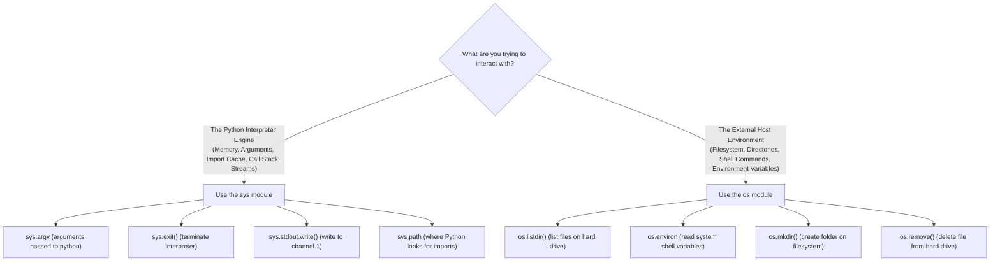
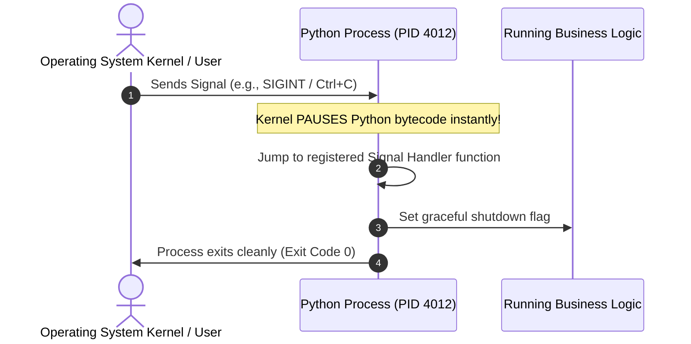
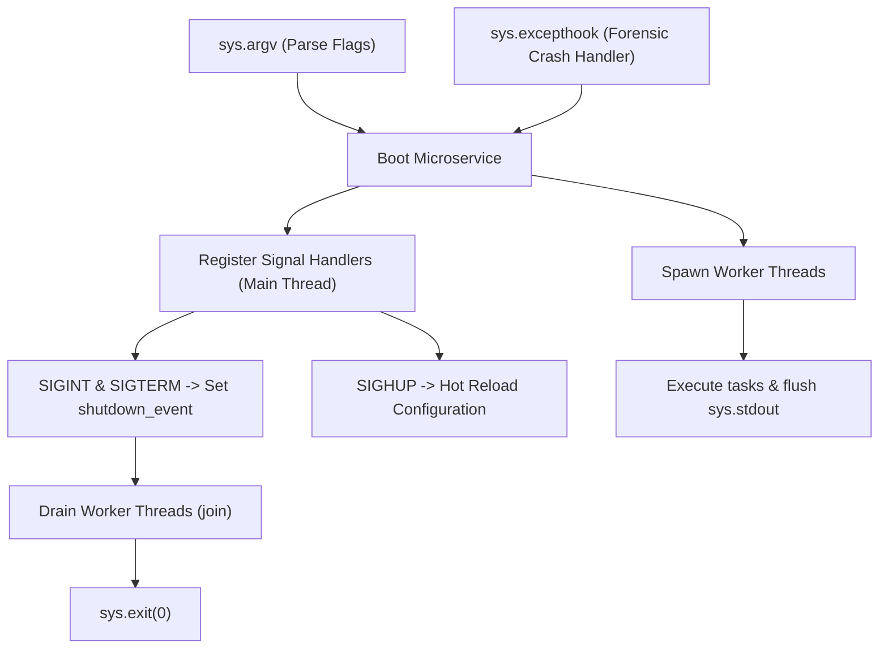

# Python `sys` & `signal` Modules: The Definitive Step-by-Step Guide

> **A Beginner-to-Advanced, Building-Block-Driven Tutorial on Python Runtime Internals, Standard I/O Streams, Process Control, and Operating System Signals.**  
> _Designed as the companion volume to the Threading & Multiprocessing Guide. Every concept is explained with intuitive real-world analogies, broken down into progressive micro-snippets with line-by-line commentary, and assembled into complete standalone runnable scripts._

---

## 📖 Pedagogical Blueprint: How Each Section is Structured

To ensure you never face a "gap in knowledge" or wonder where a line of code came from, every single topic in this guide follows a strict 4-step learning progression:


1. **The Intuitive Mental Model:** A plain-English real-world analogy (cockpits, nervous systems, pipes, librarian catalogues) that explains _why_ the operating system or Python interpreter was designed this way.
2. **The Problem & Why It Exists:** We look at what happens when you _don't_ use this feature (buffer delays, lost errors, frozen processes, unhandled crashes).
3. **Progressive Building Blocks:** We construct the solution piece by piece using tiny 3-to-8 line snippets. Every keyword, parameter, and return value is dissected with clear comments.
4. **The Standalone Assembled Script:** We merge the building blocks into a production-grade, self-contained Python file that you can copy, run, and verify in your terminal immediately.

---

## 🗺️ Master Table of Contents

### 🟢 PART I: THE `sys` MODULE (INTERPRETER & RUNTIME CONTROL)

- [1. Understanding `sys`: The Pilot's Cockpit](#1-understanding-sys-the-pilots-cockpit)
  - [The Mental Model: The Pilot's Cockpit](#the-mental-model-the-pilots-cockpit)
  - [`sys` vs. `os`: The Critical Distinction](#sys-vs-os-the-critical-distinction)
- [2. Command-Line Arguments & Process Control (`sys.argv` & `sys.exit`)](#2-command-line-arguments--process-control)
  - [The Problem: How Scripts Receive Inputs from the Outside World](#the-problem-how-scripts-receive-inputs-from-the-outside-world)
  - [Building Block 1: Inspecting `sys.argv` and Indexing](#building-block-1-inspecting-sysargv-and-indexing)
  - [Building Block 2: The String Trap & Safe Type Casting](#building-block-2-the-string-trap--safe-type-casting)
  - [Building Block 3: The Danger of `IndexError` & Argument Validation](#building-block-3-the-danger-of-indexerror--argument-validation)
  - [Building Block 4: Terminating Programs Cleanly with `sys.exit()`](#building-block-4-terminating-programs-cleanly-with-sysexit)
  - [Building Block 5: Parsing Flags and Options Manually](#building-block-5-parsing-flags-and-options-manually)
  - [Assembled Standalone Script: `01_cli_arg_processor.py`](#assembled-standalone-script-01_cli_arg_processorpy)
- [3. Standard I/O Streams (`sys.stdin`, `sys.stdout`, `sys.stderr`)](#3-standard-io-streams)
  - [The Mental Model: The Three Pipes of Unix](#the-mental-model-the-three-pipes-of-unix)
  - [Building Block 1: `print()` vs. `sys.stdout.write()`](#building-block-1-print-vs-sysstdoutwrite)
  - [Building Block 2: The C Buffer Delay & `sys.stdout.flush()`](#building-block-2-the-c-buffer-delay--sysstdoutflush)
  - [Building Block 3: Why `sys.stderr` Exists (Separating Output from Errors)](#building-block-3-why-sysstderr-exists)
  - [Building Block 4: Reading Piped Streams from `sys.stdin`](#building-block-4-reading-piped-streams-from-sysstdin)
  - [Building Block 5: Detecting Interactive Terminals vs. Pipes (`sys.stdin.isatty()`)](#building-block-5-detecting-interactive-terminals-vs-pipes)
  - [Building Block 6: Redirecting Streams at Runtime with `io.StringIO`](#building-block-6-redirecting-streams-at-runtime)
  - [Assembled Standalone Script: `02_stream_pipeline.py`](#assembled-standalone-script-02_stream_pipelinepy)
- [4. The Python Import System & Module Management (`sys.path` & `sys.modules`)](#4-the-python-import-system--module-management)
  - [The Mental Model: The Librarian's Index](#the-mental-model-the-librarians-index)
  - [Building Block 1: Understanding the `sys.path` Search Order](#building-block-1-understanding-the-syspath-search-order)
  - [Building Block 2: Dynamically Adding Custom Import Directories](#building-block-2-dynamically-adding-custom-import-directories)
  - [Building Block 3: The `sys.modules` In-Memory Cache](#building-block-3-the-sysmodules-in-memory-cache)
  - [Building Block 4: Hot-Reloading Modules by Evicting the Cache](#building-block-4-hot-reloading-modules-by-evicting-the-cache)
  - [Building Block 5: Inspecting Built-in C Modules (`sys.builtin_module_names`)](#building-block-5-inspecting-built-in-c-modules)
  - [Assembled Standalone Script: `03_import_inspector.py`](#assembled-standalone-script-03_import_inspectorpy)
- [5. Memory, Garbage Collection & Recursion Limits](#5-memory-garbage-collection--recursion-limits)
  - [Building Block 1: Measuring Memory Footprints with `sys.getsizeof()`](#building-block-1-measuring-memory-footprints-with-sysgetsizeof)
  - [Building Block 2: The Shallow Measurement Gotcha & Recursive Sizing](#building-block-2-the-shallow-measurement-gotcha)
  - [Building Block 3: Tracking Object References with `sys.getrefcount()`](#building-block-3-tracking-object-references-with-sysgetrefcount)
  - [Building Block 4: Stack Frames & Recursion Limits (`sys.getrecursionlimit`)](#building-block-4-stack-frames--recursion-limits)
  - [Assembled Standalone Script: `04_memory_and_recursion.py`](#assembled-standalone-script-04_memory_and_recursionpy)
- [6. Advanced Runtime Hooks (`sys.excepthook` & `sys.settrace`)](#6-advanced-runtime-hooks)
  - [The Mental Model: The Emergency Crash Recorder (Black Box)](#the-mental-model-the-emergency-crash-recorder)
  - [Building Block 1: How Python Handles Unhandled Crashes by Default](#building-block-1-how-python-handles-unhandled-crashes)
  - [Building Block 2: Overriding `sys.excepthook` with Custom Handlers](#building-block-2-overriding-sysexcepthook)
  - [Building Block 3: Preserving Normal KeyboardInterrupt Behavior](#building-block-3-preserving-normal-keyboardinterrupt)
  - [Building Block 4: Tracing Line Execution with `sys.settrace()`](#building-block-4-tracing-line-execution-with-syssettrace)
  - [Assembled Standalone Script: `05_crash_logger.py`](#assembled-standalone-script-05_crash_loggerpy)

---

### 🟡 PART II: THE `signal` MODULE (OPERATING SYSTEM EVENTS)

- [7. Understanding Signals: The Operating System's Nervous System](#7-understanding-signals-the-operating-systems-nervous-system)
  - [The Mental Model: The Emergency Walkie-Talkie](#the-mental-model-the-emergency-walkie-talkie)
  - [What is an Operating System Signal?](#what-is-an-operating-system-signal)
  - [The Master POSIX Signals Reference Table](#the-master-posix-signals-reference-table)
  - [Why `SIGKILL` (9) and `SIGSTOP` (19) Cannot Be Caught](#why-sigkill-and-sigstop-cannot-be-caught)
- [8. Intercepting Signals in Python (`signal.signal`)](#8-intercepting-signals-in-python-signalsignal)
  - [Building Block 1: Anatomy of a Signal Handler `(signum, frame)`](#building-block-1-anatomy-of-a-signal-handler)
  - [Building Block 2: Deep Dive into the `frame` Object](#building-block-2-deep-dive-into-the-frame-object)
  - [Building Block 3: Cleanly Catching `SIGINT` (Ctrl+C)](#building-block-3-cleanly-catching-sigint-ctrlc)
  - [Building Block 4: Ignoring Signals with `signal.SIG_IGN`](#building-block-4-ignoring-signals-with-signalsig_ign)
  - [Building Block 5: Restoring Defaults with `signal.SIG_DFL`](#building-block-5-restoring-defaults-with-signalsig_dfl)
  - [Assembled Standalone Script: `06_sigint_trap.py`](#assembled-standalone-script-06_sigint_trappy)
- [9. Production Graceful Shutdown (Docker, Kubernetes & Systemd)](#9-production-graceful-shutdown)
  - [The Mental Model: The Evacuation Warning](#the-mental-model-the-evacuation-warning)
  - [How Modern Container Runtimes Stop Processes (`SIGTERM` &rarr; `SIGKILL`)](#how-modern-container-runtimes-stop-processes)
  - [Building Block 1: Trapping Both `SIGINT` and `SIGTERM`](#building-block-1-trapping-both-sigint-and-sigterm)
  - [Building Block 2: The Two-Stage Emergency Shutdown Pattern](#building-block-2-the-two-stage-emergency-shutdown-pattern)
  - [Building Block 3: Draining In-Flight Work and Flushing State](#building-block-3-draining-in-flight-work)
  - [Assembled Standalone Script: `07_production_worker.py`](#assembled-standalone-script-07_production_workerpy)
- [10. Zero-Downtime Hot Reloading (`SIGHUP`) & Diagnostics (`SIGUSR1`/`SIGUSR2`)](#10-zero-downtime-hot-reloading)
  - [The Mental Model: Changing Tires While Driving](#the-mental-model-changing-tires-while-driving)
  - [Building Block 1: What is `SIGHUP` and Why Do Servers Use It?](#building-block-1-what-is-sighup)
  - [Building Block 2: Intercepting `SIGHUP` to Refresh Live Configuration](#building-block-2-intercepting-sighup)
  - [Building Block 3: User-Defined Signals `SIGUSR1` and `SIGUSR2`](#building-block-3-user-defined-signals)
  - [Building Block 4: Creating a Live Diagnostic State Dumper](#building-block-4-creating-a-live-diagnostic-state-dumper)
  - [Assembled Standalone Script: `08_hot_reloader.py`](#assembled-standalone-script-08_hot_reloaderpy)
- [11. Timing Out Operations with `signal.alarm()`](#11-timing-out-operations-with-signalalarm)
  - [The Mental Model: The Kitchen Egg Timer](#the-mental-model-the-kitchen-egg-timer)
  - [Building Block 1: Arming the Kernel Alarm (`signal.alarm(seconds)`)](#building-block-1-arming-the-kernel-alarm)
  - [Building Block 2: Disarming the Alarm (`signal.alarm(0)`)](#building-block-2-disarming-the-alarm)
  - [Building Block 3: The Danger of Forgetting Disarm & The `finally` Requirement](#building-block-3-the-danger-of-forgetting-disarm)
  - [Building Block 4: Building a Reusable `with timeout(N):` Context Manager](#building-block-4-building-a-reusable-context-manager)
  - [Building Block 5: Platform Differences (Unix vs. Windows)](#building-block-5-platform-differences)
  - [Assembled Standalone Script: `09_timeout_utility.py`](#assembled-standalone-script-09_timeout_utilitypy)
- [12. Signals and Multithreading: The Main-Thread-Only Law](#12-signals-and-multithreading-the-main-thread-only-law)
  - [The Mental Model: The Captain and the Crew](#the-mental-model-the-captain-and-the-crew)
  - [The Law: Only the Main Thread Receives Signals](#the-law-only-the-main-thread-receives-signals)
  - [Building Block 1: What Happens When a Child Thread Calls `signal.signal()`?](#building-block-1-what-happens-when-a-child-thread-calls-signalsignal)
  - [Building Block 2: The Main-Thread Coordinator Pattern](#building-block-2-the-main-thread-coordinator-pattern)
  - [Building Block 3: Signaling Worker Threads via `threading.Event`](#building-block-3-signaling-worker-threads-via-threadingevent)
  - [Assembled Standalone Script: `10_threaded_signals.py`](#assembled-standalone-script-10_threaded_signalspy)

---

### 🟣 PART III: PRODUCTION SYNTHESIS & MASTER REFERENCE

- [13. Complete Production Project: Resilient Background Microservice](#13-complete-production-project-resilient-background-microservice)
  - [System Architecture Flowchart](#system-architecture-flowchart)
  - [Component Breakdown: How the Pieces Fit Together](#component-breakdown-how-the-pieces-fit-together)
  - [Assembled Standalone Script: `11_resilient_microservice.py`](#assembled-standalone-script-11_resilient_microservicepy)
- [14. Master Cheat Sheet & Troubleshooting FAQ](#14-master-cheat-sheet--troubleshooting-faq)
  - [Windows vs. Unix POSIX Compatibility Matrix](#windows-vs-unix-posix-compatibility-matrix)
  - [Common Errors & Error Decoders](#common-errors--error-decoders)
  - [Production Systems Checklist](#production-systems-checklist)

---

# 🟢 PART I: THE `sys` MODULE (INTERPRETER & RUNTIME CONTROL)

---

## 1. Understanding `sys`: The Pilot's Cockpit

### The Mental Model: The Pilot's Cockpit

Imagine you are flying an airplane:

- Outside the airplane is the atmosphere, the clouds, the airport runways, and other aircraft.
- Inside the airplane is the **cockpit**: the instrument dials, fuel gauges, throttle levers, flight computer, and eject button.

```text
+-------------------------------------------------------------------------+
|                  HOST OPERATING SYSTEM (Linux / macOS / Windows)        |
|  Filesystem, Hardware Devices, Network Interfaces, Processes             |
|                                                                         |
|      +-----------------------------------------------------------+      |
|      |               PYTHON PROCESS (CPython Runtime)            |      |
|      |                                                           |      |
|      |    COCKPIT INSTRUMENT PANEL: the 'sys' module             |      |
|      |    - sys.argv            -> The flight plan handed to you |      |
|      |    - sys.stdin/stdout    -> Radio communications channels |      |
|      |    - sys.path/modules    -> Navigational maps in memory   |      |
|      |    - sys.getsizeof       -> Fuel & payload weight scales  |      |
|      |    - sys.exit()          -> Safe landing or eject button  |      |
|      |    - sys.excepthook      -> The Flight Data Black Box     |      |
|      +-----------------------------------------------------------+      |
+-------------------------------------------------------------------------+
```

The `sys` module (**sys**tem) provides direct programmatic access to the **CPython interpreter's internal state**.

---

### `sys` vs. `os`: The Critical Distinction

A major hurdle for beginners is knowing whether to use `sys` or `os`:



---

## 2. Command-Line Arguments & Process Control

### The Problem: How Scripts Receive Inputs from the Outside World

When a user runs your Python script from their command prompt or terminal:

```bash
python backup.py --compress /var/data 50
```

How does your script know that the user asked for `--compress`, specified `/var/data`, and passed `50`?  
The operating system packages every word on that terminal command line into a list of strings and delivers it to Python through **`sys.argv`**.

---

### Building Block 1: Inspecting `sys.argv` and Indexing

Let's look at the absolute simplest script:

```python
# snippet_argv_basic.py
import sys

print("Type of sys.argv:", type(sys.argv))
print("Raw sys.argv content:", sys.argv)
```

If you run `python snippet_argv_basic.py hello world 123`:

```text
Type of sys.argv: <class 'list'>
Raw sys.argv content: ['snippet_argv_basic.py', 'hello', 'world', '123']
```

#### Line-by-Line Breakdown:

- `sys.argv[0]`: Always evaluates to the **script filename** (`'snippet_argv_basic.py'`).
- `sys.argv[1]`: The first argument passed (`'hello'`).
- `sys.argv[2]`: The second argument passed (`'world'`).
- `sys.argv[3]`: The third argument passed (`'123'`).

---

### Building Block 2: The String Trap & Safe Type Casting

> [!WARNING]
> **The #1 Beginner Gotcha with `sys.argv`:**  
> **EVERYTHING** inside `sys.argv` is a string (`str`). Python never converts numbers automatically.

Look at what happens if you try to do math:

```python
# snippet_string_trap.py
import sys

num1 = sys.argv[1] # e.g. "10"
num2 = sys.argv[2] # e.g. "20"

# BUG: String concatenation instead of addition!
print("Result:", num1 + num2)
# Outputs: Result: 1020 (Not 30!)
```

To fix this, you must **explicitly cast** arguments to integers or floats, wrapped in a `try...except` block:

```python
# snippet_safe_cast.py
import sys

try:
    num1 = int(sys.argv[1])
    num2 = int(sys.argv[2])
    print(f"Correct Sum: {num1 + num2}")
except ValueError:
    print("Error: Both arguments must be valid integers!")
```

---

### Building Block 3: The Danger of `IndexError` & Argument Validation

What happens if a user runs `python script.py` without passing any arguments, and your code accesses `sys.argv[1]`?

```python
import sys
# If user passed nothing:
first_arg = sys.argv[1]
# CRASH: IndexError: list index out of range!
```

To prevent crashes, **always check `len(sys.argv)`** before accessing indices:

```python
# snippet_check_len.py
import sys

# We expect the script name (index 0) + at least 1 argument
if len(sys.argv) < 2:
    print("Error: Missing required filename argument!")
    print(f"Usage: python {sys.argv[0]} <filename>")
    # We must stop execution here!
```

---

### Building Block 4: Terminating Programs Cleanly with `sys.exit()`

How do you stop a program immediately when validation fails? You call **`sys.exit()`**.

```python
# snippet_exit.py
import sys

# 1. Exit with status 0 (Success)
sys.exit(0)

# 2. Exit with status 1 (General Error)
sys.exit(1)

# 3. Exit with an error message (Automatically prints to stderr and exits with code 1)
sys.exit("Fatal Error: Could not connect to database.")
```

#### What is an Exit Status Code?

In all operating systems (Linux, macOS, Windows):

- **Exit Code 0:** Means **SUCCESS**. Everything completed normally.
- **Exit Code 1 to 255:** Means **FAILURE**. Tells automation pipelines (like GitHub Actions, Docker, or shell scripts) that something broke.

You can inspect the exit code of your last command in terminal:

- Linux / macOS: `echo $?`
- Windows PowerShell: `$LASTEXITCODE`

```python
# snippet_exit_finally.py
import sys

try:
    print("Starting critical operation...")
    sys.exit(1)
finally:
    # IMPORTANT: sys.exit() raises a SystemExit exception under the hood!
    # That means 'finally' blocks STILL RUN!
    print("This cleanup block runs even when sys.exit() is called!")
```

---

### Building Block 5: Parsing Flags and Options Manually

Often you want flags like `-v` (verbose) or `--limit 10`. Let's build a clean, manual flag-scanning loop:

```python
# snippet_flag_scanner.py
import sys

args = sys.argv[1:] # Strip off script name
verbose = False
limit = 100
target_file = None

i = 0
while i < len(args):
    arg = args[i]
    if arg in ("-v", "--verbose"):
        verbose = True
    elif arg in ("-l", "--limit"):
        i += 1 # Advance to next argument to read the number
        limit = int(args[i])
    else:
        target_file = arg
    i += 1

print(f"Verbose: {verbose}, Limit: {limit}, Target: {target_file}")
```

---

### Assembled Standalone Script: `01_cli_arg_processor.py`

Now, let's unite Building Blocks 1 through 5 into a complete, bulletproof CLI script.

```python
# 01_cli_arg_processor.py
"""
Topic: sys.argv and sys.exit()
Description: A production-ready command line parser built from scratch
             using the sys module.
"""

import sys

def print_help_and_exit(exit_code: int = 0):
    script_name = sys.argv[0]
    print(f"\nUsage: python {script_name} [OPTIONS] <target_file>")
    print("\nOptions:")
    print("  -h, --help           Show this help message and exit")
    print("  -v, --verbose        Enable detailed debug logging")
    print("  -n, --count <INT>    Number of records to process (default: 10)")
    print("\nExample:")
    print(f"  python {script_name} -v -n 25 data.csv\n")
    sys.exit(exit_code)

def main():
    # 1. Strip off the script name; we only care about user inputs
    raw_args = sys.argv[1:]

    # 2. Check if user asked for help or provided zero arguments
    if not raw_args or "-h" in raw_args or "--help" in raw_args:
        print_help_and_exit(0)

    # 3. Default configuration state
    verbose = False
    record_count = 10
    target_file = None

    # 4. Step through tokens one by one
    index = 0
    while index < len(raw_args):
        token = raw_args[index]

        if token in ("-v", "--verbose"):
            verbose = True

        elif token in ("-n", "--count"):
            index += 1
            # Ensure there is an argument after the flag!
            if index >= len(raw_args):
                sys.exit("Error: The -n/--count flag requires a number immediately following it!")

            # Safely parse integer
            try:
                record_count = int(raw_args[index])
            except ValueError:
                sys.exit(f"Error: Value '{raw_args[index]}' is not a valid integer!")

        elif not token.startswith("-"):
            # It's a positional argument (our target filename)
            target_file = token
        else:
            sys.exit(f"Error: Unknown option flag '{token}'. Use --help to view valid options.")

        index += 1

    # 5. Validate that a target filename was provided
    if not target_file:
        sys.exit("Error: Missing required <target_file> argument. See --help.")

    # 6. Execute business logic
    if verbose:
        print(f"[DEBUG] Python Runtime: {sys.version.split()[0]} on platform: {sys.platform}")
        print(f"[DEBUG] Processing target: '{target_file}' with record limit: {record_count}")

    print(f"Successfully processed {record_count} items from '{target_file}'.")
    sys.exit(0)

if __name__ == '__main__':
    main()
```

#### How to Run and Test in Terminal:

```bash
# 1. Test Help menu (Exits with status 0)
python 01_cli_arg_processor.py --help

# 2. Test Invalid argument error
python 01_cli_arg_processor.py -n not_a_number report.txt
# Output: Error: Value 'not_a_number' is not a valid integer!

# 3. Test Full Execution with Verbose Debugging
python 01_cli_arg_processor.py -v -n 50 customers.csv
# Output:
# [DEBUG] Python Runtime: 3.11.x on platform: darwin
# [DEBUG] Processing target: 'customers.csv' with record limit: 50
# Successfully processed 50 items from 'customers.csv'.
```

---

## 3. Standard I/O Streams

### The Mental Model: The Three Pipes of Unix

In 1970, the creators of Unix invented a concept that powers every computer today: **Standard Streams**.  
Whenever any program launches, the operating system attaches **three universal pipes** to it:

```text
       +-------------------------------------------------------------+
       |                     PYTHON PROCESS                          |
       |                                                             |
-----> | sys.stdin  (Channel 0) - Incoming pipe (Keyboard or Pipe)   |
       |                                                             |
<----- | sys.stdout (Channel 1) - Outgoing normal data stream        |
       |                                                             |
<----- | sys.stderr (Channel 2) - Outgoing error & diagnostic stream |
       +-------------------------------------------------------------+
```

---

### Building Block 1: `print()` vs. `sys.stdout.write()`

What really happens when you write `print("Hello")`?  
Python converts your object to a string, appends a newline character (`\n`), and writes it to `sys.stdout`.

```python
# snippet_print_vs_write.py
import sys

# These two statements produce the exact same text output:
print("Hello World")
sys.stdout.write("Hello World\n")
```

#### The Difference:

1. `print()` automatically appends `\n` (newline) and space separators.
2. `sys.stdout.write()` requires an **explicit string** and **does not append newlines** automatically.
3. `sys.stdout.write()` returns the number of characters written.

---

### Building Block 2: The C Buffer Delay & `sys.stdout.flush()`

Why do terminal countdowns or progress dots sometimes freeze and then print all at once?

```python
# snippet_buffer_delay.py
import sys
import time

# TRY RUNNING THIS: Nothing prints on screen for 5 seconds,
# then all 5 dots suddenly appear at once!
for i in range(5):
    sys.stdout.write(".")
    time.sleep(1)
print(" Finished!")
```

#### Why did this happen?

To maximize speed, operating systems do not send every single character to the physical screen hardware immediately. Instead, they store characters inside a temporary memory bucket called a **buffer**.  
The buffer only empties (flushes) when:

1. A newline character (`\n`) is encountered.
2. The buffer becomes full (typically 4,096 bytes).
3. The program exits.

#### The Fix: `sys.stdout.flush()`

To force the buffer to write to the physical terminal screen immediately, call `sys.stdout.flush()`:

```python
# snippet_flush_fix.py
import sys
import time

# NOW IT WORKS: One dot appears smoothly every second!
for i in range(5):
    sys.stdout.write(".")
    sys.stdout.flush() # Force immediate write to screen!
    time.sleep(1)
print(" Finished!")
```

---

### Building Block 3: Why `sys.stderr` Exists

Imagine you write a script that calculates a report and saves it to a file using redirection:

```bash
python generate_report.py > report.csv
```

If an error happens during the calculation (e.g. _"Warning: Database connection slow"_), where should that warning go?

- If you print it to `stdout`, the warning gets written **into `report.csv`**, corrupting your CSV file!
- If you write it to **`sys.stderr`**, the warning appears on your terminal screen **while `report.csv` stays clean!**

```python
# snippet_stderr.py
import sys

# Normal data goes to Channel 1 (stdout)
sys.stdout.write("id,name,balance\n1,Alice,500\n")

# Diagnostic warnings go to Channel 2 (stderr)
sys.stderr.write("[LOG] Fetched 1 record successfully.\n")
```

---

### Building Block 4: Reading Piped Streams from `sys.stdin`

When someone pipes data into your Python script:

```bash
cat server_logs.txt | python analyze.py
```

How do you process that data without loading a 10 GB file into memory all at once?  
By treating `sys.stdin` as an iterable stream:

```python
# snippet_stdin_streaming.py
import sys

# Reads line-by-line lazily as bytes arrive through the pipe!
for line_number, line in enumerate(sys.stdin, start=1):
    cleaned_line = line.strip()
    if "ERROR" in cleaned_line:
        print(f"Found error at line {line_number}: {cleaned_line}")
```

---

### Building Block 5: Detecting Interactive Terminals vs. Pipes

How does a script know if a human is typing at a keyboard versus another program piping data into it?  
Using **`.isatty()`** (short for "Is A Teletypewriter"):

```python
# snippet_isatty.py
import sys

if sys.stdin.isatty():
    print("A human is running this script interactively in a terminal window.")
else:
    print("Data is being piped into this script from another command or file!")
```

---

### Building Block 6: Redirecting Streams at Runtime with `io.StringIO`

Because `sys.stdout` is just a Python variable pointing to an open file stream, you can swap it out!  
This is how test frameworks capture printed output:

```python
# snippet_redirect.py
import sys
import io

# 1. Create an in-memory text buffer
memory_buffer = io.StringIO()

# 2. Save the original stdout so we can restore it later
original_stdout = sys.stdout

try:
    # 3. Hijack stdout!
    sys.stdout = memory_buffer

    # Any print statement now writes to our memory buffer, NOT the screen!
    print("Secret calculation: 42")
    print("Status: COMPLETE")
finally:
    # 4. ALWAYS restore original stdout in a finally block!
    sys.stdout = original_stdout

# 5. Extract what was captured
captured_text = memory_buffer.getvalue()
print("Captured text was:\n" + captured_text)
```

---

### Assembled Standalone Script: `02_stream_pipeline.py`

Now let's assemble Building Blocks 1 through 6 into a standalone CLI stream filtering utility.

```python
# 02_stream_pipeline.py
"""
Topic: sys.stdin, sys.stdout, and sys.stderr
Description: A real-time log filter that processes piped data from stdin,
             separates clean output (stdout) from error alerts (stderr),
             and demonstrates output buffer flushing.
"""

import sys
import time

def process_stream():
    # 1. Check if user piped input or is typing interactively
    if sys.stdin.isatty():
        print("=== Interactive Mode ===")
        print("Type text and press ENTER.")
        print("Prefix a line with 'ERROR:' to test stderr routing.")
        print("Press Ctrl+D (Mac/Linux) or Ctrl+Z (Windows) followed by ENTER to exit:\n")

    line_count = 0
    error_count = 0

    # 2. Stream line-by-line from standard input
    for raw_line in sys.stdin:
        line_count += 1
        line = raw_line.strip()

        if line.startswith("ERROR:") or "CRITICAL" in line:
            error_count += 1
            # Send diagnostic alerts to sys.stderr (Channel 2)
            sys.stderr.write(f"[STDERR ALERT #{error_count}] {line}\n")
            sys.stderr.flush() # Ensure it appears immediately
        else:
            # Send clean transformed data to sys.stdout (Channel 1)
            sys.stdout.write(f"[STDOUT #{line_count}] {line.upper()}\n")
            sys.stdout.flush()

    # 3. Print final report
    sys.stderr.write(f"\n--- Summary: Processed {line_count} lines ({error_count} errors) ---\n")
    sys.stderr.flush()

if __name__ == '__main__':
    process_stream()
```

#### How to Run and Test in Terminal:

```bash
# Test 1: Run interactively
python 02_stream_pipeline.py
# Type: Hello world
# Output: [STDOUT #1] HELLO WORLD
# Type: ERROR: Database timeout
# Output: [STDERR ALERT #1] ERROR: Database timeout

# Test 2: Test Unix Stream Redirection
# Pipe stdout to clean.txt, but let stderr print to terminal screen!
python 02_stream_pipeline.py > clean.txt
# Type: test 1
# Type: ERROR: failed
# Press Ctrl+D
# Notice: The ERROR message printed on your screen, while "test 1" was saved into clean.txt!
```

---

## 4. The Python Import System & Module Management

### The Mental Model: The Librarian's Index

When you type `import math` or `import my_helper`:

- How does Python know which folder on your hard drive contains that code?
- Does Python re-read the file from disk every time you call `import`?

```text
Step 1: The Fast Memory Cache (sys.modules)
   "Have I already read this book today?"
   [ sys.modules dictionary ] ---> Found? YES! Return cached module immediately.
                               ---> Found? NO! Move to Step 2.

Step 2: The Shelf Search (sys.path)
   "Which folders on disk am I allowed to search?"
   Folder 0: Current Directory (where script lives)
   Folder 1: Python Standard Library (/usr/lib/python...)
   Folder 2: Third-party pip packages (site-packages)
```

---

### Building Block 1: Understanding the `sys.path` Search Order

`sys.path` is an ordinary Python list of directory strings. When you run an `import`, Python searches these directories **in order from index 0 to the end**:

```python
# snippet_sys_path.py
import sys

print("Total directories in Python's search path:", len(sys.path))
for i, path in enumerate(sys.path):
    print(f" [{i}] {path}")
```

#### Key Rules of `sys.path`:

- `sys.path[0]` is **always the directory containing the running script**.
- If you have a file named `math.py` in your current directory, `import math` will import **your local file**, accidentally shadowing the standard library!

---

### Building Block 2: Dynamically Adding Custom Import Directories

What if your project has a shared library folder located elsewhere (e.g. `../shared_utils`)? You can add it to `sys.path` at runtime:

```python
# snippet_modify_path.py
import sys
import os

# 1. Calculate absolute path to external folder
custom_folder = os.path.abspath("../shared_tools")

# 2. Append to search path if not already present
if custom_folder not in sys.path:
    sys.path.append(custom_folder)
    print(f"Added '{custom_folder}' to Python import search path.")

# 3. Now you can import modules from that folder!
# import my_shared_tool
```

---

### Building Block 3: The `sys.modules` In-Memory Cache

`sys.modules` is a standard Python dictionary storing every module currently loaded into memory:

- **Key:** String module name (`'os'`, `'json'`, `'math'`).
- **Value:** The live module object in memory.

```python
# snippet_sys_modules.py
import sys
import math

print(type(sys.modules)) # <class 'dict'>
print("Is math in memory cache?", 'math' in sys.modules) # True

# Inspect the module object:
math_module = sys.modules['math']
print("Math module file/builtin:", math_module)
```

---

### Building Block 4: Hot-Reloading Modules by Evicting the Cache

If you edit a Python file on disk while a long-running server is running, calling `import my_module` again **does nothing** because Python sees it already in `sys.modules`.  
To force Python to reload it from disk, delete it from `sys.modules`:

```python
# snippet_reload_cache.py
import sys

# Force reload:
if 'my_module' in sys.modules:
    del sys.modules['my_module'] # Evict from cache!

# Next import reads the fresh code from disk:
# import my_module
```

---

### Building Block 5: Inspecting Built-in C Modules

Some Python modules are compiled directly into the C executable itself (they do not exist as `.py` files on disk). You can view them with `sys.builtin_module_names`:

```python
# snippet_builtins.py
import sys

print(f"Total built-in C modules: {len(sys.builtin_module_names)}")
print("Sample built-ins:", sys.builtin_module_names[:5])
# e.g., ('_ast', '_bisect', '_codecs', '_collections', '_datetime')
```

---

### Assembled Standalone Script: `03_import_inspector.py`

Let's unite these concepts into a practical dependency auditor.

```python
# 03_import_inspector.py
"""
Topic: sys.path and sys.modules
Description: An import diagnostics utility that inspects where modules
             are loaded from and audits third-party pip dependencies.
"""

import sys
import os

def audit_import_system():
    print("=" * 60)
    print("🔍 PYTHON IMPORT SYSTEM DIAGNOSTICS")
    print("=" * 60)

    # 1. Inspect sys.path
    print(f"\n[1] Import Search Directories (sys.path - Total: {len(sys.path)}):")
    for idx, path in enumerate(sys.path[:6]):
        print(f"  [{idx}] {path}")
    if len(sys.path) > 6:
        print(f"  ... (+{len(sys.path) - 6} more directories)")

    # 2. Inspect Built-in C modules
    print(f"\n[2] Compiled Built-in C Modules (sys.builtin_module_names - Total: {len(sys.builtin_module_names)}):")
    sample_builtins = list(sys.builtin_module_names)[:8]
    print(f"  Sample: {', '.join(sample_builtins)}...")

    # 3. Audit Active Modules in Memory
    print(f"\n[3] Auditing Active Modules in Memory (sys.modules - Total: {len(sys.modules)}):")

    # Import a few standard libraries to inspect
    import json
    import csv

    pip_packages = []
    stdlib_packages = []
    builtin_packages = []

    for name, module in list(sys.modules.items()):
        file_path = getattr(module, '__file__', None)
        if file_path is None:
            builtin_packages.append(name)
        elif "site-packages" in file_path or "dist-packages" in file_path:
            pip_packages.append((name, file_path))
        else:
            stdlib_packages.append((name, file_path))

    print(f"  - Built-in / C Extensions in Memory: {len(builtin_packages)}")
    print(f"  - Standard Library Modules in Memory: {len(stdlib_packages)}")
    print(f"  - Pip / Third-Party Modules in Memory: {len(pip_packages)}")

    if pip_packages:
        print("\n  Sample Detected Third-Party Packages:")
        for name, path in pip_packages[:5]:
            print(f"    * {name:15} -> {path}")

    print("\n" + "=" * 60)

if __name__ == '__main__':
    audit_import_system()
```

---

## 5. Memory, Garbage Collection & Recursion Limits

### Building Block 1: Measuring Memory Footprints with `sys.getsizeof()`

How many bytes of RAM does a variable consume? Use `sys.getsizeof(obj)`:

```python
# snippet_sizeof_basics.py
import sys

print("Integer 0:       ", sys.getsizeof(0), "bytes")        # 28 bytes
print("Integer 10**100: ", sys.getsizeof(10**100), "bytes") # 72 bytes (arbitrary precision!)
print("Empty String:    ", sys.getsizeof(""), "bytes")       # 48-49 bytes
print("Empty List:      ", sys.getsizeof([]), "bytes")       # 56 bytes
print("Empty Dict:      ", sys.getsizeof({}), "bytes")       # 64 bytes
```

_Why is an integer 28 bytes instead of 4 bytes like in C?_  
Because in Python, every integer is a full C struct containing reference counts, type pointers, and size metadata!

---

### Building Block 2: The Shallow Measurement Gotcha

> [!WARNING]
> `sys.getsizeof()` is **shallow**.  
> If you measure a list of strings: `sys.getsizeof(["hello", "world"])`, it only counts the memory of the list pointers, **not the memory of the strings inside it!**

Let's build a recursive crawler that calculates the **true deep memory size** of an object:

```python
# snippet_deep_sizeof.py
import sys

def get_deep_size(obj, seen=None):
    if seen is None:
        seen = set()

    obj_id = id(obj)
    if obj_id in seen:
        return 0 # Prevent infinite loops from circular references
    seen.add(obj_id)

    total_bytes = sys.getsizeof(obj)

    if isinstance(obj, dict):
        total_bytes += sum(get_deep_size(k, seen) + get_deep_size(v, seen) for k, v in obj.items())
    elif isinstance(obj, (list, tuple, set, frozenset)):
        total_bytes += sum(get_deep_size(item, seen) for item in obj)

    return total_bytes

sample = ["apple", "banana", {"key": "value"}]
print("Shallow Size:", sys.getsizeof(sample), "bytes")   # ~88 bytes
print("True Deep Size:", get_deep_size(sample), "bytes")  # ~320 bytes!
```

---

### Building Block 3: Tracking Object References with `sys.getrefcount()`

Python deallocates memory when an object's reference counter drops to zero. You can view the counter using `sys.getrefcount(obj)`:

```python
# snippet_refcount.py
import sys

data = ["alpha", "beta"]
# Note: getrefcount() returns 2 because passing 'data' into the function
# creates a temporary second reference!
print("Initial refcount:", sys.getrefcount(data)) # 2

alias = data # Create reference 3
print("After alias:", sys.getrefcount(data))      # 3

del alias    # Delete reference
print("After del alias:", sys.getrefcount(data))  # 2
```

---

### Building Block 4: Stack Frames & Recursion Limits

If a recursive function calls itself indefinitely:

```python
def infinite_recursion():
    return infinite_recursion()
```

Why doesn't Python crash your entire operating system with a segmentation fault?  
Because Python enforces a safety ceiling: **`sys.getrecursionlimit()`** (default is 1,000 stack frames).

```python
# snippet_recursion_limit.py
import sys

print("Default Limit:", sys.getrecursionlimit()) # 1000

# You can increase it for deep algorithms (e.g. tree parsing):
sys.setrecursionlimit(2500)
print("New Limit:", sys.getrecursionlimit())
```

---

### Assembled Standalone Script: `04_memory_and_recursion.py`

```python
# 04_memory_and_recursion.py
"""
Topic: sys.getsizeof(), sys.getrefcount(), and sys.setrecursionlimit()
Description: A memory profiler and recursion safety demonstration.
"""

import sys

def deep_size(obj, seen=None):
    if seen is None: seen = set()
    obj_id = id(obj)
    if obj_id in seen: return 0
    seen.add(obj_id)

    size = sys.getsizeof(obj)
    if isinstance(obj, dict):
        size += sum(deep_size(k, seen) + deep_size(v, seen) for k, v in obj.items())
    elif isinstance(obj, (list, tuple, set, frozenset)):
        size += sum(deep_size(i, seen) for i in obj)
    return size

def test_recursion_depth():
    print("\n--- Testing Recursion Guard ---")
    sys.setrecursionlimit(500)
    print(f"Enforced recursion limit: {sys.getrecursionlimit()}")

    def dive(depth):
        try:
            return dive(depth + 1)
        except RecursionError:
            return depth

    max_frame = dive(1)
    print(f"Cleanly intercepted RecursionError at frame depth: {max_frame}")

def main():
    print("--- Testing Deep Memory Profiling ---")
    data_structure = {
        "user_id": 1001,
        "profile": {"name": "Pushkar", "active": True},
        "tags": ["python", "threading", "signals", "concurrency"],
        "metrics": (98.6, 100.0, 95.4)
    }

    shallow = sys.getsizeof(data_structure)
    deep = deep_size(data_structure)

    print(f"Container Shallow Size: {shallow:4} bytes (misleading!)")
    print(f"True Deep Object Size:  {deep:4} bytes (actual RAM usage)")

    test_recursion_depth()

if __name__ == '__main__':
    main()
```

---

## 6. Advanced Runtime Hooks

### The Mental Model: The Emergency Crash Recorder

When an airplane encounters a disaster, the **Black Box** records every sensor reading so investigators can diagnose what went wrong.  
In Python, when an unhandled exception crashes your program, **`sys.excepthook`** is your Black Box.

---

### Building Block 1: How Python Handles Unhandled Crashes

By default, when an uncaught exception bubbles up:

1. Python passes the exception details to `sys.__excepthook__`.
2. It prints a standard traceback to `sys.stderr`.
3. The process terminates with exit code 1.

---

### Building Block 2: Overriding `sys.excepthook`

You can supply your own custom function to intercept any fatal crash before the program dies:

```python
# snippet_custom_hook.py
import sys

def my_crash_handler(exc_type, exc_value, exc_traceback):
    print("🚨 A FATAL EXCEPTION OCCURRED!")
    print(f"Exception Class: {exc_type.__name__}")
    print(f"Error Message:   {exc_value}")

# Hook our function into the interpreter:
sys.excepthook = my_crash_handler

# Deliberate unhandled crash:
10 / 0
```

---

### Building Block 3: Preserving Normal KeyboardInterrupt Behavior

> [!CAUTION]
> If a user presses `Ctrl+C`, Python raises a `KeyboardInterrupt`.  
> You do **NOT** want your crash logger treating Ctrl+C like a software bug!

```python
# snippet_ignore_ctrl_c.py
import sys

def safe_crash_handler(exc_type, exc_value, exc_traceback):
    # If the user intentionally pressed Ctrl+C, let Python handle it normally:
    if issubclass(exc_type, KeyboardInterrupt):
        sys.__excepthook__(exc_type, exc_value, exc_traceback)
        return

    print(f"[FATAL BUG RECORDED] {exc_type.__name__}: {exc_value}")

sys.excepthook = safe_crash_handler
```

---

### Assembled Standalone Script: `05_crash_logger.py`

```python
# 05_crash_logger.py
"""
Topic: sys.excepthook
Description: A production crash recorder that automatically writes full
             tracebacks to a persistent log file with timestamps.
"""

import sys
import traceback
import datetime

CRASH_FILE = "crash_report.log"

def production_crash_hook(exc_type, exc_value, exc_traceback):
    # 1. Ignore normal user interrupts (Ctrl+C)
    if issubclass(exc_type, KeyboardInterrupt):
        sys.__excepthook__(exc_type, exc_value, exc_traceback)
        return

    # 2. Format human timestamp
    timestamp = datetime.datetime.now().strftime("%Y-%m-%d %H:%M:%S")

    # 3. Generate string traceback
    formatted_traceback = "".join(
        traceback.format_exception(exc_type, exc_value, exc_traceback)
    )

    # 4. Append to persistent crash file on disk
    with open(CRASH_FILE, "a") as f:
        f.write(f"=== CRASH RECORDED AT {timestamp} ===\n")
        f.write(formatted_traceback)
        f.write("=" * 45 + "\n\n")

    # 5. Output a clean, professional error message to user
    sys.stderr.write(f"\n[SYSTEM ALERT] Unexpected internal error: {exc_value}\n")
    sys.stderr.write(f"[SYSTEM ALERT] Full diagnostics written to '{CRASH_FILE}'.\n\n")
    sys.exit(1)

# Register the hook globally
sys.excepthook = production_crash_hook

def faulty_business_calculation():
    print("Initiating banking transaction...")
    items = [100, 200]
    # Intentional IndexError crash:
    corrupted_data = items[10]

if __name__ == '__main__':
    faulty_business_calculation()
```

---

# 🟡 PART II: THE `signal` MODULE (OPERATING SYSTEM EVENTS)

---

## 7. Understanding Signals: The Operating System's Nervous System

### The Mental Model: The Emergency Walkie-Talkie

Imagine a factory worker operating a printing press. Suddenly, the factory manager yells through an emergency walkie-talkie:

- _"Emergency maintenance! Finish your current page and turn off the machine!"_ (**`SIGTERM`**)
- Or the worker accidentally trips a wire on the floor: (**`SIGINT`** / Ctrl+C)
- Or a tornado hits the building and cuts the power line instantly: (**`SIGKILL`**)



---

### The Master POSIX Signals Reference Table

| Signal Name   | Number | Trigger Condition                                | Default Action                      |           Catchable in Python?            |
| :------------ | :----: | :----------------------------------------------- | :---------------------------------- | :---------------------------------------: |
| **`SIGINT`**  |   2    | User pressed `Ctrl+C` in terminal.               | Raises `KeyboardInterrupt`.         |                  **YES**                  |
| **`SIGTERM`** |   15   | Termination request (`kill <pid>`, Docker stop). | Terminates process.                 |    **YES (Crucial for Cloud/Docker!)**    |
| **`SIGHUP`**  |   1    | Terminal closed or daemon config reload request. | Terminates process.                 |     **YES (Used for Hot-Reloading)**      |
| **`SIGUSR1`** |   10   | Custom user-defined signal 1.                    | Terminates process.                 | **YES (Used for custom IPC/Diagnostics)** |
| **`SIGUSR2`** |   12   | Custom user-defined signal 2.                    | Terminates process.                 |  **YES (Used for cache dumps/toggles)**   |
| **`SIGALRM`** |   14   | Countdown timer expired (`signal.alarm(N)`).     | Terminates process.                 |   **YES (Used for operation timeouts)**   |
| **`SIGKILL`** |   9    | Forceful termination (`kill -9 <pid>`).          | Kernel kills process immediately.   |   **NO (CANNOT BE CAUGHT OR IGNORED!)**   |
| **`SIGSTOP`** |   19   | Forceful process pause (`Ctrl+Z`).               | Kernel freezes process immediately. |   **NO (CANNOT BE CAUGHT OR IGNORED!)**   |

---

### Why `SIGKILL` and `SIGSTOP` Cannot Be Caught

> [!CAUTION]
> **Fundamental OS Law:**  
> The operating system kernel **never delivers `SIGKILL` (9) or `SIGSTOP` to the user space process**.  
> If a process could catch or ignore `SIGKILL`, a malicious or bug-ridden program could refuse to close and hold your computer hostage forever!  
> If you try writing `signal.signal(signal.SIGKILL, handler)`, Python immediately raises: `OSError: [Errno 22] Invalid argument`.

---

## 8. Intercepting Signals in Python (`signal.signal`)

### Building Block 1: Anatomy of a Signal Handler

To handle a signal, you register a function using **`signal.signal(signal_number, handler)`**.  
Your handler function **must accept exactly two arguments**:

```python
# snippet_handler_signature.py
import signal

def my_handler(signum, frame):
    # signum: The integer identifying which signal arrived (e.g., 2 for SIGINT)
    # frame:  The execution stack frame where Python was paused
    print(f"Received signal: {signum}")

# Register handler for SIGINT (Ctrl+C):
signal.signal(signal.SIGINT, my_handler)
```

---

### Building Block 2: Deep Dive into the `frame` Object

What is that `frame` parameter?  
It represents the **exact line of code and local variables** where Python was executing when the kernel interrupted it:

```python
def inspect_frame(signum, frame):
    print("Paused in file:    ", frame.f_code.co_filename)
    print("Paused in function:", frame.f_code.co_name)
    print("Paused at line:    ", frame.f_lineno)
    print("Local variables:   ", frame.f_locals)
```

---

### Building Block 3: Cleanly Catching `SIGINT` (Ctrl+C)

Instead of letting `Ctrl+C` throw a messy traceback:

```python
# snippet_catch_sigint.py
import signal
import time
import sys

def on_ctrl_c(signum, frame):
    print("\n[Ctrl+C] Intercepted! Closing files cleanly...")
    sys.exit(0)

signal.signal(signal.SIGINT, on_ctrl_c)

print("Running loop. Press Ctrl+C to test clean interception.")
while True:
    time.sleep(1)
```

---

### Building Block 4: Ignoring Signals with `signal.SIG_IGN`

You can instruct the OS kernel to completely ignore a signal using **`signal.SIG_IGN`**:

```python
# snippet_ignore.py
import signal
import time

# Make the program immune to Ctrl+C:
signal.signal(signal.SIGINT, signal.SIG_IGN)

print("Try pressing Ctrl+C... nothing will happen! (Sleeping 5s)")
time.sleep(5)
```

---

### Building Block 5: Restoring Defaults with `signal.SIG_DFL`

To restore the default operating system behavior:

```python
# snippet_restore.py
import signal

# Restore standard KeyboardInterrupt behavior:
signal.signal(signal.SIGINT, signal.SIG_DFL)
```

---

### Assembled Standalone Script: `06_sigint_trap.py`

```python
# 06_sigint_trap.py
"""
Topic: signal.signal and SIGINT
Description: Demonstrates clean keyboard interruption handling and state
             inspection via the frame object.
"""

import signal
import sys
import time

exit_requested = False

def clean_shutdown_handler(signum, frame):
    global exit_requested
    print(f"\n>>> [SIGNAL {signum}] Intercepted Ctrl+C!")
    print(f">>> Paused at line {frame.f_lineno} in function '{frame.f_code.co_name}'")
    exit_requested = True

def main():
    signal.signal(signal.SIGINT, clean_shutdown_handler)

    print(f"Process PID: {sys.argv[0]} is running. Press Ctrl+C to stop cleanly.")
    counter = 0

    while not exit_requested:
        counter += 1
        print(f"Working on background batch #{counter}...")
        time.sleep(0.8)

    print("\n--- Running Safe Cleanup Tasks ---")
    print("1. Flushing disk caches...")
    time.sleep(0.4)
    print("2. Releasing locked database tables...")
    time.sleep(0.4)
    print("Done. Clean exit.")
    sys.exit(0)

if __name__ == '__main__':
    main()
```

---

## 9. Production Graceful Shutdown (Docker, Kubernetes & Systemd)

### The Mental Model: The Evacuation Warning

In cloud environments (Kubernetes, AWS ECS, Docker):

1. The orchestrator decides to shut down your container.
2. It sends **`SIGTERM` (Signal 15)**: _"You have 30 seconds to finish your current jobs and save state."_
3. If your program exits within 30 seconds &rarr; **Smooth Success**.
4. If your program hangs or ignores `SIGTERM` past 30 seconds &rarr; The orchestrator fires **`SIGKILL` (Signal 9)** and forcefully terminates your process, corrupting unwritten files!

---

### Building Block 1: Trapping Both `SIGINT` and `SIGTERM`

```python
# snippet_trap_both.py
import signal

def handle_termination(signum, frame):
    sig_name = "SIGINT (Ctrl+C)" if signum == signal.SIGINT else "SIGTERM (Container Stop)"
    print(f"Received {sig_name}. Starting safe drain...")

# Register same handler for both:
signal.signal(signal.SIGINT, handle_termination)
signal.signal(signal.SIGTERM, handle_termination)
```

---

### Building Block 2: The Two-Stage Emergency Shutdown Pattern

What if a user presses `Ctrl+C` to begin graceful shutdown, but the database hangs? If the user presses `Ctrl+C` a **second time**, the program should force-quit immediately!

```python
# snippet_two_stage.py
import sys

is_shutting_down = False

def two_stage_handler(signum, frame):
    global is_shutting_down
    if is_shutting_down:
        print("\n[FORCE EXIT] Second interrupt received! Killing immediately!")
        sys.exit(1)

    print("\n[GRACEFUL EXIT] Shutdown initiated. Press Ctrl+C again to force exit.")
    is_shutting_down = True
```

---

### Assembled Standalone Script: `07_production_worker.py`

```python
# 07_production_worker.py
"""
Topic: Production Graceful Shutdown for Docker & Kubernetes
Description: A stateful worker that traps SIGINT/SIGTERM, finishes in-flight
             jobs, and supports a double-Ctrl+C force exit.
"""

import signal
import sys
import time
import os

class ProductionWorker:
    def __init__(self):
        self.is_running = True
        self.active_job_id = None

        # Register signals
        signal.signal(signal.SIGINT, self._signal_handler)
        signal.signal(signal.SIGTERM, self._signal_handler)

    def _signal_handler(self, signum, frame):
        sig_label = "SIGINT (Ctrl+C)" if signum == signal.SIGINT else "SIGTERM (Container Stop)"
        print(f"\n>>> Received {sig_label}.")

        # If user pressed Ctrl+C a second time, force exit
        if not self.is_running:
            print(">>> [FORCE EXIT] Second interrupt received. Aborting immediately!")
            sys.exit(1)

        print(">>> [GRACEFUL DRAIN] Stopping new jobs. Finishing in-flight work...")
        self.is_running = False

    def execute_job(self, job_id):
        self.active_job_id = job_id
        print(f"  [JOB {job_id}] Processing critical transaction...")
        time.sleep(1.5) # Simulate database I/O
        print(f"  [JOB {job_id}] Transaction committed successfully.")
        self.active_job_id = None

    def start(self):
        print(f"Worker online (PID: {os.getpid()}). Press Ctrl+C to test graceful stop.")
        job_seq = 0

        while self.is_running:
            job_seq += 1
            self.execute_job(job_seq)

        self.cleanup()

    def cleanup(self):
        print("\n--- Performing Graceful Drain ---")
        if self.active_job_id:
            print(f"Warning: In-flight job {self.active_job_id} was active during stop.")
        print("Closing database connection pools...")
        time.sleep(0.5)
        print("Flushing telemetry logs...")
        time.sleep(0.5)
        print("Safe to destroy container. Goodbye.")
        sys.exit(0)

if __name__ == '__main__':
    worker = ProductionWorker()
    worker.start()
```

---

## 10. Zero-Downtime Hot Reloading (`SIGHUP`) & Diagnostics (`SIGUSR1`/`SIGUSR2`)

### The Mental Model: Changing Tires While Driving

How does a web server like Nginx reload its SSL certificates or configuration without restarting or dropping client connections?  
The system administrator sends **`SIGHUP`** (`kill -HUP <PID>`). The server re-reads its configuration files into memory while continuously serving traffic!

---

### Building Block 1: Intercepting `SIGHUP` to Refresh Live Configuration

```python
# snippet_sighup.py
import signal

config = {"timeout": 30, "debug": False}

def reload_config_handler(signum, frame):
    print("\n[SIGHUP] Re-reading configuration from disk...")
    config["debug"] = not config["debug"]
    print(f"[CONFIG UPDATED] Debug is now: {config['debug']}")

# Only available on Unix/POSIX systems:
if hasattr(signal, 'SIGHUP'):
    signal.signal(signal.SIGHUP, reload_config_handler)
```

---

### Building Block 2: User-Defined Signals `SIGUSR1` and `SIGUSR2`

`SIGUSR1` and `SIGUSR2` have no predefined meaning in Unix. They are reserved for **you** to build custom process diagnostics:

```python
# snippet_sigusr1.py
import signal
import os

def dump_diagnostics_handler(signum, frame):
    print("\n=== LIVE DIAGNOSTIC REPORT ===")
    print(f"PID: {os.getpid()}")
    print(f"Paused line: {frame.f_lineno}")
    print("==============================\n")

if hasattr(signal, 'SIGUSR1'):
    signal.signal(signal.SIGUSR1, dump_diagnostics_handler)
```

---

### Assembled Standalone Script: `08_hot_reloader.py`

```python
# 08_hot_reloader.py
"""
Topic: SIGHUP and SIGUSR1
Description: A zero-downtime hot-reloading daemon with live state diagnostics.
"""

import signal
import sys
import time
import os

live_configuration = {
    "rate_limit": 100,
    "verbose": False
}

stats = {"requests_served": 0}

def handle_sighup(signum, frame):
    print("\n>>> [SIGHUP RECEIVED] Hot-reloading config without restarting!")
    # Toggle verbose flag
    live_configuration["verbose"] = not live_configuration["verbose"]
    live_configuration["rate_limit"] += 50
    print(f">>> [NEW CONFIG] Verbose: {live_configuration['verbose']}, Rate Limit: {live_configuration['rate_limit']}")

def handle_sigusr1(signum, frame):
    print("\n📊 === [DIAGNOSTIC STATUS DUMP] ===")
    print(f"  PID:              {os.getpid()}")
    print(f"  Requests Handled: {stats['requests_served']}")
    print(f"  Verbose Mode:     {live_configuration['verbose']}")
    print(f"  Rate Limit:       {live_configuration['rate_limit']}")
    print("===================================\n")

def main():
    if not hasattr(signal, 'SIGHUP'):
        sys.exit("Error: SIGHUP is only supported on Unix/macOS operating systems.")

    signal.signal(signal.SIGHUP, handle_sighup)
    signal.signal(signal.SIGUSR1, handle_sigusr1)

    pid = os.getpid()
    print(f"Daemon running (PID: {pid})")
    print(f"  To test hot-reload:  run 'kill -HUP {pid}' in another terminal")
    print(f"  To test diagnostics: run 'kill -USR1 {pid}' in another terminal")
    print("Press Ctrl+C to terminate.\n")

    while True:
        stats["requests_served"] += 1
        if live_configuration["verbose"]:
            print(f"[DEBUG] Heartbeat tick - Total requests: {stats['requests_served']}")
        time.sleep(1.5)

if __name__ == '__main__':
    main()
```

---

## 11. Timing Out Operations with `signal.alarm()`

### The Mental Model: The Kitchen Egg Timer

What do you do if a legacy C library, an algorithm, or a network socket hangs forever, and it has no `timeout` parameter?  
You tell the operating system kernel: _"Set an alarm for 3 seconds. If I haven't cancelled it by then, interrupt me with `SIGALRM`!"_

---

### Building Block 1: Arming and Disarming the Alarm

```python
# snippet_alarm_basic.py
import signal

def on_alarm(signum, frame):
    raise TimeoutError("Operation timed out!")

# 1. Register handler
signal.signal(signal.SIGALRM, on_alarm)

# 2. Arm the alarm for 3 seconds
signal.alarm(3)

try:
    # Slow operation...
    pass
finally:
    # 3. CRITICAL: Disarm alarm by passing 0!
    signal.alarm(0)
```

---

### Building Block 2: Building a Reusable `with timeout(N):` Context Manager

Wrapping alarms into a clean, reusable context manager using `contextlib.contextmanager`:

```python
# snippet_timeout_cm.py
import signal
from contextlib import contextmanager

@contextmanager
def timeout(seconds: int):
    def _timeout_handler(signum, frame):
        raise TimeoutError(f"Block timed out after {seconds} seconds!")

    # Register handler and save previous handler
    old_handler = signal.signal(signal.SIGALRM, _timeout_handler)
    signal.alarm(seconds) # Arm
    try:
        yield
    finally:
        signal.alarm(0)   # Disarm
        signal.signal(signal.SIGALRM, old_handler) # Restore
```

---

### Assembled Standalone Script: `09_timeout_utility.py`

```python
# 09_timeout_utility.py
"""
Topic: signal.alarm() and SIGALRM
Description: A bulletproof timeout context manager for legacy blocking operations.
"""

import signal
import time
import sys
from contextlib import contextmanager

@contextmanager
def timeout(seconds: int):
    if not hasattr(signal, 'SIGALRM'):
        print("[WARN] signal.alarm is Unix-only. Timeout not enforced on Windows.")
        yield
        return

    def _on_timeout(signum, frame):
        raise TimeoutError(f"Operation exceeded safety deadline of {seconds}s!")

    old_handler = signal.signal(signal.SIGALRM, _on_timeout)
    signal.alarm(seconds)
    try:
        yield
    finally:
        signal.alarm(0)
        signal.signal(signal.SIGALRM, old_handler)

def slow_database_query(seconds_to_take):
    print(f"Executing query (will take {seconds_to_take}s)...")
    time.sleep(seconds_to_take)
    return "Query Results: [Row 1, Row 2]"

def main():
    # Test 1: Operation completes BEFORE timeout
    print("--- Test 1: Fast Query (Limit: 3s, Takes: 1s) ---")
    try:
        with timeout(3):
            data = slow_database_query(1)
            print(f"Success: {data}")
    except TimeoutError as e:
        print(f"Error: {e}")

    # Test 2: Operation EXCEEDS timeout
    print("\n--- Test 2: Hanging Query (Limit: 2s, Takes: 5s) ---")
    try:
        with timeout(2):
            data = slow_database_query(5)
            print(f"Success: {data}")
    except TimeoutError as e:
        print(f"Caught expected timeout exception: {e}")

if __name__ == '__main__':
    main()
```

---

## 12. Signals and Multithreading: The Main-Thread-Only Law

### The Mental Model: The Captain and the Crew

In a ship's bridge:

- The **Captain (Main Thread)** holds the emergency radio and communicates with the Coast Guard (Operating System).
- The **Engineers (Worker Threads)** work down in the engine room.
- If the Coast Guard sends an emergency signal, **only the Captain receives it**. The Captain must ring the ship's alarm bell (`threading.Event`) so the crew knows to stop!

---

### The Law: Only the Main Thread Receives Signals

> [!IMPORTANT]
> In Python, **only the Main Thread can register and receive signals**.  
> If a background thread calls `signal.signal()`, Python crashes with:  
> `ValueError: signal only works in main thread of the main interpreter`.

---

### Building Block: The Main-Thread Coordinator Pattern

```python
# snippet_thread_coord.py
import signal
import threading

# 1. Create a shared event flag
shutdown_event = threading.Event()

# 2. Main thread signal handler sets the event
def on_signal(signum, frame):
    print("Main thread received signal! Alerting worker threads...")
    shutdown_event.set()

# 3. Register on MAIN THREAD
signal.signal(signal.SIGINT, on_signal)

# 4. Worker thread checks the event in its loop
def worker():
    while not shutdown_event.is_set():
        # Do work...
        shutdown_event.wait(0.5)
```

---

### Assembled Standalone Script: `10_threaded_signals.py`

```python
# 10_threaded_signals.py
"""
Topic: Signals and Multithreading
Description: The Main-Thread Coordinator Pattern for stopping multiple
             worker threads cleanly on SIGINT/SIGTERM.
"""

import signal
import threading
import time
import sys

stop_event = threading.Event()

def background_worker(worker_id: int):
    print(f"[Worker-{worker_id}] Thread started.")
    batch_num = 0
    while not stop_event.is_set():
        batch_num += 1
        # wait(0.4) acts as an interruptible sleep
        stop_event.wait(0.4)
        if not stop_event.is_set():
            print(f"  [Worker-{worker_id}] Processing batch #{batch_num}")
    print(f"[Worker-{worker_id}] Stopped cleanly.")

def main_thread_signal_handler(signum, frame):
    print("\n[MAIN THREAD] Signal received! Broadcasting stop event to workers...")
    stop_event.set()

def main():
    # Register signals strictly on the MAIN THREAD
    signal.signal(signal.SIGINT, main_thread_signal_handler)
    signal.signal(signal.SIGTERM, main_thread_signal_handler)

    threads = []
    for i in range(1, 4):
        t = threading.Thread(target=background_worker, args=(i,))
        t.start()
        threads.append(t)

    print("All 3 worker threads running. Press Ctrl+C on main thread to stop.")

    # Wait for all threads to terminate
    for t in threads:
        t.join()

    print("[MAIN THREAD] All worker threads have exited. Program complete.")

if __name__ == '__main__':
    main()
```

---

# 🟣 PART III: PRODUCTION SYNTHESIS & MASTER REFERENCE

---

## 13. Complete Production Project: Resilient Background Microservice

Here we unify all concepts from both `sys` and `signal` into a production-ready microservice template.

### System Architecture Flowchart



---

### Assembled Standalone Script: `11_resilient_microservice.py`

```python
# 11_resilient_microservice.py
"""
Topic: Complete Production Synthesis
Description: An enterprise microservice combining sys.argv, sys.excepthook,
             sys.stdout flushing, SIGHUP reloads, and multi-threaded graceful stops.
"""

import sys
import signal
import threading
import time
import os
import traceback

class ResilientMicroservice:
    def __init__(self, service_name="DataSync", poll_interval=1.0, verbose=False):
        self.service_name = service_name
        self.poll_interval = poll_interval
        self.verbose = verbose
        self.shutdown_event = threading.Event()
        self.workers = []

        # 1. Register global unhandled crash black box
        sys.excepthook = self._crash_blackbox

        # 2. Register signals on main thread
        self._setup_signals()

    def _crash_blackbox(self, exc_type, exc_val, exc_tb):
        sys.stderr.write("\n🚨 [FATAL EXCEPTION] Service encountered a critical failure!\n")
        traceback.print_exception(exc_type, exc_val, exc_tb, file=sys.stderr)
        sys.stderr.flush()
        sys.exit(1)

    def _setup_signals(self):
        signal.signal(signal.SIGINT, self._handle_shutdown)
        signal.signal(signal.SIGTERM, self._handle_shutdown)
        if hasattr(signal, 'SIGHUP'):
            signal.signal(signal.SIGHUP, self._handle_reload)

    def _handle_shutdown(self, signum, frame):
        sig_name = "SIGINT" if signum == signal.SIGINT else "SIGTERM"
        sys.stdout.write(f"\n[{sig_name}] Shutdown signal received. Draining workers...\n")
        sys.stdout.flush()
        self.shutdown_event.set()

    def _handle_reload(self, signum, frame):
        sys.stdout.write("\n[SIGHUP] Hot reloading service parameters...\n")
        self.verbose = not self.verbose
        sys.stdout.write(f"[CONFIG] Verbose mode is now: {self.verbose}\n")
        sys.stdout.flush()

    def _worker_loop(self, worker_id):
        sys.stdout.write(f"[Worker-{worker_id}] Ready.\n")
        sys.stdout.flush()

        while not self.shutdown_event.is_set():
            self.shutdown_event.wait(self.poll_interval)
            if not self.shutdown_event.is_set() and self.verbose:
                sys.stdout.write(f"  [Worker-{worker_id}] Polling upstream queues...\n")
                sys.stdout.flush()

        sys.stdout.write(f"[Worker-{worker_id}] Stopped cleanly.\n")
        sys.stdout.flush()

    def start(self, num_workers=2):
        sys.stdout.write(f"=== {self.service_name} Online (PID: {os.getpid()}) ===\n")
        sys.stdout.write(f"Python: {sys.version.split()[0]} | Platform: {sys.platform}\n")
        sys.stdout.write("Press Ctrl+C to test graceful shutdown.\n\n")
        sys.stdout.flush()

        for i in range(1, num_workers + 1):
            t = threading.Thread(target=self._worker_loop, args=(i,))
            t.start()
            self.workers.append(t)

        # Keep main thread alive
        while not self.shutdown_event.is_set():
            time.sleep(0.5)

        # Drain
        sys.stdout.write("\nWaiting for active worker threads to terminate...\n")
        sys.stdout.flush()
        for t in self.workers:
            t.join()

        sys.stdout.write("All subsystems drained. Process exiting cleanly.\n")
        sys.stdout.flush()
        sys.exit(0)

def main():
    verbose = "-v" in sys.argv or "--verbose" in sys.argv
    service = ResilientMicroservice(verbose=verbose)
    service.start(num_workers=2)

if __name__ == '__main__':
    main()
```

---

## 14. Master Cheat Sheet & Troubleshooting FAQ

### Windows vs. Unix POSIX Compatibility Matrix

| Feature                         | Linux / macOS | Windows | Notes & Workarounds                                   |
| :------------------------------ | :-----------: | :-----: | :---------------------------------------------------- |
| `sys.argv`, `sys.exit()`        |      ✅       |   ✅    | 100% cross-platform compatible.                       |
| `sys.stdin`, `stdout`, `stderr` |      ✅       |   ✅    | Line/block buffering rules apply equally.             |
| `sys.excepthook`                |      ✅       |   ✅    | Fully cross-platform.                                 |
| `SIGINT` (Ctrl+C)               |      ✅       |   ✅    | Native across all OS platforms.                       |
| `SIGTERM`                       |      ✅       |   ⚠️    | On Windows, triggered via `GenerateConsoleCtrlEvent`. |
| `SIGHUP`                        |      ✅       |   ❌    | Not supported on Windows. Use file watchers.          |
| `SIGUSR1` / `SIGUSR2`           |      ✅       |   ❌    | Not supported on Windows. Use local sockets.          |
| `signal.alarm()`                |      ✅       |   ❌    | Use `threading.Timer` on Windows.                     |

---

### Common Errors & Error Decoders

#### 1. `ValueError: signal only works in main thread of the main interpreter`

- **Cause:** You attempted to call `signal.signal()` inside a background thread (`threading.Thread`).
- **Fix:** Move all `signal.signal()` calls into the main execution thread before starting workers.

#### 2. `OSError: [Errno 22] Invalid argument` on `signal.signal`

- **Cause:** You tried to catch or ignore `SIGKILL` (9) or `SIGSTOP` (19).
- **Fix:** Remove the handler. The OS kernel forbids catching these signals.

#### 3. Terminal text output is delayed or frozen

- **Cause:** `sys.stdout` is buffered and waiting for a newline or filled buffer.
- **Fix:** Call `sys.stdout.flush()`.

#### 4. `TypeError: my_handler() takes 0 positional arguments but 2 were given`

- **Cause:** You defined your signal callback as `def my_handler():`.
- **Fix:** Signal handlers must accept `(signum, frame)`.

---

### Production Systems Checklist

1. **Always Flush Prompts:** Pair `sys.stdout.write()` with `sys.stdout.flush()`.
2. **Handle Both Termination Signals:** Register handlers for both `SIGINT` and `SIGTERM`.
3. **Disarm Alarms in `finally:`**: Always execute `signal.alarm(0)` inside `finally` blocks.
4. **Use `threading.Event` for Thread Signaling:** Never attempt to interrupt worker threads directly with signals.
5. **Set Uncaught Exception Black Boxes:** Protect production daemons with `sys.excepthook` to avoid silent crashes.
