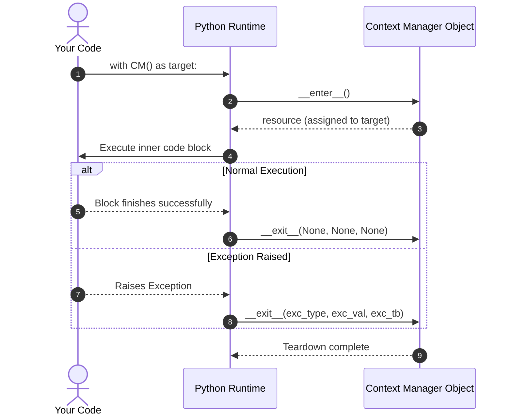
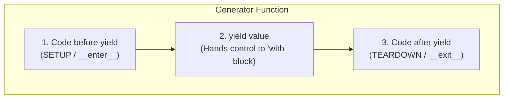

# The Friendly Guide to Python Context Managers & the `with` Statement

> **Target Audience:** Software Engineers who know basic Python syntax (functions, classes, exceptions) but want a clear, deep, intuitive understanding of what `with` really does under the hood and how to write their own context managers.

---

## Table of Contents

1. [The Big Picture: The "Borrow, Use, Return" Problem](#1-the-big-picture-the-borrow-use-return-problem)
2. [Life Without Context Managers: The `try...finally` Boilerplate](#2-life-without-context-managers-the-tryfinally-boilerplate)
3. [Enter the `with` Statement: Python's Elegant Solution](#3-enter-the-with-statement-pythons-elegant-solution)
4. [How It Works Under the Hood: The Protocol (`__enter__` & `__exit__`)](#4-how-it-works-under-the-hood-the-protocol-__enter__--__exit__)
5. [Building Your Own Context Manager: Method 1 (Class-Based)](#5-building-your-own-context-manager-method-1-class-based)
   - [Step 1: The Bare-Bones Skeleton](#step-1-the-bare-bones-skeleton)
   - [Step 2: Adding Setup & Teardown Logic](#step-2-adding-setup--teardown-logic)
   - [Step 3: Handling Errors in `__exit__`](#step-3-handling-errors-in-__exit__)
   - [Step 4: Putting It All Together (Production-Ready Timer)](#step-4-putting-it-all-together-production-ready-timer)
6. [Building Your Own Context Manager: Method 2 (`contextlib.@contextmanager`)](#6-building-your-own-context-manager-method-2-contextlibcontextmanager)
   - [The Generator Pattern Explained](#the-generator-pattern-explained)
   - [Skeleton to Final Code](#skeleton-to-final-code)
7. [Managing Multiple Resources](#7-managing-multiple-resources)
8. [Real-World Patterns in Professional Code](#8-real-world-patterns-in-professional-code)
9. [Quick Reference Cheat Sheet](#9-quick-reference-cheat-sheet)

---

## 1. The Big Picture: The "Borrow, Use, Return" Problem

### Intuition

In software engineering, you constantly work with **resources that have a lifecycle**:

- **Files**: Open file $\rightarrow$ Read/Write $\rightarrow$ Close file.
- **Database Connections**: Connect $\rightarrow$ Run queries $\rightarrow$ Close connection / return to pool.
- **Locks / Mutexes**: Acquire lock $\rightarrow$ Access shared memory $\rightarrow$ Release lock.
- **Network Sockets**: Connect socket $\rightarrow$ Transmit bytes $\rightarrow$ Close socket.

Every single one of these follows a three-stage dance:


### The Human Problem

Developers are great at Step 1 and Step 2. But we often forget Step 3, or an unexpected exception crashes Step 2 before Step 3 can ever execute.

When Step 3 fails to run, you get **resource leaks**:

- File descriptors run out (OS error: _"Too many open files"_).
- Database connections exhaust pool limits.
- Deadlocks occur because a lock was never released.

---

## 2. Life Without Context Managers: The `try...finally` Boilerplate

Before context managers existed, developers had to protect cleanup operations using `try...finally` blocks.

### The Naive (Buggy) Way

```python
# ❌ DANGEROUS: If file.read() raises an error, file.close() never runs!
file = open("data.txt", "w")
file.write("Hello, World!")
# Suppose an error happens right here:
raise RuntimeError("Something went wrong!")
file.close()  # <- Never reached! File descriptor leaks!
```

### The Defensive `try...finally` Way

```python
# ⚠️ Safe, but verbose and repetitive
file = open("data.txt", "w")
try:
    file.write("Hello, World!")
    # Even if an error happens here...
finally:
    # ...this block is GUARANTEED to run by Python runtime
    file.close()
```

### Why is `try...finally` Annoying?

- It clutters business logic with boilerplate defensive code.
- If you have 3 resources (e.g., two files and a lock), you end up with messy nested `try...finally` pyramids.

---

## 3. Enter the `with` Statement: Python's Elegant Solution

Python introduced the `with` statement (via PEP 343) to encapsulate setup and teardown into clean, reusable objects called **Context Managers**.

### The Pythonic Way

```python
# ✅ Clean, safe, and Pythonic!
with open("data.txt", "w") as file:
    file.write("Hello, World!")
# The moment execution leaves this indented block, file.close() is called automatically!
```

### Anatomy of a `with` Statement

```text
with  EXPRESSION  as  VARIABLE :
│           │               │
│           │               └─ Target variable receiving the resource (optional)
│           └──────────────── Context Manager object (creates the context)
└──────────────────────────── Keyword that activates the context manager protocol
```



---

## 4. How It Works Under the Hood: The Protocol (`__enter__` & `__exit__`)

Any Python object can be a Context Manager if it implements two special methods (often called "dunder" or double-underscore methods):

1. `__enter__(self)`:
   - Called **before** the code block inside `with` executes.
   - Any value returned by `__enter__` becomes the variable after `as` (e.g., `with ... as target:`).
2. `__exit__(self, exc_type, exc_val, exc_tb)`:
   - Called **after** the code block finishes, **regardless of whether it succeeded or crashed**.
   - Receives 3 arguments describing any exception that occurred inside the block.

### Understanding `__exit__` Arguments

| Argument   | Type        | Meaning                                                          | Value If No Exception |
| :--------- | :---------- | :--------------------------------------------------------------- | :-------------------- |
| `exc_type` | `type`      | The exception class (e.g. `ValueError`)                          | `None`                |
| `exc_val`  | `Exception` | The exception instance message (e.g. `ValueError("Invalid ID")`) | `None`                |
| `exc_tb`   | `traceback` | The traceback object for debugging                               | `None`                |

### Exception Handling Rule in `__exit__`

- If `__exit__` returns **`True`**: Python **suppresses** (swallows) the exception. Code outside the `with` block continues running.
- If `__exit__` returns **`False`** (or `None`): Python **re-raises** the exception normally after cleanup.

---

## 5. Building Your Own Context Manager: Method 1 (Class-Based)

Let's build a context manager from scratch. We will build an **Execution Timer** that measures how long a block of code takes to run.

### Step 1: The Bare-Bones Skeleton

Start with just the class signature and empty protocol methods.

```python
class Timer:
    def __enter__(self):
        # 1. SETUP goes here
        return self

    def __exit__(self, exc_type, exc_val, exc_tb):
        # 2. TEARDOWN / CLEANUP goes here
        pass
```

### Step 2: Adding Setup & Teardown Logic

Now we add timing logic using Python's standard `time.perf_counter()`.

```python
import time

class Timer:
    def __enter__(self):
        print("[SETUP] Starting timer...")
        self.start_time = time.perf_counter()
        return self  # Passed to the 'as' variable

    def __exit__(self, exc_type, exc_val, exc_tb):
        self.end_time = time.perf_counter()
        self.elapsed = self.end_time - self.start_time
        print(f"[TEARDOWN] Finished! Elapsed time: {self.elapsed:.6f} seconds")
```

### Step 3: Handling Errors in `__exit__`

What if the code inside the `with` block crashes? We still want the timer to report elapsed time, but we also want to inspect the error.

```python
import time

class Timer:
    def __enter__(self):
        self.start_time = time.perf_counter()
        return self

    def __exit__(self, exc_type, exc_val, exc_tb):
        self.elapsed = time.perf_counter() - self.start_time

        if exc_type is not None:
            print(f"[ERROR] Block failed with {exc_type.__name__}: {exc_val}")
            print(f"[TEARDOWN] Timer ran for {self.elapsed:.6f}s before failure.")
            # Returning False lets the exception bubble up to the caller
            return False

        print(f"[TEARDOWN] Success! Block took {self.elapsed:.6f}s")
        return True
```

### Step 4: Putting It All Together (Complete Runnable Example)

Here is a complete, documented script you can run immediately:

```python
import time

class CodeTimer:
    """A context manager to benchmark execution time of code blocks."""

    def __init__(self, block_name="Block"):
        # __init__ runs when creating the object: CodeTimer("My Task")
        self.block_name = block_name
        self.elapsed = 0.0

    def __enter__(self):
        # __enter__ runs at the 'with' statement
        print(f"⏱️  Starting '{self.block_name}'...")
        self.start_time = time.perf_counter()
        return self  # Bound to the variable after 'as'

    def __exit__(self, exc_type, exc_val, exc_tb):
        # __exit__ ALWAYS runs when the block ends
        self.elapsed = time.perf_counter() - self.start_time

        if exc_type is not None:
            print(f"💥 '{self.block_name}' crashed after {self.elapsed:.4f}s with error: {exc_val}")
            # return False -> do NOT suppress error, let caller handle it
            return False

        print(f"✅ '{self.block_name}' completed in {self.elapsed:.4f}s")
        # return True -> normal completion
        return True


# --- Usage Example 1: Normal execution ---
with CodeTimer("List Computation") as timer:
    data = [x ** 2 for x in range(1_000_000)]
    print(f"Computed {len(data)} items.")

# --- Usage Example 2: Handling an error gracefully ---
try:
    with CodeTimer("Faulty Operation") as timer:
        time.sleep(0.2)
        raise ValueError("Something went wrong with the database!")
except ValueError:
    print("Caught the error outside the context manager!")
```

---

## 6. Building Your Own Context Manager: Method 2 (`contextlib.@contextmanager`)

Creating a class with `__enter__` and `__exit__` can feel heavy for simple tasks. Python provides a shortcut in the `contextlib` standard library: the `@contextmanager` decorator.

### The Mental Model: The `yield` Split

When using `@contextmanager`, you write a **generator function**:

- Everything **before** `yield` is the **setup** (`__enter__`).
- The value **yielded** is what the `as` variable receives.
- Everything **after** `yield` is the **cleanup** (`__exit__`).



### Step-by-Step Skeleton

#### Skeleton 1: The Core Structure

```python
from contextlib import contextmanager

@contextmanager
def my_context():
    # Setup
    yield
    # Cleanup
```

#### Skeleton 2: Adding `try...finally` for Safety

> [!IMPORTANT]
> You **must** wrap the `yield` inside a `try...finally`. If an error occurs in the user's `with` block, Python raises it at the `yield` statement. Without `finally`, the cleanup code will be skipped!

```python
from contextlib import contextmanager

@contextmanager
def my_context():
    # 1. Setup
    try:
        yield "resource"  # 2. Hand resource to 'as' variable
    finally:
        # 3. Guaranteed cleanup
        pass
```

### Complete Example: Temporary Working Directory Changer

A common SWE task is temporarily switching the current working directory and ensuring you return back to the original directory, even if something crashes.

```python
import os
from contextlib import contextmanager

@contextmanager
def temporary_directory_switch(target_path: str):
    """Safely switches current working directory and guarantees return."""
    original_path = os.getcwd()
    print(f"📁 Switching from: {original_path} -> {target_path}")

    try:
        os.chdir(target_path)
        yield os.getcwd()  # This value is assigned to 'as current_dir'
    finally:
        # This will run NO MATTER WHAT happens in the with block
        os.chdir(original_path)
        print(f"🏠 Restored back to original directory: {os.getcwd()}")


# --- Usage ---
print(f"Current root: {os.getcwd()}")

with temporary_directory_switch("/tmp") as current_dir:
    print(f"Inside with-block: working in {current_dir}")
    # Do work in /tmp here...

print(f"Outside with-block: back in {os.getcwd()}")
```

---

## 7. Managing Multiple Resources

What if you need to open two files or acquire two locks at once?

### Method A: Nested `with` Statements

```python
with open("source.txt", "r") as src:
    with open("dest.txt", "w") as dst:
        dst.write(src.read())
```

### Method B: Single `with` Statement with Commas (Recommended)

Python allows chaining multiple context managers separated by commas:

```python
with open("source.txt", "r") as src, open("dest.txt", "w") as dst:
    dst.write(src.read())
```

### Method C: Dynamic Number of Context Managers (`contextlib.ExitStack`)

If you have an unknown list of files or resources at runtime:

```python
from contextlib import ExitStack

filenames = ["file1.txt", "file2.txt", "file3.txt"]

with ExitStack() as stack:
    # Open as many files as you want dynamically
    files = [stack.enter_context(open(fname, "w")) for fname in filenames]

    for f in files:
        f.write("Batch data")
# All opened files are safely closed together when leaving ExitStack!
```

---

## 8. Real-World Patterns in Professional Code

Here is how context managers are used in day-to-day software engineering:

### 1. Database Transactions (Commit or Rollback)

```python
class DatabaseTransaction:
    def __init__(self, connection):
        self.conn = connection

    def __enter__(self):
        self.cursor = self.conn.cursor()
        return self.cursor

    def __exit__(self, exc_type, exc_val, exc_tb):
        if exc_type is not None:
            print("Rolling back transaction due to error...")
            self.conn.rollback()
            return False  # Let exception bubble up
        else:
            print("Committing transaction...")
            self.conn.commit()
            return True
```

### 2. Thread Safety (Concurrency Locks)

```python
import threading

balance_lock = threading.Lock()
account_balance = 100

def withdraw(amount):
    global account_balance
    # Automatically acquires lock on entry, releases on exit
    with balance_lock:
        account_balance -= amount
```

### 3. Unit Testing with Mocks (`unittest.mock.patch`)

```python
from unittest.mock import patch

# Temporarily mock an API call only inside this block
with patch("my_module.fetch_user_from_api", return_value={"id": 1, "name": "Alice"}):
    # Tests run with fake user data here
    pass
# Outside the block, the original real function is automatically restored
```

---

## 9. Quick Reference Cheat Sheet

| Feature               | Class-Based (`__enter__` / `__exit__`)              | Generator-Based (`@contextmanager`)                |
| :-------------------- | :-------------------------------------------------- | :------------------------------------------------- |
| **Import needed**     | None (pure Python)                                  | `from contextlib import contextmanager`            |
| **Best for**          | Complex state, reusable libraries, multiple methods | Quick utilities, simple setup/teardown tasks       |
| **Setup logic**       | Inside `def __enter__(self):`                       | Before `yield`                                     |
| **Cleanup logic**     | Inside `def __exit__(self, ...):`                   | After `yield` (inside `finally`)                   |
| **Resource returned** | `return resource` from `__enter__`                  | `yield resource`                                   |
| **Swallow exception** | `return True` from `__exit__`                       | Catch exception with `try...except` around `yield` |

### Summary Mantras

1. **Always ask:** _"Does this resource need cleanup even if code crashes?"_ If yes, use a Context Manager.
2. **Setup in `__enter__` (or before `yield`), Teardown in `__exit__` (or `finally`).**
3. **Never forget:** `with` is not just for files—it's for any temporary state or paired operation in your program!
