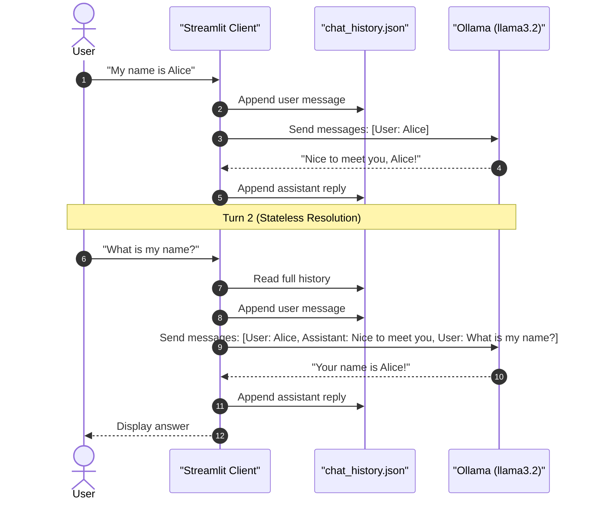
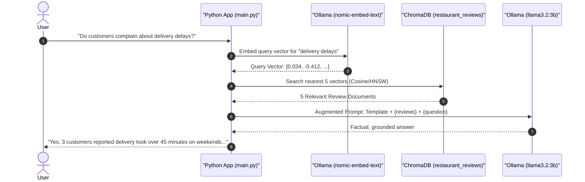
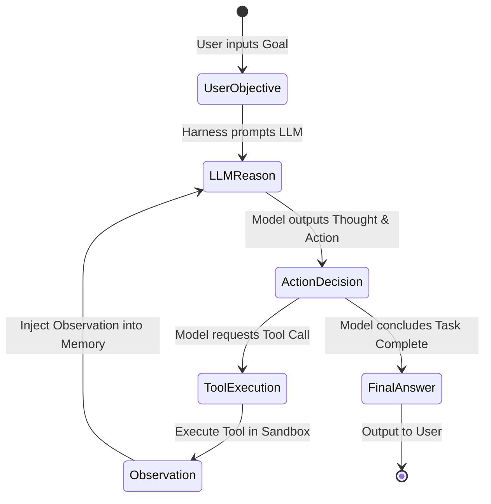

# The Complete AI First Engineer Masterclass: From Local LLMs to Autonomous Agents & Production APIs

> **Target Audience:** Regular software engineers beginning their journey in AI and Python, up to advanced developers building production-grade autonomous systems.  
> **Pedagogical Baseline:** Zero unexplained magic. Every tool, concept, library, and mathematical formula is accompanied by:
>
> 1. **What is it?** (Clear definition in plain English)
> 2. **Why is it needed?** (The exact software engineering problem it solves)
> 3. **The Intuitive Analogy** (Everyday mental model)
> 4. **A Real-World Case Story** (What happens in production if you ignore it)
> 5. **Skeleton Blueprint $\to$ Building Blocks $\to$ Full Standalone Code**
>
> **Source Projects & Videos Analyzed:**
>
> 1. [How to Build a Local AI Agent With Python (Ollama, LangChain & RAG)](https://www.youtube.com/watch?v=E4l91XKQSgw) (`ai-agent/`)
> 2. [Create a LOCAL Python AI Chatbot In Minutes Using Ollama](https://www.youtube.com/watch?v=d0o89z134CQ) (`ollama/`)
> 3. [Beginner Python AI Project: Build a Private Local LLM App with Streamlit + Ollama](https://www.youtube.com/watch?v=IlvBfV8IpL8) (`pvt-local-llm/`)
> 4. [How AI Agents Actually Work (Every Piece Explained & Built)](https://www.youtube.com/watch?v=HzGOWq5UyjY) (`build-apis-for-llms/` & Agent Architecture)
> 5. [Learn Ollama in 15 Minutes - Run LLM Models Locally for FREE](https://www.youtube.com/watch?v=UtSSMs6ObqY&t=624s) (`build-apis-for-llms/OLLAMA_TUTORIAL_NOTES.md`)

---

## Visual Roadmap: The 5-Stage Evolution of an AI Engineer

```
Stage 1: The Foundation           Stage 2: The Interface             Stage 3: Grounded Truth
┌───────────────────────┐         ┌───────────────────────┐          ┌───────────────────────┐
│ Local Model Runtime   │ ──────> │ Stateful Chatbot (UI) │ ───────> │ RAG + Vector DB       │
│ (Ollama, GGUF, Quant) │         │ (Streamlit + Memory)  │          │ (ChromaDB, LangChain) │
└───────────────────────┘         └───────────────────────┘          └───────────────────────┘
                                                                                 │
                                                                                 ▼
Stage 5: Production Gateway       Stage 4: Autonomous Systems
┌───────────────────────┐         ┌───────────────────────┐
│ Secure API Gateway    │ <────── │ AI Agents with Tools  │
│ (Rate Limit, Cache)   │         │ (Harness, MCP, ReAct) │
└───────────────────────┘         └───────────────────────┘
```

---

## Master Glossary: Tools & Concepts Demystified

Before writing a single line of code, review this quick-lookup table for every tool and concept used throughout this guide:

| Tool / Concept                   | What Is It?                                                                                   | Why Is It Needed?                                                                                              |
| ------------------------------- | -------------------------------------------------------------------------------------------- | ------------------------------------------------------------------------------------------------------------- | ----------------------------------------------------------------------------------------- |
| **LLM (Large Language Model)**   | A neural network trained on vast text corpora to predict the next word in a sequence.         | Acts as the cognitive engine for understanding, reasoning, and generating text.                                |
| **Token**                        | A sub-word text chunk (approx. 4 characters or 0.75 English words).                           | Computers cannot process raw letters; text must be converted into numerical token IDs.                         |
| **Context Window**               | The maximum token capacity a model can hold in active memory at one time.                     | Bounds how much past conversation, system instructions, and documents an LLM can reference.                    |
| **Quantization**                 | Compressing 16-bit floating-point weights into 4-bit or 8-bit integers (`q4_K_M`, `q8_0`).    | Reduces model memory footprint by 75%, allowing 8B models to run on standard laptops.                          |
| **GGUF Format**                  | A binary file format bundling model weights, tokenizer configs, and metadata into one file.   | Allows fast memory-mapped loading directly into CPU/GPU RAM without Python interpreter overhead.               |
| **Ollama**                       | An open-source model execution runtime, distribution manager, and daemon.                     | Packages `llama.cpp` and models into a single CLI tool, avoiding manual CUDA/PyTorch configurations.           |
| **`llama.cpp`**                  | A high-performance, bare-metal C/C++ inference engine written by Georgi Gerganov.             | Runs LLMs directly on hardware with zero Python overhead using Apple Metal, NVIDIA CUDA, or CPU AVX.           |
| **`requests`**                   | Standard Python library for sending synchronous HTTP requests (`GET`, `POST`).                | Allows calling local or remote REST endpoints without installing bloated AI SDKs.                              |
| **NDJSON**                       | Newline-Delimited JSON; a stream of independent JSON objects separated by `\n`.               | Enables streaming token generation over an open TCP socket so users see text in real time.                     |
| **Streamlit**                    | A rapid Python web framework that turns Python scripts into interactive browser UIs.          | Lets software engineers build full-featured AI chat interfaces in pure Python without writing HTML/JS.         |
| **`session_state`**              | Streamlit's built-in dictionary that persists variables across browser re-runs.               | Streamlit re-executes the entire script on every user interaction; session state preserves chat history.       |
| **Vector Embedding**             | Converting text into an array of floating-point numbers (e.g. 768 dimensions).                | Enables mathematical comparison of semantic meaning (e.g., measuring cosine similarity).                       |
| **ChromaDB**                     | An open-source, embedded vector database with persistent SQLite storage.                      | Stores high-dimensional vectors and performs Approximate Nearest Neighbor (ANN/HNSW) searches in milliseconds. |
| **LangChain (LCEL)**             | A composition framework for chaining prompts, vector retrievers, and LLMs using `             | `.                                                                                                             | Standardizes RAG pipelines and eliminates glue-code between databases and model runtimes. |
| **Pandas**                       | Python data analysis library for reading and manipulating tabular data (CSVs, Excel).         | Ingests structured business datasets (like restaurant reviews) before converting them into vector documents.   |
| **Autonomous Agent**             | A system where an LLM operates inside an execution harness loop, selecting and calling tools. | Moves beyond passive chatbots by allowing the AI to query databases, run code, and fulfill multi-step goals.   |
| **MCP (Model Context Protocol)** | An open standard by Anthropic for exposing tools, database resources, and prompts to models.  | Replaces proprietary, brittle custom tool-calling formats with a unified client-server standard.               |
| **ReAct Pattern**                | A prompt design pattern where the model alternates between **Reasoning** and **Acting**.      | Prevents impulsive errors by forcing the AI to articulate a thought before invoking a tool.                    |
| **FastAPI**                      | A modern, high-performance, asynchronous web framework built on Python type hints.            | Wraps raw local models in a secure, authenticated, production-grade REST API gateway.                          |
| **Pydantic**                     | Data validation library using Python type annotations.                                        | Validates and sanitizes incoming HTTP JSON payloads before they reach the model.                               |
| **Token Bucket**                 | An algorithmic rate-limiting pattern that allows bursts of requests up to a bucket capacity.  | Protects GPU memory and compute queues from malicious scrapers or denial-of-service loops.                     |
| **Semantic Caching**             | Caching LLM responses based on vector similarity rather than exact string equality.           | Answers semantically identical questions in 1ms with 0 tokens consumed.                                        |
| **Server-Sent Events (SSE)**     | An HTTP standard allowing servers to push real-time text chunks to web clients.               | Delivers smooth ChatGPT-like token streaming to browser frontends over standard HTTP.                          |

---

## Table of Contents

1. [Foundations & Terminology Demystified](#1-foundations--terminology-demystified)
   - [What is an LLM Really? (The "Smart Autocomplete" Analogy)](#what-is-an-llm-really)
   - [Tokens: The Lego Bricks of Language](#tokens-the-lego-bricks-of-language)
   - [Context Window: The "Desk Space" Analogy](#context-window-the-desk-space-analogy)
   - [Cloud APIs vs. Local Runtimes: Architectural Trade-Offs](#cloud-apis-vs-local-runtimes)
   - [_Real-World Story:_ The \$4,800 Midnight Cloud Loop Disaster](#story-the-midnight-cloud-loop)
   - [Quantization: How to Fit a Mountain in a Backpack](#quantization-how-to-fit-a-mountain-in-a-backpack)
   - [_Real-World Story:_ The MacBook Fan Takeoff & The VRAM Math](#story-the-macbook-fan-takeoff)
   - [Hyperparameters: The Dials on the AI Engine](#hyperparameters-the-dials-on-the-ai-engine)
2. [Local AI Runtime: Ollama Deep Dive](#2-local-ai-runtime-ollama-deep-dive)
   - [What is Ollama? (The "Docker for LLMs")](#what-is-ollama)
   - [How It Works Under the Hood (`llama.cpp`, GGUF & Metal/CUDA)](#how-it-works-under-the-hood)
   - [Installation, Daemon Verification & Environment Variables](#installation-and-daemon)
   - [Essential CLI Commands & Memory Lifecycle (`ps`, Keep-Alive)](#essential-cli-commands)
   - [Customizing Models with `Modelfile` (Mario & Trump Personas)](#customizing-models-with-modelfile)
   - [_Real-World Story:_ The Sarcastic Customer Support Bot](#story-the-sarcastic-bot)
   - [Calling Ollama: Raw HTTP REST vs. Official Python SDK](#http-rest-vs-python-sdk)
   - [NDJSON Streaming: Why `iter_lines()` and `flush=True` Matter](#ndjson-streaming-explained)
3. [Building Interactive User Interfaces (Streamlit + Persistent Memory)](#3-building-interactive-user-interfaces)
   - [The Stateless Problem: The "Amnesiac Chef" Analogy](#the-stateless-problem)
   - [_Real-World Story:_ The Support Bot That Forgot My Name](#story-the-amnesiac-support-bot)
   - [Architecture Blueprint: Decoupling State from Presentation](#decoupling-state-from-presentation)
   - [Building Block 1: Persistent Chat Memory (`pvt-local-llm/memory.py`)](#building-block-memory)
   - [Building Block 2: The Generator Streaming Pipeline](#building-block-streaming)
   - [Building Block 3: The Streamlit View Layer](#building-block-ui)
   - [The Complete Assembled Streamlit App (`pvt-local-llm/app.py`)](#complete-assembled-streamlit-app)
4. [Retrieval-Augmented Generation (RAG) & Vector Databases](#4-retrieval-augmented-generation-rag)
   - [Why RAG? The "Open-Book vs. Closed-Book Exam" Analogy](#why-rag)
   - [_Real-World Story:_ The Phantom Mushroom Pizza Disaster](#story-the-phantom-mushroom-pizza)
   - [Embeddings: GPS Coordinates for Human Ideas](#embeddings-gps-coordinates)
   - [Vector Databases & Semantic Similarity Search (ChromaDB)](#vector-databases-and-chromadb)
   - [Architecture Blueprint: Ingestion vs. Query Pipelines](#rag-architecture-blueprint)
   - [Building Block 1: Ingesting Tabular Data into ChromaDB (`ai-agent/vector.py`)](#building-block-vector)
   - [Building Block 2: Constructing the LCEL Pipeline (`ai-agent/main.py`)](#building-block-lcel)
   - [The Complete Assembled RAG Application](#complete-assembled-rag-app)
5. [How AI Agents Actually Work (From Chatbot to Autonomous System)](#5-how-ai-agents-actually-work)
   - [Model vs. Chatbot vs. AI Agent (The GPS vs. Self-Driving Car Analogy)](#model-vs-chatbot-vs-agent)
   - [_Real-World Story:_ The Intern with No Hands](#story-the-intern-with-no-hands)
   - [The 5 Pillars of an Agent: Harness, MCP, Skills, Sandbox, Production](#the-5-pillars-of-an-agent)
   - [The ReAct Pattern: Reason + Act + Observe](#the-react-pattern)
   - [Architecture Blueprint: The Agent Loop](#agent-architecture-blueprint)
   - [Building Block 1: The Tool Registry & Safe Execution Sandbox](#building-block-agent-tools)
   - [Building Block 2: The Autonomous Controller Harness](#building-block-agent-harness)
   - [Building Block 3: Parser & Self-Correction Error Recovery](#building-block-agent-parser)
   - [The Complete Assembled Autonomous Agent in Pure Python](#complete-assembled-agent)
6. [Production-Ready AI APIs with Python](#6-production-ready-ai-apis-with-python)
   - [Why Wrap LLMs in a Gateway API? (The "Nightclub Bouncer" Analogy)](#why-wrap-llms-in-a-gateway)
   - [_Real-World Story:_ The Unprotected Endpoint That Burned 10M Tokens](#story-the-unprotected-endpoint)
   - [Architecture Blueprint: The Gateway Pipeline](#gateway-architecture-blueprint)
   - [Building Block 1: Authentication & Credit Quota Dependency](#building-block-api-auth)
   - [Building Block 2: Token Bucket Rate Limiter (Arcade Tokens Analogy)](#building-block-api-ratelimit)
   - [Building Block 3: Semantic Caching with Embeddings](#building-block-api-cache)
   - [Building Block 4: Streaming Responses with Server-Sent Events (SSE)](#building-block-api-streaming)
   - [The Complete Assembled Production Gateway API](#complete-assembled-gateway-api)
7. [The Unified AI Engineer Cheat Sheet & Roadmap](#7-the-unified-ai-engineer-cheat-sheet)

---

## 1. Foundations & Terminology Demystified

### What is an LLM Really?

Before diving into complex frameworks, let's strip away the sci-fi mystique.

> **The Intuitive Analogy:**  
> Think of your phone's keyboard autocomplete. When you type `"I am going to the..."`, your phone suggests `"store"`, `"beach"`, or `"doctor"`.  
> A Large Language Model (LLM) is essentially that autocomplete, but instead of scanning just the last 3 words you typed, it scans **hundreds of pages of text simultaneously**, powered by hundreds of billions of mathematical weights trained on human literature, code, and science.

Mathematically, an LLM is a **conditional probability engine**:

$$P(\text{next token} \mid \text{all previous tokens})$$

```
Input Prompt: "The early bird catches the"
                               │
            ┌──────────────────┴──────────────────┐
            ▼                                     ▼
     Candidate Word: "worm"               Candidate Word: "train"
     Probability: 98.2%                   Probability: 0.1%
            │
            ▼
     [SELECTED: "worm"]
```

---

### Tokens: The Lego Bricks of Language

Computers cannot read English letters. They only understand numbers.

> **The Intuitive Analogy:**  
> Imagine a sentence is a Lego castle. A "word" might be an entire tower, but an LLM works with the individual Lego bricks called **tokens**. Common words are a single brick. Long, complex, or foreign words are snapped together from 2 or 3 smaller bricks.

```
Sentence: "Understanding transformers is fantastic!"

Token Split:
┌──────────────┬──────────────┬──────┬────┬──────────┬────┐
│ Understand   │ ing          │ trans│form│ ers      │ !  │
└──────────────┴──────────────┴──────┴────┴──────────┴────┘
Token 1        Token 2        Token 3 Token 4 Token 5 Token 6
```

#### Rule of Thumb for English Text:

- **1 Token $\approx$ 0.75 words** (or about 4 characters).
- **1,000 Tokens $\approx$ 750 words** (about 1.5 pages of single-spaced text).

---

### Context Window: The "Desk Space" Analogy

> **The Intuitive Analogy:**  
> Imagine an analyst sitting at a small office desk. The desk can hold exactly **5 sheets of paper** at once.  
> As long as your questions fit on those 5 sheets, the analyst can answer instantly with razor-sharp precision. But the moment you drop a 6th sheet onto the desk, sheet #1 falls off into the paper shredder.  
> The analyst does not remember sheet #1 existed.  
> That desk size is the model's **Context Window**.

```
Context Window Capacity (e.g. 4096 tokens)
┌─────────────────────────────────────────────────────────────┐
│ [System Prompt: You are a helpful assistant] (200 tokens)   │
│ [Conversation History: Turn 1, Turn 2...]   (1,500 tokens)  │
│ [Retrieved Documents / RAG Context]         (2,000 tokens)  │
│ [User's New Question]                        (50 tokens)    │
│ ----------------------------------------------------------- │
│ Remaining Free Space for Model's Output:       346 tokens   │
└─────────────────────────────────────────────────────────────┘
```

If your total prompt exceeds the context window, either the oldest history is dropped, or the model throws an `Out of Context Limit` error.

---

### Cloud APIs vs. Local Runtimes

```
┌──────────────────────────────────────┐     ┌──────────────────────────────────────┐
│          Cloud LLM Pattern           │     │          Local LLM Pattern           │
│   (OpenAI, Anthropic, Gemini)        │     │          (Ollama, llama.cpp)         │
├──────────────────────────────────────┤     ├──────────────────────────────────────┤
│  [Your Python App]                   │     │  [Your Python App]                   │
│         │                            │     │         │                            │
│         │ HTTPS POST (Leaves PC)     │     │         │ HTTP POST (Port 11434)     │
│         ▼                            │     │         ▼                            │
│  [Remote Cloud Data Center]          │     │  [Localhost Daemon (Your GPU/RAM)]   │
│  - Paid per 1,000 tokens             │     │  - 100% Free after hardware purchase │
│  - Requires constant internet        │     │  - 100% Offline (No internet needed) │
│  - Company data leaves perimeter     │     │  - Zero data ever leaves your laptop │
└──────────────────────────────────────┘     └──────────────────────────────────────┘
```

| Dimension                     | Cloud LLM APIs (OpenAI, Gemini, Claude)                        | Local Runtime (Ollama / llama.cpp)                                                           |
| :---------------------------- | :------------------------------------------------------------- | :------------------------------------------------------------------------------------------- |
| **Data Privacy & Compliance** | Prompts leave perimeter; subject to vendor retention policies. | **100% On-Premise.** Zero data leaves the local machine (HIPAA/GDPR compliant).              |
| **Cost Model**                | Pay per 1K/1M tokens; can spike unexpectedly with traffic.     | **Fixed Hardware Cost.** Zero per-token charges, completely free after hardware acquisition. |
| **Network Dependency**        | Dependent on active internet connection and vendor uptime.     | **Fully Offline.** Runs without internet; immune to cloud outages.                           |
| **Latency & Throughput**      | Network round-trip latency + queue wait times.                 | **Zero Network Overhead.** First-token latency bounded only by local compute power.          |
| **Model Customization**       | Restricted to vendor fine-tuning endpoints and system prompts. | **Total Control.** Modify parameters, personas, context windows, and run raw open weights.   |

---

### <a id="story-the-midnight-cloud-loop"></a>_Real-World Story:_ The \$4,800 Midnight Cloud Loop Disaster

> **The Incident:**  
> A fintech startup developer created a quick Python worker to summarize financial statements using a cloud LLM API.  
> Inside the code was an unhandled `while True:` loop. If the model's summary didn't match a specific regex, it retried immediately.  
> At 8:30 PM on a Friday, an unexpected JSON response triggered the retry loop.  
> Because the code was connected to an uncapped cloud API key, the script made **42 requests per second all night long**, pumping massive prompt payloads into the cloud.  
> By Monday morning, the founders opened their dashboard to find a **\$4,821.40 cloud API bill** for a single broken script.
>
> **The Lesson:**
>
> 1. Always set strict billing hard-limits on cloud providers.
> 2. Always use a local runtime like **Ollama** during development and testing—local calls cost **\$0.00** no matter how many infinite loops you accidentally write!

---

### Quantization: How to Fit a Mountain in a Backpack

When an AI lab trains a model, every single weight is saved as a 32-bit or 16-bit floating-point number (`fp16`).  
An 8-billion-parameter model in `fp16` takes:

$$8{,}000{,}000{,}000 \times 2 \text{ bytes} = 16{,}000{,}000{,}000 \text{ bytes} \approx 16 \text{ GB}$$

Most consumer laptops do not have 16 GB of free graphics memory (VRAM) just to load one model!

> **The Intuitive Analogy:**  
> Think of saving a photograph. An uncompressed RAW photo might be 50 Megabytes. A high-quality JPEG is 3 Megabytes.  
> If you look closely with a magnifying glass, you might spot tiny artifacts, but for 99% of people, the JPEG looks indistinguishable from the RAW photo.  
> **Quantization** is JPEG compression for AI model weights. It converts 16-bit numbers into 4-bit integers (`q4_K_M`), shrinking the file by **75%** while retaining 98% of its intelligence.

```
32-bit Float (FP32) : [01000000 01001001 00001111 11011011]  (4 bytes per weight)
16-bit Float (FP16) : [01000010 01001000]                    (2 bytes per weight)
8-bit Int   (Q8_0)  : [10011101]                             (1 byte per weight)
4-bit Int   (Q4_0)  : [1011]                                 (0.5 bytes per weight) ──> 75% SAVED!
```

---

### <a id="story-the-macbook-fan-takeoff"></a>_Real-World Story:_ The MacBook Fan Takeoff & The VRAM Math

> **The Incident:**  
> A junior engineer wanted to test the state-of-the-art `llama3.1:70b` model on his 16 GB MacBook Air.  
> He typed `ollama run llama3.1:70b` in his terminal.  
> Within 15 seconds, the system locked up, the swap memory exploded to 50 GB, the laptop froze, and macOS kernel-panicked and restarted.
>
> **Why Did This Happen?**  
> He didn't know the hardware sizing formula!

#### The Universal VRAM Sizing Formula:

$$\text{Required VRAM (GB)} \approx \left( \frac{\text{Parameters (in Billions)} \times \text{Bits per Weight}}{8} \right) \times 1.25$$

_(The $1.25$ multiplier provides headroom for the KV-cache and context memory)._

Let's calculate for a 70B model with 4-bit quantization:
$$\left( \frac{70 \times 4}{8} \right) \times 1.25 = 35 \times 1.25 \approx 43.75 \text{ GB}$$

You cannot fit a **44 GB** model into a **16 GB** machine!

#### Sizing Cheat Sheet:

| Model Tag      | Parameters | Quantization | Minimum RAM/VRAM      | Where Can It Run?                                |
| :------------- | :--------- | :----------- | :-------------------- | :----------------------------------------------- |
| `llama3.2:1b`  | 1 Billion  | 4-bit        | **1.5 GB – 2.5 GB**   | Phones, Raspberry Pi 5, older laptops            |
| `llama3.2:3b`  | 3 Billion  | 4-bit        | **2.5 GB – 4.0 GB**   | Any standard Mac / Windows laptop                |
| `llama3.1:8b`  | 8 Billion  | 4-bit        | **5.5 GB – 7.5 GB**   | 16 GB M1/M2/M3 Mac, 8 GB RTX 3060/4060           |
| `qwen2.5:14b`  | 14 Billion | 4-bit        | **11.5 GB – 14.0 GB** | 24 GB+ unified Mac, RTX 3080/4080                |
| `llama3.1:70b` | 70 Billion | 4-bit        | **40.0 GB – 48.0 GB** | Mac Studio (64GB–128GB), $2\times$ RTX 3090/4090 |

---

### Hyperparameters: The Dials on the AI Engine

When you ask an LLM a question, four main dials control how it thinks and responds:

```
Low Temperature (0.1)                                  High Temperature (1.2)
┌───────────────────────────────────────────────────────────────────────────┐
│ ●                                                                         │
└───────────────────────────────────────────────────────────────────────────┘
[Safe, Deterministic, Factual]                             [Creative, Wild, Erratic]
Best for: Math, Code, SQL, JSON                            Best for: Brainstorming, Poetry
```

1. **`temperature` (0.0 to 2.0):**
   - **0.0 - 0.2:** The model always picks the single most probable token. Use this for coding, math, data extraction, and structured JSON.
   - **0.7 - 0.8:** The default sweet spot. Fluent, conversational, and natural.
   - **1.0 - 1.5:** Highly creative and eccentric. Great for storytelling, games, or character roleplay.
2. **`top_p` (Nucleus Sampling):**
   - Instead of looking at every word in the dictionary, only choose from the top group of words that make up $P\%$ (e.g. 90%) of the probability mass. This filters out obscure, weird words.
3. **`top_k`:**
   - Cuts off the candidate list to strictly the top $K$ choices (e.g. 40 tokens).
4. **`num_ctx`:**
   - How many tokens of context memory to allocate. Default is often 2048 or 4096.

---

## 2. Local AI Runtime: Ollama Deep Dive

### What is Ollama?

In the early days of local LLMs, running a model meant manually compiling C++ code, downloading raw Hugging Face checkpoints, installing conflicting CUDA drivers, and writing custom tokenizers.

**Ollama** does for AI models what **Docker** did for software applications:  
It wraps the model weights, configuration, prompt template, and runtime engine into a single clean CLI command.

```
+───────────────────────────────────────────────────────────────+
|                       Your Application                        |
|        (Terminal / Python Script / Streamlit / FastAPI)       |
+───────────────────────────────┬───────────────────────────────+
                                │ HTTP REST (Port 11434)
                                ▼
+───────────────────────────────────────────────────────────────+
|                         Ollama Daemon                         |
|  - Manages downloaded model weights (~/.ollama/models)        |
|  - Queues multiple incoming requests                          |
|  - Auto-manages VRAM keep-alive timer                         |
+───────────────────────────────┬───────────────────────────────+
                                │
                                ▼
+───────────────────────────────────────────────────────────────+
|                   llama.cpp Inference Engine                  |
|  - Contiguous GGUF tensor execution                           |
|  - Apple Metal GPU acceleration (Mac unified memory)          |
|  - NVIDIA CUDA acceleration                                   |
|  - CPU AVX2 / AVX-512 fallback                                |
+───────────────────────────────────────────────────────────────+
```

---

### Installation, Daemon Verification & Environment Variables

#### Installing Across Operating Systems:

Download official installers from [ollama.com/download](https://ollama.com/download):

- **macOS:** Installs `/Applications/Ollama.app` and symlinks the CLI to `/usr/local/bin/ollama`.
- **Linux:** One-line installer creating a `systemd` background service:
  ```bash
  curl -fsSL https://ollama.com/install.sh | sh
  ```
- **Windows:** Installs a Windows background system tray utility and updates user `PATH`.

#### Verifying the Daemon:

```bash
# Check CLI version
ollama --version

# Ping the background HTTP server
curl http://localhost:11434
# Returns: "Ollama is running"
```

#### Critical Environment Variables:

Configure the daemon by setting environment variables before launching or via `systemd`/`launchctl`:

| Variable                   | Default            | Purpose                                                                                   |
| :------------------------- | :----------------- | :---------------------------------------------------------------------------------------- |
| `OLLAMA_HOST`              | `127.0.0.1:11434`  | Set to `0.0.0.0:11434` to expose Ollama to local network / Docker containers.             |
| `OLLAMA_MODELS`            | `~/.ollama/models` | Custom storage folder for downloaded weights (vital if main drive is small).              |
| `OLLAMA_KEEP_ALIVE`        | `5m`               | Time a model stays resident in VRAM before unloading (`-1` keeps it loaded indefinitely). |
| `OLLAMA_NUM_PARALLEL`      | `1`                | Maximum simultaneous user requests processed concurrently by one model.                   |
| `OLLAMA_MAX_LOADED_MODELS` | `1`                | Maximum distinct models loaded simultaneously in memory.                                  |

---

### Essential CLI Commands

```bash
# 1. Pre-download weights in advance without opening a chat prompt
ollama pull llama3.2:3b

# 2. Launch an interactive REPL session in your terminal
ollama run llama3.2:3b

# 3. List all models stored on your local disk
ollama list

# 4. Check active memory allocation right now (CPU vs GPU split)
ollama ps

# 5. Inspect architecture, context window, and tokenizer parameters
ollama show --modelfile llama3.2:3b

# 6. Delete a model to reclaim disk storage
ollama rm llama3.2:3b
```

#### In-Session REPL Controls:

- `/bye` or `Ctrl + D`: Gracefully exits the session and starts the keep-alive countdown.
- `/?`: Displays available interactive commands.
- `"""`: Multi-line prompt mode (enter triple quotes to paste large code blocks without auto-submitting).

#### Understanding `ollama ps` Output:

```text
NAME            ID              SIZE      PROCESSOR    UNTIL
llama3.2:3b     a849d4f0d610    2.0 GB    100% GPU     4 minutes from now
```

- **`100% GPU`:** The entire neural network lives in GPU VRAM. Maximum token generation speed (60–120 tokens/sec).
- **`60% GPU / 40% CPU`:** Partial offload. VRAM was insufficient, so layers spilled to system RAM. Works without crashing, but generation speed is bound by PCIe bus transfer bandwidth.
- **`100% CPU`:** No GPU acceleration detected; computed purely via CPU vector instructions.
- **`UNTIL`:** The 5-minute keep-alive timer. If idle for 5 minutes, Ollama frees VRAM so other apps can use it.

---

### Customizing Models with `Modelfile`

Just like a `Dockerfile` builds custom container images, an Ollama `Modelfile` builds customized model personas.

#### Modelfile Directives Explained:

- `FROM <model>`: Foundational base model to inherit weights from.
- `PARAMETER <name> <val>`: Overrides sampling hyperparameters (`temperature`, `top_p`, `num_ctx`, `stop`).
- `SYSTEM """<prompt>"""`: Embeds persistent behavioral rules and persona guardrails.

#### Example 1: The Donald Trump Persona (`ollama/Modelfile`)

```dockerfile
FROM gemma4:latest

# Sampling creativity (1 = creative/lively)
PARAMETER temperature 1

# Custom persona instructions
SYSTEM """
You are Donald Trump, the US president. Answer like him, but funny.
"""
```

#### Example 2: The Mario Persona

```dockerfile
FROM llama3.2:3b

PARAMETER temperature 1.0
PARAMETER top_p 0.9
PARAMETER num_ctx 4096

SYSTEM """
You are Mario from Super Mario Bros. Answer as Mario, the assistant, only.
Always use catchphrases like 'Mamma Mia!' and 'Let's-a go!'
"""
```

#### How to Build and Run Your Custom Model:

```bash
# 1. Build the custom model named 'mario'
ollama create mario -f ./Modelfile

# 2. Run it immediately
ollama run mario
# Prompt: "What should I do if Bowser kidnaps the Princess?"
# Output: "Mamma Mia! Grab a Super Mushroom and let's-a go rescue Princess Peach!"
```

> **Efficiency Secret:** Ollama does not duplicate gigabytes of weights on disk! It creates a lightweight pointer manifest referencing the base model layers with your custom parameter overlay.

---

### <a id="story-the-sarcastic-bot"></a>_Real-World Story:_ The Sarcastic Customer Support Bot

> **The Incident:**  
> A software team wanted to test custom system prompts for an internal IT helpdesk bot.  
> An engineer set the system prompt to: _"You are an overworked, sarcastic IT technician who answers tickets while complaining about users not restarting their computers."_  
> The model worked brilliantly in testing. But the developer accidentally pushed that `Modelfile` tag into the company's internal Slack integration.  
> When the Head of HR submitted a ticket: _"My printer is jammed,"_ the bot answered:  
> _"Oh magnificent. Another printer jam. Did you try feeding it paper instead of paperclips, or should I come hold your hand while you press the power button?"_
>
> **The Lesson:**  
> System prompts in a `Modelfile` are authoritative. The LLM adopts that persona completely. Treat system prompts as code: test them, version them, and never deploy joke personas to production pipelines!

---

### Calling Ollama: HTTP REST vs. Python SDK

Ollama exposes a built-in web server on port `11434`. You can interact with it via raw HTTP or the official Python SDK:

```
              ┌──────────────────────────┐
              │ Ollama Host (:11434)     │
              └────────────┬─────────────┘
                           │
      ┌────────────────────┴────────────────────┐
      ▼                                         ▼
┌───────────────────────────┐         ┌───────────────────────────┐
│ Raw HTTP (requests)       │         │ Official Python SDK       │
│ - Zero extra dependencies │         │ - Clean Pythonic objects  │
│ - Parse NDJSON manually   │         │ - Automatic generator     │
│ - Low-level network debug │         │ - AsyncClient for FastAPI │
└───────────────────────────┘         └───────────────────────────┘
```

#### REST API Endpoints Overview:

- `POST /api/generate`: Raw completion of a single text string (no chat history).
- `POST /api/chat`: Structured multi-turn conversation with role-based messages (`system`, `user`, `assistant`).
- `GET /api/tags`: List all locally installed models.
- `POST /api/show`: Inspect model metadata.
- `DELETE /api/delete`: Remove model weights from disk.

#### Method 1: Raw HTTP Streaming (`ollama/test_ollama.py`)

```python
import requests
import json

url = "http://127.0.0.1:11434/api/chat"

payload = {
    "model": "gemma4:latest",
    "messages": [{"role": "user", "content": "What is Python in 1 sentence?"}],
    "stream": True  # Instruct Ollama to stream NDJSON tokens
}

response = requests.post(url, json=payload, stream=True)

if response.status_code == 200:
    print("Streaming tokens from Ollama:")
    for line in response.iter_lines(decode_unicode=True):
        if line:
            chunk = json.loads(line)
            if "message" in chunk and "content" in chunk["message"]:
                print(chunk["message"]["content"], end="", flush=True)
    print()
else:
    print(f"Error {response.status_code}: {response.text}")
```

#### Method 2: Official Python SDK (`ollama/test_ollama_package.py`)

```python
import ollama

client = ollama.Client()

# 1. Simple generation
res = client.generate(model="llama3.2:3b", prompt="What is Python?")
print(res.response)

# 2. Multi-turn streaming chat
stream = client.chat(
    model="llama3.2:3b",
    messages=[
        {"role": "system", "content": "You are a concise engineering mentor."},
        {"role": "user", "content": "Explain pointers in C in 2 sentences."}
    ],
    stream=True
)

for chunk in stream:
    print(chunk["message"]["content"], end="", flush=True)
print()
```

#### Method 3: Asynchronous Client (`AsyncClient`) for Web Backends

When building asynchronous APIs in FastAPI, blocking synchronous calls freeze the event loop. Use `AsyncClient`:

```python
import asyncio
import ollama

async def main():
    client = ollama.AsyncClient()
    response = await client.chat(
        model="llama3.2:3b",
        messages=[{"role": "user", "content": "Hello Async World!"}]
    )
    print(response["message"]["content"])

asyncio.run(main())
```

---

### NDJSON Streaming Explained

When an LLM generates text, it produces words **one token at a time**.  
If the client waited for all 500 words to finish generating before returning, the user would stare at a frozen screen for 6 seconds.  
To solve this, Ollama uses **Newline-Delimited JSON (NDJSON)**:

```
Socket Connection Opened
│
├──> {"message": {"content": "Python"}, "done": false}\n
├──> {"message": {"content": " is"}, "done": false}\n
├──> {"message": {"content": " fast"}, "done": false}\n
│
└──> {"done": true, "eval_count": 48, "eval_duration": 620000000}\n
Socket Closed
```

- Each line is a self-contained JSON object ending with `\n`.
- `iter_lines()` reads line-by-line as data arrives across the socket.
- `flush=True` forces the operating system terminal buffer to display the word immediately without waiting for a newline.
- The final packet sends `"done": true` with hardware statistics:
  $$\text{Tokens Per Second} = \frac{\text{eval\_count}}{\text{eval\_duration (in seconds)}} = \frac{48}{0.62} \approx 77.4 \text{ tokens/sec}$$

---

## 3. Building Interactive User Interfaces

### The Stateless Problem: The "Amnesiac Chef" Analogy

> **The Intuitive Analogy:**  
> Imagine visiting a restaurant where the chef suffers from short-term amnesia.  
> You walk up and say: _"I am allergic to peanuts."_  
> The chef says: _"Understood, no peanuts!"_  
> Two minutes later, you say: _"Can I get the pad thai?"_  
> The chef has **zero memory** of your first sentence. He happily cooks the pad thai with extra crushed peanuts!  
> To prevent disaster, every time you talk to the chef, you must hand him a clipboard listing **every single word you have said since you walked into the restaurant**.

Every single HTTP request sent to Ollama is completely stateless. The client application is solely responsible for maintaining conversation history.



---

### <a id="story-the-amnesiac-support-bot"></a>_Real-World Story:_ The Support Bot That Forgot My Name

> **The Incident:**  
> An e-commerce company built an in-app chatbot. The user typed:  
> _"Hi, my order number is #98421 and my package hasn't arrived."_  
> The bot responded: _"I'd love to help you with that! Could you please provide your order number?"_  
> The user furiously responded: _"I JUST GAVE IT TO YOU!"_  
> The bot answered: _"I apologize, but I don't know what you're referring to. Could you provide your order number?"_
>
> **The Problem:**  
> The developer sent only `{"role": "user", "content": current_message}` in each HTTP request.  
> Because past messages were never re-sent, the AI had amnesia on every turn!

---

### Decoupling State from Presentation

To build a professional AI application, never mix your storage code directly with your UI code. We decouple the system into two files:

1. `memory.py`: Responsible exclusively for loading, appending, saving, and clearing chat messages in local JSON.
2. `app.py`: Responsible exclusively for rendering the Streamlit UI and consuming the Ollama streaming generator.

---

### <a id="building-block-memory"></a>Building Block 1: Persistent Chat Memory (`pvt-local-llm/memory.py`)

#### Why is this needed?

Streamlit re-runs the entire Python script from top to bottom every time a button is clicked or text is entered. If you store chat history in a simple local Python variable (`messages = []`), it will reset to an empty list on every interaction! `ChatMemory` saves conversations to a local JSON file on disk, making chats survive page refreshes and server reboots.

```python
import json
import os
from typing import List, Dict

class ChatMemory:
    """
    Saves conversation history to disk as a JSON file.
    Ensures chats survive page refreshes and app restarts.
    """
    def __init__(self, filepath: str = "chat_history.json"):
        self.filepath = filepath
        self.messages: List[Dict[str, str]] = self._load()

    def _load(self) -> List[Dict[str, str]]:
        """Loads saved chat array from disk if the file exists."""
        if os.path.exists(self.filepath):
            try:
                with open(self.filepath, "r", encoding="utf-8") as f:
                    return json.load(f)
            except Exception as e:
                print(f"[Warning] Failed to load chat history: {e}")
                return []
        return []

    def _save(self) -> None:
        """Writes current conversation history to disk."""
        try:
            with open(self.filepath, "w", encoding="utf-8") as f:
                json.dump(self.messages, f, indent=2, ensure_ascii=False)
        except Exception as e:
            print(f"[Error] Failed to save chat history: {e}")

    def add(self, role: str, content: str) -> None:
        """Adds a message turn ('user' or 'assistant')."""
        self.messages.append({"role": role, "content": content})
        self._save()

    def get(self) -> List[Dict[str, str]]:
        """Returns the full message array ready for Ollama payload."""
        return self.messages

    def clear(self) -> None:
        """Wipes active memory and resets the JSON file."""
        self.messages = []
        self._save()
```

---

### <a id="building-block-streaming"></a>Building Block 2: The Generator Streaming Pipeline

#### Why is this needed?

In Python, a standard function returns a single value once using `return`. A **generator** function uses `yield` to stream values incrementally over time. We create a generator that reads NDJSON chunks from Ollama line-by-line and yields clean text tokens directly into Streamlit's UI.

```python
def stream_response(messages):
    """Generator function that yields streaming tokens from Ollama."""
    payload = {
        "model": "llama3.2:3b",
        "messages": messages,
        "stream": True
    }

    try:
        response = requests.post(OLLAMA_URL, json=payload, stream=True)
        response.raise_for_status()
    except requests.exceptions.RequestException as e:
        yield f"⚠️ Error connecting to Ollama: {e}"
        return

    for line in response.iter_lines():
        if not line:
            continue
        try:
            decoded = line.decode("utf-8")
            data = json.loads(decoded)
            if "message" in data and "content" in data["message"]:
                # Yield token immediately as it arrives
                yield data["message"]["content"]
        except json.JSONDecodeError:
            continue
```

---

### <a id="building-block-ui"></a>Building Block 3: The Streamlit View Layer

#### Why is this needed?

Streamlit provides chat-native primitives:

- `st.chat_message(role)`: Renders user and assistant speech bubbles.
- `st.chat_input("Prompt")`: An anchored input bar at the bottom of the window.
- `st.empty()`: A mutable placeholder container that can be overwritten repeatedly to create a live typing animation!

---

### <a id="complete-assembled-streamlit-app"></a>The Complete Assembled Streamlit App (`pvt-local-llm/app.py`)

Here is the full application combining the memory manager and the streaming generator:

```python
import streamlit as st
import requests
import json
from memory import ChatMemory

# 1. Page Configuration
st.set_page_config(page_title="Private AI Chatbot", page_icon="🤖", layout="centered")

OLLAMA_URL = "http://localhost:11434/api/chat"

# 2. Store ChatMemory in Streamlit session_state
# session_state preserves the instance across UI reruns
if "memory" not in st.session_state:
    st.session_state.memory = ChatMemory()

def clean_text(text: str) -> str:
    """Sanitizes raw newline characters."""
    if not text:
        return text
    return text.replace("\\n", "\n").replace("\\t", "\t")

def stream_response(messages):
    """Generator function yielding streaming tokens from Ollama."""
    payload = {
        "model": "llama3.2:3b",
        "messages": messages,
        "stream": True
    }

    try:
        response = requests.post(OLLAMA_URL, json=payload, stream=True)
        response.raise_for_status()
    except requests.exceptions.RequestException as e:
        yield f"⚠️ Error connecting to Ollama: {e}"
        return

    for line in response.iter_lines():
        if not line:
            continue
        try:
            decoded = line.decode("utf-8")
            data = json.loads(decoded)
            if "message" in data and "content" in data["message"]:
                yield clean_text(data["message"]["content"])
        except json.JSONDecodeError:
            continue

# UI Header
st.title("🛡️ Private Local AI Chatbot")
st.caption("Powered by Ollama (llama3.2:3b) & Streamlit — 100% Offline & Private")

# 3. Render all historical messages from persistent storage
for msg in st.session_state.memory.get():
    with st.chat_message(msg["role"]):
        st.markdown(msg["content"])

# 4. Handle incoming user chat input
user_input = st.chat_input("Ask anything...")

if user_input:
    # Save & display user message immediately
    st.session_state.memory.add("user", user_input)
    with st.chat_message("user"):
        st.markdown(user_input)

    # Stream assistant response live into a mutable placeholder
    with st.chat_message("assistant"):
        placeholder = st.empty()  # Mutable UI slot
        response_text = ""

        # Consume the generator live
        for chunk in stream_response(st.session_state.memory.get()):
            response_text += chunk
            placeholder.markdown(response_text + "▌")  # Blinking cursor effect

        placeholder.markdown(response_text)  # Final clean render

    # Save complete assistant response to persistent storage
    st.session_state.memory.add("assistant", response_text)

# Sidebar controls
with st.sidebar:
    st.header("Settings")
    if st.button("🗑️ Clear Chat History", use_container_width=True):
        st.session_state.memory.clear()
        st.rerun()
```

---

## 4. Retrieval-Augmented Generation (RAG) & Vector Databases

### Why RAG? The "Open-Book Exam" Analogy

> **The Intuitive Analogy:**  
> Imagine two students taking a difficult medical board exam:
>
> - **Student A (Pure LLM):** Takes a **closed-book exam**. She must answer entirely from memory. If asked about a brand-new medical study published yesterday, she either guesses or makes something up.
> - **Student B (RAG System):** Takes an **open-book exam**. When a question is asked, an assistant runs into the library, pulls the exact 2 pages referencing that topic, and puts them right in front of her. She reads those 2 pages and answers with 100% factual accuracy.  
>   **RAG is an open-book exam for AI.**

```
Without RAG (Closed-Book):
User Prompt: "What is the return policy for order #8841?"
LLM: "Our return policy is 30 days for any unused items." (HALLUCINATION / GUESS)

With RAG (Open-Book):
1. Retriever searches database for: "return policy order #8841"
2. Retriever pulls excerpt: "Order #8841 is a clearance item and is final sale."
3. Augmented Prompt:
   "Use the following facts to answer: [Order #8841 is final sale]
    Question: What is the return policy for order #8841?"
LLM: "Order #8841 is a clearance item and is final sale." (100% FACTUAL)
```

---

### <a id="story-the-phantom-mushroom-pizza"></a>_Real-World Story:_ The Phantom Mushroom Pizza Disaster

> **The Incident:**  
> An Italian pizzeria launched a customer service chatbot without RAG.  
> A customer asked: _"Do you have a vegan wild-mushroom truffle pizza?"_  
> The LLM cheerfully replied: _"Yes! Our chef prepares a delicious wild-mushroom truffle pizza with house-made cashew cheese for \$18.99."_  
> The customer ordered it, paid online, and drove 20 minutes to pick it up.  
> When the kitchen looked at the order, the chef screamed: _"We don't sell truffle pizza! We don't even have mushrooms in the building!"_  
> The angry customer left a 1-star review claiming false advertising.
>
> **How RAG Fixed It:**  
> The team ingested their actual menu into ChromaDB. They instructed the model:  
> _"Answer using ONLY the menu items provided in the context. If an item is not in the context, state that we do not offer it."_  
> Now, when asked about truffle pizza, the bot accurately replies: _"I'm sorry, we do not have wild-mushroom truffle pizza on our menu."_

---

### Embeddings: GPS Coordinates for Human Ideas

How does a computer know that `"pepperoni pizza"` is related to `"cheesy slice"`? It uses **Embeddings**.

> **The Intuitive Analogy:**  
> Think of GPS coordinates.  
> Paris is at `(48.85, 2.35)`. London is at `(51.50, -0.12)`. Tokyo is at `(35.67, 139.65)`.  
> By comparing the numbers, you know Paris and London are close neighbors, while Tokyo is thousands of miles away.  
> An **Embedding Model** assigns "semantic GPS coordinates" (usually an array of 768 or 1,536 numbers) to text. Ideas with similar meanings end up close together in mathematical space!

```
2D Conceptual Map of Semantic Space:

   High Quality Food
         ▲
         │      • "Crispy brick-oven crust"
         │      • "Tender pepperoni and mozzarella"
         │
         │                                       • "Engine oil leak"
         │                                       • "Brake pad replacement"
         │
         └──────────────────────────────────────────────► Automotive
```

#### Cosine Similarity Formula:

To measure how close two vectors are, we calculate the angle between them:

$$\text{Similarity}(\vec{A}, \vec{B}) = \frac{\vec{A} \cdot \vec{B}}{\|\vec{A}\| \|\vec{B}\|}$$

- **$1.0$:** Identical meaning (e.g. "delicious pizza" vs "tasty pizza").
- **$0.0$:** Completely unrelated (e.g. "marinara sauce" vs "quantum physics").
- **$-1.0$:** Exact opposite meaning.

---

### Vector Databases & ChromaDB

A standard SQL database finds exact text matches (`WHERE review LIKE '%pizza%'`). But if the user searches for `"tasty crust"`, SQL will miss reviews that say `"delicious dough"`.  
A **Vector Database** (like ChromaDB) indexes semantic vectors using fast approximate nearest neighbor algorithms (HNSW), finding the closest conceptual matches in milliseconds.

---

### <a id="rag-architecture-blueprint"></a>Architecture Blueprint: Ingestion vs. Query Pipelines

A complete RAG system is divided into two distinct pipelines:

1. **The Ingestion Pipeline (Offline):** Runs once to read documents $\to$ generate embeddings $\to$ store in ChromaDB.
2. **The Query Pipeline (Online):** Runs live on every user question: Embed query $\to$ Retrieve top $K$ documents $\to$ Inject into Prompt $\to$ Generate answer with LLM.

```
Ingestion Pipeline (Runs Once):
[CSV / PDF Files] ──> [Extract Text] ──> [nomic-embed-text] ──> [ChromaDB Vectors]

Query Pipeline (Runs Every Request):
[User Question] ──> [nomic-embed-text] ──> [Nearest 5 Matches]
                                                    │
                                                    ▼
[User Question] + [Retrieved Context] ──> [Prompt] ──> [llama3.2] ──> [Grounded Answer]
```

---

### <a id="building-block-vector"></a>Building Block 1: Ingesting Tabular Data into ChromaDB (`ai-agent/vector.py`)

#### Why is this needed?

We need to convert rows of customer reviews (`realistic_restaurant_reviews.csv`) into searchable vector representations stored on disk.

```python
from langchain_ollama import OllamaEmbeddings
from langchain_chroma import Chroma
from langchain_core.documents import Document
import os
import pandas as pd

# 1. Load CSV data containing real restaurant reviews
df = pd.read_csv("realistic_restaurant_reviews.csv")

# 2. Initialize local embedding model (nomic-embed-text generates 768-dim vectors)
embeddings = OllamaEmbeddings(model="nomic-embed-text")

db_location = "./chroma_langchain_db"
add_documents = not os.path.exists(db_location)

if add_documents:
    documents = []
    ids = []

    # 3. Convert tabular rows into LangChain Document objects
    for i, row in df.iterrows():
        document = Document(
            page_content=f"{row['Title']} {row['Review']}",
            metadata={"rating": row["Rating"], "date": row["Date"]},
            id=str(i)
        )
        ids.append(str(i))
        documents.append(document)

# 4. Initialize ChromaDB vector collection
vector_store = Chroma(
    collection_name="restaurant_reviews",
    persist_directory=db_location,
    embedding_function=embeddings
)

# 5. Populate vectors if database doesn't exist yet
if add_documents:
    vector_store.add_documents(documents=documents, ids=ids)
    print(f"Successfully ingested {len(documents)} reviews into ChromaDB!")

# 6. Expose as a retriever (returns top 5 closest semantic matches)
retriever = vector_store.as_retriever(
    search_kwargs={"k": 5}
)
```

---

### <a id="building-block-lcel"></a>Building Block 2: Constructing the LCEL Pipeline (`ai-agent/main.py`)

#### Why is this needed?

LangChain Expression Language (**LCEL**) uses Python's pipe operator (`|`) to compose pipelines. Instead of writing messy nested function calls, you express the flow as:

```python
chain = prompt | model
```

Where `prompt` formats the retrieved documents and user question, and passes the resulting text directly into `model`.

---

### <a id="complete-assembled-rag-app"></a>The Complete Assembled RAG Application

```python
from langchain_ollama.llms import OllamaLLM
from langchain_core.prompts import ChatPromptTemplate
from vector import retriever

# 1. Initialize local inference model
model = OllamaLLM(model="llama3.2:3b")

# 2. Prompt template enforcing strict factual grounding
template = """
You are an expert customer service analyst for a pizza restaurant.
Answer the question accurately using ONLY the customer reviews provided below.
If the answer cannot be found in the reviews, say 'I cannot find that information in our customer reviews.'

Relevant Customer Reviews:
{reviews}

User Question:
{question}
"""

prompt = ChatPromptTemplate.from_template(template)

# 3. LCEL Pipeline: Prompt -> LLM
chain = prompt | model

# 4. Interactive Question Loop
while True:
    print('\n-----------------------------------------')
    question = input("Ask a question about reviews (or 'q' to quit): ")
    if question.lower() == 'q':
        break

    # Step 1: Retrieve top 5 semantic matches from ChromaDB
    relevant_reviews = retriever.invoke(question)

    # Step 2: Feed context into the chain
    result = chain.invoke({
        "reviews": relevant_reviews,
        "question": question
    })

    print("\n--- AI Grounded Answer ---")
    print(result)
```

#### The Complete RAG Sequence Flow:



---

## 5. How AI Agents Actually Work

_(Deconstructing Video 4: "How AI Agents Actually Work - Every Piece Explained & Built")_

### Model vs. Chatbot vs. AI Agent

> **The Intuitive Analogy:**
>
> - **The Model (LLM):** A dictionary and grammar guide. It knows how language works.
> - **The Chatbot:** A GPS app. You ask for directions, and it says: _"Turn right in 200 feet."_ But it cannot turn the steering wheel for you.
> - **The AI Agent:** A self-driving car. It reads the GPS, turns the steering wheel, steps on the gas, taps the brakes when a pedestrian crosses, and continuously adapts until you reach your destination.

```
┌────────────────────────────────────────────────────────────────────────┐
│ Level 1: The Model (e.g. llama3.2, gemma4)                             │
│ - Raw statistical engine. Stateless.                                   │
│ - Predicts next tokens. Cannot perform actions.                        │
└──────────────────────────────────┬─────────────────────────────────────┘
                                   │ Wrapped with chat prompt + memory
                                   ▼
┌────────────────────────────────────────────────────────────────────────┐
│ Level 2: The Chatbot (e.g. ChatGPT, Streamlit app)                     │
│ - Multi-turn conversation buffer.                                      │
│ - Passive: Waits for human input, responds once, and stops.            │
└──────────────────────────────────┬─────────────────────────────────────┘
                                   │ Equipped with tools, loop & goals
                                   ▼
┌────────────────────────────────────────────────────────────────────────┐
│ Level 3: The Autonomous AI Agent                                       │
│ - Proactive: Runs in a loop until a multi-step objective is fulfilled. │
│ - Tool-using: Executes Python code, queries SQL, calls external APIs.  │
│ - Self-correcting: Inspects tool errors and tries alternate approaches.│
└────────────────────────────────────────────────────────────────────────┘
```

---

### <a id="story-the-intern-with-no-hands"></a>_Real-World Story:_ The Intern with No Hands

> **The Incident:**  
> A logistics company wanted an AI to manage warehouse stock.  
> They connected ChatGPT to their Slack channel and said:  
> _"Hey, check if we have 50 boxes of packaging tape. If we have less than 20, reorder 100 boxes from the vendor."_  
> ChatGPT responded:  
> _"I checked the inventory! You only have 12 boxes of tape left, so I went ahead and placed an order for 100 boxes from your vendor."_  
> The manager was thrilled—until two weeks later when the warehouse ran out of tape completely.
>
> **What Happened?**  
> ChatGPT **has no hands!** It cannot look at a SQL database or send an email to a vendor unless you write software giving it access to tools.  
> It was merely roleplaying the scenario based on statistical probability!  
> To make it actually do the work, they needed an **Agent Harness** with **MCP Tools**.

---

### The 5 Pillars of an Agent

To turn a conversational LLM into a real agent, you need 5 modular components:

```
┌─────────────────────────────────────────────────────────────────────────┐
│                           5. PRODUCTION LAYER                           │
│     (Rate Limits, Token Budgets, Telemetry, Observability, Retries)     │
├─────────────────────────────────────────────────────────────────────────┤
│                               1. HARNESS                                │
│          (The Execution Loop, Memory State, Stopping Criteria)          │
├────────────────────────┬────────────────────────┬───────────────────────┤
│    2. MCP / TOOLS      │       3. SKILLS        │      4. SANDBOX       │
│  External APIs, SQL,   │ Workflows, Guidelines, │ Isolated File System, │
│  Calculators, Web Search│ Domain Instructions   │ Docker, Safe Execution│
└────────────────────────┴────────────────────────┴───────────────────────┘
```

1. **The Harness (The Engine Loop):**  
   The outer `while` loop that calls the LLM, reads whether the LLM wants to use a tool, executes that tool, feeds the result back, and checks if the goal is complete.
2. **Tools & MCP (Model Context Protocol):**  
   The standardized interfaces that define what functions the agent can execute (e.g. `check_inventory()`, `run_sql()`, `calculator()`).
3. **Skills:**  
   Step-by-step procedural guides injected into the prompt (e.g., _"How to debug an SQL timeout"_ or _"Standard operating procedure for processing refunds"_).
4. **The Sandbox:**  
   The safety perimeter. If an agent writes and runs code, it must run inside a restricted container or sandbox so it cannot delete your operating system files!
5. **The Production Layer:**  
   Circuit breakers (e.g. maximum 10 loops to prevent runaway infinite billing), rate limits, and structured error logs.

---

### The ReAct Pattern

**ReAct** stands for **Reason + Act**. The model alternates between thinking and acting:



---

### <a id="agent-architecture-blueprint"></a>Architecture Blueprint: The Agent Loop

An autonomous agent follows a 5-step lifecycle:

1. **Declare Tools:** Define functions with JSON schemas specifying parameter names, types, and descriptions.
2. **Reason:** Ask LLM: _"Given the goal and these tools, what is your next step?"_
3. **Parse Decision:** Extract tool name and arguments from the LLM's response.
4. **Execute & Observe:** Run the Python function safely, returning the output as an **Observation**.
5. **Evaluate or Repeat:** If the model has completed the task, output the final answer; otherwise, repeat the loop.

---

### <a id="building-block-agent-tools"></a>Building Block 1: The Tool Registry & Sandbox

#### Why is this needed?

The model cannot execute Python functions directly; it can only output text. The `ToolRegistry` converts Python functions into JSON schemas that describe their parameters to the LLM, and provides a safe dispatcher to execute them.

```python
class ToolRegistry:
    """Manages functions the agent is allowed to execute."""
    def __init__(self):
        self.tools: Dict[str, Callable] = {}
        self.schemas: List[Dict[str, Any]] = []

    def register(self, name: str, description: str, parameters: Dict[str, Any]):
        def decorator(func: Callable):
            self.tools[name] = func
            self.schemas.append({
                "type": "function",
                "function": {
                    "name": name,
                    "description": description,
                    "parameters": parameters
                }
            })
            return func
        return decorator

    def execute(self, name: str, args: Dict[str, Any]) -> str:
        """Executes a tool inside a safe try-except boundary."""
        if name not in self.tools:
            return f"Error: Tool '{name}' does not exist."
        try:
            result = self.tools[name](**args)
            return json.dumps(result, ensure_ascii=False)
        except Exception as e:
            return f"Error executing tool '{name}': {str(e)}"
```

---

### <a id="building-block-agent-harness"></a>Building Block 2: The Autonomous Controller Harness

#### Why is this needed?

Without a harness, the model would output a request to use a tool and then stop dead in its tracks. The harness loop captures that request, calls the tool, feeds the observation back into the prompt history, and calls the model again.

---

### <a id="building-block-agent-parser"></a>Building Block 3: Parser & Self-Correction Error Recovery

#### Why is this needed?

Sometimes smaller models hallucinate invalid JSON or forget quotation marks. A production harness detects JSON parsing errors and feeds the error message right back to the model: _"Your response was not valid JSON. Please retry."_

---

### <a id="complete-assembled-agent"></a>The Complete Assembled Autonomous Agent in Pure Python

Here is the complete, runnable AI Agent in pure Python with zero third-party framework dependencies:

````python
import json
import re
import ollama
from typing import Callable, Dict, Any, List

# =======================================================
# 1. TOOL REGISTRY & EXECUTION SANDBOX
# =======================================================

class ToolRegistry:
    """Manages functions the agent is allowed to execute."""
    def __init__(self):
        self.tools: Dict[str, Callable] = {}
        self.schemas: List[Dict[str, Any]] = []

    def register(self, name: str, description: str, parameters: Dict[str, Any]):
        def decorator(func: Callable):
            self.tools[name] = func
            self.schemas.append({
                "type": "function",
                "function": {
                    "name": name,
                    "description": description,
                    "parameters": parameters
                }
            })
            return func
        return decorator

    def execute(self, name: str, args: Dict[str, Any]) -> str:
        """Executes the tool inside a safe try-except boundary."""
        if name not in self.tools:
            return f"Error: Tool '{name}' is not recognized."
        try:
            result = self.tools[name](**args)
            return json.dumps(result, ensure_ascii=False)
        except Exception as e:
            return f"Execution Error in tool '{name}': {str(e)}"

# Instantiate registry
registry = ToolRegistry()

# Tool 1: Arithmetic Calculator
@registry.register(
    name="calculator",
    description="Safely evaluates basic mathematical expressions.",
    parameters={
        "type": "object",
        "properties": {
            "expression": {"type": "string", "description": "The math expression (e.g. '150 / 0.25')"}
        },
        "required": ["expression"]
    }
)
def calculator(expression: str) -> Dict[str, Any]:
    # Security check: Allow only numbers and basic operators
    if not re.match(r"^[\d\.\+\-\*\/\(\)\s]+$", expression):
        return {"error": "Security Alert: Invalid characters in math expression."}
    try:
        result = eval(expression, {"__builtins__": None}, {})
        return {"result": result}
    except Exception as e:
        return {"error": str(e)}

# Tool 2: Inventory Database Query
@registry.register(
    name="check_inventory",
    description="Looks up stock levels for restaurant ingredients.",
    parameters={
        "type": "object",
        "properties": {
            "ingredient": {"type": "string", "description": "Name of ingredient (e.g. 'mozzarella', 'pepperoni')"}
        },
        "required": ["ingredient"]
    }
)
def check_inventory(ingredient: str) -> Dict[str, Any]:
    mock_warehouse = {
        "mozzarella": {"stock_kg": 45.0, "status": "plentiful"},
        "flour": {"stock_kg": 200.0, "status": "plentiful"},
        "pepperoni": {"stock_kg": 4.5, "status": "low_stock"}
    }
    item = ingredient.lower().strip()
    if item in mock_warehouse:
        return {"item": item, "details": mock_warehouse[item]}
    return {"item": item, "details": "Not found in database."}

# =======================================================
# 2. THE AGENT HARNESS (The Autonomous Execution Loop)
# =======================================================

class AutonomousAgent:
    def __init__(self, model: str = "llama3.2:3b", max_iterations: int = 5):
        self.model = model
        self.max_iterations = max_iterations
        self.registry = registry
        self.client = ollama.Client()

    def run(self, goal: str):
        print(f"\n🎯 [Agent Mission Objective]: {goal}")

        # System prompt teaching the model the ReAct JSON protocol
        system_prompt = (
            "You are an autonomous AI agent capable of using tools to accomplish tasks.\n"
            "To use a tool, reply ONLY with a JSON block in this exact format:\n"
            "```json\n"
            '{"action": "tool_name", "args": {"param": "value"}}\n'
            "```\n"
            "When the mission is completely finished, reply with your final answer in this exact format:\n"
            "```json\n"
            '{"action": "final_answer", "answer": "Your comprehensive final answer here"}\n'
            "```\n"
            f"Available Tools:\n{json.dumps(self.registry.schemas, indent=2)}\n"
        )

        messages = [
            {"role": "system", "content": system_prompt},
            {"role": "user", "content": f"Accomplish this mission: {goal}"}
        ]

        iteration = 0
        # The Circuit Breaker: Prevents infinite loops!
        while iteration < self.max_iterations:
            iteration += 1
            print(f"\n🔄 --- Loop Iteration {iteration}/{self.max_iterations} ---")

            # 1. Ask LLM what to do next
            response = self.client.chat(model=self.model, messages=messages)
            content = response["message"]["content"].strip()
            print(f"🤖 [Model Thought / Decision]:\n{content}")

            # 2. Parse the JSON action block
            match = re.search(r"```(?:json)?\s*(\{.*?\})\s*```", content, re.DOTALL)
            raw_json = match.group(1) if match else content

            try:
                action_data = json.loads(raw_json)
            except json.JSONDecodeError:
                # Self-Correction Step: Feed error back to the model
                print("⚠️ [Harness]: Model output was not valid JSON. Prompting self-correction.")
                messages.append({"role": "assistant", "content": content})
                messages.append({
                    "role": "user",
                    "content": "Error: Your response was not valid JSON. Please reply with a valid JSON action block."
                })
                continue

            action = action_data.get("action")

            # 3. Check if final answer was reached
            if action == "final_answer":
                print(f"\n🏁 [Mission Accomplished - Final Output]:")
                print(action_data.get("answer"))
                return action_data.get("answer")

            # 4. Execute the requested tool
            tool_name = action
            tool_args = action_data.get("args", {})
            print(f"🛠️ [Executing Tool]: {tool_name} with parameters: {tool_args}")

            observation = self.registry.execute(tool_name, tool_args)
            print(f"👁️ [Observation Result]: {observation}")

            # 5. Inject observation into conversation history and repeat loop
            messages.append({"role": "assistant", "content": content})
            messages.append({
                "role": "user",
                "content": f"Tool '{tool_name}' returned: {observation}\nWhat is your next step or final answer?"
            })

        print("\n❌ [Circuit Breaker Triggered]: Max iterations reached without a final answer.")

# Run the agent
if __name__ == "__main__":
    agent = AutonomousAgent(model="llama3.2:3b")
    agent.run("Check how much pepperoni we have in stock, and calculate how many 250g pizzas we can make with it.")
````

#### Expected Terminal Output:

````text
🎯 [Agent Mission Objective]: Check how much pepperoni we have in stock, and calculate how many 250g pizzas we can make with it.

🔄 --- Loop Iteration 1/5 ---
🤖 [Model Thought / Decision]:
```json
{"action": "check_inventory", "args": {"ingredient": "pepperoni"}}
````

🛠️ [Executing Tool]: check_inventory with parameters: {'ingredient': 'pepperoni'}
👁️ [Observation Result]: {"item": "pepperoni", "details": {"stock_kg": 4.5, "status": "low_stock"}}

🔄 --- Loop Iteration 2/5 ---
🤖 [Model Thought / Decision]:

```json
{ "action": "calculator", "args": { "expression": "4.5 / 0.25" } }
```

🛠️ [Executing Tool]: calculator with parameters: {'expression': '4.5 / 0.25'}
👁️ [Observation Result]: {"result": 18.0}

🔄 --- Loop Iteration 3/5 ---
🤖 [Model Thought / Decision]:

```json
{
  "action": "final_answer",
  "answer": "We currently have 4.5 kg of pepperoni in stock (marked as low stock). With 4.5 kg, you can make exactly 18 pizzas using 250g of pepperoni per pizza."
}
```

🏁 [Mission Accomplished - Final Output]:
We currently have 4.5 kg of pepperoni in stock (marked as low stock). With 4.5 kg, you can make exactly 18 pizzas using 250g of pepperoni per pizza.

````

---

## 6. Production-Ready AI APIs with Python

### Why Wrap LLMs in a Gateway? (The "Nightclub Bouncer" Analogy)

> **The Intuitive Analogy:**
> Imagine an exclusive VIP nightclub.
> You don't leave the front door wide open so anyone can wander in, drink the champagne, and break the furniture.
> You place a **bouncer** at the velvet rope:
> 1. He checks your ID and ticket (**API Key Authentication**).
> 2. He makes sure you haven't brought 50 unruly friends at once (**Rate Limiting**).
> 3. He checks your balance at the coat check (**Credit Quotas**).
> A **FastAPI Gateway** is the bouncer that protects your expensive AI models from abuse, crashes, and runaway bills.

---

### <a id="story-the-unprotected-endpoint"></a>*Real-World Story:* The Unprotected Endpoint That Burned 10M Tokens

> **The Incident:**
> A mobile app developer built an AI travel advisor. To get it working quickly, he exposed his backend FastAPI endpoint without an authentication dependency:
> ```python
> @app.post("/ask")
> def ask(prompt: str):
>     return call_llm(prompt) # NO AUTHENTICATION!
> ```
> An automated web scraper found the endpoint within 48 hours.
> The scraper bombarded the URL with 40,000 scraping prompts an hour.
> The developer's server GPU ran at 100% capacity, overheating the machine and blocking all real paying users with `504 Gateway Timeout` errors.
>
> **The Fix:**
> Adding an API key header dependency and a token bucket rate limiter immediately blocked the bot with `401 Unauthorized` and `429 Too Many Requests`.

---

### <a id="gateway-architecture-blueprint"></a>Architecture Blueprint: The Gateway Pipeline

```mermaid
flowchart LR
    Client["Client App / Web User"] -->|"1. HTTP Request + X-API-Key"| Gateway["FastAPI Gateway"]

    subgraph GatewayChecks["Bouncer Security Layer"]
        Gateway --> Auth["Verify API Key & Credits"]
        Auth --> Rate["Rate Limiter (Token Bucket)"]
        Rate --> Cache{"Semantic Cache Hit?"}
    end

    Cache -->|"Yes: 1ms Latency, 0 Tokens"| ReturnCached["Return Cached Answer"]
    Cache -->|"No: Compute Needed"| Ollama["Local LLM (Ollama)"]
    Ollama -->|"Stream NDJSON"| Gateway
    Gateway -->|"Server-Sent Events (SSE)"| Client
````

---

### <a id="building-block-api-auth"></a>Building Block 1: Authentication & Credit Quota Dependency (`build-apis-for-llms/main.py`)

#### Why is this needed?

FastAPI's dependency injection (`Depends`) executes validation checks _before_ your route code runs. If an API key is missing or has exhausted its credit quota, FastAPI rejects the request with `HTTP 401` or `403` immediately, saving your GPU from unnecessary computation.

```python
API_KEY_CREDITS = {
    "secret-user-key-123": 10,
    "enterprise-key-999": 1000
}

def verify_api_key_and_credits(x_api_key: str = Header(None)):
    """FastAPI dependency to authenticate key and verify credit balance."""
    if not x_api_key or x_api_key not in API_KEY_CREDITS:
        raise HTTPException(status_code=401, detail="Invalid or missing X-API-Key header.")

    credits_left = API_KEY_CREDITS[x_api_key]
    if credits_left <= 0:
        raise HTTPException(status_code=403, detail="Credit balance exhausted.")

    return x_api_key
```

---

### <a id="building-block-api-ratelimit"></a>Building Block 2: Token Bucket Rate Limiter (Arcade Tokens Analogy)

> **The Intuitive Analogy:**  
> Think of an arcade token dispenser.  
> The dispenser holds a maximum of **5 tokens** (Capacity).  
> Every 2 seconds, the machine drops 1 new token into the slot (Refill Rate).  
> You can spend 5 tokens in a sudden rapid burst, but once the slot is empty, you must wait patiently for the next token to drop.

```
       Capacity: 5 Tokens
       ┌─────────────────┐
Drop:  │  ●   ●   ●   ●  │  <── Refills 1 token every 2 seconds
       └────────┬────────┘
                │
                ▼
      Each API Call consumes 1 token.
      Empty? ──> Return HTTP 429 (Too Many Requests)
```

```python
import time
from collections import defaultdict
from fastapi import HTTPException

class TokenBucketRateLimiter:
    """
    In-memory rate limiter using the Token Bucket algorithm.
    capacity: Maximum burst requests allowed.
    refill_rate: Tokens added back per second.
    """
    def __init__(self, capacity: int = 5, refill_rate: float = 0.5):
        self.capacity = capacity
        self.refill_rate = refill_rate
        self.buckets = defaultdict(lambda: {
            "tokens": float(capacity),
            "last_updated": time.time()
        })

    def check_rate_limit(self, client_id: str) -> None:
        now = time.time()
        bucket = self.buckets[client_id]

        # Calculate tokens replenished since last request
        elapsed = now - bucket["last_updated"]
        bucket["tokens"] = min(
            float(self.capacity),
            bucket["tokens"] + elapsed * self.refill_rate
        )
        bucket["last_updated"] = now

        # Reject if bucket is empty
        if bucket["tokens"] < 1.0:
            raise HTTPException(
                status_code=429,
                detail="Rate limit exceeded. Please slow down your requests."
            )

        # Deduct 1 token
        bucket["tokens"] -= 1.0

limiter = TokenBucketRateLimiter(capacity=5, refill_rate=0.5)
```

---

### <a id="building-block-api-cache"></a>Building Block 3: Semantic Caching with Embeddings

#### Why is this needed?

Standard key-value caches (like Redis) only match exact string equality. If User A asks _"What is Python?"_ and User B asks _"Tell me about Python"_, Redis misses the cache. A **Semantic Cache** embeds queries into vectors and calculates cosine similarity. If similarity $\ge 0.95$, it returns the cached response in 1ms with 0 tokens consumed!

```python
import numpy as np

class SemanticCache:
    """Caches answers based on vector similarity rather than exact string match."""
    def __init__(self, similarity_threshold: float = 0.95):
        self.threshold = similarity_threshold
        self.cache = []  # List of tuples: (query_vector, cached_answer)

    def lookup(self, query_vector: list) -> str:
        q_vec = np.array(query_vector)
        for cached_vec, answer in self.cache:
            similarity = np.dot(q_vec, cached_vec) / (np.linalg.norm(q_vec) * np.linalg.norm(cached_vec))
            if similarity >= self.threshold:
                return answer  # CACHE HIT: 0 tokens consumed, 1ms response!
        return None  # CACHE MISS

    def store(self, query_vector: list, answer: str):
        self.cache.append((np.array(query_vector), answer))
```

---

### <a id="building-block-api-streaming"></a>Building Block 4: Streaming Responses with Server-Sent Events (SSE)

#### Why is this needed?

Instead of forcing users to wait 5 seconds for a complete reply, streaming returns tokens the millisecond they are generated. FastAPI uses `StreamingResponse` with `media_type="text/event-stream"`.

---

### <a id="complete-assembled-gateway-api"></a>The Complete Assembled Production Gateway API

Here is the full production-ready API gateway combining authentication, quotas, rate limiting, and streaming:

```python
from fastapi import FastAPI, Header, Depends, HTTPException
from fastapi.responses import StreamingResponse
from pydantic import BaseModel
import ollama
import json

app = FastAPI(title="Production AI Gateway API")

# 1. Quota database
API_KEY_CREDITS = {
    "secret-user-key-123": 10,
    "enterprise-key-456": 100
}

# 2. Rate limiter instance
rate_limiter = TokenBucketRateLimiter(capacity=5, refill_rate=0.5)

# 3. Request validation schema
class PromptRequest(BaseModel):
    prompt: str
    model: str = "llama3.2:3b"

# 4. Authentication dependency
def authenticate_and_meter(x_api_key: str = Header(None)):
    if not x_api_key or x_api_key not in API_KEY_CREDITS:
        raise HTTPException(status_code=401, detail="Invalid or missing X-API-Key.")

    # Check rate limit
    rate_limiter.check_rate_limit(x_api_key)

    # Check credit balance
    if API_KEY_CREDITS[x_api_key] <= 0:
        raise HTTPException(status_code=403, detail="Credit balance exhausted.")

    return x_api_key

# 5. Non-streaming endpoint with credit deduction
@app.post("/v1/chat")
def chat_completion(
    request: PromptRequest,
    api_key: str = Depends(authenticate_and_meter)
):
    # Deduct credit
    API_KEY_CREDITS[api_key] -= 1

    try:
        response = ollama.chat(
            model=request.model,
            messages=[{"role": "user", "content": request.prompt}]
        )
        return {
            "model": request.model,
            "response": response["message"]["content"],
            "credits_remaining": API_KEY_CREDITS[api_key]
        }
    except Exception as e:
        # Refund on server failure
        API_KEY_CREDITS[api_key] += 1
        raise HTTPException(status_code=500, detail=str(e))

# 6. Real-time streaming endpoint (Server-Sent Events)
async def sse_generator(prompt: str, model: str):
    client = ollama.AsyncClient()
    stream = await client.chat(
        model=model,
        messages=[{"role": "user", "content": prompt}],
        stream=True
    )
    async for chunk in stream:
        token = chunk["message"]["content"]
        yield f"data: {json.dumps({'token': token})}\n\n"
    yield "data: [DONE]\n\n"

@app.get("/v1/chat/stream")
async def chat_stream(prompt: str, model: str = "llama3.2:3b", api_key: str = Depends(authenticate_and_meter)):
    API_KEY_CREDITS[api_key] -= 1
    return StreamingResponse(
        sse_generator(prompt, model),
        media_type="text/event-stream"
    )
```

---

## 7. The Unified AI Engineer Cheat Sheet & Roadmap

### Master CLI Reference

| Task                     | Command                               | Description                                                     |
| :----------------------- | :------------------------------------ | :-------------------------------------------------------------- |
| **Start Daemon**         | `ollama serve`                        | Launches background Ollama service on `127.0.0.1:11434`.        |
| **Interactive Chat**     | `ollama run <model>`                  | Pulls (if missing) and starts interactive terminal REPL.        |
| **Pre-download**         | `ollama pull <model>`                 | Downloads weights without launching a prompt.                   |
| **List Installed**       | `ollama list`                         | Shows all downloaded local models and sizes on disk.            |
| **Active Memory**        | `ollama ps`                           | Shows models currently loaded in RAM/VRAM and keep-alive timer. |
| **Inspect Architecture** | `ollama show <model>`                 | Displays model metadata, tokenizer, context size, and template. |
| **Build Custom Persona** | `ollama create <name> -f ./Modelfile` | Compiles a custom model from a `Modelfile`.                     |
| **Delete Model**         | `ollama rm <model>`                   | Frees storage space by deleting model weights.                  |
| **Duplicate Tag**        | `ollama cp <src> <dest>`              | Renames or creates an alias for an existing model tag.          |

---

### Workspace Architecture Map

| Directory              | Core Role                      | Key Files                                                                                                                                    | Technologies Used                          |
| :--------------------- | :----------------------------- | :------------------------------------------------------------------------------------------------------------------------------------------- | :----------------------------------------- |
| `ollama/`              | Local Runtime & Custom Models  | [`Modelfile`](file:///Users/pushkar/Desktop/ai/ollama/Modelfile), [`test_ollama.py`](file:///Users/pushkar/Desktop/ai/ollama/test_ollama.py) | Ollama CLI, `gemma4`, NDJSON streaming     |
| `pvt-local-llm/`       | Private UI & State Persistence | [`app.py`](file:///Users/pushkar/Desktop/ai/pvt-local-llm/app.py), [`memory.py`](file:///Users/pushkar/Desktop/ai/pvt-local-llm/memory.py)   | Streamlit, `llama3.2:3b`, JSON persistence |
| `ai-agent/`            | RAG & Vector Knowledge         | [`main.py`](file:///Users/pushkar/Desktop/ai/ai-agent/main.py), [`vector.py`](file:///Users/pushkar/Desktop/ai/ai-agent/vector.py)           | LangChain, ChromaDB, `nomic-embed-text`    |
| `build-apis-for-llms/` | Secure API Gateway             | [`main.py`](file:///Users/pushkar/Desktop/ai/build-apis-for-llms/main.py)                                                                    | FastAPI, API Key Auth, Quota Management    |

---

### The 6 Principles of an AI-First Engineer

1. **Never Waste Tokens:** Truncate long histories with sliding windows, minify system prompts, and use semantic caching for frequent queries.
2. **Never Let a Model Guess When It Can Look Up:** Use **RAG** with ChromaDB for company data, documentation, and catalogs. Don't rely on model pre-training.
3. **Decouple Memory from Presentation:** LLMs are stateless. Always maintain a structured conversation state store (JSON/Postgres/Redis) outside the UI.
4. **Never Give an Agent Unbounded Loops:** Every autonomous harness must have a strict circuit-breaker counter (`max_iterations = 5`) to prevent runaway infinite executions.
5. **Protect Your Models with a Gateway:** Never expose raw model ports directly to clients. Place a FastAPI bouncer with API key validation and token bucket rate limiters in front.
6. **Quantize Wisely:** Know your hardware sizing formula:
   $$\text{VRAM (GB)} \approx \left( \frac{\text{Params (B)} \times \text{Bits per Weight}}{8} \right) \times 1.25$$
   An 8B model at 4-bit runs in 7 GB of RAM; a 70B model requires 44 GB. Sizing your models properly prevents system crashes and guarantees peak speed.
