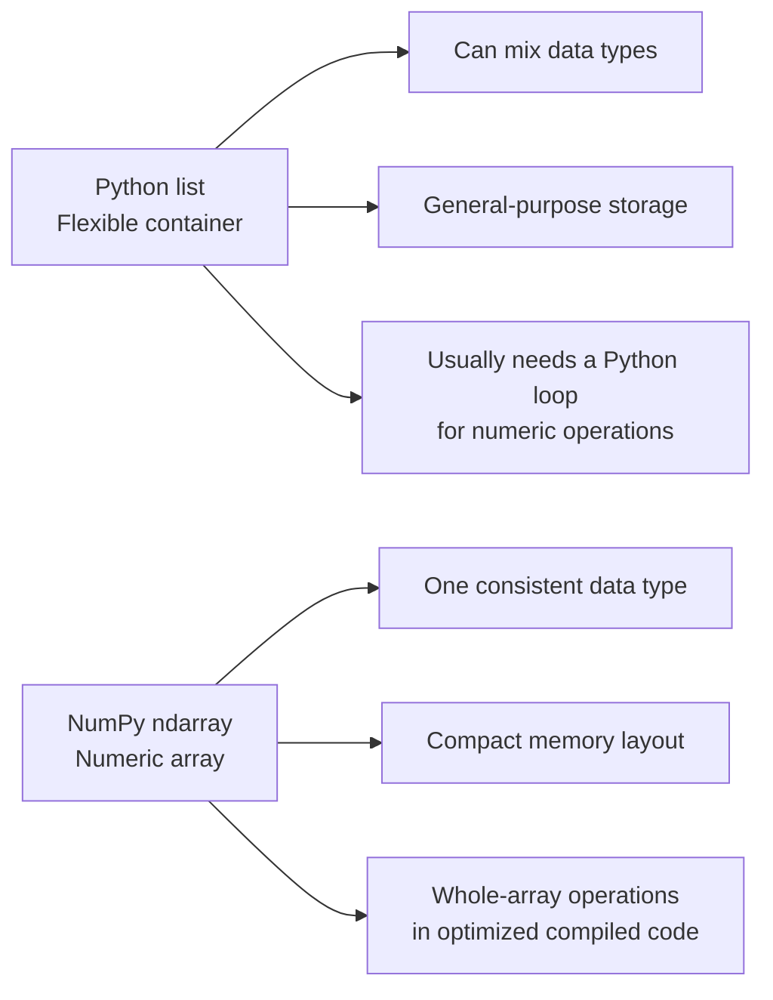
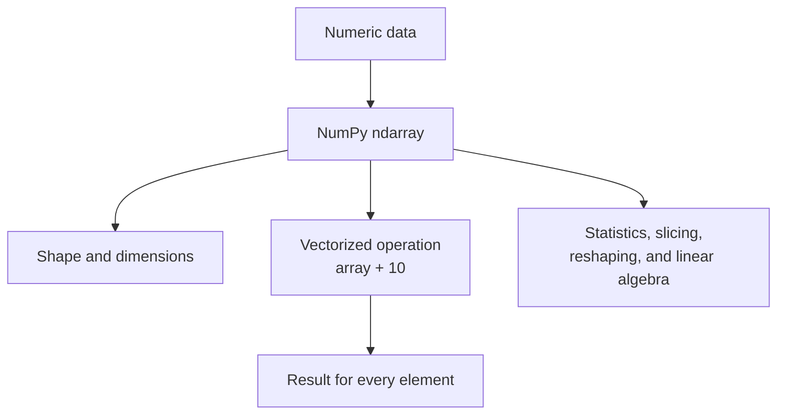

# Learn NumPy in 40 Minutes - Complete Tutorial Notes (Lossless)

**Video Reference:** Learn NumPy in 40 Minutes - Python NumPy Tutorial (Tech With Tim)
**Source:** https://www.youtube.com/watch?v=zI5ducyfyNc

These notes capture the complete start-to-finish concepts, commands, and code demonstrated in the tutorial.

- [Overview & Introduction](#overview-introduction)
- [Setup & Install](#setup-install)
- [What is NumPy?](#what-is-numpy)
- [Why Use NumPy? (NumPy vs. Python Lists)](#why-use-numpy-numpy-vs-python-lists)
- [Creating NumPy Arrays](#creating-numpy-arrays)
- [NumPy Data Types](#numpy-data-types)
- [Multi-Dimensional Arrays](#multi-dimensional-arrays)
- [Array Attributes](#array-attributes)
- [Indexing & Slicing](#indexing-slicing)
- [Boolean Indexing](#boolean-indexing)
- [Array Operations](#array-operations)
- [Scalar and Comparison Operations](#scalar-and-comparison-operations)
- [Array Manipulation](#array-manipulation)
- [Combining Arrays with `vstack` and `hstack`](#combining-arrays-with-vstack-and-hstack)
- [Dimensions and Axis](#dimensions-and-axis)
- [Statistical Operations](#statistical-operations)
- [Linear Algebra](#linear-algebra)
- [Sorting, Filtering, and Column Stacking](#sorting-filtering-and-column-stacking)
- [Useful Array Methods](#useful-array-methods)
- [Practical Examples (Image Manipulation & Data Analysis)](#practical-examples-image-manipulation-data-analysis)

---

## Overview & Introduction

- **Target Audience:** Anyone learning data science, AI, machine learning, or scientific computing.
- **What NumPy is:** NumPy, short for **Numerical Python**, is a Python library for working with numbers. Its main object is called an `ndarray`, which is an array that can hold numbers in one or more dimensions. A 1D array is like a list of measurements, a 2D array is like a table, and a 3D array can represent data such as an image or a group of tables.
- **Why NumPy matters:** Python lists are useful general-purpose containers, but they are not designed for large-scale math. NumPy arrays store values of the same type in a compact layout, which helps NumPy perform calculations quickly.
- **Why it is useful compared with regular Python lists:** With a list, adding 10 to every value usually requires a loop: `[x + 10 for x in my_list]`. With NumPy, you can write `my_array + 10`, and NumPy adds 10 to every element. NumPy also provides convenient tools for filtering, slicing, reshaping, calculating statistics, doing linear algebra, and generating random numbers.
- **The tradeoff:** NumPy is best when you have many numeric values and need to perform calculations on them. Python lists are still a good choice for small collections, mixed types, or data that changes size often.
- **Ecosystem:** NumPy is one of the building blocks of Python's data-science ecosystem. Libraries such as Pandas, SciPy, scikit-learn, TensorFlow, and PyTorch use NumPy arrays or similar array-based ideas.

### Python Lists vs. NumPy Arrays



### How NumPy Processes Data



### Quick Comparison: Python Lists vs. NumPy Arrays

| Task                     | Regular Python list              | NumPy array           | Why NumPy helps                                                |
| ------------------------ | -------------------------------- | --------------------- | -------------------------------------------------------------- |
| Add 10 to every value    | `[x + 10 for x in values]`       | `array + 10`          | No explicit loop is needed.                                    |
| Multiply matching values | `[x * y for x, y in zip(a, b)]`  | `a * b`               | Element-wise arithmetic is built in.                           |
| Keep values above 90     | `[x for x in values if x > 90]`  | `array[array > 90]`   | Boolean masking works directly on the array.                   |
| Calculate an average     | `sum(values) / len(values)`      | `np.mean(array)`      | Clear, optimized statistical functions are available.          |
| Work with a matrix       | Nested lists and manual indexing | `matrix[row, column]` | Multidimensional data has a natural shape and indexing system. |

```python
import numpy as np

python_values = [10, 20, 30, 40]
numpy_values = np.array(python_values)

# Add 5 to every value
list_result = [value + 5 for value in python_values]
array_result = numpy_values + 5

# Filter values greater than 20
list_filtered = [value for value in python_values if value > 20]
array_filtered = numpy_values[numpy_values > 20]

print(list_result)     # [15, 25, 35, 45]
print(array_result)    # [15 25 35 45]
print(list_filtered)   # [30, 40]
print(array_filtered)  # [30 40]
```

## Setup & Install

- **Installation:** Run this in your terminal to install NumPy globally or in your virtual environment:
  - Windows: `pip install numpy`
  - Mac/Linux: `pip3 install numpy`
- **Development Environment:** The tutorial recommends using **Jupyter Notebooks** (file extension `.ipynb`). Jupyter allows you to mix Markdown (text) and Code blocks, running Python in chunks and displaying output directly underneath.
  - In VS Code, Cursor, or Windsurf: Open Command Palette (Ctrl/Cmd + Shift + P), type "Jupyter", and select "Create New Jupyter Notebook".

## What is NumPy?

- Stands for **Numerical Python**.
- Provides robust support for multi-dimensional arrays and matrices.
- Includes a massive collection of high-level mathematical functions to operate on these arrays.
- **Speed:** The underlying mathematical operations are written in C and C++, making it significantly faster than pure Python code.

## Why Use NumPy? (NumPy vs. Python Lists)

NumPy arrays are vastly superior to Python lists for numerical operations, both in functionality and performance.

- **Import Convention:** Always import NumPy using the alias `np`:
  ```python
  import numpy as np
  ```
- **Memory & Performance:** NumPy stores data in contiguous blocks of memory and uses C-level optimizations.
- **Vectorized Operations:** NumPy allows you to apply an operation to an entire array without explicit `for` loops.
  - _Python List way:_ `[x + 10 for x in my_list]`
  - _NumPy way:_ `my_array + 10`
- **Speed Test Example:** Adding 1 to every element in a 1-million element list vs. a 1-million element NumPy array often shows a large NumPy performance advantage, especially for repeated numerical operations.

```python
import time
import numpy as np

size = 1_000_000
python_values = list(range(size))
numpy_values = np.array(python_values)

# Time the Python list operation
start_time = time.time()
list_result = [value + 1 for value in python_values]
list_time = time.time() - start_time

# Time the NumPy vectorized operation
start_time = time.time()
array_result = numpy_values + 1
numpy_time = time.time() - start_time

print(f"Python list: {list_time:.6f} seconds")
print(f"NumPy array: {numpy_time:.6f} seconds")
print(f"NumPy speedup: {list_time / numpy_time:.2f}x")
```

Both operations produce the same values, but the NumPy version can be faster because the element-by-element loop runs in optimized compiled code instead of being managed by Python. Timing results depend on the computer and workload, so this example demonstrates a general performance pattern rather than a guaranteed fixed speedup.

_sample output_:

```
Python list: 0.013655 seconds
NumPy array: 0.000996 seconds
NumPy speedup: 13.71x
```

### What Is a Vectorized Operation?

A **vectorized operation** applies one calculation to every element in an entire NumPy array at once, without writing the loop yourself. For example, `array + 10` adds 10 to each value in the array. NumPy still performs the individual calculations, but the looping happens inside optimized compiled code rather than in the Python interpreter.

```python
# Python list: the loop runs at the Python level
list_result = [value + 10 for value in python_values]

# NumPy array: one vectorized operation handles every element
array_result = numpy_values + 10
```

Vectorization makes NumPy useful and often faster because it:

- **Reduces Python overhead:** Python does not repeatedly manage each loop iteration, function call, and type check.
- **Uses optimized compiled code:** NumPy's numerical loops are implemented in low-level code designed for array calculations.
- **Works efficiently with typed data:** Every element has a known data type, so NumPy can process values without the flexibility overhead of a general-purpose Python list.
- **Expresses intent clearly:** `numpy_values + 10` directly communicates “add 10 to every value,” making numerical code shorter and easier to read.

Vectorization does not make every NumPy operation automatically faster. Its main advantage appears when applying numerical calculations to many values; for small collections or mixed data, a regular Python list may still be the better choice.

## Creating NumPy Arrays

The core object in NumPy is the `ndarray` (n-dimensional array).

**Why NumPy Arrays Usually Cannot Mix Data Types**

NumPy arrays are designed to store numerical data efficiently, so every element in a regular array uses one shared data type, such as `int32`, `float64`, or `bool`. This is called a **homogeneous** array. Because NumPy knows the type and size of every element, it can store values compactly next to one another in memory and apply the same optimized operation to all of them without checking each value's type separately.

When values with different compatible types are used to create an array, NumPy converts them to one common type. For example, integers and decimals become a floating-point array so that no decimal information is lost:

```python
arr = np.array([1, 2.5, 3])
print(arr)       # [1.  2.5 3. ]
print(arr.dtype) # float64 (typically)
```

This design is different from a Python list, which can store an integer, string, and Boolean value together. A NumPy array can be created with `dtype=object` to hold mixed Python objects, but that gives up much of NumPy's memory efficiency and numerical speed. For numerical work, keeping one data type is what makes array operations fast and predictable.

- **From a List:**
  ```python
  python_list = [1, 2, 3, 4, 5]
  my_array = np.array(python_list)
  print(my_array) # Output: [1 2 3 4 5]  (Notice no commas!)
  ```
- **Built-in Creation Methods:**
  - `np.zeros(5)` -> creates an array of 5 zeros.
    - **Function signature:** `np.zeros(shape, dtype=float)` takes the array shape first; `dtype` is optional and controls the data type.
    - **Output:** `[0. 0. 0. 0. 0.]`
  - `np.ones((2, 3))` -> creates a 2x3 matrix of ones.
    - **Function signature:** `np.ones(shape, dtype=float)` takes the dimensions as a number or tuple; `dtype` is optional.
    - **Output:** `[[1. 1. 1.] [1. 1. 1.]]`
  - `np.arange(0, 10, 2)` -> starts at 0, ends before 10, step by 2. Result: `[0, 2, 4, 6, 8]`.
    - **Function signature:** `np.arange(start, stop, step)` starts at `start`, stops before `stop`, and moves by `step`; `stop` is required, while `start` defaults to 0 and `step` defaults to 1 when omitted.
    - **Output:** `[0 2 4 6 8]`
    - **Shortcut:** `np.arange(5)` is the same as `np.arange(0, 5, 1)`, so it generates integers from 0 up to, but not including, 5.
      - **Output:** `[0 1 2 3 4]`
  - `np.linspace(0, 10, 5)` -> generates 5 evenly spaced numbers between 0 and 10.
    - **Function signature:** `np.linspace(start, stop, num=50)` starts at `start`, ends at `stop` by default, and creates `num` evenly spaced values; `num` defaults to 50.
    - **Output:** `[0.  2.5 5.  7.5 10. ]`
  - `np.full((2, 3), 7)` -> creates a 2x3 array where every value is 7.
    - **Function signature:** `np.full(shape, fill_value, dtype=None)` takes the array shape and the value to repeat; `dtype` is optional.
    - **Output:** `[[7 7 7] [7 7 7]]`
  - `np.eye(3)` -> creates a 3x3 identity matrix with 1s on the main diagonal and 0s elsewhere.
    - **Function signature:** `np.eye(N, M=None, k=0, dtype=float)` uses `N` rows, optionally `M` columns, and places 1s on diagonal `k`; `k=0` means the main diagonal.
    - **Output:** `[[1. 0. 0.] [0. 1. 0.] [0. 0. 1.]]`
  - `np.random.rand(2, 3)` -> creates a 2x3 array of random decimal values from 0 up to, but not including, 1.
    - **Function signature:** `np.random.rand(d0, d1, ...)` takes one size argument for each dimension; the arguments describe the shape, not a range of values.
    - **Example output:** `[[0.42 0.87 0.15] [0.63 0.09 0.74]]` (values will vary each run)
  - `np.random.randint(1, 10, size=5)` -> creates five random integers from 1 up to, but not including, 10.
    - **Function signature:** `np.random.randint(low, high=None, size=None, dtype=int)` chooses integers from `low` to before `high`; if `high` is omitted, the range is 0 to `low`, and `size` controls the output shape.
    - **Example output:** `[4 9 2 7 1]` (values will vary each run)

## NumPy Data Types

Unlike standard Python lists, which can hold mixed data types, NumPy arrays are strictly homogeneous (all items must be the same data type) for maximum memory efficiency.

- Common types: `int32`, `int64`, `float32`, `float64`, `bool`.
- Specifying a type on creation:
  ```python
  arr = np.array([1, 2, 3], dtype='float32')
  ```
- Checking the type: `arr.dtype`

### How NumPy Infers Types

When `dtype` is not provided, NumPy examines the values used to create the array and chooses a suitable common data type. Whole numbers are usually inferred as an integer type, decimal values as a floating-point type, and `True` or `False` as Boolean values.

```python
integers = np.array([1, 2, 3])
decimals = np.array([1.5, 2.5, 3.5])
flags = np.array([True, False, True])

print(integers.dtype)  # int64 (typically)
print(decimals.dtype)  # float64 (typically)
print(flags.dtype)     # bool
```

NumPy also looks at all values together. If the values do not initially have the same type, it chooses one type that can represent them all safely. For example, an array containing integers and floats becomes a floating-point array so the decimal part is preserved.

### How Integers and Floats Are Promoted

**Type promotion** is NumPy's automatic process of converting values to a common data type before performing an operation. When an integer and a float are used together, the integer is promoted to a float because a floating-point type can represent both whole numbers and decimal numbers.

```python
integers = np.array([1, 2, 3], dtype=np.int32)
decimals = np.array([0.5, 1.5, 2.5], dtype=np.float64)

result = integers + decimals

print(result)       # [1.5 3.5 5.5]
print(result.dtype) # float64
```

The same idea applies when creating an array from mixed numeric values:

```python
mixed = np.array([1, 2.5, 3])
print(mixed)       # [1.  2.5 3. ]
print(mixed.dtype) # float64 (typically)
```

Promotion prevents NumPy from losing information. Converting `1` to `1.0` is safe, but converting `2.5` to an integer would discard its decimal part. The exact promoted type can depend on the input dtypes and the platform, so use an explicit `dtype` when a particular precision or memory size is required.

### Converting an Array After Creation

Use `.astype()` to create a copy of an existing array with a different data type. The original array is unchanged unless you assign the converted result back to the same variable.

```python
values = np.array([1.2, 2.8, 3.5])
integers = values.astype(int)

print(integers)       # [1 2 3]
print(values)        # [1.2 2.8 3.5]
print(integers.dtype) # int64 (typically)
```

Converting floats to integers removes the decimal part; it does not round to the nearest integer. Converting integers to floats usually preserves their numerical values, but may use more memory. Choose the target type carefully because a conversion can lose information.

## Multi-Dimensional Arrays

Arrays can have multiple dimensions (e.g., 2D matrices, 3D tensors).

- **Creating a 2D Array (Matrix):** Pass a list of lists to `np.array()`.
  ```python
  matrix = np.array([[1, 2, 3], [4, 5, 6]])
  print(matrix)
  ```
  **Output:**
  ```text
  [[1 2 3]
   [4 5 6]]
  ```
  This creates a matrix with 2 rows and 3 columns.

### Creating a 3D Array

A 3D array can be viewed as a stack of 2D matrices. Its shape is written as `(depth, rows, columns)`. In this example, there are 2 matrices, each with 2 rows and 3 columns, so the shape is `(2, 2, 3)`.

```python
cube = np.array([
    [[1, 2, 3], [4, 5, 6]],
    [[7, 8, 9], [10, 11, 12]]
])

print(cube.shape)
print(cube)
```

**Output:**

```text
(2, 2, 3)
[[[ 1  2  3]
  [ 4  5  6]]

 [[ 7  8  9]
  [10 11 12]]]
```

### Specifying Dimensions in Array-Creation Functions

For most array-creation functions, provide the dimensions as a tuple. For example, `(2, 3, 4)` means 2 layers, 3 rows per layer, and 4 columns per row.

| Function   | Example                 | Resulting shape |
| ---------- | ----------------------- | --------------- |
| `np.zeros` | `np.zeros((2, 3, 4))`   | `(2, 3, 4)`     |
| `np.ones`  | `np.ones((2, 3, 4))`    | `(2, 3, 4)`     |
| `np.full`  | `np.full((2, 3, 4), 7)` | `(2, 3, 4)`     |
| `np.eye`   | `np.eye(3)`             | `(3, 3)`        |

`np.zeros`, `np.ones`, and `np.full` can create arrays with any number of dimensions by passing a shape tuple. `np.eye` creates a 2D identity matrix, so its dimensions are specified as the number of rows and, optionally, the number of columns: `np.eye(2, 3)` creates a `(2, 3)` matrix. It does not create a 3D identity array.

## Array Attributes

Every NumPy array comes with built-in attributes that describe its shape and size.

- `arr.shape`: Returns a tuple showing the dimensions (e.g., `(2, 3)` for 2 rows, 3 columns). **Output:** `(2, 3)`
- `arr.size`: Total number of elements in the array (e.g., 6). **Output:** `6`
- `arr.ndim`: The number of dimensions (e.g., 2). **Output:** `2`

```python
arr = np.array([[1, 2, 3], [4, 5, 6]])

print(arr.shape)
print(arr.size)
print(arr.ndim)
```

**Output:**

```text
(2, 3)
6
2
```

### Advanced Array Attributes

- `arr.itemsize`: The number of bytes used by one element. For an `int64` array, this is usually `8` bytes.
- `arr.nbytes`: The total memory used by the array's elements. It is calculated as `size * itemsize`.
- `arr.T`: The transpose of the array, which swaps its rows and columns.

```python
arr = np.array([[1, 2, 3], [4, 5, 6]], dtype=np.int64)

print(arr.itemsize)
print(arr.nbytes)
print(arr.T)
```

**Output:**

```text
8
48
[[1 4]
 [2 5]
 [3 6]]
```

## Indexing & Slicing

Accessing elements in NumPy is highly flexible and similar to Python lists, but extended for multiple dimensions.

- **1D Arrays:**
  - `arr[0]` -> first element. **Output:** `10`
  - `arr[1:4]` -> slice from index 1 up to (but not including) 4. **Output:** `[20 30 40]`
- **2D Arrays:** Access using `[row, column]`.
  - `matrix[0, 2]` -> Gets the item at row index 0, column index 2. **Output:** `3`
  - `matrix[:, 1]` -> Gets all rows for column index 1 (extracts a whole column). **Output:** `[2 5]`
  - `matrix[0:2, 1:3]` -> Extracts a sub-matrix. **Output:** `[[2 3] [5 6]]`

```python
arr = np.array([10, 20, 30, 40, 50])
matrix = np.array([[1, 2, 3], [4, 5, 6]])

print(arr[0])
print(arr[1:4])
print(matrix[0, 2])
print(matrix[:, 1])
print(matrix[0:2, 1:3])
```

**Output:**

```text
10
[20 30 40]
3
[2 5]
[[2 3]
 [5 6]]
```

### NumPy Cell Access vs. Python Lists

When accessing one cell in a nested Python list, use a separate pair of brackets for each dimension. NumPy uses one pair of brackets and separates the indices with commas. The indices still mean the same thing: for a 2D array, the order is `[row, column]`; for a 3D array, it is `[layer, row, column]`.

| Dimensions | Python list access   | NumPy array access  | Output |
| ---------- | -------------------- | ------------------- | ------ |
| 1D         | `python_1d[2]`       | `numpy_1d[2]`       | `30`   |
| 2D         | `python_2d[1][2]`    | `numpy_2d[1, 2]`    | `6`    |
| 3D         | `python_3d[1][0][2]` | `numpy_3d[1, 0, 2]` | `9`    |

```python
python_1d = [10, 20, 30]
numpy_1d = np.array(python_1d)

python_2d = [[1, 2, 3], [4, 5, 6]]
numpy_2d = np.array(python_2d)

python_3d = [
  [[1, 2, 3], [4, 5, 6]],
  [[7, 8, 9], [10, 11, 12]]
]
numpy_3d = np.array(python_3d)

print(python_1d[2], numpy_1d[2])
print(python_2d[1][2], numpy_2d[1, 2])
print(python_3d[1][0][2], numpy_3d[1, 0, 2])
```

**Output:**

```text
30 30
6 6
9 9
```

### Selecting Complete Rows and Columns

For a 2D NumPy array, use `:` to mean “all values” along an axis:

- `matrix[0, :]` selects row 0 and all of its columns.
- `matrix[:, 1]` selects column 1 and all of its rows.
- `matrix[0, 1:3]` selects columns 1 through 2 from row 0, which is a slice of a row.
- `matrix[0:2, 1]` selects rows 0 through 1 from column 1, which is a slice of a column.

```python
matrix = np.array([[1, 2, 3], [4, 5, 6]])

first_row = matrix[0, :]
second_column = matrix[:, 1]
row_slice = matrix[0, 1:3]
column_slice = matrix[0:2, 1]

print(first_row)
print(second_column)
print(row_slice)
print(column_slice)
```

**Output:**

```text
[1 2 3]
[2 5]
[2 3]
[2 5]
```

The same expressions can be written as `matrix[0]` for a complete row and `matrix[:, 1]` for a complete column. The comma is important for column access because it separates the row selector from the column selector.

### Selecting a Submatrix

To select a rectangular section of a 2D array, use a row slice and a column slice separated by a comma:
`matrix[row_start:row_stop, column_start:column_stop]`. Both stop indices are excluded, just like regular Python slicing.

```python
matrix = np.array([
  [1, 2, 3, 4],
  [5, 6, 7, 8],
  [9, 10, 11, 12]
])

submatrix = matrix[0:2, 1:3]
print(submatrix)
```

Here, `0:2` selects rows 0 and 1, while `1:3` selects columns 1 and 2.

**Output:**

```text
[[2 3]
 [6 7]]
```

## Boolean Indexing

Boolean indexing uses an array of `True` and `False` values, called a **Boolean mask**, to filter another NumPy array. A comparison such as `arr > 3` creates the mask: positions containing `True` are selected, and positions containing `False` are ignored.

### Boolean Indexing with a 1D Array

```python
arr = np.array([10, 15, 20, 25, 30])
mask = arr > 20

print(mask)
print(arr[mask])
```

**Output:**

```text
[False False False  True  True]
[25 30]
```

You can write the comparison directly inside the brackets: `arr[arr > 20]`.

### Boolean Indexing with a 2D Array

For a 2D array, a comparison creates a mask with the same shape. Applying that mask returns all matching values as a 1D result.

```python
matrix = np.array([[1, 6, 3], [8, 2, 9]])
mask = matrix > 5

print(mask)
print(matrix[mask])
```

**Output:**

```text
[[False  True False]
 [ True False  True]]
[6 8 9]
```

To keep complete rows instead of individual matching cells, reduce the mask across the columns. For example, `np.all(matrix > 5, axis=1)` finds rows where every value is greater than 5.

```python
row_mask = np.all(matrix > 5, axis=1)
print(row_mask)
print(matrix[row_mask])
```

**Output:**

```text
[False False]
[]
```

### Boolean Indexing with a 3D Array

The same rule works for higher-dimensional arrays. A 3D mask has the same 3D shape as the original array, and applying it returns the matching values in a 1D result.

```python
cube = np.array([
  [[1, 2], [3, 4]],
  [[5, 6], [7, 8]]
])

even_values = cube[cube % 2 == 0]
print(even_values)
```

**Output:**

```text
[2 4 6 8]
```

Boolean masks can also be combined. Use `&` for “and” and `|` for “or,” and put each comparison in parentheses:

```python
arr = np.array([5, 12, 18, 25, 30])
selected = arr[(arr >= 10) & (arr <= 25)]
print(selected)
```

**Output:**

```text
[12 18 25]
```

## Array Operations

You can perform **element-wise arithmetic** simply by using standard Python math operators.

```python
a = np.array([1, 2, 3])
b = np.array([4, 5, 6])

print(a + b)  # [5, 7, 9]
print(b - a)  # [3, 3, 3]
print(a * b)  # [4, 10, 18]
print(b / a)  # [4.  2.5 2. ]
print(a ** 2) # [1, 4, 9]
print(np.sqrt(a)) # [1.         1.41421356 1.73205081]
```

**Output:**

```text
[5 7 9]
[3 3 3]
[ 4 10 18]
[4.  2.5 2. ]
[1 4 9]
[1.         1.41421356 1.73205081]
```

## Scalar and Comparison Operations

A **scalar** is one single value, such as `10`. NumPy automatically applies a scalar operation to every element in an array:

```python
arr = np.array([1, 2, 3])

print(arr + 10)  # [11 12 13]
print(arr * 2)   # [2 4 6]
```

Comparison operations check each element and return a Boolean array. This Boolean array can be used as a mask to keep only matching values:

```python
print(arr > 1)       # [False  True  True]
print(arr[arr > 1])  # [2 3]
```

## Array Manipulation

Reshaping changes how an array is arranged without changing the values themselves. **_The new shape must contain the same total number of elements as the original array_**.

### Basic Reshape

This array has 6 values, so its new dimensions must multiply to 6:

```python
arr = np.arange(1, 7)
new_arr = arr.reshape((2, 3))
print(new_arr)
```

**Output:**

```text
[[1 2 3]
 [4 5 6]]
```

The values are placed from left to right, then continue on the next row. The default order is row-major order, sometimes described as “fill each row before moving to the next row.”

### Let NumPy Calculate an Unknown Dimension

Use `-1` when you know one dimension but do not know the other. NumPy calculates the missing dimension from the number of values:

```python
arr = np.arange(1, 13)  # 12 values

three_rows = arr.reshape(3, -1)
four_columns = arr.reshape(-1, 4)

print(three_rows.shape)
print(three_rows)
print(four_columns.shape)
print(four_columns)
```

**Output:**

```text
(3, 4)
[[ 1  2  3  4]
 [ 5  6  7  8]
 [ 9 10 11 12]]
(3, 4)
[[ 1  2  3  4]
 [ 5  6  7  8]
 [ 9 10 11 12]]
```

For example, `arr.reshape(3, -1)` means “make 3 rows and calculate the number of columns.” Since there are 12 values, NumPy calculates `12 / 3 = 4` columns. Similarly, `arr.reshape(-1, 4)` asks NumPy to calculate the number of rows.

### Reshape Gotchas

- You can use `-1` only once. NumPy cannot infer two unknown dimensions.
- The known dimension must divide evenly into the total number of values. For example, 12 values cannot be reshaped to `(5, -1)` because 12 is not evenly divisible by 5.
- You cannot change the number of values. Reshaping 6 values to `(2, 4)` raises an error because that shape requires 8 values.
- Reshaping does not sort or rearrange the values; it only changes how they are grouped.

```python
arr = np.arange(1, 13)

try:
    arr.reshape(5, -1)
except ValueError as error:
    print(error)
```

**Output:**

```text
cannot reshape array of size 12 into shape (5,newaxis)
```

- **Flatten:** `arr.flatten()` converts a multi-dimensional array back into 1D.

```python
matrix = np.array([[1, 2, 3], [4, 5, 6]])
print(matrix.flatten())
```

**Output:** `[1 2 3 4 5 6]`

## Combining Arrays with `vstack` and `hstack`

Stacking means joining smaller arrays to make one larger array:

- **`np.vstack()`** means **vertical stack**. It places arrays on top of one another, adding more rows.
- **`np.hstack()`** means **horizontal stack**. It places arrays beside one another, adding more columns.

### Vertical Stack: `np.vstack()`

The arrays must have the same number of columns:

```python
top = np.array([[1, 2], [3, 4]])
bottom = np.array([[5, 6], [7, 8]])

vertical = np.vstack((top, bottom))
print(vertical)
```

**Output:**

```text
[[1 2]
 [3 4]
 [5 6]
 [7 8]]
```

The shape changes from `(2, 2)` and `(2, 2)` to `(4, 2)` because rows were added.

### Horizontal Stack: `np.hstack()`

The arrays must have the same number of rows:

```python
left = np.array([[1, 2], [3, 4]])
right = np.array([[5, 6], [7, 8]])

horizontal = np.hstack((left, right))
print(horizontal)
```

**Output:**

```text
[[1 2 5 6]
 [3 4 7 8]]
```

The shape changes from `(2, 2)` and `(2, 2)` to `(2, 4)` because columns were added.

### Which Different Shapes Work?

The dimensions that do **not** grow must match:

- `vstack`: the column counts must match, but the row counts can be different.
- `hstack`: the row counts must match, but the column counts can be different.

#### `vstack` with Different Row Counts: Works

```python
first = np.array([[1, 2], [3, 4]])       # shape (2, 2)
second = np.array([[5, 6]])              # shape (1, 2)

result = np.vstack((first, second))
print(result)
print(result.shape)
```

**Output:**

```text
[[1 2]
 [3 4]
 [5 6]]
(3, 2)
```

This works because both arrays have 2 columns. Their row counts, 2 and 1, are allowed to be different.

#### `hstack` with Different Column Counts: Works

```python
left = np.array([[1, 2], [3, 4]])         # shape (2, 2)
right = np.array([[5], [6]])              # shape (2, 1)

result = np.hstack((left, right))
print(result)
print(result.shape)
```

**Output:**

```text
[[1 2 5]
 [3 4 6]]
(2, 3)
```

This works because both arrays have 2 rows. Their column counts, 2 and 1, are allowed to be different.

#### `vstack` with Different Column Counts: Does Not Work

```python
first = np.array([[1, 2], [3, 4]])       # shape (2, 2)
second = np.array([[5, 6, 7]])           # shape (1, 3)

try:
  np.vstack((first, second))
except ValueError as error:
  print(error)
```

**Output:**

```text
all the input array dimensions except for the concatenation axis must match exactly, but along dimension 1, the array at index 0 has size 2 and the array at index 1 has size 3
```

This fails because the arrays have different numbers of columns: 2 and 3.

#### `hstack` with Different Row Counts: Does Not Work

```python
left = np.array([[1, 2], [3, 4]])         # shape (2, 2)
right = np.array([[5, 6, 7]])             # shape (1, 3)

try:
  np.hstack((left, right))
except ValueError as error:
  print(error)
```

**Output:**

```text
all the input array dimensions except for the concatenation axis must match exactly, but along dimension 0, the array at index 0 has size 2 and the array at index 1 has size 1
```

This fails because the arrays have different numbers of rows: 2 and 1.

## Dimensions and Axis

### The Easiest Way to Think About `axis`

An **axis** is simply a direction in an array. For a 2D array, imagine a table:

- **Axis 0** points downward through the rows.
- **Axis 1** points across the columns.

This is the same direction idea used by stacking:

- `np.vstack()` joins arrays along **axis 0**, so it adds rows from top to bottom.
- `np.hstack()` joins arrays along **axis 1**, so it adds columns from left to right.

For calculations, the axis tells NumPy which direction to combine:

- `sum(axis=0)` combines values down the rows and gives one result for each column.
- `sum(axis=1)` combines values across the columns and gives one result for each row.

```python
scores = np.array([[10, 20, 30], [40, 50, 60]])
vertical = np.vstack((scores, scores))
horizontal = np.hstack((scores, scores))

print(vertical)                          # rows were added
print(vertical.shape)                    # (4, 3)
print(horizontal)                        # columns were added
print(horizontal.shape)                  # (2, 6)
print(scores.sum(axis=0))                 # [50 70 90]: one sum per column
print(scores.sum(axis=1))                 # [60 150]: one sum per row
```

**Output:**

```text
[[10 20 30]
 [40 50 60]
 [10 20 30]
 [40 50 60]]
(4, 3)
[[10 20 30 10 20 30]
 [40 50 60 40 50 60]]
(2, 6)
[50 70 90]
[ 60 150]
```

| Operation     | Direction      | What it does               |
| ------------- | -------------- | -------------------------- |
| `vstack`      | `axis=0`       | Adds rows vertically.      |
| `hstack`      | `axis=1`       | Adds columns horizontally. |
| `sum(axis=0)` | Down rows      | Combines each column.      |
| `sum(axis=1)` | Across columns | Combines each row.         |

The most useful question to ask is: **“Which direction am I moving through or combining?”**

An array's **dimensions** describe how its data is organized:

- A 1D array is a single line of values, such as `[10, 20, 30]`.
- A 2D array has rows and columns, like a table.
- A 3D array is a stack of 2D tables or matrices.

The `axis` argument tells NumPy **which direction to work along** when calculating a sum, mean, minimum, or another aggregate. A useful beginner rule is: the axis you choose is the direction that gets combined, and the other direction remains in the result.

Consider this 2D array:

```python
scores = np.array([
  [10, 20, 30],
  [40, 50, 60]
])
```

It has 2 rows and 3 columns:

```text
     column 0  column 1  column 2
row 0     10        20        30
row 1     40        50        60
```

### `axis=0`: Work Down the Rows

With `axis=0`, NumPy moves **downward** through the rows and combines values in each column. The result contains one value per column:

```python
print(scores.sum(axis=0))
print(scores.mean(axis=0))
```

**Output:**

```text
[50 70 90]
[25. 35. 45.]
```

For example, the first output value is `10 + 40 = 50`, the second is `20 + 50 = 70`, and the third is `30 + 60 = 90`.

### `axis=1`: Work Across the Columns

With `axis=1`, NumPy moves **across** each row and combines the values in that row. The result contains one value per row:

```python
print(scores.sum(axis=1))
print(scores.mean(axis=1))
```

**Output:**

```text
[ 60 150]
[20. 50.]
```

The first row sums to `10 + 20 + 30 = 60`, and the second row sums to `40 + 50 + 60 = 150`.

### A Simple Memory Trick

Think of `axis=0` as **“collapse the rows i.e move down rows”** and `axis=1` as **“collapse the columns i.e move across columns"**. The dimension you collapse disappears from the result:

- Shape `(2, 3)` with `axis=0` becomes shape `(3,)`, one result for each column.
- Shape `(2, 3)` with `axis=1` becomes shape `(2,)`, one result for each row.

For a 3D array, the same idea continues: `axis=0` combines across layers, `axis=1` combines across rows within each layer, and `axis=2` combines across columns within each row.

## Statistical Operations

NumPy has incredible built-in stats functions.

- `np.mean(arr)` -> calculates the average. **Output:** `3.0`
- `np.median(arr)` -> finds the middle value after sorting. **Output:** `3.0`
- `np.std(arr)` -> calculates the standard deviation, which describes how spread out the values are. **Output:** `1.41421356...`
- `np.var(arr)` -> calculates the variance, another measure of how spread out the values are. **Output:** `2.0`
- `np.min(arr)` / `np.max(arr)` -> return the smallest and largest values. **Output:** `1` and `5`

| Measure            | Simple meaning                         | Units          | Example    |
| ------------------ | -------------------------------------- | -------------- | ---------- |
| Variance           | Average squared distance from the mean | Squared units  | `2.0`      |
| Standard deviation | Typical distance from the mean         | Original units | `1.414...` |

In short: **variance measures spread mathematically; standard deviation expresses that spread more understandably.**

```python
arr = np.array([1, 2, 3, 4, 5])

print(np.mean(arr))
print(np.median(arr))
print(np.std(arr))
print(np.min(arr))
print(np.max(arr))
```

**Output:**

```text
3.0
3.0
1.4142135623730951
1
5
```

> **Simple idea:** Standard deviation and variance both describe how far values tend to be from the average. Variance squares those distances, so its units are squared. Standard deviation is the square root of variance, which puts the result back in the original units and is often easier to understand.

```python
arr = np.array([1, 2, 3, 4, 5])

print(np.var(arr))  # 2.0
print(np.std(arr))  # 1.41421356...
```

For this array, the average is `3`. The values are close to that average, so the spread is relatively small. A standard deviation of about `1.41` means a typical distance from the average is roughly 1.41 units. The variance is `2`, which is the squared version of that spread: `1.41421356... ** 2 = 2`.

### A Simple Calculation

For `arr = [1, 2, 3, 4, 5]`, the mean is `3`:

1. Distances from the mean: `[-2, -1, 0, 1, 2]`
2. Squared distances: `[4, 1, 0, 1, 4]`
3. Variance: `(4 + 1 + 0 + 1 + 4) / 5 = 2`
4. Standard deviation: `sqrt(2) = 1.414...`

Squaring removes negative signs so distances do not cancel each other out. The square root at the end changes the variance back to the same units as the original data. That is why standard deviation is usually easier to explain: for these values, the typical distance from the mean is about `1.41`.

### Statistics with an Axis

For a 2D array, `axis=0` calculates one result for each column, while `axis=1` calculates one result for each row:

```python
scores = np.array([
  [10, 20, 30],
  [40, 50, 60]
])

print(np.mean(scores, axis=0))  # mean of each column
print(np.mean(scores, axis=1))  # mean of each row
print(np.min(scores, axis=0))   # minimum of each column
print(np.max(scores, axis=1))   # maximum of each row
```

**Output:**

```text
[25. 35. 45.]
[20. 50.]
[10 20 30]
[30 60]
```

The same `axis=0` and `axis=1` idea can be used with `np.median`, `np.std`, and other aggregation functions.

## Linear Algebra

NumPy can perform true **matrix multiplication** (dot product) rather than just element-wise multiplication.

- Use `np.dot(matrix1, matrix2)` or the `@` operator: `matrix1 @ matrix2`.

```python
matrix1 = np.array([[1, 2], [3, 4]])
matrix2 = np.array([[5, 6], [7, 8]])

'''
Matrix 1:
1 2
3 4

Matrix 2:
5 6
7 8

Dot product (matrix multiplication):
Multiple corresponding elements of each row in 1st matrix with each column in 2nd matrix
...Start from 1st row of 1st matrix and multiple with all columns of 2nd matrix
...Start from 2nd row of 1st matrix and multiple with all columns of 2nd matrix, and so on
'''

dot_result = np.dot(matrix1, matrix2)
at_result = matrix1 @ matrix2
elementwise_result = matrix1 * matrix2

print(dot_result)
print(at_result)
print(elementwise_result)
```

**Output:**

```text
[[19 22]
 [43 50]]
[[19 22]
 [43 50]]
[[ 5 12]
 [21 32]]
```

`np.dot()` and `@` give the same matrix product. The `*` operator is different: it multiplies matching cells one by one. For example, the top-left matrix-product value is `(1 * 5) + (2 * 7) = 19`.

## Sorting, Filtering, and Column Stacking

### Sorting Values

`np.sort()` returns the values in ascending order without changing the original array:

```python
arr = np.array([30, 10, 20, 10])
sorted_arr = np.sort(arr)

print(sorted_arr)
print(arr)
```

**Output:**

```text
[10 10 20 30]
[30 10 20 10]
```

Use `arr.sort()` when you want to sort the original array in place.

### Finding Unique Elements

`np.unique()` removes repeated values and returns each different value once, in sorted order:

```python
arr = np.array([30, 10, 20, 10, 30])
print(np.unique(arr))
```

**Output:**

```text
[10 20 30]
```

### Using `np.where()`

The simplest form is `np.where(condition)`. It returns the indexes where the condition is `True`:

```python
arr = np.array([5, 12, 18, 25])
print(arr > 15)
print(np.where(arr > 15))
```

**Output:**

```text
[False False  True  True]
(array([2, 3]),)
```

The condition creates a Boolean mask: an array of `True` and `False` values with the same shape as the input. `True` means the condition is met; `False` means it is not.

With three arguments, `np.where(condition, value_if_true, value_if_false)` checks the condition for every element and chooses between two values:

```python
mask = arr > 15
result = np.where(mask, arr, 0)

print(mask)
print(result)
```

**Output:**

```text
[False False  True  True]
[ 0  0 18 25]
```

### Column Stacking with `np.column_stack()`

`np.column_stack()` combines 1D arrays as columns. It is useful when each 1D array represents one feature or field:

```python
ages = np.array([20, 25, 30])
scores = np.array([80, 90, 85])

columns = np.column_stack((ages, scores))
print(columns)
print(columns.shape)
```

**Output:**

```text
[[20 80]
 [25 90]
 [30 85]]
(3, 2)
```

Compared with the other stacking functions:

- `vstack` adds rows. Two 1D arrays become separate rows, with shape `(2, 3)`.
- `hstack` joins 1D arrays end to end into one long 1D array, with shape `(6,)`.
- `column_stack` turns the 1D arrays into columns, with shape `(3, 2)`.

```python
print(np.vstack((ages, scores)))
print(np.hstack((ages, scores)))
print(np.column_stack((ages, scores)))
```

**Output:**

```text
[[20 25 30]
 [80 90 85]]
[20 25 30 80 90 85]
[[20 80]
 [25 90]
 [30 85]]
```

## Useful Array Methods

- `np.argmax(arr)`: Returns the **index** of the maximum value in the array, rather than the value itself. Highly useful in machine learning to find the category with the highest probability.
- `np.argmin(arr)`: Returns the index of the minimum value.

```python
arr = np.array([12, 45, 7, 30])

print(np.argmax(arr))
print(np.argmin(arr))
```

**Output:**

```text
1
2
```

The maximum value is `45` at index 1, and the minimum value is `7` at index 2.

## Practical Examples (Image Manipulation & Data Analysis)

The video concludes with two powerful real-world applications showing off NumPy's speed and utility:

### 1. Image Manipulation (Brightness and Contrast)

Images are essentially multi-dimensional NumPy arrays of pixels.

- **Adding Brightness:** You can increase brightness by adding a number (e.g., 50) to the array.
- **Using `np.clip`:** When manipulating pixels, values must stay between 0 and 255.
  ```python
  # Adding 50 to brightness but clipping to a max of 255
  brighter_image = np.clip(image_array + 50, 0, 255)
  ```
  Example:
  ```python
  image_array = np.array([[100, 220], [240, 250]])
  brighter_image = np.clip(image_array + 50, 0, 255)
  print(brighter_image)
  ```
  **Output:**
  ```text
  [[150 255]
   [255 255]]
  ```
- **Adding Contrast:** Instead of adding, you multiply the array and clip it similarly.

### 2. Data Analysis (Student Test Scores)

Imagine a 2D array where each row is a student and each column is a test score.

- **Student Averages:** `np.mean(scores, axis=1)` gives the average score for each individual student.
- **Best Student Index:** `np.argmax(np.mean(scores, axis=1))` finds the index of the student with the highest average.
- **Test Statistics:** `np.mean(scores, axis=0)` gives the class average for each individual test.
- **Boolean Masking (Filtering):** Find all students who scored above 90 on all tests.

  ```python
  # Returns a boolean array indicating which students meet the criteria
  excellent_students_mask = np.all(scores > 90, axis=1)
  # Use the mask to get their actual scores
  excellent_scores = scores[excellent_students_mask]
  ```

  Example:

  ```python
  scores = np.array([
      [95, 92, 98],
      [88, 94, 91],
      [99, 97, 96]
  ])

  student_averages = np.mean(scores, axis=1)
  best_student_index = np.argmax(student_averages)
  test_averages = np.mean(scores, axis=0)
  excellent_students_mask = np.all(scores > 90, axis=1)
  excellent_scores = scores[excellent_students_mask]

  print(student_averages)
  print(best_student_index)
  print(test_averages)
  print(excellent_students_mask)
  print(excellent_scores)
  ```

  **Output:**

  ```text
  [95.         91.         97.33333333]
  2
  [94.         94.33333333 95.        ]
  [ True False  True]
  [[95 92 98]
   [99 97 96]]
  ```
