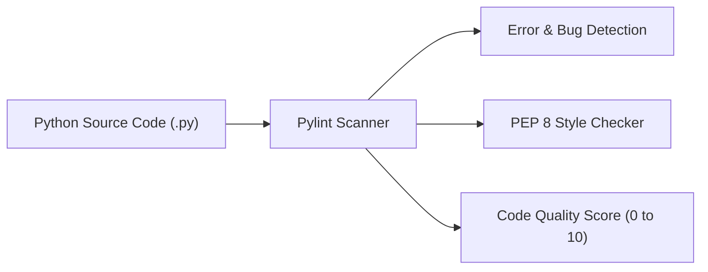
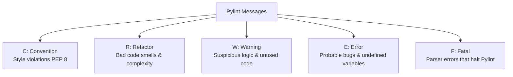
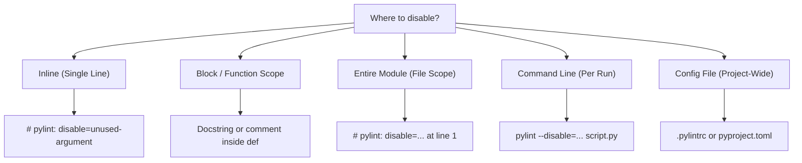
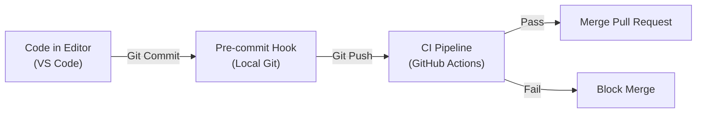

# Pylint: Complete Beginner's Guide & Notes

A comprehensive, beginner-friendly guide to understanding, using, and mastering **Pylint** to write clean, professional Python code.

- [1. What is Pylint?](#1-what-is-pylint)
- [2. How is it Useful?](#2-how-is-it-useful)
- [3. Installation (No Import Required)](#3-installation-no-import-required)
- [4. Fixing a Badly Written Python Module](#4-fixing-a-badly-written-python-module)
- [5. Disabling Errors](#5-disabling-errors)
- [6. Customizing Pylint](#6-customizing-pylint)
- [7. Automating Pylint Checks](#7-automating-pylint-checks)
- [Quick Reference Summary](#quick-reference-summary)

---

## 1. What is Pylint?

**Pylint** is a popular static code analysis tool (often called a **linter**) for Python.

### What is a "Linter"?

Think of Pylint like a strict grammar and spell checker, but for Python source code:

- It scans your code **without running it** (static analysis).
- It looks for programming errors, bugs, bad practices, code smells, and stylistic inconsistencies.
- It checks whether your code follows the official Python style guide, known as **PEP 8**.



---

## 2. How is it Useful?

When writing Python, code can be syntactically valid (meaning it runs) while still containing subtle bugs, poor formatting, or confusing logic. Pylint helps you catch these issues early.

### Key Benefits

1. **Catches Hidden Bugs Early**:
   Detects undefined variables, unused imports, typos in variable names, and unreachable code before execution.
2. **Enforces PEP 8 Style Standards**:
   Maintains consistent naming conventions (`snake_case` for functions/variables, `PascalCase` for classes), line lengths, and spacing across teams.
3. **Encourages Clean Code (Refactoring)**:
   Warns you when functions are too long, take too many arguments, or contain duplicate logic.
4. **Enforces Documentation**:
   Reminds you to write docstrings for modules, classes, and functions so your code remains understandable to others.
5. **Provides an Objective Score**:
   Gives your code a rating out of **10.0**, providing immediate feedback as you improve your code quality.

---

## 3. Installation (No Import Required)

Unlike libraries such as Flask or SQLAlchemy, **Pylint is a command-line tool**. You do **not** import it inside your Python scripts (no `import pylint`).

### Step 1: Install via pip

Run the following command in your terminal:

```bash
pip install pylint
```

### Step 2: Verify Installation

Check that Pylint is installed and inspect its version:

```bash
pylint --version
```

**Sample Output:**

```text
pylint 3.2.6
astroid 3.2.4
Python 3.11.9
```

---

## 4. Fixing a Badly Written Python Module

To understand how Pylint works, let's examine a badly written file, run Pylint on it, understand its message categories and scoring system, and fix it step-by-step.

### The Bad Code (`math_helper.py`)

```python
import math
import sys

def addNumbers(num1, num2):
    total = num1 + num2
    unused_val = 100
    return total

print(addNumbers(5, 10))
```

---

### Running Pylint

Execute Pylint against the file from your terminal:

```bash
pylint math_helper.py
```

### Pylint Output

```text
************* Module math_helper
math_helper.py:1:0: C0114: Missing module docstring (missing-module-docstring)
math_helper.py:1:0: W0611: Unused import math (unused-import)
math_helper.py:2:0: W0611: Unused import sys (unused-import)
math_helper.py:4:0: C0103: Function name "addNumbers" doesn't conform to snake_case naming style (invalid-name)
math_helper.py:4:0: C0116: Missing function or method docstring (missing-function-docstring)
math_helper.py:6:4: W0612: Unused variable 'unused_val' (unused-variable)

------------------------------------------------------------------
Your code has been rated at -2.00/10 (previous run: 0.00/10, -2.00)
```

---

### Understanding the Message Format

Every Pylint message follows a structured format:

```text
math_helper.py : 4 : 0 : C0103 : Function name "addNumbers" doesn't conform to snake_case naming style (invalid-name)
     │           │   │     │                                │                                             │
  File Name    Line Col  Message                        Description                                 Symbolic Name
                          Code
```

- **File Name & Line/Col**: Pinpoints the exact location of the issue.
- **Message Code (`C0103`)**: A 5-character identifier consisting of 1 letter and 4 numbers.
- **Description**: Human-readable explanation of the issue.
- **Symbolic Name (`invalid-name`)**: An easy-to-read name you can use to disable or configure this rule.

---

### Pylint Message Categories

Pylint categorizes issues into 5 main types:



| Type           | Letter | Meaning                                           | Example                                                          |
| :------------- | :----: | :------------------------------------------------ | :--------------------------------------------------------------- |
| **Convention** |  `C`   | Violates PEP 8 coding standards                   | Missing docstring, using `camelCase` instead of `snake_case`     |
| **Refactor**   |  `R`   | Code smells or poorly structured code             | Too many function parameters, duplicate code branches            |
| **Warning**    |  `W`   | Python-specific stylistic or logic issues         | Unused imports, unused variables, accessing protected attributes |
| **Error**      |  `E`   | Definite bugs or invalid code                     | Using an undefined variable, wrong number of function arguments  |
| **Fatal**      |  `F`   | Severe errors preventing Pylint from reading code | Syntax error in the file, missing file                           |

---

### How the Score is Calculated

At the end of the report, Pylint assigns a score out of **10.0**:

$$\text{Score} = 10.0 - \left( \frac{5 \times \text{Error} + \text{Warning} + \text{Refactor} + \text{Convention}}{\text{Total Statements}} \times 10 \right)$$

- High-severity issues (like Errors) penalize your score much more than minor Convention issues.
- Very short files with many issues can end up with a **negative score** (e.g., `-2.00/10`).
- The ultimate goal is to achieve **10.00/10**.

---

### Fixing the Issues Step-by-Step

Let's address each issue identified by Pylint:

1. **`C0114` (missing-module-docstring)**: Add a docstring at the top of the file explaining what the module does.
2. **`W0611` (unused-import)**: Remove `import math` and `import sys` since neither is used.
3. **`C0103` (invalid-name)**: Rename `addNumbers` to `add_numbers` to follow `snake_case`.
4. **`C0116` (missing-function-docstring)**: Add a docstring inside `add_numbers()` explaining its parameters and return value.
5. **`W0612` (unused-variable)**: Remove `unused_val = 100`.

---

### The Fixed Code (`math_helper.py`)

```python
"""Module providing basic arithmetic helper functions."""

def add_numbers(num1, num2):
    """Add two numbers and return the result.

    :param num1: First number
    :param num2: Second number
    :return: Sum of num1 and num2
    """
    total = num1 + num2
    return total

print(add_numbers(5, 10))
```

### Re-running Pylint

```bash
pylint math_helper.py
```

**New Output:**

```text
--------------------------------------------------------------------
Your code has been rated at 10.00/10 (previous run: -2.00/10, +12.00)
```

---

## 5. Disabling Errors

Sometimes Pylint flags code that is intentionally written in a specific way (for example, a parameter required by a framework interface that you don't use, or a global variable). You can disable rules at different scopes.

> [!TIP]
> Always prefer disabling rules using **symbolic names** (e.g., `unused-argument`) instead of codes (`W0613`) so your code remains readable to other developers.



### 1. Inline Disabling (Single Line)

Place `# pylint: disable=symbolic-name` at the end of the line:

```python
def handle_event(event):
    unused_code = 123  # pylint: disable=unused-variable
    print("Handled")
```

### 2. Block or Function Disabling

Disable a rule inside a specific function only:

```python
def example_function(event, context):
    # pylint: disable=unused-argument
    print("Event received")
    # All unused arguments in this function are now ignored
```

### 3. Module-Level Disabling (Entire File)

Place the comment at the very top of the Python file to disable a rule across the entire file:

```python
# pylint: disable=missing-module-docstring, invalid-name

x = 10
y = 20
```

### 4. Command-Line Disabling

Disable rules on the fly when running Pylint:

```bash
pylint --disable=missing-docstring,invalid-name my_script.py
```

---

## 6. Customizing Pylint

For real projects, you don't want to disable rules manually in every file. Instead, you create a configuration file.

Pylint supports two standard configuration formats:

1. **`.pylintrc`**: Dedicated INI-style configuration file.
2. **`pyproject.toml`**: The modern Python project standard.

---

### Option A: Generating a `.pylintrc` File

Generate a default configuration file with all available options:

```bash
pylint --generate-rcfile > .pylintrc
```

This creates a comprehensive `.pylintrc` file in your directory.

#### Common Customizations in `.pylintrc`:

```ini
[MAIN]
# Files or directories to ignore
ignore = .venv,migrations,tests

[MESSAGES CONTROL]
# Disable annoying or unnecessary warnings project-wide
disable =
    missing-module-docstring,
    missing-function-docstring,
    too-few-public-methods

[FORMAT]
# Increase max line length (PEP 8 default is 79, but 88 or 100 is common)
max-line-length = 100

[DESIGN]
# Adjust maximum allowed arguments for functions (default is 5)
max-args = 7
```

---

### Option B: Using `pyproject.toml`

If you are using modern Python packaging (`pyproject.toml`), you can embed your Pylint configuration directly inside it:

```toml
[tool.pylint.main]
ignore = [".venv", "build", "dist"]

[tool.pylint."messages control"]
disable = [
    "missing-module-docstring",
    "missing-function-docstring"
]

[tool.pylint.format]
max-line-length = 100
```

---

## 7. Automating Pylint Checks

To ensure code quality is maintained automatically without relying on developers to remember to run Pylint manually, you can automate it at multiple stages of development.



---

### 1. In Your Editor (VS Code Integration)

Get real-time feedback as you type:

1. Install the **Pylint** extension from the VS Code Marketplace (published by Microsoft).
2. In your `.vscode/settings.json`, enable linting on save:

```json
{
  "pylint.args": ["--rcfile=${workspaceFolder}/.pylintrc"]
}
```

---

### 2. Using Git Pre-Commit Hooks

A pre-commit hook runs Pylint automatically every time you run `git commit`. If Pylint fails, the commit is aborted.

1. **Install pre-commit**:

   ```bash
   pip install pre-commit
   ```

2. **Create `.pre-commit-config.yaml`** in your repository root:

   ```yaml
   repos:
     - repo: local
       hooks:
         - id: pylint
           name: pylint
           entry: pylint
           language: system
           types: [python]
           args: [
               "-rn", # Only display messages
               "-sn", # Don't display the score
               "--fail-under=8.0", # Fail only if score is below 8.0
             ]
   ```

3. **Install the hook into git**:
   ```bash
   pre-commit install
   ```

---

### 3. Continuous Integration (GitHub Actions)

Run Pylint automatically on every Pull Request to block bad code from being merged into `main`.

Create `.github/workflows/lint.yml`:

```yaml
name: Pylint Code Quality

on: [push, pull_request]

jobs:
  lint:
    runs-on: ubuntu-latest
    steps:
      - name: Checkout Code
        uses: actions/checkout@v4

      - name: Set up Python
        uses: actions/setup-python@v5
        with:
          python-version: "3.11"

      - name: Install Dependencies
        run: |
          python -m pip install --upgrade pip
          pip install pylint
          if [ -f requirements.txt ]; then pip install -r requirements.txt; fi

      - name: Run Pylint
        run: |
          # Fail the build if score is less than 8.5/10
          pylint --fail-under=8.5 $(git ls-files '*.py')
```

---

### Understanding Pylint Exit Codes in Automation

When Pylint runs in CI/CD or scripts, its exit status is a **bit-encoded integer**:

| Bit Value | Meaning                            |
| :-------: | :--------------------------------- |
|  **`0`**  | Everything passed without issues   |
|  **`1`**  | Fatal message issued               |
|  **`2`**  | Error message issued               |
|  **`4`**  | Warning message issued             |
|  **`8`**  | Refactor message issued            |
| **`16`**  | Convention message issued          |
| **`32`**  | Usage or command line syntax error |

> [!NOTE]
> If Pylint encounters a Warning (`2`) and a Convention (`16`), the exit code is `18` (`2 + 16`). In automated pipelines, any non-zero exit code fails the build unless you configure `--fail-under=<score>`.

---

## Quick Reference Summary

| Task                                 | Command                                        |
| :----------------------------------- | :--------------------------------------------- |
| **Run Pylint on a single file**      | `pylint script.py`                             |
| **Run Pylint on a whole folder**     | `pylint my_package/`                           |
| **Fail only below a specific score** | `pylint --fail-under=8.0 script.py`            |
| **Disable a rule from CLI**          | `pylint --disable=missing-docstring script.py` |
| **Generate config file**             | `pylint --generate-rcfile > .pylintrc`         |
| **Disable rule in code (inline)**    | `# pylint: disable=symbolic-name`              |
