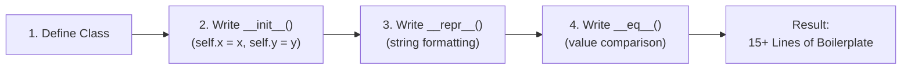
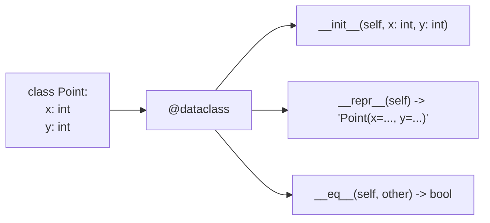
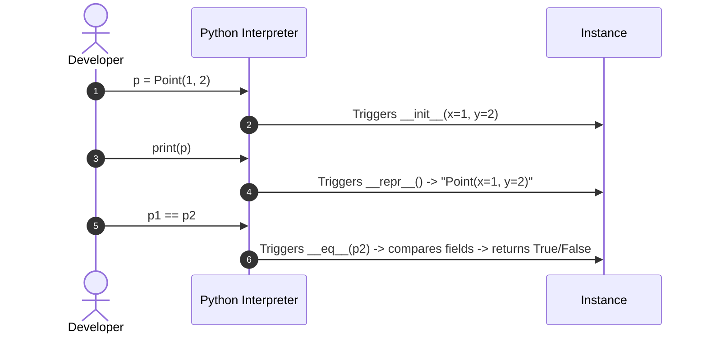
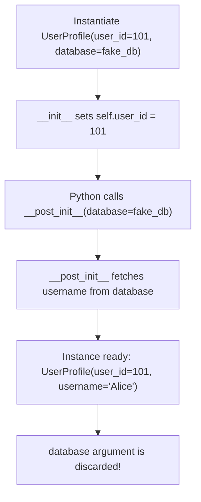
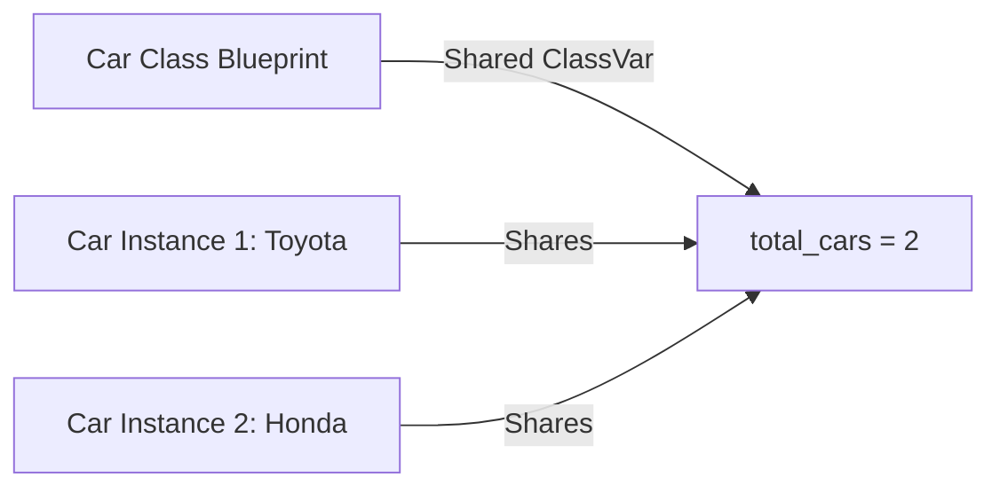
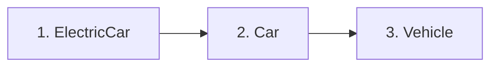
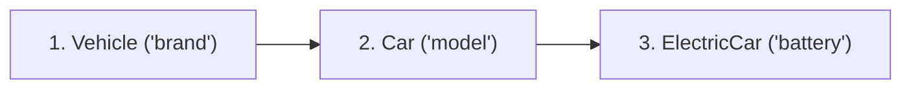
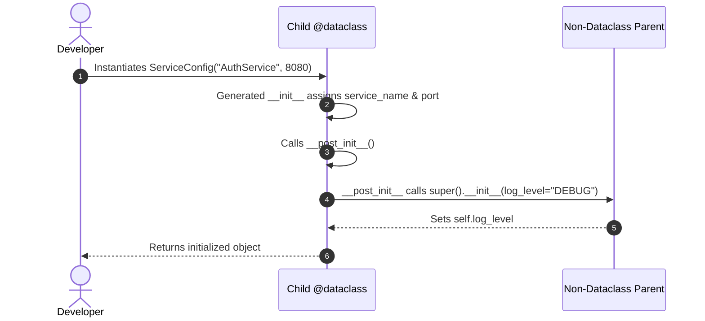

# Python Data Classes - Complete Notes

- [1. Why Data Classes?](#1-why-data-classes)
  - [Standard Python Class Approach (Manual Boilerplate)](#standard-python-class-approach-manual-boilerplate)
  - [Data Class Approach (Automated & Clean)](#data-class-approach-automated-clean)
- [2. What is a Data Class?](#2-what-is-a-data-class)
- [3. Auto-Generated Dunder Methods](#3-auto-generated-dunder-methods)
  - [`init` (Initialization)](#__init__-initialization)
  - [`repr` (String Representation)](#__repr__-string-representation)
  - [`eq` (Equality Comparison)](#__eq__-equality-comparison)
- [4. Custom Methods](#4-custom-methods)
- [5. Field Customization with `field()`](#5-field-customization-with-field)
  - [Preventing Mutable Default Mutation](#preventing-mutable-default-mutation)
- [6. InitVar and `postinit`](#6-initvar-and-__post_init__)
- [7. Class Variables with `ClassVar`](#7-class-variables-with-classvar)
- [8. Data Class Inheritance & Parent Integration](#8-data-class-inheritance-parent-integration)
  - [Dataclass Inheritance & Reverse MRO](#dataclass-inheritance-reverse-mro)
  - [Inheriting from Non-Dataclass Parent Classes](#inheriting-from-non-dataclass-parent-classes)

## 1. Why Data Classes?

In standard Python, writing a class that mainly stores data requires a lot of repetitive **boilerplate code**:

- `__init__`: Assigning every parameter to `self`.
- `__repr__`: Writing string formatting to print object contents cleanly.
- `__eq__`: Writing logic to compare two objects by their values rather than their memory location.

Python **Data Classes** (introduced in Python 3.7) eliminate this boilerplate by generating these methods automatically from type-hinted fields.

> 💡 **Core Takeaway:** `@dataclass` turns a verbose 15-line class definition into just 4 clean lines.

### Standard Python Class Approach (Manual Boilerplate)



### Data Class Approach (Automated & Clean)

```mermaid
flowchart LR
    F[1. Declare Fields with Types\n(x: int, y: int)] --> G["2. Add @dataclass Decorator"] --> H["3. Python Auto-Generates\n__init__, __repr__, and __eq__"] --> I["Result:\n4 Clean Lines of Code"]
```

**Code Comparison**

```python
# ❌ Standard Class (Verbose Boilerplate)
class PointStandard:
    def __init__(self, x: int, y: int):
        self.x = x
        self.y = y

    def __repr__(self):
        return f"PointStandard(x={self.x}, y={self.y})"

    def __eq__(self, other):
        if not isinstance(other, PointStandard):
            return False
        return self.x == other.x and self.y == other.y

# ✅ Data Class (Clean & Automated)
from dataclasses import dataclass

@dataclass
class Point:
    x: int
    y: int

p1 = Point(1, 2)
p2 = Point(1, 2)

print("Printed Object:", p1)
print("Are p1 and p2 equal?:", p1 == p2)
```

**Output:**

```text
Printed Object: Point(x=1, y=2)
Are p1 and p2 equal?: True
```

---

## 2. What is a Data Class?

- **Importing:** Built into Python (`from dataclasses import dataclass`).
- **How it Works:** `@dataclass` is a decorator. When applied to a class, it reads the type hints on class fields (`x: int`, `y: int`) and constructs `__init__`, `__repr__`, and `__eq__` under the hood.

**How `@dataclass` Inspects Fields**



---

## 3. Auto-Generated Dunder Methods

When you decorate a class with `@dataclass`, Python generates three essential "dunder" (double underscore) magic methods:

### `__init__` (Initialization)

- Creates constructor parameters matching your field declarations in exact order.
- Supports both positional (`Point(10, 20)`) and keyword (`Point(x=10, y=20)`) initialization.

### `__repr__` (String Representation)

- Returns a formatted string: `ClassName(field1=val1, field2=val2)`.
- Replaces unhelpful default prints like `<Point object at 0x1024a8b10>`.

### `__eq__` (Equality Comparison)

- Compares objects field-by-field.
- Two separate instances with matching field values evaluate to `True`.

**Trigger Mapping for Dunder Methods**



**Code Example: Generated Methods in Action**

```python
from dataclasses import dataclass

@dataclass
class Point:
    x: int
    y: int

p1 = Point(3, 4)
p2 = Point(3, 4)

# 1. __repr__ in action:
print("Representation:", p1)

# 2. __eq__ in action:
print("p1 == p2:", p1 == p2)
```

**Output:**

```text
Representation: Point(x=3, y=4)
p1 == p2: True
```

---

## 4. Custom Methods

Data classes are standard Python classes. You can add regular methods, properties, and helper functions directly inside them.

```python
from dataclasses import dataclass

@dataclass
class Point:
    x: int
    y: int

    def distance_from_origin(self) -> float:
        """Custom method to calculate Euclidean distance."""
        return (self.x ** 2 + self.y ** 2) ** 0.5

p = Point(3, 4)
print("Point:", p)
print("Distance:", p.distance_from_origin())
```

**Output:**

```text
Point: Point(x=3, y=4)
Distance: 5.0
```

---

## 5. Field Customization with `field()`

The `field()` function gives fine-grained control over individual field attributes:

- `default`: Static default value for immutable types (`int`, `str`, `float`).
- `default_factory`: Callable (`list`, `dict`, `set`) generating fresh default values per instance.
- `repr=False`: Hides field from string outputs (useful for passwords/secrets).
- `compare=False`: Excludes field from equality (`==`) checks.
- `init=False`: Excludes field from constructor parameter list.

### Preventing Mutable Default Mutation

In standard Python, setting a mutable default like `items: list = []` causes all instances to share the exact same list in memory!

Python `@dataclass` catches this and raises a `ValueError`. Use `field(default_factory=list)` to create a new list for every instance.

#### Problem: Standard Python Bug (Shared List in Memory)

```mermaid
flowchart LR
    Instance1[Instance 1] & Instance2[Instance 2] -->|Both reference| SharedList[Single Shared List [] in Memory]
    Instance1 -->|Appends item| SharedList
    SharedList -->|Accidentally mutates state of| Instance2
```

#### Solution: Data Class `default_factory` (Per-Instance Isolation)

```mermaid
flowchart LR
    Bag1[ShoppingBag 1] -->|default_factory=list| List1[Isolated List 1 []]
    Bag2[ShoppingBag 2] -->|default_factory=list| List2[Isolated List 2 []]
    Bag1 -->|Appends 'Apples'| List1
    Note[List 2 remains empty & untouched] -.-> List2
```

**Code Example: `default_factory` and `field()` Options**

```python
from dataclasses import dataclass, field
from typing import List

@dataclass
class ShoppingBag:
    owner: str
    items: List[str] = field(default_factory=list)  # Fresh list per instance

@dataclass
class Employee:
    name: str
    salary: float = field(default=50000.0)
    secret_key: str = field(default="SECRET-999", repr=False)  # Hidden from print
    age: int = field(default=30, compare=False)               # Ignored in ==

# ShoppingBag isolation test:
bag1 = ShoppingBag("Alice")
bag2 = ShoppingBag("Bob")
bag1.items.append("Apples")

print("Bag 1:", bag1)
print("Bag 2:", bag2)

# Employee repr & comparison test:
emp1 = Employee("John")
emp2 = Employee("John", age=45)
print("Employee 1 repr (secret hidden):", emp1)
print("Are emp1 and emp2 equal (age ignored)?:", emp1 == emp2)
```

**Output:**

```text
Bag 1: ShoppingBag(owner='Alice', items=['Apples'])
Bag 2: ShoppingBag(owner='Bob', items=[])
Employee 1 repr (secret hidden): Employee(name='John', salary=50000.0, age=30)
Are emp1 and emp2 equal (age ignored)?: True
```

---

## 6. InitVar and `__post_init__`

Sometimes you need temporary parameters during object creation that shouldn't be saved on the instance:

- **`InitVar`**: Declares a temporary initialization parameter. It is included in `__init__`, but excluded from attributes, `__repr__`, and `__eq__`.
- **`__post_init__`**: A special method called immediately after `__init__`. It receives `InitVar` arguments to perform post-processing (like database lookups or calculations).

**`InitVar` & `__post_init__` Lifecycle**



**Code Example: `InitVar` Database Lookup**

```python
from dataclasses import dataclass, InitVar

USER_DATABASE = {101: "Alice Smith", 102: "Bob Jones"}

@dataclass
class UserProfile:
    user_id: int
    database: InitVar[dict]  # Temporary argument
    username: str = ""       # Instance attribute populated in __post_init__

    def __post_init__(self, database: dict):
        self.username = database.get(self.user_id, "Unknown User")

user = UserProfile(user_id=101, database=USER_DATABASE)

print("User object:", user)
print("Has 'database' attribute?:", hasattr(user, "database"))
```

**Output:**

```text
User object: UserProfile(user_id=101, username='Alice Smith')
Has 'database' attribute?: False
```

---

## 7. Class Variables with `ClassVar`

By default, `@dataclass` treats every type-hinted field as an instance attribute.

To define a shared **class variable** (like a global counter or constant):

- Import `ClassVar` from `typing`.
- Type-hint the field as `ClassVar[T]`.
- `@dataclass` will ignore this field when generating `__init__`, `__repr__`, and `__eq__`.

> 💡 **Instance vs. Class Variables:**
>
> - **Instance Variable (`make: str`)**: Unique per object instance.
> - **Class Variable (`total: ClassVar[int] = 0`)**: Shared across all instances of the class.

**Instance Variables vs Class Variables**



**Code Example: Shared Instance Counter**

```python
from dataclasses import dataclass
from typing import ClassVar

@dataclass
class Car:
    make: str
    total_cars: ClassVar[int] = 0  # Shared counter

    def __post_init__(self):
        Car.total_cars += 1

c1 = Car("Toyota")
c2 = Car("Honda")

print("Car instance repr:", c1)
print("Total cars produced:", Car.total_cars)
```

**Output:**

```text
Car instance repr: Car(make='Toyota')
Total cars produced: 2
```

---

## 8. Data Class Inheritance & Parent Integration

Data classes support inheritance. Understanding how constructor parameters are built is key:

### Dataclass Inheritance & Reverse MRO

Standard Python inspects classes from bottom-to-top (`Child` $\rightarrow$ `Parent` $\rightarrow$ `Base`).

`@dataclass` traverses Method Resolution Order (MRO) in **Reverse Order** (`Base` $\rightarrow$ `Parent` $\rightarrow$ `Child`) when building constructor arguments.

> 💡 **Why Reverse MRO?** Base class fields must be requested first in `__init__` before child class fields.

#### Standard Python MRO (Bottom-to-Top Lookup)



#### Dataclass Constructor Parameter Order (Top-to-Bottom)



**Code Example: Multi-Level Inheritance**

```python
from dataclasses import dataclass

@dataclass
class Vehicle:
    brand: str

@dataclass
class Car(Vehicle):
    model: str

@dataclass
class ElectricCar(Car):
    battery_capacity: float

# Parameters follow top-down order: brand -> model -> battery_capacity
my_ev = ElectricCar(brand="Tesla", model="Model 3", battery_capacity=75.0)
print("ElectricCar instance:", my_ev)
```

**Output:**

```text
ElectricCar instance: ElectricCar(brand='Tesla', model='Model 3', battery_capacity=75.0)
```

### Inheriting from Non-Dataclass Parent Classes

If a `@dataclass` inherits from a standard (non-dataclass) parent class:

- `@dataclass` does **not** automatically call `super().__init__()`.
- Call `super().__init__(...)` manually inside `__post_init__`.

**Execution Order with Non-Dataclass Parent**



**Code Example: Non-Dataclass Parent Initializer**

```python
from dataclasses import dataclass

# Standard non-dataclass parent class
class BaseLogger:
    def __init__(self, log_level: str = "INFO"):
        self.log_level = log_level

# Dataclass child
@dataclass
class ServiceConfig(BaseLogger):
    service_name: str
    port: int

    def __post_init__(self):
        # Explicitly initialize standard parent class
        super().__init__(log_level="DEBUG")

config = ServiceConfig(service_name="AuthService", port=8080)
print("Config instance:", config)
print("Inherited log_level:", config.log_level)
```

**Output:**

```text
Config instance: ServiceConfig(service_name='AuthService', port=8080)
Inherited log_level: DEBUG
```
